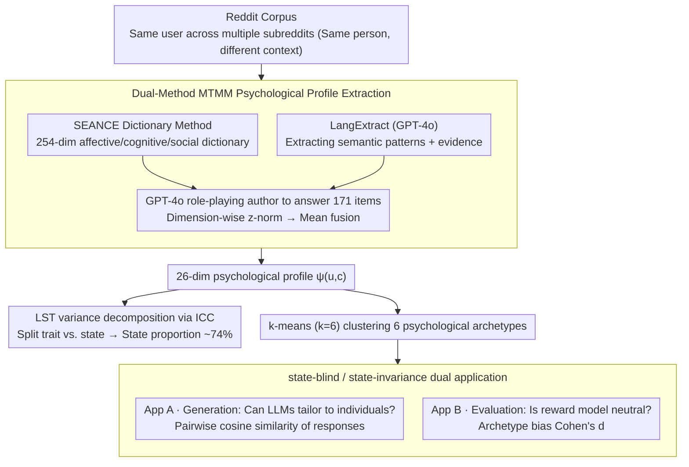

# Beyond Fixed Psychological Personas: State Beats Trait, but Language Models are State-Blind

**Conference**: ACL 2026 Findings  
**arXiv**: [2601.15395](https://arxiv.org/abs/2601.15395)  
**Code**: <https://huggingface.co/datasets/tonyeh/chameleon-dataset> (Dataset)  
**Area**: LLM Alignment / Role-playing / RLHF / Psychology  
**Keywords**: Latent State-Trait, persona, reward model, RLHF, state-blind

## TL;DR
The authors construct the Chameleon psychological profile dataset covering 1,667 users across multiple subreddit contexts. Using ICC decomposition, they demonstrate that 72-74% of psychological variation stems from "state (context)" rather than "trait (personality)." They further reveal that LLMs are nearly blind to these states, while reward models react to states in contradictory directions—consequently, RLHF blindly inherits these state-based biases from the reward models.

## Background & Motivation

**Background**: Existing persona datasets (PersonaChat, PANDORA, LaMP, PERSONA) treat each user's psychological profile as a fixed vector shared across all contexts. RLHF training also assumes that "the same user has stable preferences," with reward models only examining the response without considering the user's state.

**Limitations of Prior Work**: Decades of psychology's Latent State-Trait (LST) theory have established that human behavior reflects both stable traits $\tau$ and situational states $\sigma$. For example, the same "John" expresses entirely different psychological states when seeking help on r/SuicideWatch versus planning calmly on r/personalfinance. Fixed personas average out these "intra-individual differences across contexts" as noise.

**Key Challenge**: If states account for the majority of actual psychological variation, then all alignment methods based on fixed personas (including RLHF) fundamentally misestimate the structure of user diversity. However, this remained a hypothesis as no one in NLP had quantified the state/trait ratio.

**Goal**: (1) Measure the state/trait variance ratio using real text data; (2) test whether current LLMs perceive user states during generation; (3) test whether reward models maintain "state invariance" and remain fair during evaluation.

**Key Insight**: Reddit provides posting records for the same user across multiple subreddits—subreddits serve as natural "contexts." By extracting psychological profiles of the same user across subreddits, one can use Intraclass Correlation (ICC) to decompose within-person and between-person variance.

**Core Idea**: The authors introduce the psychological LST framework into NLP, perform state/trait variance decomposition using the Chameleon dataset, and expose the failure modes of LLMs and reward models in the state dimension through two downstream experiments.

## Method

### Overall Architecture

This study aims to determine "how much of a user's psychological profile is a stable trait versus a context-driven state" and evaluates LLM and reward model behaviors accordingly. The pipeline begins by constructing the Chameleon dataset from Reddit, utilizing the natural "same person, different context" structure where users post in multiple subreddits. For each post, a dual-method psychological profile extraction pipeline generates a 26-dimensional profile $\psi_{u,c}$. Subsequently, ICC is used to decompose the variance of these profiles into trait and state components to quantify which dominates. Finally, six clustered psychological archetypes are used for downstream experiments in generation (can LLMs tailor to individuals?) and evaluation (is the reward model state-invariant?) to turn the abstract concept of "how personas should be used" into measurable engineering metrics.

### Key Designs

**1. Dual-method MTMM Psychological Profile Extraction: Cross-validation to exclude single-method bias.** When extracting 26-dimensional psychological scale scores from a post, a single method is prone to being overwhelmed by its own bias. Thus, two parallel paths are used: (a) the SEANCE dictionary method, which matches based on a 254-dimensional affective/cognitive/social dictionary, yielding reproducible results but lacking context sensitivity; (b) LangExtract (GPT-4o), which extracts semantic patterns, supporting evidence, and interpretation logic, capturing implicit semantics but carrying LLM stochasticity. The features from both paths are fed to GPT-4o to "role-play as the post author" and answer 171 scale items. After dimension-wise z-normalization $\tilde{\psi}^m_i = (\psi^m_i - \mu^m_i)/\sigma^m_i$, the scores are fused via mean fusion $\psi_{u,c} = \frac{1}{2}(\tilde{\psi}^{lex}_{u,c} + \tilde{\psi}^{sem}_{u,c})$ to obtain a unified 26-dimensional profile $\psi_{u,c}$. This follows the MTMM framework (Campbell & Fiske, 1959), requiring high correlation across methods for the same trait (convergent) and low correlation for different traits (discriminant). Measured results show a profile-level mean $r=0.71$, and $69.9\%$ of posts have $r>0.70$, indicating that the two distinct methods capture the same psychological structure.

**2. LST Variance Decomposition via ICC: Splitting psychology into trait and state.** The psychological Latent State-Trait theory posits that a psychological expression contains both stable traits and situational states. This is formalized as an observation model $\psi_{u,c} = \tau_u + \sigma_{u,c} + \epsilon_{u,c}$, where $\tau_u$ is the stable trait, $\sigma_{u,c}$ is the situational state, and $\epsilon_{u,c}$ is the error. Using a one-way random effects model (nesting posts within users), the consistency coefficient is defined as $\text{ICC} = \frac{\text{Var}(\tau)}{\text{Var}(\tau) + \text{Var}(\sigma) + \text{Var}(\epsilon)}$, representing the proportion of between-person variance. Thus, $1-\text{ICC}$ (occasion specificity) represents the within-person state proportion. Conventionally, $\text{ICC} < 0.30$ identifies a state-dominant construct. In this study, almost all 26 dimensions fall within $0.26–0.28$, directly refuting the "persona as a fixed vector" assumption using psychological tools.

**3. State-blind / State-invariance Dual Applications: Dividing the abstract problem into engineering metrics.** Six psychological archetypes are clustered from Chameleon using k-means ($k=6$): Distressed-Vulnerable, Driven-Assertive, Self-Actualized, Supportive-Conventional, Nonconformist-Skeptical, and Risk-Seeking-Detached. Each is assigned a profile card. **Application A (Generation)**: 127 questions × 7 conditions (6 archetypes + baseline) are fed to GPT-4o / Llama-3.1-8B / Qwen2.5-14B to generate 2,667 responses. Pairwise cosine similarity is calculated using all-mpnet-base-v2; lower similarity indicates better tailoring. **Application B (Evaluation)**: A fixed reference response (GPT-4o, no profile) is scored by three reward models (ArmoRM, DeBERTa-RM, Skywork-RM) under 7 archetype conditions. Cohen's $d$ measures the bias relative to the baseline. Ideally, this should be 0. This distinction maps to a refined principle: a good teacher should adjust instructions based on a student's state (generation should be state-aware), but an examiner should not give different scores to the same answer just because a student seems anxious (evaluation should be state-invariant).

### Loss & Training

No models are trained; this is a pure dataset and evaluation paper. Hypothesis testing uses linear mixed-effects regression: $\psi_{u,c,i} = \beta_0 + \beta_c \cdot \mathbf{1}[c] + \gamma_u + \epsilon_{u,c}$, where the user random intercept $\gamma_u \sim \mathcal{N}(0, \sigma_u^2)$ accounts for within-person correlation, ensuring the significance of the subreddit effect $\beta_c$ holds after controlling for individual differences.

## Key Experimental Results

### Main Results: Variance Decomposition (RQ1)

| Extraction Method | Mean ICC | Range | Dimensions < 0.30 | State Proportion |
| :--- | :--- | :--- | :--- | :--- |
| SEANCE | 0.26 | 0.25-0.27 | 26/26 | **74%** |
| LangExtract | 0.28 | 0.25-0.31 | 25/26 | **72%** |
| Fused | 0.27 | 0.25-0.30 | 26/26 | **73%** |

Across both methods, almost all 26 dimensions have $\text{ICC} < 0.30$, meaning state variation is 2-3 times higher than trait variation. $94.7\%$ of users manifested $\geq 2$ archetypes across 3 posts, and $50.7\%$ showed 3 different archetypes—confirming significant psychological profile differences for the same person across contexts.

### Ablation Study: Application A (Generation Diversity) + Application B (Evaluation Invariance)

| Model | Avg. similarity (lower is better) | Interpretation |
| :--- | :--- | :--- |
| Llama-3.1-8B | 0.768 | Most sensitive (counter-intuitive, smallest model is most sensitive) |
| GPT-4o | 0.819 | Medium |
| Qwen2.5-14B | 0.846 | Least sensitive |

**Key Findings**: Cross-archetype ANOVA $F=2.18, p=0.054$ was not significant—models can detect "the presence of a persona framework" but fail to make meaningful distinctions between different archetypes (shallow persona detection).

| Reward Model | Distressed-Vulnerable ($d$ vs. baseline) | Driven-Assertive ($d$ vs. baseline) | Direction |
| :--- | :--- | :--- | :--- |
| ArmoRM-8B | **+0.76** | +0.31 | Reward vulnerable |
| DeBERTa-RM | **−1.08** | −1.11 | Penalize vulnerable |
| Skywork-8B | **−1.12** | −1.02 | Penalize vulnerable |

For the same Distressed-Vulnerable user, ArmoRM shows high preference while Skywork shows high penalty—reward models react in opposite directions to user states. This arbitrariness is directly converted into differential user treatment via RLHF.

### Key Findings
- The state proportion (~74%) is highly consistent across two independent extraction methods and 26 dimensions (SD = 0.02). Even after removing subreddit means to control for stylistic confounding, ICC remained at 0.27, ruling out noise/style explanations.
- Five literature-driven hypotheses were confirmed by both methods—e.g., r/SuicideWatch leads to high Neuroticism and low Competence; r/personalfinance leads to high Security and high Achievement.
- "Alignment vs. Adaptability" Trade-off: The heavily RLHF-tuned GPT-4o was less capable of tailoring to individuals compared to the smaller Llama-3.1-8B. Alignment training appears to promote mode collapse, resulting in a regression in psychological flexibility.
- Vulnerable User Paradox: Reward models do not model real user preferences; instead, they arbitrarily react to user labels, with the direction determined by accidental training data patterns rather than principles.

## Highlights & Insights
- Quantifying psychology's LST theory into NLP is a true interdisciplinary answer to an interdisciplinary problem—it is not just a buzzword, but a proven fact supported by ICC metrics.
- The directional inconsistency of reward models in the state dimension is a profound discovery; it suggests that "the same code and test would result in opposite reviews from different reviewers." This undermines the interpretability of consistency in models trained via RLHF.
- The "state-aware generation + state-invariant evaluation" principles, borrowed from pedagogical scenarios, are intuitive yet precisely map to the two stages of the LLM pipeline, serving as an efficient design framework.
- The observation of "shallow persona detection" (models detect *that* there is a persona but cannot distinguish *which* persona) explains why many persona-conditioned generations feel slightly "persona-flavored" but do not actually adapt to the user.

## Limitations & Future Work
- Extracting psychological profiles from text reveals "expressed psychology" rather than ground-truth internal states. Ideal criterion validity should be established via ecological momentary assessment (EMA) where real users label their own states.
- ICC estimates are affected by the small-k design (k=3), which may overestimate between-person variance; the 74% state proportion is a conservative lower bound.
- Subreddits as "contexts" mix topics, audiences, and community norms; future work needs to decouple these factors.
- Limited to Reddit and American English; cross-platform and cross-cultural generalization is not yet verified, and the archetype count ($k=6$) is relatively small.

## Related Work & Insights
- **vs. PersonaChat / PANDORA**: These treat personas as fixed text or trait vectors. Ours proves this assumption ignores 74% of psychological variation, providing the first quantitative fundamental critique of the persona paradigm.
- **vs. LaMP / PERSONA**: LaMP uses retrieval of user history for personalization (implying stable preferences), and PERSONA assigns fixed Big Five traits to synthetic personas—both fall into the trait-only framework. Chameleon enables state-trait decomposition in NLP for the first time by measuring the same user across contexts.
- **vs. Reward Bias Literature**: Singhal's length bias, Sharma's sycophancy, and Casper's RLHF limitations focus on response features or demographic fairness. Ours opens the "psychological state fairness" dimension and finds that "opposite direction" issues are more severe than known biases.

## Rating
- **Novelty**: ⭐⭐⭐⭐⭐ LST is a brand-new framework in NLP; the quantitative state/trait decomposition and state-blind/state-invariance principles are highly original.
- **Experimental Thoroughness**: ⭐⭐⭐⭐ Moderate dataset scale (1,667 users, 5,001 posts), dual-method cross-validation + hypothesis testing + dual downstream experiments. Solid argumentation, though k=3 posts/user limits ICC precision.
- **Writing Quality**: ⭐⭐⭐⭐⭐ The "John" example clarifies abstract statistical concepts; Figure 1 beautifully compresses the dual failures of generation and evaluation.
- **Value**: ⭐⭐⭐⭐⭐ Directly reveals that RLHF-trained models might unwittingly treat vulnerable users differently; this has immediate implications for responsible AI deployment and provides a foundation for future personalization research.

<!-- RELATED:START -->

## Related Papers

- [\[NeurIPS 2025\] MEMTRACK: Evaluating Long-Term Memory and State Tracking in Multi-Platform Dynamic Agent Environments](../../NeurIPS2025/llm_evaluation/memtrack_evaluating_long-term_memory_and_state_tracking_in_multi-platform_dynami.md)
- [\[ACL 2026\] Beyond the Singular: Revealing the Value of Multiple Generations in Benchmark Evaluation](beyond_the_singular_revealing_the_value_of_multiple_generations_in_benchmark_eva.md)
- [\[ACL 2026\] Beyond Marginal Distributions: A Framework to Evaluate the Representativeness of Demographic-Aligned LLMs](beyond_marginal_distributions_a_framework_to_evaluate_the_representativeness_of_.md)
- [\[ACL 2026\] Teaching Language Models to Forecast Research Success Through Comparative Idea Evaluation](teaching_language_models_to_forecast_research_success_through_comparative_idea_e.md)
- [\[ACL 2026\] EngiBench: A Benchmark for Evaluating Large Language Models on Engineering Problem Solving](engibench_a_benchmark_for_evaluating_large_language_models_on_engineering_proble.md)

<!-- RELATED:END -->
