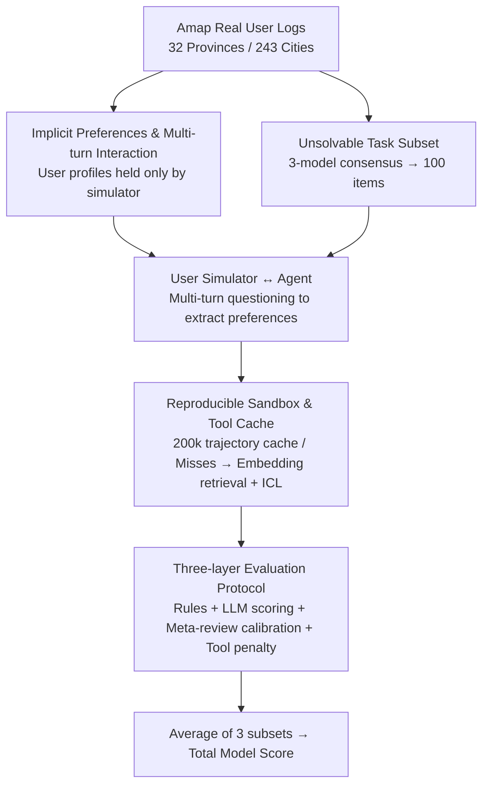

# Beyond Itinerary Planning: A Real-World Benchmark for Multi-Turn and Tool-Using Travel Tasks

**Conference**: ACL 2026  
**arXiv**: [2512.22673](https://arxiv.org/abs/2512.22673)  
**Code**: [GitHub](https://github.com/small-xiangcheng/TravelBench)  
**Area**: Recommendation Systems  
**Keywords**: Travel planning benchmark, tool usage, multi-turn dialogue, implicit preferences, unsolvable tasks

## TL;DR

TravelBench is proposed as the first travel planning benchmark integrating real user queries, implicit user preferences, multi-turn interactions, unsolvable task identification, and 10 real-world tools. It implements reproducible evaluation through a sandbox environment, revealing unbalanced performance of cutting-edge models across different capability dimensions.

## Background & Motivation

**Background**: Travel planning is an ideal scenario for evaluating the multi-step reasoning, tool usage, and user interaction capabilities of LLM Agents. Existing benchmarks (TravelPlanner, ChinaTravel, etc.) have made progress but still possess key deficiencies.

**Limitations of Prior Work**: (1) User preferences and constraints are typically pre-defined, injected into instructions, or revealed step-by-step by a simulator, failing to dynamically elicit implicit user preferences; (2) Most benchmarks only cover itinerary planning, ignoring diverse real-world travel needs such as POI exploration, route planning, and solution comparison; (3) They either lack tool support or rely on synthetic queries, which do not reflect real data distributions; (4) There is a lack of evaluation for unsolvable tasks—Agents must recognize capability boundaries in practical scenarios.

**Key Challenge**: The performance on existing benchmarks does not truly reflect the performance of Agents in real-world travel planning because they have significant gaps in task scope, user interaction methods, and evaluation coverage compared to real-world requirements.

**Goal**: To build a "truly real-world oriented" travel planning benchmark that comprehensively evaluates three core Agent capabilities: autonomous problem solving, interaction to elicit implicit preferences, and recognition of capability boundaries.

**Key Insight**: Queries and preferences are collected from real user logs of Alibaba's Amap (Gaode Maps), integrating 10 types of real travel tools and constructing approximately 200,000 cached tool invocation trajectories.

**Core Idea**: Expand the travel planning benchmark from "itinerary planning" to multiple domains including POI exploration, route planning, and solution comparison, while introducing two entirely new dimensions: multi-turn elicitation of implicit preferences and unsolvable task identification.

## Method

### Overall Architecture

TravelBench decomposes "real-world travel planning" into three types of queries to examine three core Agent capabilities: 500 single-turn queries to evaluate autonomous tool-based problem solving, 500 multi-turn queries to evaluate the elicitation of unstated implicit preferences through dialogue, and 100 unsolvable queries to evaluate the recognition of capability boundaries. At runtime, a simulator driven by an LLM and user profiles acts as a real user. The Agent reasons, invokes tools, and produces solutions within a sandbox integrated with 10 real travel tools. The output is processed through a protocol consisting of "rule-based judgment + LLM scoring + meta-review calibration + tool error penalty" to determine the final scores. The entire process forms a reproducible closed loop from real query input, through multi-turn tool interaction in the sandbox, to hierarchical scoring output.

### Key Designs

**1. Implicit Preferences & Multi-turn Interaction: Enabling Agents to Actively Elicit Preferences**

Real users often do not proactively state all their preferences. Existing benchmarks either inject pre-defined preferences into instructions or have simulators reveal them progressively, leaving the Agent as a passive receiver and failing to evaluate active questioning. This work extracts anonymized preferences from real Amap data to construct user profiles including gender, family structure, and lifestyle, which are **held only by the user simulator**. To know these preferences, the Agent must actively ask the simulator through multi-turn dialogue. Whether a query is single-turn or multi-turn is determined by 6 experimental trials across 3 models to see if interaction is necessary to complete the missing preferences.

**2. Unsolvable Task Subset: Evaluating When an Agent Should Say "I can't do this"**

In practical scenarios, an Agent must know its capability boundaries; providing a wrong answer is more dangerous than admitting inability. This work uses GPT-5.1, Qwen3-235B, and Qwen-Plus to annotate whether each query is solvable. Only queries deemed unsolvable by **all three models** enter the unsolvable subset, categorized into three causes: lack of tool support, lack of necessary context, or no clear executable intent. The tested Agent must output a special label `[Unsolved]` to succeed in these queries, quantifying the "knowing when to quit" capability.

**3. Reproducible Sandbox & Tool Cache: Freezing Unstable Real APIs into a Reproducible Environment**

Directly calling external travel APIs may return different results each time, undermining reproducibility and fair comparison. This work uses multiple models to generate and cache approximately 200,000 tool invocation trajectories from real APIs. During evaluation, tool responses are matched from the cache by parameters; for cache misses, a style-consistent response is generated via embedding retrieval and ICL. Simultaneously, the sandbox performs strict parameter validation and records tool invocation error rates, allowing the capture of trajectories where "the task seems completed, but the tools were misused."

**4. Three-layer Evaluation Protocol: Mutual Safeguards via Rules, Scoring, and Calibration**

Final scores are aggregated through three layers: the unsolvable subset uses rule-based accuracy; single-turn (3 dimensions) and multi-turn (4 dimensions, adding user_interaction) queries are scored 1–5 by an LLM-as-judge; a meta-review layer then calibrates potentially inflated judge scores and applies penalties based on tool invocation error rates. The average of the three subsets serves as the total score, ensuring that task completion and tool usage reliability are considered simultaneously.

## Key Experimental Results

### Main Results

| Model | Multi-turn (post-penalty) | Single-turn (post-penalty) | Unsolvable | Total Score |
|------|------------|------------|--------|------|
| Qwen-Plus | 62.56 | 82.64 | 83.67 | **76.29** |
| GPT-5.1 | 71.31 | 73.81 | 80.00 | 75.04 |
| Kimi-K2-Th | 71.83 | 77.31 | 73.67 | 74.27 |
| DeepSeek-V3.2 | 82.80 | 83.29 | 51.33 | 72.47 |
| Qwen3-235B-It | 61.78 | 70.74 | 80.00 | 70.84 |
| DeepSeek-R1 | 35.67 | 76.93 | 83.67 | 65.42 |

### Ablation Study

| Configuration | Key Metric | Description |
|------|---------|------|
| Scoring Stability | std $\approx$ 0.01 | Minimal standard deviation across 3 repeated runs |
| Offline vs. Online Scoring | <1 point difference | Highly consistent evaluation between cached sandbox and real APIs |
| Human Validation | 97% label consistency | Unsolvable and single/multi-turn labels highly match human judgment |
| Judge MAE | 0.52 vs. Human 0.48 | Close to the level of inter-human disagreement |

### Key Findings
- Even the strongest model scores only around 76, indicating that real-world travel planning remains challenging.
- Capability imbalances are prevalent: DeepSeek-V3.2 is strongest in single/multi-turn tasks but poor at identifying unsolvable queries (51.33), while Kimi-K2-0925 is strongest in unsolvable queries (94) but performs poorly in task completion.
- Reasoning models generally have lower tool invocation error rates than instruction-following models but tend to perform lower on unsolvable tasks—stronger reasoning makes models "less willing to give up."
- Tool invocation error rates are higher in multi-turn tasks than in single-turn tasks, indicating that multi-turn interactions increase the difficulty of tool usage.
- The tool penalty has the greatest impact on MiniMax-M2 (78$\rightarrow$67), effectively distinguishing "seemingly correct but tool-misused" trajectories.

## Highlights & Insights
- **Truly Real-World Oriented**: Developed from real Amap logs, covering 32 provincial regions and 243 cities, with task distributions reflecting real user needs.
- **Unified Evaluation of Three Core Capabilities**: Autonomous solving, interactive preference elicitation, and boundary recognition—forming a complete capability profile for practical Agents.
- **Innovative Tool Penalty Mechanism**: Evaluates not only task completion but also the reliability of the tool usage process.
- **Important Discovery of Capability Imbalance**: Highlights the tension between "strong reasoning" and "knowing when to give up" in current models.

## Limitations & Future Work
- **Limited to China Travel Scenarios**: Geographical and cultural scope is limited; international travel needs are not covered.
- **User Simulator Limitations**: User interactions simulated by LLMs may deviate from real user behavior.
- **Dependency on LLM-as-judge**: While human validation shows high consistency, potential blind spots may still exist.
- **Future Directions**: Expanding to international travel, introducing more complex dynamic constraint changes, and researching how Agents can better balance capability and boundary recognition.

## Related Work & Insights
- **vs. TravelPlanner**: The first travel planning benchmark but largely solved by solver-based methods; tasks are too simple.
- **vs. ChinaTravel**: Introduces real queries and stricter constraints but does not support multi-turn interactions or unsolvable tasks.
- **vs. COMPASS**: Focuses on soft preference optimization but does not utilize real-world queries or tools.

## Rating
- Novelty: ⭐⭐⭐⭐ Elicitation of implicit preferences and unsolvable task identification are important new dimensions; task coverage significantly exceeds prior work.
- Experimental Thoroughness: ⭐⭐⭐⭐⭐ Covers 12+ models, including stability analysis, human validation, and online/offline comparisons.
- Writing Quality: ⭐⭐⭐⭐ Clear structure with detailed descriptions of evaluation protocols.
- Value: ⭐⭐⭐⭐ Provides the most comprehensive benchmark for travel planning Agent evaluation; findings on capability imbalance provide guidance for Agent design.

<!-- RELATED:START -->

<!-- RELATED:END -->

## Related Papers

- [\[ACL 2025\] TripTailor: A Real-World Benchmark for Personalized Travel Planning](../../ACL2025/llm_evaluation/triptailor_a_real-world_benchmark_for_personalized_travel_planning.md)
- [\[ACL 2026\] ReCoQA: A Benchmark for Tool-Augmented and Multi-Step Reasoning in Real Estate Question and Answering](recoqa_a_benchmark_for_tool-augmented_and_multi-step_reasoning_in_real_estate_qu.md)
- [\[ACL 2026\] TaxPraBen: A Scalable Benchmark for Structured Evaluation of LLMs in Chinese Real-World Tax Practice](taxpraben_a_scalable_benchmark_for_structured_evaluation_of_llms_in_chinese_real.md)
- [\[ACL 2026\] Evaluating Temporal Consistency in Multi-Turn Language Models](evaluating_temporal_consistency_in_multi-turn_language_models.md)
- [\[ACL 2025\] TripCraft: A Benchmark for Spatio-Temporally Fine Grained Travel Planning](../../ACL2025/llm_evaluation/tripcraft_a_benchmark_for_spatio-temporally_fine_grained_travel_planning.md)

<!-- RELATED:END -->
