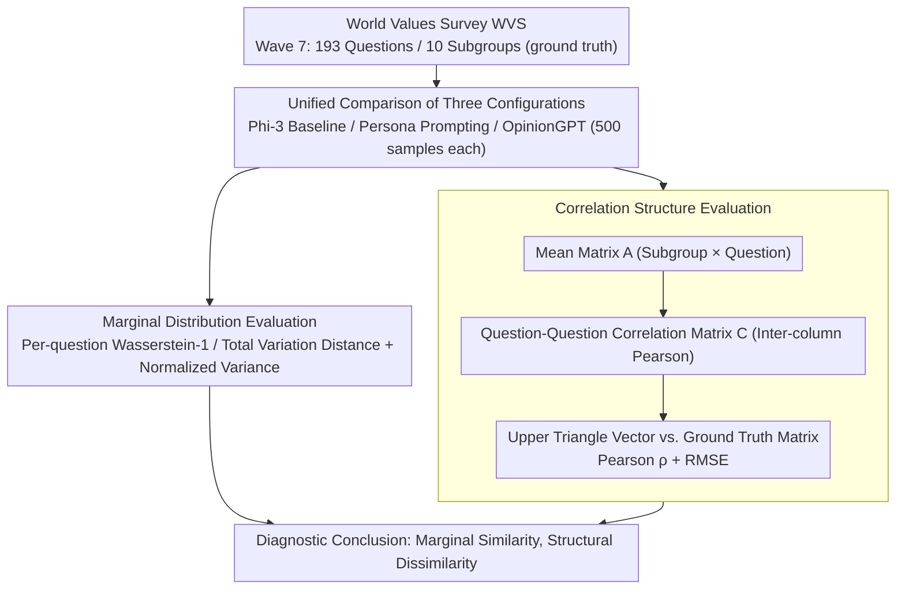

# Beyond Marginal Distributions: A Framework to Evaluate the Representativeness of Demographic-Aligned LLMs

**Conference**: ACL 2026 Findings  
**arXiv**: [2601.15755](https://arxiv.org/abs/2601.15755)  
**Code**: [https://github.com/tdw75/beyond-marginal-distributions](https://github.com/tdw75/beyond-marginal-distributions)  
**Area**: LLM Alignment  
**Keywords**: Demographic Alignment, Correlation Structure, Marginal Distributions, Value Surveys, Representativeness Evaluation

## TL;DR

This paper proposes a framework for evaluating LLM representativeness beyond marginal distributions. By simultaneously examining marginal response distributions and cross-question correlation structures to evaluate demographic-aligned models, it reveals that while fine-tuning and persona prompting improve marginal distribution approximation, neither faithfully reproduces the multivariate correlation patterns found in human value surveys.

## Background & Motivation

**Background**: LLMs are increasingly used to simulate human opinions, values, and beliefs. Model steerability is an active research direction. Current work uses persona prompting or demographic fine-tuning to align model outputs more closely with specific groups.

**Limitations of Prior Work**: Existing evaluations focus primarily on **marginal response distributions**—comparing response distributions for each question independently. While necessary, this approach may ignore the **deep latent structures** present in real populations. For instance, a model might correctly approximate support rates for two policies individually but fail to capture the high correlation between supporting one policy and opposing another found in real populations.

**Key Challenge**: Cultural value theories in social sciences (e.g., Hofstede, Schwartz, Inglehart-Welzel) emphasize that multivariate correlation patterns are the core of cultural dimensions, yet LLM alignment evaluations almost entirely overlook this dimension.

**Goal**: (1) Propose an evaluation framework that examines both marginal distributions and correlation structures; (2) Compare the performance of persona prompting and demographic fine-tuning across both dimensions.

**Key Insight**: Utilize the World Values Survey (WVS) as ground truth to diagnose model representativeness at both the marginal distribution and inter-question correlation levels.

**Core Idea**: Representativeness is an independent dimension of alignment. Evaluations relying solely on marginal distributions may mask structural failures, leading to overly optimistic conclusions about model representativeness.

## Method

### Overall Architecture

This paper decomposes the "representativeness" diagnosis into two complementary levels. The first level is marginal distribution evaluation: for each survey question, it independently compares the proximity of the model-simulated response distribution to the real population distribution, consistent with prior mainstream work. The second level is correlation structure evaluation: response behaviors across multiple questions are aggregated into a correlation matrix to check if the model reproduces the interlocking structures found in populations, such as "supporting a certain policy often accompanies opposing another." Using the World Values Survey (WVS) as ground truth, the framework compares persona prompting and demographic fine-tuning under a unified metric to expose hidden "marginal-similar-but-structurally-dissimilar" failures.

### Key Designs

**1. Marginal Distribution Evaluation: Per-question Alignment Baseline**

This level measures representativeness at the single-question level. For each survey question $q$, the distance $d(P_m(\cdot|q), P_s(\cdot|q))$ between the true distribution $P_s$ and simulated distribution $P_m$ is calculated (using Wasserstein-1 or Total Variation Distance), then averaged across all questions to obtain an overall dissimilarity metric $\mathcal{D}$. Simultaneously, the normalized variance of each question is compared to diagnose whether response diversity is collapsing or being over-amplified. This layer ensures comparability with existing literature (e.g., Santurkar, Durmus) and provides a baseline for correlation structure analysis.

**2. Correlation Structure Evaluation: Inter-question Linkage Structure**

This level checks if the model preserves dependencies between questions. It involves three steps: first, calculating the mean response for each subgroup on each question to form a mean matrix $A \in \mathbb{R}^{|S| \times |Q|}$; second, computing column-wise Pearson correlation coefficients to obtain a question-question correlation matrix $C \in \mathbb{R}^{|Q| \times |Q|}$; third, extracting upper triangle elements as a vector to compare the true matrix $C^{\text{true}}$ and simulated matrix $C^{\text{sim}}$ using Pearson correlation and RMSE. The correlation coefficient captures the relative structure of "which pairs of questions tend to change together," while RMSE captures whether the magnitudes match. This corresponds to the social science view that multivariate correlations define cultural dimensions.

**3. Unified Comparison of Three Model Configurations: Comparing Fine-tuning vs. Prompting**

To reveal differences in control strategies, the framework compares three configurations: the un-steered Phi-3 baseline, Phi-3 with persona prompting (covering 10 demographic subgroups), and OpinionGPT (LoRA adapters fine-tuned on Reddit subgroup data). The evaluation uses 193 questions from WVS Wave 7 across 10 subgroups, with 500 samples per configuration. This maps parameter-level (fine-tuning) and prompt-level (persona) control methods onto the same marginal/structural scale.

### Loss & Training

The paper focuses on evaluation rather than training; the evaluated OpinionGPT is a pre-existing model fine-tuned on Reddit subgroup data using LoRA adapters.

## Key Experimental Results

### Main Results

**Question-Question Correlation Structure (95% CI)**

| Model | Pearson ρ | RMSE |
|------|-----------|------|
| OpinionGPT | 0.090 [0.08, 0.10] | 0.638 [0.63, 0.64] |
| Persona Prompting | 0.158 [0.15, 0.17] | 0.679 [0.67, 0.68] |
| Permutation Baseline | −0.004 | 0.849 |
| Split-Half Upper Bound | 0.999 | 0.006 |

**Topic-Topic Correlation Structure**

| Model | Pearson ρ | RMSE |
|------|-----------|------|
| OpinionGPT | −0.018 [-0.02, 0.05] | 0.718 [0.71, 0.73] |
| Persona Prompting | 0.240 [0.21, 0.28] | 0.676 [0.67, 0.69] |

### Ablation Study

**Marginal Distribution Results**: OpinionGPT reduced marginal dissimilarity across all subgroups, outperforming persona prompting. However, persona prompting performed worse on response diversity (tending to collapse into stereotypical single responses), while OpinionGPT sometimes over-amplified response diversity.

### Key Findings

- Improvement in marginal distribution $\neq$ improvement in correlation structure: OpinionGPT approximates marginal distributions better, but persona prompting preserves correlation structures slightly better—revealing a "reversal" in evaluation dimensions.
- Both methods perform far below the empirical upper bound on correlation structure, indicating current steering techniques cannot faithfully reproduce the multivariate structure of human values.
- Persona prompting significantly compresses response diversity, tending to produce stereotypical answers.
- OpinionGPT loses correlation structure entirely after topic-level aggregation ($\rho \approx -0.018$), suggesting that fine-tuning subgroup adapters might introduce representation drift across groups.

## Highlights & Insights

- The evaluation framework design is elegant; the permutation baseline and split-half upper bound provide clear reference points for the metrics.
- The finding that "marginal success $\neq$ structural success" serves as a crucial methodological warning.
- Incorporating cultural value theories from social sciences into LLM alignment evaluation provides a unique interdisciplinary perspective.
- Highlights the importance of representativeness as an independent dimension of alignment.

## Limitations & Future Work

- Generalizability is limited as only the Phi-3 base model was used.
- WVS contains Western-centric normative assumptions and is not a completely neutral benchmark.
- Evaluation was limited to English and did not cover multilingual scenarios.
- Future work could replace independent sampling with trajectory-based sampling to construct more refined correlation matrices.

## Related Work & Insights

- Complements marginal distribution evaluation work by Santurkar et al. and Durmus et al.
- Münker (2025) proposed a similar fingerprinting method, but this work explicitly positions correlation structure as a necessary condition for representativeness.
- Provides a theoretical foundation for incorporating multivariate dependency structures into alignment mechanisms.

## Rating

- Novelty: ⭐⭐⭐⭐ First systematic incorporation of correlation structure into LLM representativeness evaluation.
- Experimental Thoroughness: ⭐⭐⭐⭐ Comprehensive multi-dimensional evaluation, confidence intervals, and baseline comparisons.
- Writing Quality: ⭐⭐⭐⭐⭐ Clear framework explanation and rigorous problem definition.

<!-- RELATED:START -->

## Related Papers

- [\[ACL 2026\] Beyond Reproduction: A Paired-Task Framework for Assessing LLM Comprehension and Creativity in Literary Translation](beyond_reproduction_a_paired-task_framework_for_assessing_llm_comprehension_and_.md)
- [\[ICML 2026\] BuildArena: A Physics-Aligned Interactive Benchmark of LLMs for Engineering Construction](../../ICML2026/llm_evaluation/buildarena_a_physics-aligned_interactive_benchmark_of_llms_for_engineering_const.md)
- [\[ACL 2026\] Large Language Models Are Bad Dice Players: LLMs Struggle to Generate Random Numbers from Statistical Distributions](large_language_models_are_bad_dice_players_llms_struggle_to_generate_random_numb.md)
- [\[ICLR 2026\] Rethinking LLM Evaluation: Can We Evaluate LLMs with 200× Less Data?](../../ICLR2026/llm_evaluation/rethinking_llm_evaluation_can_we_evaluate_llms_with_200_less_data.md)
- [\[AAAI 2026\] Beyond Accuracy: A Cognitive Load Framework for Mapping the Capability Boundaries of Tool-use Agents](../../AAAI2026/llm_evaluation/beyond_accuracy_a_cognitive_load_framework_for_mapping_the_c.md)

<!-- RELATED:END -->
