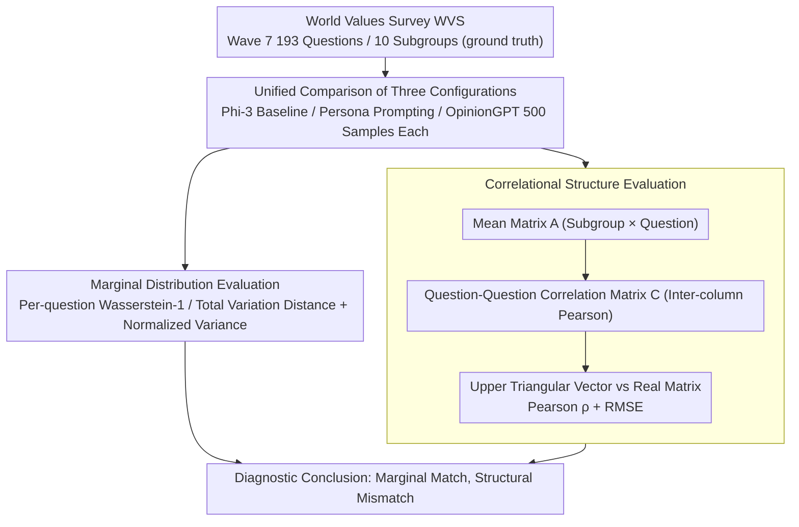

# Beyond Marginal Distributions: A Framework to Evaluate the Representativeness of Demographic-Aligned LLMs

**Conference**: ACL 2026 Findings  
**arXiv**: [2601.15755](https://arxiv.org/abs/2601.15755)  
**Code**: [https://github.com/tdw75/beyond-marginal-distributions](https://github.com/tdw75/beyond-marginal-distributions)  
**Area**: LLM Alignment  
**Keywords**: Demographic alignment, correlational structure, marginal distributions, values surveys, representativeness evaluation

## TL;DR

This paper proposes an evaluation framework for LLM representativeness that goes beyond marginal distributions. By simultaneously examining marginal response distributions and cross-question correlational structures to evaluate demographic-aligned models, the study finds that while fine-tuning and persona prompting can improve the approximation of marginal distributions, neither can faithfully reproduce the multivariate correlation patterns found in human value surveys.

## Background & Motivation

**Background**: LLMs are increasingly used to simulate human opinions, values, and beliefs, making model steerability an active research direction. Existing work utilizes persona prompting or demographic fine-tuning to bring model outputs closer to specific groups.

**Limitations of Prior Work**: Existing evaluations mainly focus on **marginal response distributions**—comparing response distributions for each question independently. While necessary, this approach may overlook the **deep latent structures** present in real populations. For example, a model might correctly approximate the support rates for two policies individually but fail to capture the high correlation between supporting one policy and opposing another as observed in a real population.

**Key Challenge**: Cultural value theories in social sciences (e.g., Hofstede, Schwartz, Inglehart-Welzel) emphasize that multivariate correlation patterns are the core of cultural dimensions, yet LLM alignment evaluation has almost entirely ignored this dimension.

**Goal**: (1) Propose an evaluation framework that simultaneously examines marginal distributions and correlational structures; (2) Compare the performance of persona prompting and demographic fine-tuning across these two dimensions.

**Key Insight**: Using the World Values Survey (WVS) as ground truth to diagnose model representativeness at both the marginal distribution level and the inter-question correlation matrix level.

**Core Idea**: Representativeness is an independent dimension of alignment. Evaluations relying solely on marginal distributions may mask structural failures, leading to over-optimistic conclusions regarding model representativeness.

## Method

### Overall Architecture

This paper decomposes the "representativeness" diagnosis into two complementary levels. The first level is marginal distribution evaluation: for each survey question, it independently compares how close the model's simulated response distribution is to the real population's, consistent with mainstream prior work. The second level is correlational structure evaluation: it aggregates responses across multiple questions into a correlation matrix to verify if the model reproduces the interlocking structure—such as "supporting one policy often being accompanied by opposing another"—between questions. Using the World Values Survey (WVS) as ground truth, the framework compares two mainstream steering methods, persona prompting and demographic fine-tuning, on a unified scale to expose hidden failures where the marginals appear aligned but the structure does not.

### Key Designs

**1. Marginal Distribution Evaluation: Baseline Level for Question-by-Question Alignment**

This level measures representativeness at the single-question level. For each survey question $q$, the distance $d(P_m(\cdot|q), P_s(\cdot|q))$ between the real distribution $P_s$ and the simulated distribution $P_m$ is calculated (using Wasserstein-1 or Total Variation distance), and then averaged across all questions to obtain an overall dissimilarity metric $\mathcal{D}$. Simultaneously, the normalized variance of each question is compared to diagnose whether response diversity is collapsing or being over-amplified. This level ensures comparability with existing literature (e.g., Santurkar, Durmus) and provides a "seemingly aligned" baseline for subsequent structural analysis.

**2. Correlational Structure Evaluation: Structural Level for Inter-question Linkage**

This level checks whether the model preserves dependencies between questions. It follows three steps: first, calculating the mean response for each subgroup on each question to form a mean matrix $A \in \mathbb{R}^{|S| \times |Q|}$; second, calculating Pearson correlation coefficients between columns to obtain a question-question correlation matrix $C \in \mathbb{R}^{|Q| \times |Q|}$; finally, extracting the upper triangular elements as a vector to compare the real matrix $C^{\text{true}}$ and simulated matrix $C^{\text{sim}}$ using both Pearson correlation and RMSE. The correlation coefficient captures the relative structure of "which pairs of questions tend to vary together," while RMSE captures whether the magnitudes match. This aligns with cultural value theories suggesting that multivariate correlations are the core of cultural dimensions.

**3. Unified Comparison of Three Model Configurations: Fine-tuning vs. Prompting on the Same Scale**

To reveal the differences between steering strategies across both dimensions, the paper compares three configurations within the same framework: the un-steered Phi-3 baseline, Phi-3 with persona prompting (covering 10 demographic subgroups), and OpinionGPT (using LoRA adapters) which was fine-tuned on Reddit subgroup data. The evaluation uniformly adopts 193 questions and 10 subgroups from WVS Wave 7, with 500 samples for each configuration. This design places parameter-level (fine-tuning) and prompt-level (persona) steering methods on the same marginal/structural scale to clearly identify their respective strengths and blind spots.

### Loss & Training

This paper itself focuses on evaluation and does not train models; the evaluated OpinionGPT is a pre-existing model fine-tuned on specific Reddit subgroup data using LoRA adapters.

## Key Experimental Results

### Main Results

**Question-Question Correlational Structure (95% CI)**

| Model | Pearson ρ | RMSE |
|------|-----------|------|
| OpinionGPT | 0.090 [0.08, 0.10] | 0.638 [0.63, 0.64] |
| Persona Prompting | 0.158 [0.15, 0.17] | 0.679 [0.67, 1.68] |
| Permutation Zero Baseline | −0.004 | 0.849 |
| Split-Half Upper Bound | 0.999 | 0.006 |

**Topic-Topic Correlational Structure**

| Model | Pearson ρ | RMSE |
|------|-----------|------|
| OpinionGPT | −0.018 [-0.02, 0.05] | 0.718 [0.71, 0.73] |
| Persona Prompting | 0.240 [0.21, 0.28] | 0.676 [0.67, 0.69] |

### Ablation Study

**Marginal Distribution Results**: OpinionGPT reduced marginal dissimilarity across all subgroups, outperforming persona prompting. However, persona prompting performed worse regarding response diversity (tending to collapse into stereotypical single responses), while OpinionGPT sometimes over-amplified response diversity.

### Key Findings

- Improved marginal distribution $\neq$ improved correlational structure: OpinionGPT approximates marginal distributions better, but persona prompting slightly better preserves correlational structures—representing a "reversal" across evaluation dimensions.
- Both methods perform far below the empirical upper bounds for correlational structure, indicating current steering techniques cannot faithfully reproduce the multivariate structures of human values.
- Persona prompting significantly compresses response diversity, tending to produce stereotypical answers.
- OpinionGPT completely loses correlational structure after topic-level aggregation ($\rho \approx -0.018$), suggesting that fine-tuning separate subgroup adapters may introduce representational drift across groups.

## Highlights & Insights

- The evaluation framework is elegantly designed; the permutation zero baseline and split-half upper bound provide clear references for the metrics.
- The finding that "good marginals $\neq$ good structure" serves as an important methodological warning.
- Integrating cultural value theories from social sciences into LLM alignment evaluation offers a unique interdisciplinary perspective.
- The work highlights the importance of representativeness as an independent dimension of alignment.

## Limitations & Future Work

- Only one base model (Phi-3) was used, limiting the generalizability of the conclusions.
- The WVS contains Western-centric normative assumptions and is not a completely neutral benchmark.
- The evaluation was conducted only in English and does not cover multilingual scenarios.
- Future work could replace independent sampling with trajectory-based sampling to construct more refined correlation matrices.

## Related Work & Insights

- Complements the marginal distribution evaluation work of Santurkar et al. and Durmus et al.
- Münker (2025) proposed a similar fingerprinting method, but this paper explicitly positions correlational structure as a necessary condition for representativeness.
- Provides a theoretical foundation for incorporating multivariate dependency structures into alignment mechanisms in the future.

## Rating

- Novelty: ⭐⭐⭐⭐ First to systematically incorporate correlational structure into LLM representativeness evaluation.
- Experimental Thoroughness: ⭐⭐⭐⭐ Comprehensive multi-dimensional evaluation, confidence intervals, and baseline comparisons.
- Writing Quality: ⭐⭐⭐⭐⭐ Clear framework explanation and rigorous problem definition.

<!-- RELATED:START -->

## Related Papers

- [\[ACL 2026\] Beyond Reproduction: A Paired-Task Framework for Assessing LLM Comprehension and Creativity in Literary Translation](beyond_reproduction_a_paired-task_framework_for_assessing_llm_comprehension_and_.md)
- [\[ACL 2026\] Large Language Models Are Bad Dice Players: LLMs Struggle to Generate Random Numbers from Statistical Distributions](large_language_models_are_bad_dice_players_llms_struggle_to_generate_random_numb.md)
- [\[AAAI 2026\] Beyond Accuracy: A Cognitive Load Framework for Mapping the Capability Boundaries of Tool-use Agents](../../AAAI2026/llm_evaluation/beyond_accuracy_a_cognitive_load_framework_for_mapping_the_c.md)
- [\[ACL 2026\] Beyond the Singular: Revealing the Value of Multiple Generations in Benchmark Evaluation](beyond_the_singular_revealing_the_value_of_multiple_generations_in_benchmark_eva.md)
- [\[ICLR 2026\] Unpacking Human Preference for LLMs: Demographically Aware Evaluation with the HUMAINE Framework](../../ICLR2026/llm_evaluation/unpacking_human_preference_for_llms_demographically_aware_evaluation_of_long-fo.md)

<!-- RELATED:END -->
