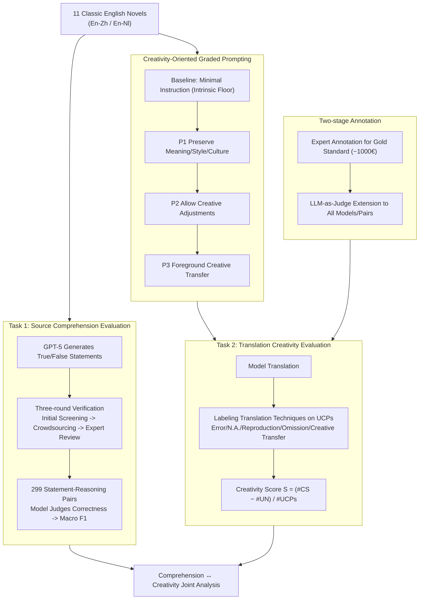

# Beyond Reproduction: A Paired-Task Framework for Assessing LLM Comprehension and Creativity in Literary Translation

**Conference**: ACL 2026 Findings  
**arXiv**: [2604.18169](https://arxiv.org/abs/2604.18169)  
**Code**: [github](https://github.com/NL2G/Beyond-Reproduction)  
**Area**: LLM Evaluation  
**Keywords**: Literary Translation, Translational Creativity, Source Text Comprehension, LLM Evaluation, Paired-Task Framework

## TL;DR

Ours proposes a paired-task framework to jointly evaluate the literary text comprehension and translational creativity of LLMs. Based on a large-scale evaluation of 23 models using 11 classic English novels, it is found that strong comprehension ability does not translate into human-level translational creativity.

## Background & Motivation

**Background**: LLMs are increasingly used for creative tasks such as literary translation, with some studies even claiming they have reached human-level performance. However, translational creativity remains severely overlooked in large-scale assessments.

**Limitations of Prior Work**: (1) Existing literary translation evaluations primarily focus on accuracy and adequacy, almost entirely ignoring the creativity dimension; (2) Research on translational creativity is small-scale and costly, usually comparing only 1-2 traditional MT systems; (3) Comprehension is typically studied in isolation, whereas in professional translation, comprehension and creativity are deeply intertwined.

**Key Challenge**: While LLMs can generate large volumes of fluent, low-cost translations, little is known about how they handle the creative challenges unique to literary texts—does understanding the source text imply the ability to make creative translational choices?

**Goal**: To construct a scalable evaluation framework to jointly measure the source text comprehension and creative translation capabilities of LLMs.

**Key Insight**: Based on the concept of "Units of Creative Potential" (UCP) in translation studies, segments requiring creative handling—such as metaphors, puns, and cultural allusions—are used as the focus of evaluation.

**Core Idea**: Design paired tasks—Task 1 evaluates source text comprehension through statement verification, and Task 2 evaluates creative transfer through UCP translation technique labeling. By combining expert annotation with LLM-as-Judge automatic evaluation, a large-scale and scalable assessment is achieved.

## Method

### Overall Architecture

This paper uses a paired-task framework to decouple the intertwined abilities of "comprehension" and "creation" in literary translation for individual measurement, before comparing them together. Task 1 assesses source text comprehension: based on true/false statements generated from literary critical analysis, the model is asked to judge their correctness, testing whether it can perform interpretive reasoning rather than simple paraphrasing. Task 2 assesses translational creativity: at "Units of Creative Potential" (UCP) like metaphors, puns, and cultural allusions, the translation techniques used by the model are labeled to quantify its willingness to make creative choices. The framework covers 11 classic English novels, 23 models, 4 prompting strategies, and two language pairs (English-Chinese, English-Dutch), scaling the evaluation via expert annotation followed by a two-stage LLM-as-Judge process.

### Key Designs

**1. Task 1 Source Comprehension Evaluation: Interpretive Reasoning via Triple-Verified Statements**

This task evaluates the model's interpretive reasoning of literary texts rather than paraphrasing or factual recall. Utilizing literary criticism entries from the RELIC dataset, GPT-5 generates candidate true/false statements. These undergo a "sandwich" verification process—initial screening by the authors, filtering by 3 crowdsourced annotators, and final review by 2 trained students and the authors—resulting in 299 statement-reasoning pairs. This rigorous process ensures statements require genuine textual interpretation, preventing models from succeeding via shallow pattern matching.

**2. Task 2 Translation Creativity Evaluation: Quantifying Creative Transfer on UCPs**

This task targets the creative challenges unique to literary translation. For each UCP (metaphor, pun, cultural allusion, etc.), the translation technique is labeled: Error, Not Applicable, Reproduction, Omission, or Creative Transfer (CS). A creativity score is defined as $S_{creativity} = (\#CS - \#UN) / \#UCPs$, representing the number of creative transfers minus unacceptable instances, normalized by the total UCPs. Given the reliance on domain expertise, a two-stage design is employed: an expert-annotated gold standard (costing ~1000€) is established first, followed by an LLM-as-Judge expansion to all models and language pairs to balance quality and scalability.

**3. Creativity-Oriented Graded Prompting: Probing Intrinsic Floor and Elicitation Potential**

To distinguish between intrinsic creativity and that elicited by prompts, a series of prompts with increasing creative freedom was designed: the baseline provides minimal instructions to measure the intrinsic floor; P1 requires preservation of meaning, style, and culture; P2 explicitly allows selective creative adjustments; P3 further foregrounds creative transfer techniques, encouraging bold execution. This gradient from "no guidance" to "strong guidance" allows observation of prompt engineering's actual leverage on translational creativity.

### Loss & Training

Ours is an evaluation framework and does not involve model training. Task 1 uses Macro F1 to measure the accuracy of statement judgments; Task 2 uses a creativity score $S_{creativity} \in [-1, 1]$, where +1 indicates all UCPs were handled as creative transfers and -1 indicates all were unacceptable.

## Key Experimental Results

### Main Results

| Evaluation Dimension | Human | Best LLM | Typical LLM |
|---------|------|---------|---------|
| Task 1 F1 (Overall) | - | 0.94 (Mistral-Large) | 0.85-0.94 |
| Task 1 F1 (Hard) | - | ~0.60 (Best) | 0.42-0.60 |
| Creativity Score (En-Zh) | 0.246 | 0.167 (Mistral-Large) | -0.10 ~ 0.03 |
| High Acceptability + High Creativity (En-Zh) | 21% | 2% | - |

### Ablation Study

| Configuration | Key Finding | Description |
|------|---------|------|
| Baseline Prompt vs P1-P3 | High overlap in score distributions | Creativity prompts yield minimal gains |
| Model Scale vs Task 1 | $\rho=0.311, p=0.149$ | Scale is not a strong predictor |
| Task 1 vs Task 2 | $\rho=0.278, p=0.007$ | Weak correlation between comprehension and creativity |
| En-Zh vs En-Nl | Creativity lower in En-Zh | Linguistic distance increases translation difficulty |

### Key Findings
- Only 3 model-prompt combinations achieved creativity scores exceeding 0.1, with most between -0.10 and 0.03; only Mistral-Large approached human levels (0.167 vs 0.246).
- 77% of UCPs in human translations were rated high in acceptability, with 38% medium and 21% high creativity; LLM translations showed 60% high acceptability but only 2% reached high creativity.
- Creativity prompts produced weak and inconsistent effects, sometimes backfiring for many systems by causing context-detached over-interpretation.
- Thinking/Reasoning modes improved comprehension performance inconsistently: Qwen3-235B-Thinking outperformed the non-thinking version, while Qwen3-30B-Thinking performed worse.

## Highlights & Insights
- Operationalizing UCP/CS theory from translation studies into quantifiable computational metrics is an excellent example of interdisciplinary integration.
- The paired-task design effectively links comprehension and creation, revealing a weak correlation between the two.
- The two-stage expert + LLM-as-Judge design achieves a strong balance between evaluation quality and scale.
- Provides robust counter-evidence against claims that "LLMs have reached human parity in translation."

## Limitations & Future Work
- The corpora consist mainly of 19th-20th century English classics, which may exist in pre-training data; results may represent an optimistic upper bound.
- Advanced prompt engineering (e.g., Multi-Agent systems, decoding adjustments, fine-tuning) was not systematically explored.
- The annotated dataset covers limited languages and lacks low-resource representation.
- While LLM-as-Judge is reliable for system-level comparisons, caution is required for segment-level labeling.

## Related Work & Insights
- **vs CREAMT Project**: CREAMT only compares 1-2 traditional MT systems; Ours extends this to a large-scale evaluation of 23 LLMs.
- **vs NoCha/KRISTEVA**: While they focus on long-text reasoning and close-reading comprehension, Ours links comprehension specifically to translational creativity.
- **vs Psychometric Creativity Tests (e.g., Torrance)**: Ours adopts a task-specific definition of translational creativity, avoiding the domain-instability issues of general creativity tests.

## Rating
- Novelty: ⭐⭐⭐⭐⭐ First large-scale joint evaluation of LLM literary comprehension and translation creativity.
- Experimental Thoroughness: ⭐⭐⭐⭐⭐ 23 models, 4 prompts, 2 language pairs, 1000€ in manual annotation.
- Writing Quality: ⭐⭐⭐⭐ Clear framework elucidation with a solid theoretical foundation.
- Value: ⭐⭐⭐⭐⭐ Provides critical quantitative evidence refuting the claim that "LLMs reach human translation levels."

<!-- RELATED:START -->

## Related Papers

- [\[ACL 2026\] Beyond Marginal Distributions: A Framework to Evaluate the Representativeness of Demographic-Aligned LLMs](beyond_marginal_distributions_a_framework_to_evaluate_the_representativeness_of_.md)
- [\[ICML 2026\] Resolution Diagnostics for Paired LLM Evaluation](../../ICML2026/llm_evaluation/resolution_diagnostics_for_paired_llm_evaluation.md)
- [\[ACL 2026\] Multi-Task Reinforcement Learning for Enhanced Multimodal LLM-as-a-Judge](multi-task_reinforcement_learning_for_enhanced_multimodal_llm-as-a-judge.md)
- [\[ACL 2026\] PolicyLLM: Towards Excellent Comprehension of Public Policy for Large Language Models](policyllm_towards_excellent_comprehension_of_public_policy_for_large_language_mo.md)
- [\[ACL 2026\] ResearchBench: Benchmarking LLMs in Scientific Discovery via Inspiration-Based Task Decomposition](researchbench_benchmarking_llms_in_scientific_discovery_via_inspiration-based_ta.md)

<!-- RELATED:END -->
