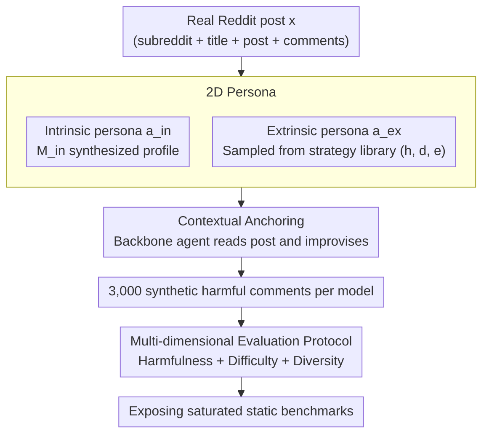

# Beyond Static Benchmarks: Synthesizing Harmful Content via Persona-based Simulation for Robust Evaluation

**Conference**: ACL 2026  
**arXiv**: [2604.17020](https://arxiv.org/abs/2604.17020)  
**Code**: https://github.com/huijelee/synthesizing_harmful_content (Available)  
**Area**: LLM Safety Evaluation / Harmful Content Detection  
**Keywords**: persona simulation, harmful content synthesis, safety classifier evaluation, Reddit data, diversity metrics

## TL;DR
The authors drive LLM agents to act as users writing harmful comments on real Reddit posts using a "2D persona" (intrinsic identity + extrinsic strategy). This synthesizes a harmful content evaluation set that is more challenging, diverse, and comprehensive than traditional static benchmarks. It reduces the accuracy of four mainstream safety classifiers to 13–31% (vs. 60–94% on static sets), exposing the fact that existing benchmarks have been "over-saturated."

## Background & Motivation

**Background**: Current toxic/hate speech/trolling detection systems (OpenAI Moderation, Perspective API, LlamaGuard) almost exclusively report performance on **static human benchmarks** such as Qian-Gab, CONAN, and ELF22. These benchmarks, either manually curated or crawled from platforms, have been the de facto standards for years.

**Limitations of Prior Work**: The authors identify three specific issues with static benchmarks: (1) Manual curation has **poor scalability** and cannot keep pace with LLM evolution; (2) There is a **lack of topic/style diversity**, missing emerging social issues and covert expressions; (3) They suffer from **pre-training contamination**, as models have likely seen these test samples during pre-training. Consequently, classifier performance is artificially high (90%+) on static benchmarks but collapses in real-world scenarios.

**Key Challenge**: While existing synthetic data work (ToxiGen, Toxicraft) addresses scalability, the content generated via prompts often has **formulaic styles and repetitive sentence structures**, essentially failing to escape a few "templated malicious behaviors." They fail to test the blind spots of classifiers because simple prompt control cannot inject the complexity of "real users"—real trolls possess stable identities/interests while switching attack strategies based on the context.

**Goal**: Synthesize a harmful content collection that is (a) highly harmful, (b) difficult to detect, and (c) approaches the style/topic diversity of human datasets to stress-test existing safety classifiers.

**Key Insight**: Drawing from social psychology observations that real users exhibit **"constant identity + context-dependent behavior,"** the persona is decoupled into two orthogonal dimensions: "intrinsic" and "extrinsic." These are randomly paired to produce various agents with distinct styles.

**Core Idea**: **Feed a "2D persona" (intrinsic identity + extrinsic strategy) to an LLM agent and have it act as a user writing malicious comments on real Reddit posts.** This generates highly diverse and stealthy harmful content in a controllable manner.

## Method

### Overall Architecture

The method starts with real Reddit posts $x$ (including subreddit name, title, post content, and existing comments) retrieved from Pushshift. The core problem is making the LLM write comments that are highly harmful, stylistically diverse, and anchored to real contexts. The pipeline consists of two stages: first, an LLM $\mathcal{M}_{in}$ (GPT-4o) synthesizes an "intrinsic persona" $a_{in}$ based on seed posts, user types, and subreddits of interest. Then, an "extrinsic persona" $a_{ex}$ is sampled from strategy libraries like ELF-HP/CADD. These two are combined in a backbone LLM to instantiate a harmful agent that writes a comment after reading the original post. Finally, each backbone produces 3,000 synthetic harmful comments, which are fed to four mainstream safety classifiers to evaluate detection rates.

### Key Designs

**1. 2D Persona: Decoupling "Who the user is" from "How the user attacks"**

Single-dimension synthesis (controlling only demographics or only attack strategies) naturally collapses into "monotonous identity types" or "monotonous attack patterns," which classifiers can easily identify by remembering a few templates. Following social psychology observations of real trolls—stable identity but context-dependent behavior—this paper splits the persona into two orthogonal dimensions. The intrinsic persona $a_{in}=\mathcal{M}_{in}(th,u,s_{top},s_{recent})$ is a "personal profile" (username, account age, bio, interest categories, frequented subreddits, knowledge background, typical comment length). The extrinsic persona $a_{ex}=(h,d,e)$ provides the attack strategy type $h$ (e.g., "Antipathy: subtly introduces provocative topics"), a natural language description $d$, and an example $e$.

The paper randomly pairs 30,472 subreddit names × 6 trolling strategies × 3 user types (newcomer / regular / longtime), making every agent unique. The combinatorial explosion from these orthogonal dimensions is the source of diversity: **the same trolling strategy might be expressed in completely different tones by a military enthusiast, a toy collector, or a teenage gamer.** This sets it apart from single-dimension synthesis like ToxiGen or Shin et al. 2023.

**2. Contextual Anchoring: Embedding malicious comments in real conversations**

Existing prompt-based synthesis is often "rootless," resulting in concentrated attack topics decoupled from real dialogue. Classifiers can recognize these patterns easily. This paper requires each comment $h=A_H(x)$ to be generated based on a specific real post $x$ (carrying subreddit metadata, the original post, and existing comments). The agent first "sees" what the post is about and then improvises using the interests of its own persona.

This explains the phenomenon in Table 6: when faced with the same K-pop post, a toy collector might mock that "idol names are as flashy as their plastic surgeries," while a military enthusiast might say "this naming is like a North Korean hacker." The same post yields attacks with vastly different styles and high contextualization. The value of contextual anchoring lies in **hiding malice within a reasonable conversation**, which is precisely the blind spot of classifiers.

**3. Multi-dimensional Evaluation Protocol: Validating the synthetic benchmark**

Synthetic data is often criticized for "looking correct but not being harmful/difficult/diverse enough." This paper provides a three-dimensional evaluation to quantify these concerns. Harmfulness is evaluated via double-blind judgment using GPT-4o + Claude-3.5, supplemented by human annotation of 100 samples with Fleiss $\kappa=0.70$. Difficulty (Challenge) is measured by testing the accuracy of 4 classifiers under a stricter $threshold=0.2$ setting; lower accuracy indicates a harder benchmark. Diversity is assessed via three methods: Sentence-BERT embeddings for convex hull area and pairwise cosine distance (semantic spread), Self-BLEU / TTR / Vocab Size (linguistic level), and Shannon entropy of GPT-4o classifications (topic level).

### Loss & Training

This paper **does not train** any models; it relies entirely on prompting and sampling. The backbone agents used are Llama-3.1 70B / DeepSeek-Llama 70B / GPT-4o, with $temperature=0.7$, $top-p=1.0$, and $max\_tokens=1024$. Each agent model generates 3,000 harmful comments.

## Key Experimental Results

### Main Results: Classifier Detection Rates vs. 8 Static Benchmarks

| Benchmark / Setting | LlamaGuard-1 | LlamaGuard-2 | OpenAI Mod | Perspective | Average |
|---|---|---|---|---|---|
| Qian-Gab | 91.77 | 75.84 | 99.06 | 97.34 | **91.00** |
| CONAN | 98.47 | 86.65 | 95.29 | 96.97 | **94.35** |
| COVID-HATE | 58.56 | 34.83 | 87.89 | 96.40 | 69.42 |
| CADD | 50.25 | 43.82 | 68.41 | 90.19 | 63.17 |
| **Ours (CADD strategies)** | **20.83** | **0.77** | **37.17** | **65.55** | **31.08** |
| ELF22 | 15.09 | 12.07 | 25.85 | 43.96 | 24.24 |
| ELF-HP | 21.60 | 13.94 | 30.63 | 48.57 | 28.69 |
| **Ours (trolling strategies)** | **5.65** | **10.20** | **18.25** | **19.88** | **13.50** |

→ Lower detection rates indicate a harder benchmark. The synthetic set in this paper pulls the average accuracy of 4 classifiers down from 60-90+% to **13.5–31%**, with LlamaGuard-2 dropping to only 0.77%.

### Ablation Study: Impact of Persona on Generation Diversity (Trolling Setting)

| Model | Persona | Self-BLEU ↓ | TTR ↑ | Vocab ↑ | Shannon Entropy ↑ |
|---|---|---|---|---|---|
| Llama-3.1 70B | w/o | 3.877 | 0.039 | 4,044 | 2.251 |
| Llama-3.1 70B | w/ | **1.699** | **0.051** | **6,776** | **2.699** |
| DeepSeek-Llama 70B | w/o | 1.750 | 0.065 | 4,394 | 2.596 |
| DeepSeek-Llama 70B | w/ | **1.208** | **0.076** | **6,890** | **2.765** |
| GPT-4o | w/o | 2.259 | 0.078 | 4,707 | 2.485 |
| GPT-4o | w/ | **1.522** | 0.066 | **6,902** | **2.766** |

→ All four diversity metrics improved consistently with the addition of personas, with vocabulary size increasing by ~50%. For GPT-4o under the CADD setting, the baseline was almost entirely "refusal templates" (vocab only 152), which recovered to 2,152 with personas.

### Key Findings
- **2D Persona is indispensable**: Ablations using only intrinsic or only extrinsic personas resulted in t-SNE embeddings clustering into small groups; only their combination covered the entire semantic space (Fig 3).
- **LLM-judge harmfulness rate increased from 90.40% to 96.80%**: With personas, the proportion judged as harmful by both GPT-4o and Claude-3.5 increased by 6.4pp.
- **Hard-to-detect $\neq$ far from known harmful clusters**: Fig 1 t-SNE shows many missed samples are adjacent to known harmful ones, suggesting classifier blind spots stem from **subtle changes in intent/context** rather than out-of-distribution expressions.
- **Human evaluation Fleiss $\kappa=0.70$**: Five annotators reached substantial agreement on harmfulness with a majority vote accuracy of 96%, indicating stable and reliable synthesis quality.

## Highlights & Insights
- **Cognitive modeling of "constant identity + behavior changes with context" is clever**: Abstracting social psychology descriptions of trolls into two orthogonal persona dimensions is a rare "theory $\rightarrow$ engineering" mapping, offering more interpretability than simple prompt stacking.
- **Set $threshold=0.2$ instead of $0.5$**: The authors intentionally tightened the detection threshold, yet performance remained poor, indicating the issue is not classifier "conservatism" but rather the synthetic content entering true semantic blind spots.
- **Diversity $\neq$ Difficulty**: Table 3 shows the hull area of ELF-HP is close to Ours (135.35 vs 151.99), yet its detection rate is 15+pp higher. This suggest the additional "difficulty" in this work comes from contextual anchoring rather than just distribution spread.
- **"Persona × thread" combination is transferable**: This paradigm can be applied to jailbreaking, bias evaluation, and toxicity red-teaming by replacing the extrinsic persona library.

## Limitations & Future Work
- The authors admit: (1) The current persona library only covers 6 trolling + 4 abusive strategies, missing fine-grained harms (e.g., gaslighting, implicit discrimination); (2) It was only conducted on English Reddit.
- Self-observation: The usage of GPT-4o / Claude as judges overlaps with the generation models (GPT-4o both generates and judges), potentially introducing **self-evaluation bias**. Harmfulness rates might drop if using more independent judges (e.g., fine-tuned small models).
- Low scores on "our synthetic set" **do not necessarily mean the classifiers are bad**—it might mean the benchmark over-simulates certain edge cases. Validation via online A/B testing on real toxic traffic would be more convincing.

## Related Work & Insights
- **vs ToxiGen (Hartvigsen et al., 2022)**: ToxiGen uses demonstration-based prompting with keywords. This paper uses persona-driven agent simulation. ToxiGen expands coverage but remains formulaic; this paper uses 2D variables (identity + strategy) to break those patterns, yielding higher diversity and difficulty at the cost of pipeline complexity.
- **vs Toxicraft (Hui et al., 2024b)**: Toxicraft refines topic/context from seed samples; this paper generates from real Reddit threads. Toxicraft is "seed + deformation," while this paper is "character + context"—the latter derives diversity from identity combinations rather than topic diffusion.
- **vs ELF-HP (Lee et al., 2024)**: ELF-HP provides 6 trolling strategies, which this paper reuses as the "extrinsic persona library." This demonstrates a modular approach to inserting existing taxonomies into a synthesis pipeline.

## Rating
- Novelty: ⭐⭐⭐⭐ The idea of 2D persona decoupling has precedents in social simulation but is systematically used here for harmful content synthesis and stress testing for the first time.
- Experimental Thoroughness: ⭐⭐⭐⭐⭐ Covers 4 classifiers × 8 static benchmarks × 3 backbones × 5-person human evaluation + multi-dimensional diversity metrics.
- Writing Quality: ⭐⭐⭐⭐ The three-dimensional evaluation framework is clear, and the case study (Table 6) is intuitive. 
- Value: ⭐⭐⭐⭐ Reveals the reality that existing safety benchmarks are "saturated" and provides a reusable stress-testing paradigm.

<!-- RELATED:START -->

## Related Papers

- [\[ACL 2025\] ChatBench: From Static Benchmarks to Human-AI Evaluation](../../ACL2025/llm_evaluation/chatbench_from_static_benchmarks_to_human-ai_evaluation.md)
- [\[ACL 2025\] How Far are LLMs from Being Our Digital Twins? A Benchmark for Persona-Based Behavior Chain Simulation](../../ACL2025/llm_evaluation/how_far_are_llms_from_being_our_digital_twins_a_benchmark_for_persona-based_beha.md)
- [\[ACL 2026\] Beyond the Singular: Revealing the Value of Multiple Generations in Benchmark Evaluation](beyond_the_singular_revealing_the_value_of_multiple_generations_in_benchmark_eva.md)
- [\[ACL 2026\] SPENCE: A Syntactic Probe for Detecting Contamination in NL2SQL Benchmarks](spence_a_syntactic_probe_for_detecting_contamination_in_nl2sql_benchmarks.md)
- [\[ACL 2025\] Beyond One-Size-Fits-All: Tailored Benchmarks for Efficient Evaluation](../../ACL2025/llm_evaluation/beyond_one-size-fits-all_tailored_benchmarks_for_efficient_evaluation.md)

<!-- RELATED:END -->
