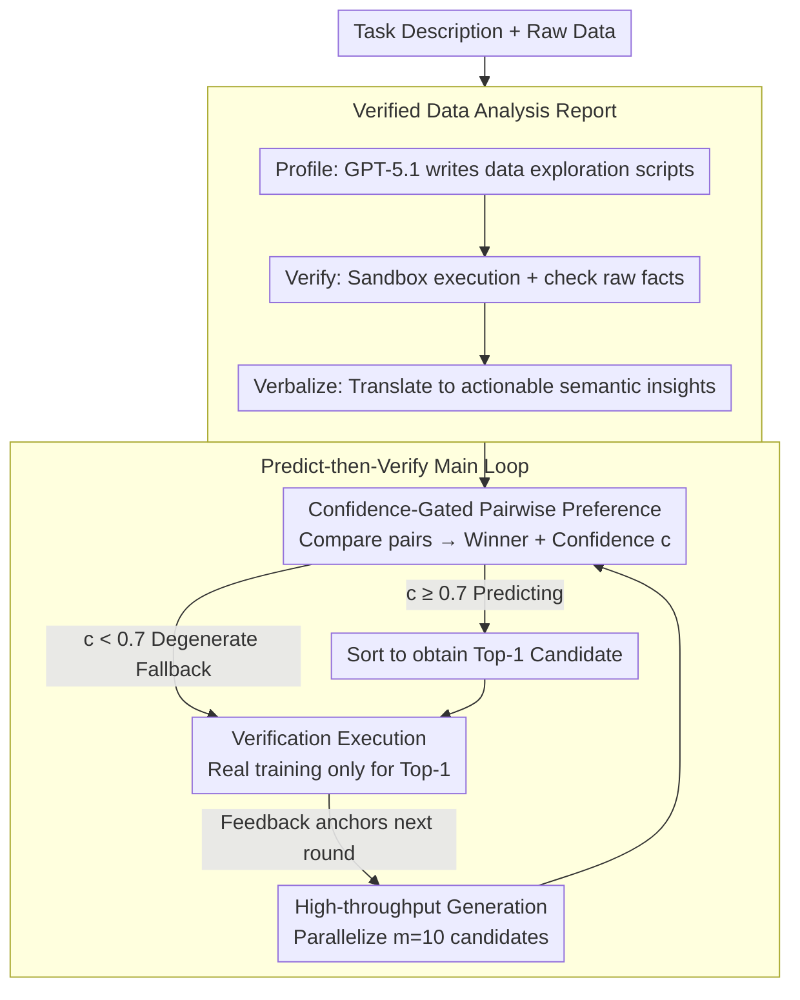

# Can We Predict Before Executing Machine Learning Agents?

**Conference**: ACL 2026  
**arXiv**: [2601.05930](https://arxiv.org/abs/2601.05930)  
**Code**: https://github.com/zjunlp/predict-before-execute  
**Area**: LLM Agent / Evaluation  
**Keywords**: ML Agent, World Model, Predict-then-Verify, AutoML, MLE-Bench

## TL;DR
This paper demonstrates that LLMs can serve as implicit "world models," predicting the quality of machine learning (ML) solutions based solely on task descriptions, verified data reports, and two sets of code (DeepSeek-V3.2-Thinking achieves 61.5% accuracy). Based on this, ForeAgent is constructed to transform the "Generate-Execute-Feedback" loop center to AIDE into a "Predict-then-Verify" loop, achieving 6× acceleration, 3.2× search space expansion, and a +6% Beat Ratio on MLE-Bench.

## Background & Motivation

**Background**: ML agents such as MLE-Bench, AutoMind, and AIDE follow the "Generate-Execute-Feedback" paradigm—generating code, executing training to obtain metrics, and refining based on feedback. However, a single full training run on MLE-Bench often takes 9 hours, limiting agents to exploring only a few candidates within a 12-hour budget.

**Limitations of Prior Work**: (1) Execution Bottleneck—most computation is wasted on executing sub-optimal candidates; (2) Narrow search space—tree search methods like AIDE are constrained by execution budgets, expanding only 1× nodes on average; (3) Unreliable pruning—existing methods (Trirat 2025, Kulibaba 2025) rely on heuristics (e.g., complexity scores) that are prone to pruning high-quality solutions.

**Key Challenge**: To enable agents to explore wider solution spaces, the requirement to "execute every candidate" must be abandoned. However, without execution, it is difficult to identify which candidates are worth running. Human experts use "mental simulation" by understanding tasks and data to judge algorithm suitability—can LLMs achieve similar mental simulation?

**Goal**: (1) Formally define the "Data-centric Solution Preference" task and construct a large-scale evaluation; (2) Verify if LLMs can reliably predict ML solution quality without execution; (3) Embed this prediction capability into agents, replacing the Execute loop with a Predict-then-Verify loop.

**Key Insight**: Borrowing the World Model concept (Ha & Schmidhuber 2018, Hafner 2024)—where RL agents use learned environment models for internal rollouts instead of real interaction. This paradigm is transferred to code execution: using the "execution prior" learned by LLMs for internal rollouts instead of real training.

**Core Idea**: Use a verified data analysis report (profiling data then using GPT-5.1 to verbalize insights, e.g., "severe class imbalance, accuracy should not be used") as critical context. The LLM treats this semantic signal as input for an implicit world model to perform pairwise comparisons between two solutions, providing a confidence score. Only high-confidence candidates proceed to real execution.

## Method

### Overall Architecture
The paper first formalizes "predicting ML solution quality without execution" as a Data-centric Solution Preference task with an evaluation corpus, then integrates this capability into an agent. For the corpus, 1,329 valid solutions were extracted from AIDE/AutoMind trajectories on MLE-Bench. After deduplication, classification, and expert sampling, 895 instances remained, forming 18,438 pairs with balanced ground-truth winners to eliminate positional bias. For the agent, ForeAgent uses AIDE’s tree search as a backbone but modifies the Improvement stage from "sequential execution" to three steps: high-throughput generation of $m=10$ candidates $\rightarrow$ pairwise screening with a 0.7 confidence threshold $\rightarrow$ real execution verification only for top-1 candidates. The preference task is measured by Micro-Averaged Accuracy (Random baseline 50.0%, Complexity heuristic 50.8%), while the agent is measured by Beat Ratio (proportion of human competitors beaten on MLE-Bench).

### Key Designs

**1. Verified Data Analysis Report: Distilling raw data into semantic insights for LLM reasoning**

LLMs are neither proficient at processing raw numbers nor capable of fitting large data tables into context. This paper uses a Profile-Verify-Verbalize pipeline to translate raw data into LLM-friendly insights. First, GPT-5.1 writes a Python profiling script (e.g., `df['target'].value_counts()`). The script is executed in a sandbox, and outputs are strictly verified to be free of runtime errors, yielding raw facts (e.g., "Target: 0: 0.915, 1: 0.085"). Finally, GPT-5.1 translates the logs into actionable insights ("Severe class imbalance (Pos: 8.5%). Implication: Accuracy is not a suitable metric; consider using F1-score.").

Ablation studies confirm the value of this pipeline: Code Only 56.7% $\rightarrow$ Numerical Stats 59.0% $\rightarrow$ Verbal Report 61.3%. Deliberately providing mismatched context (Context Mismatch) results in only 56.8%. This indicates LLMs are not guessing based on "code complexity" but are reasoning about "data semantics $\times$ algorithmic adaptation." Verbal narratives outperform raw statistics, suggesting the model acts as a rhetorical reasoner triggered by "meaning."

**2. Confidence-Gated Pairwise Preference: Skipping execution only when confident**

The prediction input is $\mathcal{X}=(I, D_{rep}, \{C_0, C_1\}, \mathcal{P})$, and the output is $\mathcal{Y}=(cot, \hat{y}, c)$, where $\hat{y}\in\{0,1\}$ is the predicted winner and $c\in[0,1]$ is the confidence score. ForeAgent uses $c=0.7$ as a gating threshold: it trusts the prediction and skips execution only if confidence is high, falling back to real execution otherwise.

The validity of this mechanism relies on the model not assigning high confidence arbitrarily. Calibration experiments show a strong positive correlation between confidence and accuracy. High calibration allows the filter to prune efficiently without discarding good solutions. If confidence were noisy, gating would degenerate into random selection. Reliable self-reported confidence is key to the safe deployment of this implicit world model.

**3. Predict-then-Verify Loop: Downgrading execution to a final validation step**

ForeAgent inverts the "execution-driven" main loop of AIDE into a "prediction-driven" one. Physical execution is reserved for final verification, allowing each Improvement step to reduce execution from $m=10$ times to 1, immediately gaining $m \times$ acceleration. The process involves: High-Volume Generation to parallelize $m=10$ candidates (no execution cost, greatly widening search); Confidence-Gated Pairwise Selection using the implicit world model to compare pairs; and Verification Execution locally to anchor feedback only for the top-$k=1$ candidate.

The architecture is designed conservatively—verifying only top-1—to prevent LLM misjudgments from derailing the search trajectory. This means the reported 6× acceleration, 3.2× search width, and +6% Beat Ratio are lower bounds.

## Key Experimental Results

### Main Results — Solution Preference Task (Selected: DeepSeek-V3.2-Thinking)

| Dimension | Value | Acc (%) |
|------|------|---------|
| Domain | CV | 59.3 |
| Domain | NLP | **66.9** |
| Domain | Data Sci. | 57.4 |
| Difficulty | Easy | **63.9** |
| Difficulty | Medium | 60.4 |
| Difficulty | Hard | 57.0 |
| Algo Era | Traditional | **64.5** |
| Algo Era | Modern | 60.4 |
| Granularity | Cross-Algo | **62.8** |
| Granularity | Self-Comp. | 60.7 |
| Complexity | Low | 62.1 |
| Complexity | High | 59.6 (Complexity Tax) |
| **Avg (Total 18,438 pairs)** | | **61.5** |

Comparison: GPT-5.1: 58.8% Global Avg; Random 50.0%; Complexity Heuristic 50.8%. Reasoning mode (CoT) 61.3% vs. Direct Answer 55.9%.

### Ablation Study

| Experimental Dimension | Key Result |
|----------|----------|
| Input Modality | Heuristic 50.8 $\rightarrow$ Code Only 56.7 $\rightarrow$ Numerical Stats 59.0 $\rightarrow$ **Verbal Report 61.3**; Context Mismatch only 56.8 |
| Listwise Ranking | Acc@1 is 61.3% at N=2, but drops to 31.1% at N=5; Spearman $\rho \approx 0.23$ |
| Scaling (Qwen 4B $\rightarrow$ 1T) | Saturation after 30B; no significant gain for 1T; DeepSeek-V3.2 (61.3%) and GPT-5.1 (58.8%) advantages stem from reasoning paradigms, not parameters |
| Validation-Test Gap | Training val metric achieves Acc 72.2% (hours); LLM reasoning achieves 61.5% (seconds) |

### Key Findings
- **LLMs can "mentally calculate" algorithm adaptation**: Over 10% improvement over random baseline is statistically significant, proving this is not a lucky pattern.
- **Verbal Report is the core source of gain**: Raw statistics are insufficient; they must be translated into "meaning" to trigger reasoning.
- **Cognitive Boundaries exist**: Models perform better on NLP > CV > Data Sci.; Easy > Hard; Traditional > Modern; Cross-Algo > Self-Comp. They excel at coarse comparisons between algorithms but struggle with fine-tuning.
- **Listwise Ranking is a weakness**: Pairwise 61% $\rightarrow$ List of 5 only 31% Acc@1, with Spearman at 0.23. LLMs lack global discrimination.
- **Parameter Scaling Law does not apply**: Gains are negligible from 30B to 1T, suggesting reasoning architecture is the bottleneck.
- **Complexity Tax**: Accuracy drops by 4 points on complex code, suggesting LLMs get lost in verbose scripts.

## Highlights & Insights
- **Applying the World Model paradigm to code/data**: While World Models were previously used for physical simulation, this is one of the first works to use them as a code-execution prior using standard reasoning LLMs.
- **Verified Data Report**: A two-step process using LLMs to write profiling scripts and verbalize results. This circumvents LLM weaknesses in direct numerical processing and serves as a reusable prompt engineering pattern.
- **Confidence-Gated Pruning**: A simple design using self-reported confidence and gating thresholds allows for safe deployment without RL fine-tuning of reward models.
- **Validation-Test Gap Perspective**: Traditional validation metrics only achieve 72.2% accuracy due to distribution shifts. LLM prediction at 61.5% is competitive and significantly faster, redefining what constitutes a reliable ML feedback signal.
- **Dataset Value**: The 18,438-pair dataset is valuable for training reward models as a dense reward source for offline RL agents.

## Limitations & Future Work
- The corpus covers 26 tasks but is biased toward Classification/Regression. Coverage of long-tail scientific tasks (e.g., Audio, Tabular Grading) is low.
- Verified Data Reports for unstructured fields like CV/NLP rely on metadata and lack multimodal semantic profiling.
- ForeAgent uses conservative top-1 verification; more aggressive strategies like top-$k$ or hierarchical gating were not explored.
- The weakness in listwise ranking restricts ForeAgent's application in very large candidate pools.
- Complexity Tax is severe on complex code, potentially limiting effectiveness in deep optimization scenarios.

## Related Work & Insights
- **vs AIDE / AutoMind / MLE-Star**: These rely entirely on real execution for feedback; this work uses an implicit world model to defer execution.
- **vs CodeI/O (Li 2025) / CRUXEval (Gu 2024)**: These measure forward execution prediction; this work measures which code is better for a specific dataset.
- **vs Hora (2024) Predicting Test Results**: Hora predicts static test cases; this work predicts ML training outcomes, which is inherently more difficult.
- **vs Trirat (2025) / Kulibaba (2025)**: They use complexity heuristics for pruning; this work uses semantic-level preference judgments, which are more reliable.

## Rating
- Novelty: ⭐⭐⭐⭐⭐ Combining the world model paradigm with verified data reports and pairwise preference for ML agents is a fresh perspective.
- Experimental Thoroughness: ⭐⭐⭐⭐⭐ 18,438-pair evaluation, scaling from 4B to 1T, and testing on 5 MLE-Bench tasks makes it very comprehensive.
- Writing Quality: ⭐⭐⭐⭐ Concepts are clear, though tables with many dimensions can be dense.
- Value: ⭐⭐⭐⭐⭐ 6× speedup and +6% Beat Ratio are direct engineering improvements, and the open-source dataset is valuable for future reward modeling.

<!-- RELATED:START -->

## Related Papers

- [\[ICML 2026\] HiPER: Hierarchical Reinforcement Learning with Explicit Credit Assignment for Large Language Model Agents](../../ICML2026/llm_evaluation/hiper_hierarchical_reinforcement_learning_with_explicit_credit_assignment_for_la.md)
- [\[ICML 2025\] DataDecide: How to Predict Best Pretraining Data with Small Experiments](../../ICML2025/llm_evaluation/datadecide_how_to_predict_best_pretraining_data_with_small_experiments.md)
- [\[ACL 2026\] Can LLMs Act as Historians? Evaluating Historical Research Capabilities of LLMs via the Chinese Imperial Examination](can_llms_act_as_historians_evaluating_historical_research_capabilities_of_llms_v.md)
- [\[ACL 2026\] Multi-Task Reinforcement Learning for Enhanced Multimodal LLM-as-a-Judge](multi-task_reinforcement_learning_for_enhanced_multimodal_llm-as-a-judge.md)
- [\[ACL 2026\] Enhancing Linguistic Competence of Language Models through Pre-training with Language Learning Tasks](enhancing_linguistic_competence_of_language_models_through_pre-training_with_lan.md)

<!-- RELATED:END -->
