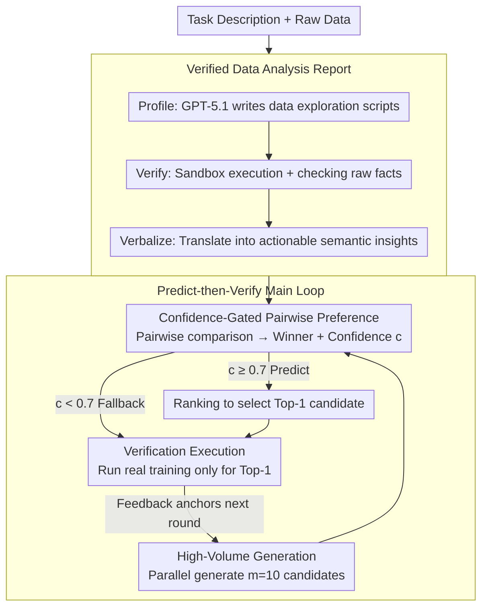

# Can We Predict Before Executing Machine Learning Agents?

**Conference**: ACL 2026  
**arXiv**: [2601.05930](https://arxiv.org/abs/2601.05930)  
**Code**: https://github.com/zjunlp/predict-before-execute  
**Area**: LLM Agent / Evaluation  
**Keywords**: ML Agent, World Model, Predict-then-Verify, AutoML, MLE-Bench

## TL;DR
This paper demonstrates that LLMs can serve as implicit "world models" to predict the quality of ML solutions based solely on task descriptions, verified data reports, and code snippets (DeepSeek-V3.2-Thinking achieves 61.5% accuracy). Based on this, the authors develop ForeAgent, which transforms the traditional "Generate-Execute-Feedback" loop of AIDE into a "Predict-then-Verify" loop, achieving a 6× speedup, 3.2× expanded search space, and a +6% Beat Ratio on MLE-Bench.

## Background & Motivation

**Background**: ML agents such as MLE-Bench, AutoMind, and AIDE typically follow a "Generate-Execute-Feedback" paradigm—generating code, executing training to obtain metrics, and iteratively refining based on feedback. However, a single full training run on MLE-Bench can take up to 9 hours, limiting agents to exploring only a few candidates within a 12-hour budget.

**Limitations of Prior Work**: (1) Execution Bottleneck—vast computational resources are wasted on executing sub-optimal candidates; (2) Narrow Search Space—tree search methods like AIDE are constrained by execution budgets, typically expanding only 1× nodes on average; (3) Existing pruning methods (e.g., Trirat 2025, Kulibaba 2025) rely on heuristics like complexity scores, which are unreliable and prone to pruning high-quality solutions.

**Key Challenge**: To enable agents to explore a broader solution space, the "execute every candidate" requirement must be relaxed. However, without execution, how can one determine which candidates are worth running? Human experts use "mental simulation" to judge algorithm suitability after understanding the task and data—can LLMs perform similar simulations?

**Goal**: (1) Formally define the "Data-centric Solution Preference" task and construct a large-scale evaluation; (2) Verify whether LLMs can reliably predict the performance of ML solutions without execution; (3) Integrate this predictive capability into agents to replace the execution-heavy loop with a Predict-then-Verify loop.

**Key Insight**: Drawing inspiration from the World Model concept (Ha & Schmidhuber 2018, Hafner 2024), where RL agents use learned environment models for internal rollouts instead of real interactions, this paper transfers the paradigm to code execution. It uses the "execution prior" learned by LLMs to perform internal rollouts as a substitute for actual training.

**Core Idea**: Use a verified data analysis report (generated by profiling data and having GPT-5.1 verbalize it into natural language insights, e.g., "Severe class imbalance; accuracy should not be used") as critical context. This allows the LLM to use semantic signals as input for an implicit world model, performing pairwise comparisons of solutions with confidence scores. Only high-confidence candidates proceed to actual execution.

## Method

### Overall Architecture
The study first formalizes the "Data-centric Solution Preference" task and prepares evaluation corpora, then integrates this capability into the agent. For the corpora, 1,329 valid solutions were extracted from trajectories of AIDE/AutoMind on MLE-Bench. After deduplication, classification, and expert sampling, 895 instances were refined into 18,438 pairs, with ground-truth winner positions balanced to eliminate bias. ForeAgent uses AIDE’s tree search as a backbone but modifies the Improvement stage from "sequential execution" to a three-step process: generating $m=10$ candidates at once $\rightarrow$ performing pairwise filtering with a 0.7 confidence threshold $\rightarrow$ executing only the top-1 candidate for verification. The preference task is measured by Micro-Averaged Accuracy (Random baseline 50.0%, Complexity heuristic 50.8%), while the agent is evaluated by Beat Ratio (the percentage of human competitors surpassed on MLE-Bench).

### Key Designs

**1. Verified Data Analysis Report: Refining Raw Data into Semantic Insights for LLM Reasoning**

LLMs are neither proficient at handling raw numerical tables nor capable of fitting massive datasets into their context. This paper uses a Profile-Verify-Verbalize pipeline to translate raw data into LLM-friendly insights. First, GPT-5.1 writes a Python profiling script (e.g., `df['target'].value_counts()`). This is executed in a sandbox with manual verification for runtime errors to obtain raw facts (e.g., "Target: 0: 0.915, 1: 0.085"). Finally, GPT-5.1 translates the logs into actionable insights ("Severe class imbalance (Pos: 8.5%). Implication: Accuracy is not a suitable metric; consider using F1-score.").

Ablation studies confirm the value of this pipeline: Code Only 56.7% $\rightarrow$ Numerical Stats 59.0% $\rightarrow$ Verbal Report 61.3%. Intentionally providing mismatched context droped accuracy to 56.8%. This proves LLMs are not merely guessing based on code complexity but are performing "Data Semantics $\times$ Algorithm Adaptation" reasoning.

**2. Confidence-Gated Pairwise Preference: Skipping Execution Only When Confident**

The prediction input is $\mathcal{X}=(I, D_{rep}, \{C_0, C_1\}, \mathcal{P})$ and the output is $\mathcal{Y}=(cot, \hat{y}, c)$, where $\hat{y}\in\{0,1\}$ is the predicted winner and $c\in[0,1]$ is the confidence. ForeAgent uses $c=0.7$ as a gating threshold: if confidence is high, the prediction is trusted and execution is skipped; otherwise, it falls back to real execution.

Calibration experiments show that confidence is strictly positively correlated with accuracy. This reliable calibration allows the filter to prune efficiently without accidentally discarding superior solutions.

**3. Predict-then-Verify Loop: Downgrading Execution to a Final Verification Step**

ForeAgent flips AIDE's "execution-driven" loop into a "prediction-driven" one. Physical execution is reserved only for final verification. Each Improvement step is reduced from $m=10$ runs to 1 run, providing immediate acceleration. The three steps are: High-Volume Generation (generating $m=10$ candidates in parallel without cost); Confidence-Gated Pairwise Selection (using the implicit world model to compare candidates); and Verification Execution (running real training only for the top-ranking candidate to anchor feedback).

### Key Experimental Results

### Main Results — Solution Preference Task (Selected for DeepSeek-V3.2-Thinking)

| Dimension | Type | Acc (%) |
|------|------|---------|
| Domain | CV | 59.3 |
| Domain | NLP | **66.9** |
| Domain | Data Sci. | 57.4 |
| Difficulty | Easy | **63.9** |
| Difficulty | Medium | 60.4 |
| Difficulty | Hard | 57.0 |
| Algo Era | Traditional | **64.5** |
| Algo Era | Modern | 60.4 |
| Granularity | Cross-Algo | **62.8** |
| Granularity | Self-Comp. | 60.7 |
| Complexity | Low | 62.1 |
| Complexity | High | 59.6 |
| **Avg (All 18,438 pairs)** | | **61.5** |

Comparison: GPT-5.1 achieved 58.8% average; Random was 50.0%; Complexity Heuristic was 50.8%. Reasoning mode (CoT) yielded 61.3% vs. 55.9% for Direct Answer.

### Ablation Study

| Dimension | Key Result |
|----------|----------|
| Input Modality | Heuristic 50.8 $\rightarrow$ Code Only 56.7 $\rightarrow$ Stats 59.0 $\rightarrow$ **Verbal Report 61.3** |
| Listwise Ranking | Acc@1 is 61.3% for N=2, but drops to 31.1% for N=5; Spearman $\rho \approx 0.23$ |
| Scaling (Qwen 4B → 1T) | Saturation after 30B; no significant gain at 1T. Advantage comes from reasoning paradigm. |
| Validation-Test Gap | Real training metric Acc 72.2% (hours); LLM inference 61.5% (seconds) |

### Performance on MLE-Bench (5 AI4Science Tasks)

| Metric | AIDE baseline | ForeAgent | Gain |
|------|---------------|-----------|------|
| Avg Beat Ratio | base | **+6%** | Significant |
| Conv. Time | 12h | 2h | **6× Acceleration** |
| Nodes Explored | 1× | **3.2×** | Broader Search |
| Test Improve Rate | base | +23% | Significant |

### Key Findings
- **LLMs can "calculate" algorithm fitment**: Achieving $>10\%$ over the random baseline is statistically significant, proving this is not mere pattern matching.
- **Verbal Reports are the core driver**: Raw stats are insufficient; they must be translated into "meaning" to trigger reasoning.
- **Cognitive Boundaries exist**: Models perform better on NLP > CV; Easy > Hard; and Cross-Algorithm > Self-Comparison. They excel at coarse algorithmic comparisons but struggle with fine-tuning.
- **Listwise Ranking is a weakness**: Pairwise accuracy of 61% drops to 31% for a list of 5 (Acc@1). LLMs currently lack global discrimination.
- **Complexity Tax**: Accuracy drops by 4 points on complex code, suggesting LLMs may get lost in verbose scripts.

## Highlights & Insights
- **Applying the World Model paradigm to code/data**: While previously used for physical simulations, this is one of the first works to use LLMs as a code-execution prior.
- **Verified Data Report**: This pattern avoids the weakness of LLMs in numerical processing by using code to verify facts before verbalizing them.
- **Confidence-Gated Pruning**: A simple design allowing safe deployment of implicit world models without requiring RL fine-tuning of a reward model.
- **Redefining Feedback**: Since traditional validation metrics only have ~72% accuracy due to distribution shift, the LLM’s 61.5% (obtained in seconds) represents a highly efficient alternative feedback signal.

## Limitations & Future Work
- The corpora cover 26 tasks but are skewed toward Classification/Regression; long-tail scientific tasks (Audio, Tabular Grading) are underrepresented.
- Verified Data Reports rely on metadata for unstructured domains like CV/NLP, lacking deep multimodal semantic profiling.
- The use of conservative top-1 verification limits more aggressive batching strategies.
- The "Complexity Tax" remains a hurdle for deep optimization scenarios involving highly verbose code.

## Related Work & Insights
- **vs AIDE / AutoMind**: These rely entirely on real execution; ForeAgent uses an implicit world model to defer execution.
- **vs CodeI/O / CRUXEval**: These test forward code execution prediction; this work tests high-level "algorithm-data suitability."
- **vs Trirat (2025) / Kulibaba (2025)**: They use complexity heuristics for pruning; this work uses semantic-level preference judgment, which is far more reliable.

## Rating
- Novelty: ⭐⭐⭐⭐⭐ 
- Experimental Thoroughness: ⭐⭐⭐⭐⭐ 
- Writing Quality: ⭐⭐⭐⭐ 
- Value: ⭐⭐⭐⭐⭐ 

<!-- RELATED:START -->

## Related Papers

- [\[ICML 2026\] HiPER: Hierarchical Reinforcement Learning with Explicit Credit Assignment for Large Language Model Agents](../../ICML2026/llm_evaluation/hiper_hierarchical_reinforcement_learning_with_explicit_credit_assignment_for_la.md)
- [\[ICML 2025\] DataDecide: How to Predict Best Pretraining Data with Small Experiments](../../ICML2025/llm_evaluation/datadecide_how_to_predict_best_pretraining_data_with_small_experiments.md)
- [\[ACL 2026\] Multi-Task Reinforcement Learning for Enhanced Multimodal LLM-as-a-Judge](multi-task_reinforcement_learning_for_enhanced_multimodal_llm-as-a-judge.md)
- [\[ACL 2026\] Can LLMs Act as Historians? Evaluating Historical Research Capabilities of LLMs via the Chinese Imperial Examination](can_llms_act_as_historians_evaluating_historical_research_capabilities_of_llms_v.md)
- [\[ACL 2026\] Enhancing Linguistic Competence of Language Models through Pre-training with Language Learning Tasks](enhancing_linguistic_competence_of_language_models_through_pre-training_with_lan.md)

<!-- RELATED:END -->
