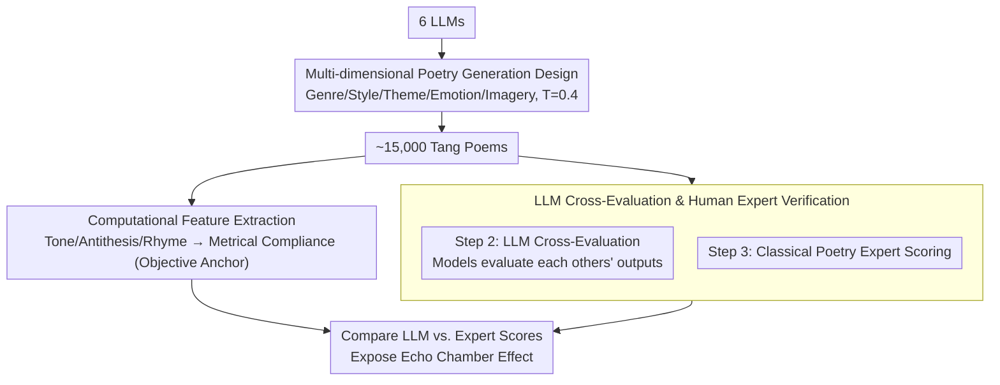

# Capabilities and Evaluation Biases of Large Language Models in Classical Chinese Poetry Generation: A Case Study on Tang Poetry

**Conference**: ACL 2026 Findings  
**arXiv**: [2510.15313](https://arxiv.org/abs/2510.15313)  
**Code**: [https://github.com/boleima/Tang-Poetry](https://github.com/boleima/Tang-Poetry)  
**Area**: LLM Evaluation  
**Keywords**: Classical Chinese Poetry Generation, Tang Poetry, LLM Evaluation Bias, Echo Chamber Effect, Human-AI Evaluation

## TL;DR

This paper proposes a three-step evaluation framework (computational feature extraction + LLM-as-Judge + human expert verification) to systematically evaluate the performance of six LLMs in Tang poetry generation. It identifies a critical "echo chamber" effect: LLMs systematically overestimate machine-generated poems that mimic statistical patterns but violate metrical rules, deviating significantly from human expert judgments.

## Background & Motivation

**Background**: LLMs have demonstrated impressive capabilities in text generation, including creative writing. Classical Chinese poetry (especially Tang poetry) poses an extreme challenge to AI creativity due to its strict prosodic and tonal constraints and deep cultural connotations.

**Limitations of Prior Work**: (1) LLM-generated poems often exhibit inter-line inconsistency, lack of original imagery, or the reproduction of memorized verses; (2) Traditional automated metrics (BLEU, ROUGE) fail to capture rhythm, imagery, and aesthetic value; (3) LLM-as-Judge methods may suffer from systematic biases—models might inflate their own outputs or converge with peers.

**Key Challenge**: Poetry generation requires balancing structural correctness with aesthetic quality. Current automated evaluation methods cannot reliably measure these dimensions, particularly in culturally sensitive creative tasks.

**Goal**: Establish a systematic study of LLM Tang poetry generation and evaluation to reveal the capability boundaries of LLMs and the biases in their evaluation.

**Key Insight**: Using Tang poetry as a testing ground, the study designs generation tasks across five dimensions (genre, poet style, theme, emotion, imagery) and provides multi-layered evaluation through a three-step framework.

**Core Idea**: Poems generated by LLMs may resemble human works in surface statistical features but possess systematic flaws in strict metrical compliance. LLM evaluators fail to recognize these flaws, creating an "echo chamber."

## Method

### Overall Architecture
This paper constructs a "generation-evaluation" pipeline: six LLMs generate approximately 2,500 Tang poems each across five dimensions (totaling ~15,000 poems). These are evaluated through a three-step framework: Step 1 extracts computational features (objective metrics like metrical compliance rate); Step 2 involves cross-evaluation where each model evaluates others' outputs (LLM-as-Judge); Step 3 involves independent scoring by experts in classical Chinese literature. By comparing LLM scores with expert scores, the "echo chamber" effect is localized.

### Key Designs

**1. Multi-dimensional Poetry Generation Design: Deconstructing Tang poetry creation into five comparable dimensions**

To ensure scientific comparisons across models and dimensions, the generation tasks are spread across five dimensions: Genre (five/seven-character Jueju, Lushi), Poet Style (Li Bai, Du Fu, Bai Juyi, Wang Wei, Li Shangyin), Theme (Landscape, Nostalgia, Historical, Pastoral, Parting), Emotion (Sadness, Serenity, Unrestrained, Romantic, Joy), and Imagery (Wind, Flower, Willow, Moon, Wild Goose). Each poem is generated using explicit prompts for its category with temperature fixed at $T=0.4$ to control randomness, thereby isolating model capability differences from task variations.

**2. Computational Feature Extraction: Transforming strict metrical constraints into quantifiable compliance rates**

Metrical rules are the "hard" constraints of Tang poetry. Violations of tone, antithesis, or rhyme render a poem technically failed, yet these are the dimensions LLM evaluators often overlook. Step 1 automatically detects compliance with tone patterns, antithetical structures, and rhyming schemes to calculate a metrical compliance rate. This serves as the most objective and discriminative metric, providing a quantifiable anchor to reveal how LLM judges ignore metrical violations.

**3. LLM Cross-evaluation and Human Expert Verification: Using expert baselines to highlight systematic biases in automated evaluation**

In Step 2, each LLM evaluates other models' poems based on thematic relevance, emotional consistency, imagery/structure, and linguistic authenticity. Step 3 involves classical literature experts independently scoring the same samples. Comparing these two sets of scores reveals the "echo chamber" effect: LLM judges systematically assign high scores to machine-generated poems that mimic statistical patterns but violate meter, often showing a slight preference for their own output. Poetry, with its mix of cultural sensitivity and rigid formal constraints, serves as a unique litmus test for the reliability of LLM-as-Judge.

### Loss & Training
No model training is involved. Generation uses $T=0.4$, and all evaluations (including LLM cross-evaluation and expert verification) are conducted in a zero-shot setting.

## Key Experimental Results

### Main Results

**Capability Stratification of Six LLMs**

- **Tier 1**: Qwen2.5-7B-Instruct (highest metrical compliance, best overall quality)
- **Tier 2**: GLM-4-9B-Chat, DeepSeek-V2-Lite-Chat
- **Tier 3**: Baichuan2-7B-Chat, Gemma-2-9B-it, Mistral-7B (weaker Chinese poetry capability)

### Ablation Study

**"Echo Chamber" Effect**: LLM evaluators systematically award high scores to machine-generated poems even when they violate strict metrical rules. Human experts accurately identify these violations and significantly lower their ratings. A tendency toward self-preference is observed between self-evaluation and cross-evaluation scores.

### Key Findings

- Models with strong Chinese language backgrounds (Qwen, GLM, DeepSeek) significantly outperform English-centric models in Tang poetry generation.
- LLM evaluators tend to overestimate poems that mimic statistical patterns but violate metrical constraints—the "echo chamber" effect.
- Metrical compliance rate is the most discriminative quality metric, yet it is the dimension most frequently ignored by LLM evaluators.
- Generation difficulty varies by dimension; style imitation is easier for models than metrical compliance.

## Highlights & Insights

- First systematic study of the "echo chamber" effect in classical Chinese poetry generation and evaluation by LLMs.
- The three-step evaluation framework is generalizable to other culturally sensitive and creative generation tasks.
- The findings serve as a warning regarding the reliability of LLM-as-Judge, especially in evaluations requiring specialized domain expertise.
- Dataset and code are open-sourced with high reproducibility.

## Limitations & Future Work

- Evaluation is limited to 6 open-source models and does not include commercial closed-source models.
- Human evaluation is limited in scale due to the availability of domain experts.
- The study focuses solely on Tang poetry and does not extend to other poetic forms like Song Ci.
- Future work could explore metrical-aware fine-tuning strategies to improve poetry generation performance.

## Related Work & Insights

- Provides specific validation in the poetry domain for bias research within the LLM-as-Judge field (similar to findings by Clark et al.).
- Offers a significant creative generation benchmark for the Chinese NLP community.
- Automated metrical detection methods can be extended to other text generation tasks with strict formal constraints.

## Rating

- **Novelty**: ⭐⭐⭐⭐ First systematic study of the echo chamber effect in Tang poetry.
- **Experimental Thoroughness**: ⭐⭐⭐⭐ Comprehensive design involving 6 models, 5 dimensions, and 3 evaluation steps.
- **Writing Quality**: ⭐⭐⭐⭐ Rigorous research design with clear visualizations.

<!-- RELATED:START -->

## Related Papers

- [\[ACL 2026\] SciCustom: A Framework for Custom Evaluation of Scientific Capabilities in Large Language Models](scicustom_a_framework_for_custom_evaluation_of_scientific_capabilities_in_large_.md)
- [\[ACL 2026\] Attribution, Citation, and Quotation: A Survey of Evidence-based Text Generation with Large Language Models](attribution_citation_and_quotation_a_survey_of_evidence-based_text_generation_wi.md)
- [\[ACL 2026\] Dynamic Infilling Anchors for Format-Constrained Generation in Diffusion Large Language Models](dynamic_infilling_anchors_for_format-constrained_generation_in_diffusion_large_l.md)
- [\[ACL 2026\] Exploring the Capability Boundaries of LLMs in Mastering of Chinese Chouxiang Language](exploring_the_capability_boundaries_of_llms_in_mastering_of_chinese_chouxiang_la.md)
- [\[ACL 2025\] McBE: A Multi-task Chinese Bias Evaluation Benchmark for Large Language Models](../../ACL2025/llm_evaluation/mcbe_a_multi-task_chinese_bias_evaluation_benchmark_for_large_language_models.md)

<!-- RELATED:END -->
## Related Papers

- [\[ACL 2026\] SciCustom: A Framework for Custom Evaluation of Scientific Capabilities in Large Language Models](scicustom_a_framework_for_custom_evaluation_of_scientific_capabilities_in_large_.md)
- [\[ACL 2026\] Attribution, Citation, and Quotation: A Survey of Evidence-based Text Generation with Large Language Models](attribution_citation_and_quotation_a_survey_of_evidence-based_text_generation_wi.md)
- [\[ACL 2026\] Dynamic Infilling Anchors for Format-Constrained Generation in Diffusion Large Language Models](dynamic_infilling_anchors_for_format-constrained_generation_in_diffusion_large_l.md)
- [\[ACL 2025\] McBE: A Multi-task Chinese Bias Evaluation Benchmark for Large Language Models](../../ACL2025/llm_evaluation/mcbe_a_multi-task_chinese_bias_evaluation_benchmark_for_large_language_models.md)
- [\[ACL 2026\] Exploring the Capability Boundaries of LLMs in Mastering of Chinese Chouxiang Language](exploring_the_capability_boundaries_of_llms_in_mastering_of_chinese_chouxiang_la.md)

<!-- RELATED:END -->
