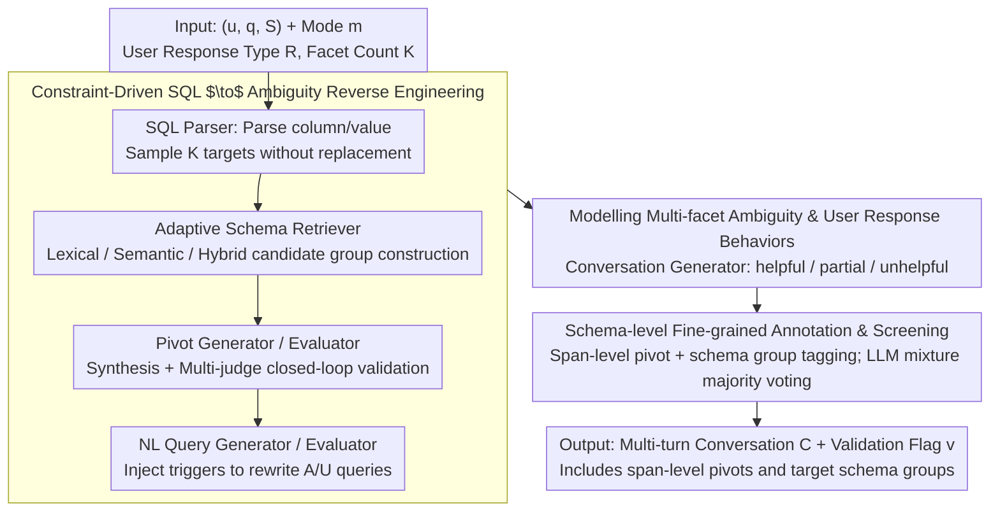

# CLARITY: A Framework and Benchmark for Conversational Language Ambiguity and Unanswerability in Interactive NL2SQL Systems

**Conference**: ACL 2026  
**arXiv**: [2604.22313](https://arxiv.org/abs/2604.22313)  
**Code**: None (Oracle Internal Framework)  
**Area**: LLM Evaluation / Conversational NL2SQL / Ambiguity Detection  
**Keywords**: NL2SQL Evaluation, Multi-facet Ambiguity, Unanswerability, Schema Grounding, Conversational Clarification

## TL;DR
CLARITY is the first diagnostic benchmark proposed by Oracle that supports "**multi-facet ambiguity + unanswerability** + single/multi-turn + varied user clarification behaviors" in NL2SQL. Using a controllable LLM pipeline (SQL $\to$ pivot term $\to$ rewrite $\to$ conversation $\to$ screening), CLARITY automatically extends Spider/BIRD into ~30k instances. It reveals a failure mode where SOTA LLMs "can detect ambiguity but fail to locate specific schema elements" through schema-level pivot/group annotations.

## Background & Motivation

**Background**: NL2SQL has been deployed in industrial query interfaces (Oracle, Snowflake, etc.), but user queries are often ambiguous or unanswerable. Existing benchmarks such as AMBROSIA, AmbiQT, NoisySP, and SQUAB only cover single ambiguity and single turns. Others like PRACTIQ, MMSQL, and BIRD-INTERACT extend to multiple turns but assume cooperative users with clean clarifications and provide only instance-level labels (binary ambiguous/unanswerable).

**Limitations of Prior Work**: In real production environments—(1) a single query often has **multiple interacting sources of ambiguity** (involving multiple columns and values); (2) user clarification responses are often **partially helpful, vague, or even irrelevant**; (3) even if a system correctly detects "ambiguity," it often **misidentifies the specific schema elements**—a schema-level failure masked by benchmarks that only track detection rates.

**Key Challenge**: The real distribution of ambiguity/unanswerability is multi-faceted, multi-turn, and user-noisy, whereas existing evaluations assume uni-faceted, single-turn, and cooperative-user scenarios. This gap allows NL2SQL systems with "high ambiguity detection rates" to fail frequently in industrial deployment without clear reasons.

**Goal**: Construct a diagnostic NL2SQL benchmark that: (1) covers both column and value levels with 4 modes of ambiguity and unanswerability; (2) supports uni-/multi-facet scenarios; (3) covers helpful/partial/unhelpful user behaviors; and (4) provides fine-grained metadata (span-level pivot terms + candidate schema groups). The goal is to move beyond "knowing there is a problem" to "precisely identifying where the problem is."

**Key Insight**: Reverse engineer from executable SQL. Since the column/value reference structure of SQL explicitly defines the "true intent," rule-based parsing + LLM rewriting can be used to directionally degrade clean queries into ambiguous/unanswerable versions. This constraint-driven generation ensures clean ground truths while controlling the ambiguity patterns.

**Core Idea**: Utilize a modular pipeline consisting of "SQL Parser $\to$ Adaptive Schema Retriever $\to$ Pivot Term Generator/Evaluator $\to$ NL Query Generator/Evaluator $\to$ Conversation Generator $\to$ Automated Screening" to automatically extend existing clean NL2SQL data into schema-grounded, ambiguous/unanswerable multi-turn interaction instances.

## Method

### Overall Architecture

CLARITY is an end-to-end framework for generating NL2SQL diagnostic benchmarks, aimed at "polluting" existing clean data (Spider/BIRD) into multi-turn conversations with schema-level annotations. Given a triplet $(u, q, \mathcal{S})$ (natural language query, SQL, schema), a specified mode $m$, user response type $R$, and target facet count $K$, the framework follows a structured path. The SQL Parser extracts columns/values and samples $K$ targets. The Adaptive Schema Retriever constructs candidate schema groups. The Pivot Generator/Evaluator synthesizes and validates ambiguity triggers in a multi-judge loop. The NL Query Generator/Evaluator rewrites the query with these triggers. The Conversation Generator extends this into multiple turns based on response types. Finally, Automated Data Screening uses majority voting to output the conversation $C=\{(r_t, t_t)\}_{t=1}^T$ and a validation flag $v$. The modes $M = \{\texttt{col\_amb}, \texttt{val\_amb}, \texttt{col\_unans}, \texttt{val\_unans}\}$ support uni-facet ($K=1$) and multi-facet ($K \ge 2$) scenarios. The process yields ~6.4k/3.5k single-turn and 12.1k/7.2k multi-turn instances on Spider/BIRD.

### Key Designs

**1. Constraint-Driven SQL $\to$ Ambiguity Reverse Engineering**

Pure LLM generation of ambiguous queries introduces distribution bias and imprecise definitions. CLARITY reverse-engineers from executable SQL: the SQL column/value structure precisely defines "ground truth intent." The SQL Parser breaks $q$ into referenced column sets $\mathcal{C}$ and column-value pairs $(\mathcal{C}, \mathcal{V})$. For each target, the Adaptive Schema Retriever constructs candidate groups $G_j$ using lexical (token overlap), semantic (cosine similarity), or hybrid methods. A two-stage filter (lexical identification followed by semantic retrieval under lexical-overlap constraints) explicitly distinguishes between ambiguity sub-types. For unanswerable modes, no positive group is built; the entire target space $\mathcal{X}_j$ serves as a negative reference. Triggers synthesized by the Pivot Generator are validated by the Pivot Evaluator against boolean constraints (mode adherence, $G_j$ compatibility, schema absence), with a feedback loop for regeneration.

**2. Multi-facet Ambiguity and User Response Modeling**

Real-world queries often contain multiple ambiguities, and user clarifications are frequently imperfect. CLARITY sets $K \ge 2$ to allow multiple A/U instances (e.g., concurrent column ambiguity and value unanswerability). In the dialogue phase, three user response types $R \in \{\texttt{helpful}, \texttt{partial}, \texttt{unhelpful}\}$ are introduced. The Conversation Generator creates diverse agent clarification questions, then simulates user answers: `helpful` provides complete info, `partial` resolves only some ambiguity, and `unhelpful` provides irrelevant or vague responses.

**3. Schema-level Fine-grained Translation & Automated Screening**

Existing benchmarks provide only instance-level binary labels. CLARITY attaches span-level triggers $\{p_j\}$ and candidate schema target groups $\{G_j\}$ to every instance. It introduces **Match Accuracy (MA)** (whether the detected ambiguity corresponds to the correct schema element) alongside **Detection Accuracy (DA)**. Automated Data Screening uses an LLM mixture and majority voting (iterating up to 5 rounds) to filter data. While SOTA models achieve near 100% DA, their MA drops to 5–20% on multi-facet tasks, exposing a failure mode of "knowing there is an ambiguity but misidentifying its location."

## Key Experimental Results

### Main Results (GPT-5 Single-turn Column Ambiguity, Spider few-shot)

| Setting | Uni LEM | Uni SEM | Multi LEM | Multi SEM |
|---------|---------|---------|-----------|-----------|
| Zero-shot | 19.2 | 15.0 | 15.2 | 5.2 |
| Few-shot no-meta (uni examples) | 56.9 | 42.9 | 55.3 | 13.4 |
| Few-shot no-meta (uni+multi examples) | 62.7 | 50.3 | 61.4 | 23.4 |
| Few-shot meta (uni examples) | 60.5 | 53.9 | 67.0 | 60.2 |
| **Few-shot meta (uni+multi examples)** | **61.3** | **55.8** | **70.1** | **60.1** |

SEM (Strict Exact Match) requires enumerating all correct SQL interpretations; LEM (Lenient Exact Match) requires at least one. On multi-facet tasks, metadata inclusion boosts SEM from 5.2% (zero-shot) to 60.1%, a **+55 point gain**, proving the value of schema-grounded metadata.

### Multi-turn SQL Prediction (Spider, EA %)

| Model | U-Lex Amb | M-Lex Amb | U-Sem Amb | M-Sem Amb | U-Col Unans | M-Col Unans | U-Val Amb | M-Val Amb | Concise | Verbose | Partial | Not |
|-------|-----------|-----------|-----------|-----------|-------------|-------------|-----------|-----------|---------|---------|---------|-----|
| GPT-4o | 74.2 | 73.2 | 74.2 | 67.2 | 99.0 | 100.0 | 68.3 | 60.6 | 73.1 | 80.5 | 74.6 | 62.6 |
| GPT-4.1 | 75.2 | 73.6 | 81.0 | 73.2 | 95.0 | 99.0 | 75.2 | 66.7 | 68.3 | 82.2 | 78.1 | 71.7 |
| GPT-5 | 73.0 | 71.6 | 77.6 | 69.4 | 83.0 | 93.0 | 78.3 | 70.8 | 62.9 | 79.3 | 77.2 | 70.0 |
| Grok-3 Mini | 78.2 | 75.8 | 82.4 | 77.8 | 86.0 | 94.0 | 76.8 | 65.9 | 64.8 | 81.7 | 79.3 | 75.8 |
| LLaMA-3.3 | 76.8 | 76.8 | 80.6 | 69.8 | 44.0 | 72.0 | 72.6 | 64.9 | 42.3 | 81.3 | 76.5 | 72.8 |

### Key Findings
- **Detection $\neq$ Localization**: DA is near 100%, but MA on multi-facet column ambiguity is only 5.4–20.4%. Systems "sense" ambiguity but **cannot pinpoint which columns are involved**.
- **Multi-facet Complexity**: Multi-facet SEM improvement (5.2% $\to$ 60.1%) with metadata is significantly higher than uni-facet, indicating a heavy reliance on teaching signals for complex tasks.
- **Unanswerable is Easier**: EA for unanswerable cases is consistently 90%+, while ambiguous cases remain in the 60–80% range.
- **Conversation Structure Dominates**: The gap between `Verbose` and `Not` (e.g., 82% vs 71%) is larger than the gap between models, suggesting user interaction design is critical.
- **Lexical vs. Semantic Confusion**: LLMs frequently misclassify lexical ambiguity as semantic.

## Highlights & Insights
- **The "Detection-Localization Gap"**: Introducing MA as a core metric exposes failures invisible to previous benchmarks, highlighting the most critical capability for industrial deployment.
- **Constraint-driven Reverse Engineering**: Starting from executable SQL is more controllable than forward synthesis and more natural than template-based methods.
- **Multi-judge Feedback Loop**: The closed-loop validation ensures high-quality synthesized benchmarks at scale.
- **User Behavior Modeling**: Quantifying performance across helpful vs. noisy users provides a realistic diagnostic coordinate for conversational systems.

## Limitations & Future Work
- **Limitations**: (1) Value-based A/U evaluation is limited due to DB privacy/scale; (2) regeneration is capped at 5 rounds; (3) user behaviors like topic shifts are not yet covered.
- **Bias**: Dependency on LLM mixtures for evaluation introduces systematic bias risks.
- **Future Work**: Incorporating real industrial query logs, extending the pipeline to NL2Code/NL2API, and fine-tuning systems using CLARITY data to bridge the localization gap.

## Related Work & Insights
- **vs. AMBROSIA / SQUAB**: CLARITY covers more dimensions (multi-facet, value-level, multi-turn) and adds schema-grounded metadata.
- **vs. PRACTIQ / BIRD-INTERACT**: CLARITY enables schema-level localization assessment and models non-cooperative users.
- **vs. AmbiSQL**: Using CLARITY as few-shot examples significantly improved AmbiSQL's MA (e.g., Spider 57.8 $\to$ 62.2, $p < 0.005$), proving its value as a training/teaching source.

## Rating
- Novelty: ⭐⭐⭐⭐⭐ 
- Experimental Thoroughness: ⭐⭐⭐⭐ 
- Writing Quality: ⭐⭐⭐⭐⭐ 
- Value: ⭐⭐⭐⭐⭐ 

<!-- RELATED:START -->

## Related Papers

- [\[ACL 2026\] SPENCE: A Syntactic Probe for Detecting Contamination in NL2SQL Benchmarks](spence_a_syntactic_probe_for_detecting_contamination_in_nl2sql_benchmarks.md)
- [\[ACL 2026\] MARCH: Evaluating the Intersection of Ambiguity Interpretation and Multi-hop Inference](march_evaluating_the_intersection_of_ambiguity_interpretation_and_multi-hop_infe.md)
- [\[ACL 2026\] Rethinking Meeting Effectiveness: A Benchmark and Framework for Temporal Fine-grained Automatic Meeting Effectiveness Evaluation](rethinking_meeting_effectiveness_a_benchmark_and_framework_for_temporal_fine-gra.md)
- [\[NeurIPS 2025\] Small Language Models as Compiler Experts: Auto-Parallelization for Heterogeneous Systems](../../NeurIPS2025/llm_evaluation/small_language_models_as_compiler_experts_auto-parallelization_for_heterogeneous.md)
- [\[ACL 2026\] SciCustom: A Framework for Custom Evaluation of Scientific Capabilities in Large Language Models](scicustom_a_framework_for_custom_evaluation_of_scientific_capabilities_in_large_.md)

<!-- RELATED:END -->
