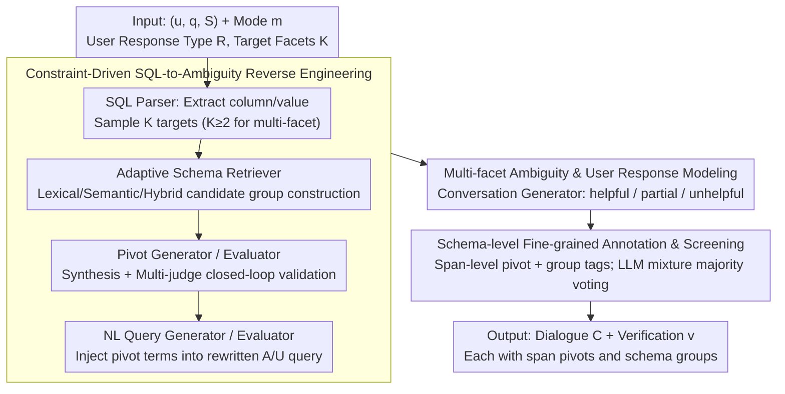

# CLARITY: A Framework and Benchmark for Conversational Language Ambiguity and Unanswerability in Interactive NL2SQL Systems

**Conference**: ACL 2026  
**arXiv**: [2604.22313](https://arxiv.org/abs/2604.22313)  
**Code**: None (Oracle Internal Framework)  
**Area**: LLM Evaluation / Conversational NL2SQL / Ambiguity Detection  
**Keywords**: NL2SQL Evaluation, Multi-facet Ambiguity, Unanswerability, Schema Grounding, Conversational Clarification

## TL;DR
CLARITY is the first diagnostic benchmark for NL2SQL proposed by Oracle that supports "**multi-facet ambiguity + unanswerability** + single/multi-turn dialogue + diverse user clarification behaviors". Using a controllable LLM pipeline (SQL → pivot term → rewriting → dialogue → screening), it automatically extends Spider/BIRD into approximately 30,000 instances. Through schema-level pivot/group annotations, it reveals a failure mode where SOTA LLMs "can detect ambiguity but cannot locate specific schema elements."

## Background & Motivation

**Background**: NL2SQL has been deployed in industrial query interfaces (e.g., Oracle, Snowflake), but user queries are frequently ambiguous or unanswerable. Existing benchmarks such as AMBROSIA, AmbiQT, NoisySP, and SQUAB only cover single ambiguities and single turns. Others like PRACTIQ, MMSQL, and BIRD-INTERACT extend to multiple turns but still assume cooperative users and clean clarifications, providing only instance-level labels (binary ambiguous/unanswerable).

**Limitations of Prior Work**: In real production environments: (1) a single query often contains **multiple interacting sources of ambiguity** (involving multiple columns and values simultaneously); (2) user clarification responses are often **partially useful, vague, or even irrelevant**; (3) even if a system correctly detects "ambiguity," it often **mislocates the specific schema elements**—yet existing benchmarks focus solely on detection rates, masking these schema-level failures.

**Key Challenge**: The real-world distribution of ambiguity and unanswerability is multi-faceted, multi-turn, and user-noisy, whereas current evaluations assume uni-faceted, single-turn, and cooperative scenarios. This gap allows NL2SQL systems with "high ambiguity detection rates" to fail frequently in industrial deployment without identifiable causes.

**Goal**: To construct a diagnostic benchmark for NL2SQL that (1) covers both column and value levels across four ambiguity/unanswerable modes, (2) supports uni- and multi-facet scenarios, (3) covers three types of user behaviors (helpful/partial/unhelpful), and (4) provides fine-grained metadata including span-level pivot terms and candidate schema groups. The objective is to shift evaluation from "does the system know there is a problem" to "can the system pinpoint exactly where the problem lies."

**Key Insight**: Reverse engineering from executable SQL. Since the column/value reference structure of SQL precisely defines the "real intent," rule-based parsing combined with LLM rewriting can directionally sabotage the query into ambiguous or unanswerable versions, which are then expanded into dialogues. This constraint-driven generation ensures clean ground truths while maintaining control over ambiguity modes.

**Core Idea**: Utilizing a modular pipeline consisting of "SQL Parser → Adaptive Schema Retriever → Pivot Term Generator/Evaluator → NL Query Generator/Evaluator → Conversation Generator → Automated Screening," clean NL2SQL data is automatically extended into schema-grounded, ambiguous/unanswerable multi-turn interaction instances.

## Method

### Overall Architecture

CLARITY is an end-to-end framework for generating NL2SQL diagnostic benchmarks. It aims to transform existing clean data (Spider/BIRD) into multi-turn dialogues with schema-level annotations. Given a triplet $(u, q, \mathcal{S})$ (NL query, SQL, schema), a specified mode $m$, user response type $R$, and target facet count $K$, the SQL Parser extracts column/value targets. The Adaptive Schema Retriever constructs candidate schema groups; the Pivot Generator/Evaluator synthesizes and validates triggers in a multi-LLM judge loop; the NL Query Generator/Evaluator injects triggers into rewritten queries; and the Conversation Generator expands them into dialogues. Finally, Automated Data Screening employs majority voting to output the dialogue $C=\{(r_t, t_t)\}_{t=1}^T$ and a verification flag $v$. The mode set is $M = \{\texttt{col\_amb}, \texttt{val\_amb}, \texttt{col\_unans}, \texttt{val\_unans}\}$, where $K=1$ denotes uni-facet and $K\ge 2$ denotes multi-facet. This process generates approximately 6.4k/3.5k single-turn and 12.1k/7.2k multi-turn instances for Spider and BIRD respectively, each with span-level pivot terms and target group annotations.

### Key Designs

**1. Constraint-Driven SQL-to-Ambiguity Reverse Engineering: Ground Truth by Design**

Generating ambiguous queries purely via LLMs introduces distribution bias and imprecise definitions, while template-based methods lack natural diversity. CLARITY reverse engineers from executable SQL: the column/value reference structure defines the "true intent." The SQL Parser decomposes $q$ into column sets $\mathcal{C}$ and column-value pairs $(\mathcal{C}, \mathcal{V})$, sampling $K$ targets $\mathcal{T} = \{t_j\}$ without replacement. The Adaptive Schema Retriever constructs candidate groups $G_j$ using lexical (token overlap), semantic (cosine similarity), or hybrid methods. Triggers (pivot terms) are synthesized by the Pivot Generator under constraints and validated by a multi-LLM judge loop for mode compliance, compatibility with $G_j$, and absence from the schema. This ensures high quality—human validation shows 93–100% accuracy across most categories.

**2. Multi-facet Ambiguity and Tri-mode User Response Modeling: Approaching Real-world Distributions**

In practice, queries often contain overlapping ambiguities, and user clarifications are frequently imperfect. CLARITY sets $K \ge 2$ to allow multiple A/U instances (e.g., simultaneous column ambiguity and value unanswerability). For dialogues, three user response types are introduced: $R \in \{\texttt{helpful}, \texttt{partial}, \texttt{unhelpful}\}$. The Conversation Generator first creates diverse agent clarification questions, then simulates user responses: helpful provides complete info, partial resolves only some ambiguity, and unhelpful provides irrelevant info. This enables the quantification of performance gaps between "cooperative vs. noisy" scenarios.

**3. Schema-level Fine-grained Annotation and Automated Screening: From "If" to "Where"**

Existing benchmarks provide only instance-level binary labels. CLARITY attaches span-level triggers $\{p_j\}$ and candidate target schema groups $\{G_j\}$ to every instance. It introduces **Match Accuracy (MA)** (whether the detected ambiguity corresponds to the correct schema element) alongside **Detection Accuracy (DA)**. Automated Data Screening utilizes an LLM mixture and majority voting to filter instances, iterating up to 5 times. This schema-grounded metadata reveals that while LLMs reach nearly 100% DA, their MA on multi-facet tasks can drop to 5–20%, exposing a critical failure to locate the specific sources of ambiguity.

## Key Experimental Results

### Main Results (GPT-5 Single-turn Column Ambiguity, Spider Few-shot)

| Setting | Uni LEM | Uni SEM | Multi LEM | Multi SEM |
|---------|---------|---------|-----------|-----------|
| Zero-shot | 19.2 | 15.0 | 15.2 | 5.2 |
| Few-shot no-meta (uni exemplars) | 56.9 | 42.9 | 55.3 | 13.4 |
| Few-shot no-meta (uni+multi exemplars) | 62.7 | 50.3 | 61.4 | 23.4 |
| Few-shot meta (uni exemplars) | 60.5 | 53.9 | 67.0 | 60.2 |
| **Few-shot meta (uni+multi exemplars)** | **61.3** | **55.8** | **70.1** | **60.1** |

SEM (Strict Exact Match) requires enumerating all correct SQL interpretations; LEM (Lenient Exact Match) requires at least one. On multi-facet tasks, zero-shot SEM is only 5.2%, but providing schema-grounded metadata boosts it to 60.1% (+55 points), demonstrating the diagnostic and pedagogical value of metadata.

### Multi-turn SQL Prediction (Spider, 5 Models × A/U Mode × 4 Conversation Types, EA %)

| Model | U-Lex Amb | M-Lex Amb | U-Sem Amb | M-Sem Amb | U-Col Unans | M-Col Unans | Concise | Verbose | Partial | Not |
|-------|-----------|-----------|-----------|-----------|-------------|-------------|---------|---------|---------|-----|
| GPT-4o | 74.2 | 73.2 | 74.2 | 67.2 | 99.0 | 100.0 | 73.1 | 80.5 | 74.6 | 62.6 |
| GPT-4.1 | 75.2 | 73.6 | 81.0 | 73.2 | 95.0 | 99.0 | 68.3 | 82.2 | 78.1 | 71.7 |
| GPT-5 | 73.0 | 71.6 | 77.6 | 69.4 | 83.0 | 93.0 | 62.9 | 79.3 | 77.2 | 70.0 |
| Grok-3 Mini Fast | 78.2 | 75.8 | 82.4 | 77.8 | 86.0 | 94.0 | 64.8 | 81.7 | 79.3 | 75.8 |
| LLaMA-3.3 | 76.8 | 76.8 | 80.6 | 69.8 | 44.0 | 72.0 | 42.3 | 81.3 | 76.5 | 72.8 |

### Key Findings
- **Detection ≠ Localization**: DA is near 100%, but MA on multi-facet column ambiguity is as low as 5.4–20.4%. Systems "smell" the trouble but fail to pinpoint the exact columns involved.
- **Multi-facet Difficulty >> Uni-facet**: Multi-facet task performance relies significantly more on instructional metadata signals.
- **Unanswerable is Easier than Ambiguous**: Accuracy for unanswerable cases is generally 90%+, while ambiguous cases range from 60–80%, suggesting that identifying unanswerable queries is easier than resolving resource-controversial ambiguities.
- **Dialogue Quality Dominates**: Interaction structure impacts performance more than model capability (Verbose > Partial > Not).
- **Subtype Confusion**: LLMs frequently misclassify lexical ambiguities as semantic ones.

## Highlights & Insights
- **Introduced the "Detection-Localization Gap"**: This provides a critical new dimension for industrial NL2SQL evaluation.
- **Reverse Engineering Methodology**: The constraint-driven approach is highly portable to other tasks like NL2Code or NL2API.
- **Quality Control via Multi-judge Loops**: The feedback-driven generative cycle serves as a template for large-scale high-fidelity benchmark synthesis.
- **Quantifying User Noise**: Explicit modeling of helpful vs. noisy user behaviors allows for robust system assessment.

## Limitations & Future Work
- **Limitations**: (1) Value-based evaluation is limited due to the impracticality of exposing entire database contents; (2) regeneration is capped at 5 rounds; (3) user behavior modeling misses complex patterns like topic shifts or internal user uncertainty.
- **Future Work**: Integration of real industrial query logs, extension to NL2Code/API scenarios, and utilizing CLARITY data to fine-tune systems for better localization.

## Related Work & Insights
- **Contrast with AmbiSQL**: Using CLARITY as few-shot exemplars significantly improved AmbiSQL's Match Accuracy (e.g., BIRD U-Col Amb 50.1 → 57.7), proving its value as a training/instructional data source.
- **Gap with Existing Benchmarks**: CLARITY fills the void in "ambiguity-aware" and "localization-capable" NL2SQL evaluation that previous works (like Spider-Inter) treated as instance-level problems.

## Rating
- Novelty: ⭐⭐⭐⭐⭐
- Experimental Thoroughness: ⭐⭐⭐⭐
- Writing Quality: ⭐⭐⭐⭐⭐
- Value: ⭐⭐⭐⭐⭐

<!-- RELATED:START -->

## Related Papers

- [\[ACL 2026\] SPENCE: A Syntactic Probe for Detecting Contamination in NL2SQL Benchmarks](spence_a_syntactic_probe_for_detecting_contamination_in_nl2sql_benchmarks.md)
- [\[ACL 2026\] MARCH: Evaluating the Intersection of Ambiguity Interpretation and Multi-hop Inference](march_evaluating_the_intersection_of_ambiguity_interpretation_and_multi-hop_infe.md)
- [\[ACL 2026\] Rethinking Meeting Effectiveness: A Benchmark and Framework for Temporal Fine-grained Automatic Meeting Effectiveness Evaluation](rethinking_meeting_effectiveness_a_benchmark_and_framework_for_temporal_fine-gra.md)
- [\[ICML 2026\] BuildArena: A Physics-Aligned Interactive Benchmark of LLMs for Engineering Construction](../../ICML2026/llm_evaluation/buildarena_a_physics-aligned_interactive_benchmark_of_llms_for_engineering_const.md)
- [\[NeurIPS 2025\] Small Language Models as Compiler Experts: Auto-Parallelization for Heterogeneous Systems](../../NeurIPS2025/llm_evaluation/small_language_models_as_compiler_experts_auto-parallelization_for_heterogeneous.md)

<!-- RELATED:END -->
