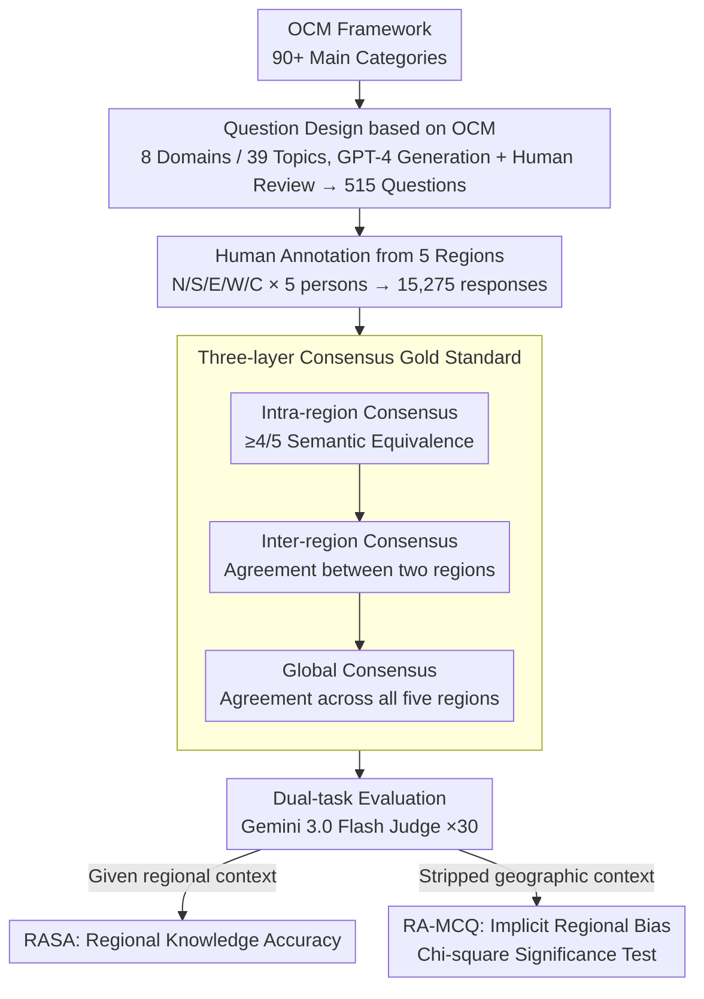

# Common to Whom? Regional Cultural Commonsense and LLM Bias in India

**Conference**: ACL 2026  
**arXiv**: [2601.15550](https://arxiv.org/abs/2601.15550)  
**Code**: None  
**Area**: LLM Evaluation  
**Keywords**: Cultural commonsense, Regional bias, Indian cultural diversity, Benchmark construction, LLM bias

## TL;DR

This paper constructs Indica, the first benchmark for evaluating sub-national cultural commonsense in LLMs, focusing on cultural differences across five major regions of India in eight everyday domains. It finds that only 39.4% of questions reach a consensus across all five regions, and all LLMs exhibit geographic bias—over-selecting Central and North India as the "default" cultural representation.

## Background & Motivation

**Background**: Cultural commonsense benchmarks (e.g., CultureBank, CulturalBench) have begun focusing on cross-cultural differences, but these works treat the nation as a cultural monolith, assuming uniform cultural practices within a country.

**Limitations of Prior Work**: (1) Existing benchmarks evaluate cultural commonsense at the national level, ignoring sub-national cultural diversity; (2) Existing Indian NLP benchmarks focus only on factual knowledge from textbooks and exams, treating Indian culture as a singular entity; (3) LLMs may have systematic biases toward certain regions in culturally diverse countries, but tools to detect this are lacking.

**Key Challenge**: In a country like India with 28 states, 8 union territories, and 22 official languages, "cultural commonsense" cannot be nationally unified. However, LLMs must make regional choices when presenting a cultural practice, and these implicit choices may reflect geographic biases in training data.

**Goal**: (1) Quantify the degree of regional variations in Indian cultural commonsense; (2) Evaluate LLM accuracy on region-specific cultural knowledge; (3) Detect implicit regional bias in LLMs when geographic context is absent.

**Key Insight**: Design eight everyday cultural domains based on the Outline of Cultural Materials (OCM), collect human-annotated answers from five Indian regions, and construct a region-specific cultural commonsense benchmark.

**Core Idea**: Cultural commonsense in multicultural countries is primarily regional rather than national; LLMs exhibit systematic geographic bias when processing such knowledge.

## Method

### Overall Architecture

Indica aims to answer a question ignored by existing cultural benchmarks: in a country with high diversity in states, languages, and customs like India, is "cultural commonsense" nationally unified or regional, and do LLMs favor certain regions? The construction path starts by decomposing everyday culture into 8 domains, 39 topics, and 515 questions based on the OCM system. Then, 5 participants from each of the North, South, East, West, and Central regions of India were recruited to answer all questions (15,275 total responses). A gold standard was established through a three-layer consensus (Intra-region, Inter-region, and Global). The evaluation uses two tasks: Region-Anchored Short Answer (RASA) and Region-Agnostic Multiple Choice Questions (RA-MCQ), with Gemini 3.0 Flash as an LLM judge. Each question is run 30 times to eliminate randomness, and Chi-square goodness-of-fit tests are used to determine the statistical significance of geographic bias.

### Key Designs

**1. Question design based on anthropology classification: Anchoring questions in daily practices rather than institutional knowledge**

To reveal regional differences, questions must fall on choices people actually make daily, rather than institutional knowledge with national standard answers. Indica therefore selects 8 daily-life domains (Interpersonal Relations, Education, Clothing, Food, Communication, Finance, Festivals & Rituals, Transportation Behavior) from over 90 main categories of OCM. Two to four non-overlapping sub-topics are chosen per domain, with questions generated via GPT-4 and reviewed by humans. This ensures questions focus on daily practices with enough diversity to expose real regional divergences.

**2. Three-layer consensus gold standard: Distinguishing personal preference from true regional practice**

Cultural questions have no single standard answer; gold standards must filter out personal taste to leave only large-scale regional practices. Indica sets three layers of consensus: Intra-region consensus requires at least 4/5 participants in a region to have semantically equivalent answers; Inter-region consensus requires exact agreement between two regions; Global consensus requires agreement across all five regions. Initial semantic classification is performed by GPT-4o, followed by full review by two human annotators. These standards ensure the gold standard reflects stable regional culture rather than individual respondent preference.

**3. Dual-task evaluation: Measuring knowledge with RASA and bias with RA-MCQ**

Knowledge accuracy and implicit bias are distinct; a single task cannot measure both. RASA (Region-Anchored Short Answer) provides regional context (e.g., "In South India...") to examine if the model can generate accurate local cultural knowledge when the region is explicit. RA-MCQ (Region-Agnostic Multiple Choice Questions) deliberately strips geographic context to see which region's practice the model defaults to when no region is specified, revealing implicit geographic bias in the training data. The two tasks complement each other by measuring "capability" and "preference" respectively.

## Key Experimental Results

### Main Results

**RASA Regional Knowledge Accuracy (%)**

| Model | North | South | East | West | Central | Average |
|------|------|------|------|------|------|------|
| GPT-4o | ~20 | ~19 | ~15 | ~18 | ~20 | 20.9 |
| Claude 3.5 | ~19 | ~18 | ~14 | ~17 | ~19 | 19.3 |
| Lowest Model | - | - | - | - | - | 13.4 |

### Ablation Study

| Analysis Dimension | Finding |
|----------|------|
| Global Consensus Rate | Only 39.4% of questions achieved agreement across all regions |
| Domain Differences | Transportation Behavior highest (22.6%), Festivals & Rituals lowest (1.8%) |
| Region Pair Bias | North-Central highest (68.3%), South-East lowest (60.1%) |

### Key Findings

- Only 39.4% of questions have a consensus answer across all five regions—cultural commonsense in India is primarily regional.
- All 8 LLMs achieve only 13.4%-20.9% accuracy on region-specific questions, far below a usable level.
- RA-MCQ reveals systematic bias in all models: responses from Central and North India are over-selected (30-40% higher than expected), while East and West are underrepresented.
- Even in domains like Education with national curricula, regional practice differences remain significant (only 13.8% global consensus).
- The Festivals & Rituals domain shows the greatest variation (1.8% global consensus), reflecting strong regional traditions.

## Highlights & Insights

- Systematically challenges the "nation = cultural monolith" assumption for the first time, opening a sub-national dimension for cultural NLP research.
- The dual-task evaluation design (knowledge accuracy + implicit bias) provides a comprehensive framework for cultural representation assessment.
- The OCM-based question design methodology is generalizable and can be transferred to any culturally diverse country.

## Limitations & Future Work

- The division into five regions may be too coarse; significant diversity still exists within each region.
- Small sample size with only 5 participants per region.
- Gold standard establishment depends on subjective semantic equivalence judgments.
- Focuses only on India; the cross-country transferability of the methodology needs verification.

## Related Work & Insights

- **vs CultureBank/CulturalBench**: These benchmarks evaluate cultural commonsense at the national level, while Indica descends to the sub-national level for the first time.
- **vs Indian NLP Benchmarks**: Existing Indian benchmarks focus on textbook knowledge; Indica focuses on everyday cultural practices.
- **vs CANDLE**: CANDLE evaluates national-level cultural norms, whereas Indica reveals cultural divisions within a nation.

## Rating

- Novelty: ⭐⭐⭐⭐⭐ First sub-national cultural commonsense benchmark, unique and important perspective.
- Experimental Thoroughness: ⭐⭐⭐⭐ 8 models, dual-task evaluation, strict gold standard, but small sample size.
- Writing Quality: ⭐⭐⭐⭐⭐ Thought-provoking motivation, detailed data analysis.
- Value: ⭐⭐⭐⭐⭐ Significant implications for cultural AI and LLM fairness research.

<!-- RELATED:START -->

## Related Papers

- [\[ACL 2026\] Contrastive Decoding Mitigates Score Range Bias in LLM-as-a-Judge](contrastive_decoding_mitigates_score_range_bias_in_llm-as-a-judge.md)
- [\[ACL 2026\] Fin-Bias: Comprehensive Evaluation for LLM Decision-Making under human bias in Finance Domain](fin-bias_comprehensive_evaluation_for_llm_decision-making_under_human_bias_in_fi.md)
- [\[AAAI 2026\] Towards a Common Framework for Autoformalization](../../AAAI2026/llm_evaluation/towards_a_common_framework_for_autoformalization.md)
- [\[ACL 2026\] ReTraceQA: Evaluating Reasoning Traces of Small Language Models in Commonsense Question Answering](retraceqa_evaluating_reasoning_traces_of_small_language_models_in_commonsense_qu.md)
- [\[ICLR 2026\] BiasScope: Towards Automated Detection of Bias in LLM-as-a-Judge Evaluation](../../ICLR2026/llm_evaluation/biasscope_towards_automated_detection_of_bias_in_llm-as-a-judge_evaluation.md)

<!-- RELATED:END -->
