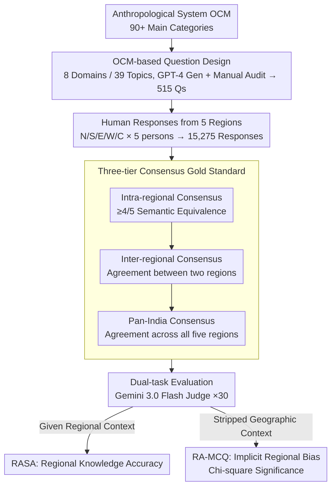

# Common to Whom? Regional Cultural Commonsense and LLM Bias in India

**Conference**: ACL 2026  
**arXiv**: [2601.15550](https://arxiv.org/abs/2601.15550)  
**Code**: None  
**Area**: LLM Evaluation  
**Keywords**: Cultural Commonsense, Regional Bias, Indian Cultural Diversity, Benchmark Construction, LLM Bias

## TL;DR

This paper constructs Indica, the first benchmark to evaluate sub-national cultural commonsense in LLMs. Focusing on cultural variations across five major regions of India in eight daily life domains, the study finds that only 39.4% of questions reach a consensus across all regions. Furthermore, all evaluated LLMs exhibit geographic bias—disproportionately selecting Central and North India as "default" cultural representatives.

## Background & Motivation

**Background**: Cultural commonsense benchmarks (e.g., CultureBank, CulturalBench) have begun to address cross-cultural differences. However, these works often treat nations as cultural monoliths, assuming uniform cultural practices within a country.

**Limitations of Prior Work**: (1) Existing benchmarks evaluate cultural commonsense at the national level, ignoring sub-national cultural diversity; (2) existing Indian NLP benchmarks focus primarily on factual knowledge from textbooks and exams, treating Indian culture as a singular entity; (3) LLMs may harbor systematic biases toward specific regions in culturally diverse countries, yet tools to detect such biases are lacking.

**Key Challenge**: In a country like India, with 28 states, 8 union territories, and 22 official languages, "cultural commonsense" cannot be nationally uniform. Nevertheless, an LLM must make a regional choice when presenting a cultural practice; such implicit choices may reflect geographic biases in the training data.

**Goal**: (1) Quantify the extent of regional variation in Indian cultural commonsense; (2) evaluate LLM accuracy regarding region-specific cultural knowledge; (3) detect implicit regional biases in LLMs when geographic context is absent.

**Key Insight**: Design eight daily cultural domains based on the anthropological classification system (OCM) and collect human-annotated answers from five Indian regions to build a region-specific cultural commonsense benchmark.

**Core Idea**: Cultural commonsense in multicultural nations is primarily regional rather than national; LLMs exhibit systematic geographic biases when processing such knowledge.

## Method

### Overall Architecture

Indica aims to answer a question ignored by existing cultural benchmarks: in a country with high diversity in states, languages, and customs like India, is "cultural commonsense" nationally uniform or regional, and do LLMs favor certain regions? The construction path involves first decomposing daily culture into 8 domains, 39 topics, and 515 questions based on the Outline of Cultural Materials (OCM). Five participants from each of the North, South, East, West, and Central regions were recruited to answer all questions (totaling 15,275 responses). A gold standard was established through a three-tier consensus mechanism (intra-regional, inter-regional, and pan-India). The evaluation includes two tasks: Region-Anchored Short Answer (RASA) and Region-Agnostic Multiple Choice Questions (RA-MCQ). Gemini 3.0 Flash serves as the LLM judge, with each question run 30 times to eliminate randomness, and Chi-square goodness-of-fit tests are used to determine the statistical significance of geographic bias.

### Key Designs

**1. OCM-based Question Design: Anchoring Questions in Daily Practices rather than Institutional Knowledge**

To reveal regional differences, questions must focus on areas where people make choices daily, rather than institutional knowledge with national standard answers. Indica selects 8 daily domains from over 90 OCM main categories (Interpersonal Relations, Education, Clothing, Food, Communication, Finance, Festivals/Rituals, and Transport Behavior). Each domain includes 2–4 non-overlapping sub-topics. Questions are generated with GPT-4 assistance and then manually audited. This ensures the questions focus on daily practices while maintaining enough diversity to expose real regional divergence.

**2. Three-tier Consensus Gold Standard: Distinguishing Personal Preferences from Real Regional Practices**

Cultural questions lack a single standard answer; the gold standard must filter out personal tastes to retain large-scale regional practices. Indica employs a three-tier consensus: Intra-regional consensus requires at least 4/5 participants in a region to provide semantically equivalent answers; inter-regional consensus requires total agreement between two regions; and pan-India consensus requires agreement across all five. GPT-4o initially performs semantic classification, followed by full audit by two human annotators. These tightening standards ensure the gold standard reflects stable regional culture rather than individual preferences.

**3. Dual-task Evaluation: Measuring Knowledge with RASA and Bias with RA-MCQ**

Knowledge accuracy and implicit bias are distinct; a single task cannot capture both. RASA (Region-Anchored Short Answer) provides regional context (e.g., "In South India...") to evaluate if a model can generate accurate local knowledge. RA-MCQ (Region-Agnostic Multiple Choice Questions) deliberately strips geographic context to see which region's practice the model defaults to when no region is specified, thereby making implicit geographic biases in training data visible. These tasks are complementary, measuring "capability" and "bias" respectively.

## Key Experimental Results

### Main Results

**RASA Regional Knowledge Accuracy (%)**

| Model | North | South | East | West | Central | Average |
|-------|-------|-------|-------|-------|-------|-------|
| GPT-4o | ~20 | ~19 | ~15 | ~18 | ~20 | 20.9 |
| Claude 3.5 | ~19 | ~18 | ~14 | ~17 | ~19 | 19.3 |
| Lowest Model | - | - | - | - | - | 13.4 |

### Ablation Study

| Analysis Dimension | Findings |
|----------|------|
| Pan-India Consensus Rate | Only 39.4% of questions reach consensus across all regions |
| Domain Differences | Transport Behavior highest (22.6%), Festivals/Rituals lowest (1.8%) |
| Region-Pair Bias | North-Central highest (68.3%), South-East lowest (60.1%) |

### Key Findings

- Only 39.4% of questions have a consensus answer across all five regions—cultural commonsense in India is primarily regional.
- All 8 LLMs achieve only 13.4%-20.9% accuracy on region-specific questions, well below usable levels.
- RA-MCQ reveals systematic bias in all models: responses aligned with Central and North India are over-selected (30-40% higher than expected), while East and West are underestimated.
- Even in domains like Education with national curricula, regional practice differences remain significant (only 13.8% pan-India consensus).
- The Festivals/Rituals domain shows the greatest variation (1.8% pan-India consensus), reflecting strong regional traditions.

## Highlights & Insights

- Systematically challenges the "nation = cultural monolith" assumption for the first time, opening a sub-national dimension for cultural NLP.
- The dual-task evaluation design (accuracy + implicit bias) provides a comprehensive assessment framework for cultural representation.
- The OCM-based question design methodology is generalizable and can be transferred to any multicultural nation.

## Limitations & Future Work

- The division into five regions may be too coarse; significant diversity still exists within each region.
- The sample size is small, with only 5 participants per region.
- The establishment of the gold standard relies on subjective semantic equivalence judgments.
- The study focuses only on India; the cross-national transferability of the methodology needs verification.

## Related Work & Insights

- **vs CultureBank/CulturalBench**: These benchmarks evaluate cultural commonsense at the national level; Indica is the first to drill down to the sub-national level.
- **vs Indian NLP Benchmarks**: Existing Indian benchmarks focus on textbook knowledge, while Indica focuses on daily cultural practices.
- **vs CANDLE**: CANDLE evaluates national-level cultural norms, whereas Indica reveals cultural divisions within a nation.

## Rating

- Novelty: ⭐⭐⭐⭐⭐ First sub-national cultural commonsense benchmark; perspective is unique and important.
- Experimental Thoroughness: ⭐⭐⭐⭐ 8 models, dual-task evaluation, strict gold standard, though sample size is small.
- Writing Quality: ⭐⭐⭐⭐⭐ Thought-provoking motivation and detailed data analysis.
- Value: ⭐⭐⭐⭐⭐ Provides important insights for cultural AI and LLM fairness research.

<!-- RELATED:START -->

## Related Papers

- [\[ACL 2026\] Contrastive Decoding Mitigates Score Range Bias in LLM-as-a-Judge](contrastive_decoding_mitigates_score_range_bias_in_llm-as-a-judge.md)
- [\[ACL 2026\] Fin-Bias: Comprehensive Evaluation for LLM Decision-Making under human bias in Finance Domain](fin-bias_comprehensive_evaluation_for_llm_decision-making_under_human_bias_in_fi.md)
- [\[AAAI 2026\] Towards a Common Framework for Autoformalization](../../AAAI2026/llm_evaluation/towards_a_common_framework_for_autoformalization.md)
- [\[ACL 2026\] ReTraceQA: Evaluating Reasoning Traces of Small Language Models in Commonsense Question Answering](retraceqa_evaluating_reasoning_traces_of_small_language_models_in_commonsense_qu.md)
- [\[ACL 2025\] CuLEmo: Cultural Lenses on Emotion - Benchmarking LLMs for Cross-Cultural Emotion Understanding](../../ACL2025/llm_evaluation/culemo_cultural_lenses_on_emotion_-_benchmarking_llms_for_cross-cultural_emotion.md)

<!-- RELATED:END -->
