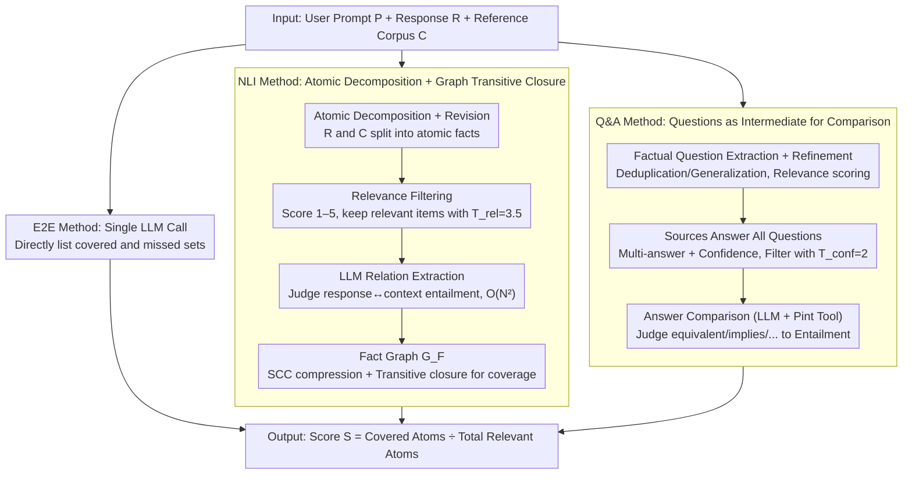

# Comprehensiveness Metrics for Automatic Evaluation of Factual Recall in Text Generation

**Conference**: ACL 2026 Findings  
**arXiv**: [2510.07926](https://arxiv.org/abs/2510.07926)  
**Code**: Not provided by authors (N/A)  
**Area**: LLM Evaluation / Factuality / Information Coverage  
**Keywords**: Comprehensive Evaluation, Factual Recall, NLI Graph, Q&A Comparison, End-to-End LLM Evaluation

## TL;DR
To address the difficulty of quantifying "missing key information" in long-form generation, this work proposes three comprehensiveness metrics—NLI decomposition + graph analysis, QA comparison, and end-to-end LLM identification. Coverage $S = |\mathcal{A}_{in}| / (|\mathcal{A}_{in}| + |\mathcal{A}_{out}|)$ is calculated against a reference corpus $\mathcal{C}$ as the benchmark. Meta-evaluation on WikiContradict / ConflictBank reveals that the simplest E2E method is strongest on average (best LMR=0.85), but Q&A exhibits better robustness (cross-model std of only 0.009 vs. 0.044 for E2E), indicating specific application scenarios for each.

## Background & Motivation
**Background**: LLM factuality evaluation primarily focuses on precision. Methods like FActScore and FacTool decompose responses into atomic facts for individual verification. Few works address recall (e.g., SAFE's $R_K(y) = \min(S(y)/K, 1)$), which often rely on a preset number of expected facts $K$ and cannot localize specific omissions.

**Limitations of Prior Work**: (1) Precision-only metrics fail to identify "half-truth" scenarios where LLMs selectively answer or deliberately omit key information, which is as fatal as "hallucination" in high-risk scenarios like medical or legal fields; (2) existing recall metrics use coarse-grained ratios that cannot pinpoint "exactly which fact is missing," preventing diagnosis or real-time feedback; (3) there is a lack of specialized meta-benchmarks for evaluating comprehensiveness evaluators themselves.

**Key Challenge**: To identify "what was missed," one theoretically needs to know "which atomic facts should be included"—yet a complete set of facts is inexhaustible (any response could involve infinite related facts).

**Goal**: (1) Transform the comprehensiveness evaluation problem into "coverage relative to a reference corpus $\mathcal{C}$" to make the evaluation operational; (2) design three metrics of different granularities and meta-evaluate their reliability; (3) measure the comprehensiveness of mainstream open-source LLMs in real-world RAG scenarios.

**Key Insight**: Using modern retrievers and search engines to construct a reference corpus is sufficient; the unreachability of "absolute completeness" does not hinder the utility of "relative coverage." Within the evaluator, NLI, QA, and direct LLM judgment can provide various levels of granularity.

**Core Idea**: Comprehensiveness is defined as the "coverage of relevant items in the reference corpus atomic fact set $\mathcal{A}_\mathcal{C}$ by the response atomic fact set $\mathcal{A}_R$," implemented through three pipelines of varying complexity.

## Method

### Overall Architecture
The three metrics share the same input-output contract: they take a user prompt $P$, an evaluation response $R$, and a reference corpus $\mathcal{C}$, and output a covered set $\mathcal{A}_{in}$, an uncovered set $\mathcal{A}_{out}$, and a scalar score $S = |\mathcal{A}_{in}| / (|\mathcal{A}_{in}| + |\mathcal{A}_{out}|)$. The difference lies in how $R$ is aligned with $\mathcal{C}$. The NLI and Q&A methods maintain an internal fact graph $G_F$ (nodes are atomic statements or QA pairs, edges represent entailment relations), which uses transitive closure for deduplicated counting and derives an "uncovered context basis" $\mathcal{A}_{basis}$ (suggesting the minimum facts required for completion). The E2E method collapses the entire pipeline into a single LLM call. These represent a spectrum of decreasing complexity to determine how complex an evaluator needs to be.

### Key Designs

**1. NLI Method: Atomic Decomposition + Graph Transitive Closure for Coverage.** This heavyweight pipeline follows five stages, focusing on strictly grounding "coverage" in entailment relations between atomic statements. LLMs are used with few-shot prompting to split $R$ and each document in $\mathcal{C}$ into atomic facts, followed by atomic revision to resolve pronouns and split conjunctive sentences. Each context atom is scored 1–5 for relevance, filtering irrelevant items with $T_{rel} = 3.5$ to retain the "should-be-covered" subset.

The core is relation extraction: instead of specialized NLI models, general LLMs judge entailment between response↔context and context↔context, as regulatory or knowledge-intensive statements are challenging for specialized models. The cost is traversing $2|\mathcal{A}_R||\mathcal{A}_\mathcal{C}| + |\mathcal{A}_\mathcal{C}|(|\mathcal{A}_\mathcal{C}|-1)$ pairs, with $O(|\mathcal{A}|^2)$ complexity. These relations form a fact graph $G_F$. After strongly connected component (SCC) compression into $G_C$, any node in the reference corpus reachable from a response atom via an entailment path is considered covered: $\mathcal{A}_{in} = \{A_i \in \mathcal{V}_C \cap \mathcal{A}_\mathcal{C} \mid \exists A_j \in \mathcal{A}_R,\ \text{path}(A_j, A_i) \in G_F\}$. Using a graph rather than pair counting ensures that transitive relations (e.g., "X entails Y, Y entails Z") are automatically closed to avoid duplicate scoring. However, extracting relations from isolated atoms without the original context resulted in lower accuracy.

**2. Q&A Method: Using Questions as Mediators.** Instead of direct pairwise atomic comparison, this pipeline "extracts questions first, then compares answers." Self-contained factual questions are extracted from $R$ and $\mathcal{C}$, followed by refinement (deduplication, generalization, resolving ambiguity, and relevance scoring). The model then answers all refined questions using each source—allowing multiple or no answers with confidence scores, filtering low-confidence items with $T_{conf} = 2$. Answer comparison uses an LLM paired with the Pint tool (handling physical unit conversions) to categorize relations as equivalent / first implies second / contradictory / neutral, which are converted to entailment and fed into the fact graph to calculate $S$.

This reduces the $O(N^2)$ atomic comparison to an $O(M \cdot k)$ comparison of answers to the same question, significantly improving efficiency. Furthermore, models can view the full context when generating answers, yielding higher accuracy than isolated atomic NLI comparison—explaining its superior cross-model stability.

**3. E2E Method: Single LLM Call for Coverage and Omissions.** This lightweight approach bypasses decomposition, graphs, and pairwise classification. It places $(P, \mathcal{C}, R)$ into a single context, tasking the model to provide $(\mathcal{A}_{in}, \mathcal{A}_{out}) = \text{CoverageEvaluator}(P, \mathcal{C}, R)$. The scoring formula remains identical. It relies on the reasoning power of modern long-context LLMs (e.g., Llama 4 17Bx128E) to list coverage directly after viewing the reference and response, eliminating cascading errors from multi-stage pipelines. The trade-off is a lack of interpretability and high dependency on the evaluator LLM—it shows the highest average strength but also the largest cross-model variance.

### Loss & Training
This work does not train any models. All LLM calls use existing open-source models (gpt-oss-20b/120b, Llama 3.3 70B, Llama 4 17Bx128E, Qwen 2.5 72B) with temperature 0, top-p 1, and Llama 4 in FP8 quantization. The Pint tool is only available for Llama / Qwen (the gpt-oss engine lacks tool call support).

## Key Experimental Results

### Main Results (Label Match Rate, LMR↑)

| Metric × LLM | WikiContradict LMR | ConflictBank LMR | Average |
|--------------|-------------------|------------------|------|
| E2E × Llama 4 17Bx128E | — | — | **0.85** (Best) |
| Q&A × gpt-oss-20b | — | — | **0.81** (Best cross-model stability) |
| NLI (All LLMs) | Significantly lower than Q&A/E2E | Same | — |
| E2E × gpt-oss-120b on ConflictBank | — | Sig. lower than Q&A (same model) | — |

Cross-model stability: The Q&A method's LMR std across 5 LLMs is only **0.009**, while E2E's std is **0.044** (5× more sensitive to evaluator LLM choice). On WikiContradict, E2E significantly outperforms Q&A (except for gpt-oss-120b, p < 0.05); on ConflictBank, results are mixed, with Q&A significantly outperforming E2E on 3 LLMs.

### Human Evaluation (50 WikiContradict Samples)

| Metric | Proportion of Fully Correct Outputs | Main Error Types |
|--------|------------------------------------|------------------|
| NLI | 48.0% | CLASS_ERR (Classification error) + MISS_ATOM + IRR_ATOM |
| Q&A | 66.0% | MISS_ATOM + DUP_ATOM (Incomplete deduplication in refinement) |
| **E2E** | **88.0%** | CLASS_ERR + MISS_ATOM (Minor) |

The agreement rate between automatic LMR judgment and human annotation is **81.3%**, validating the meta-evaluation protocol.

### LLM Comprehensiveness Measurements (ELI5 500 tasks, best evaluator)

| Model | Q&A Score | E2E Score |
|-------|-----------|-----------|
| **gpt-oss-120b** | **0.71** (Highest) | **0.83** (Highest) |
| Llama 4 17Bx128E | 0.69 | 0.78 |
| gpt-oss-20b | 0.67 | 0.76 |
| Llama 3.3 70B | 0.68 | 0.75 |
| **Qwen 2.5 72B** | **0.66** (Lowest) | **0.73** (Lowest) |

Both Q&A and E2E identify gpt-oss-120b as the most comprehensive and Qwen 2.5 72B as the least; however, Q&A absolute scores are significantly lower than E2E (due to more fine-grained questions increasing the denominator).

### Key Findings
- **E2E Simplicity yields strongest average results**: On meta-eval datasets, E2E with Llama 4 17Bx128E achieved the highest average LMR=0.85, whereas the complex NLI pipeline performed worst. This suggests "modern long-context LLMs in one step" are sufficient for many evaluation tasks, where intricate pipeline designs may become a hindrance.
- **E2E cross-model variance is 5x higher than Q&A**: Choosing the wrong evaluator LLM causes drastic performance drops (e.g., E2E is worse than Q&A on gpt-oss-120b), indicating E2E simplicity comes at the cost of high dependency on specific model capabilities. If the evaluator is uncertain, Q&A is preferred.
- **NLI failure stems from context loss in isolated atoms**: NLI's CLASS_ERR rate was highest, confirming that entailment between atoms requires original context. This serves as a warning for all factuality methods that "extract atoms first, then analyze independently."
- **Q&A duplicate atom issues**: Despite refinement, semantically similar questions (e.g., "Who is the author?" vs. "Written by whom?") may remain, causing coverage to be underestimated in some cases.
- **gpt-oss-120b is most comprehensive**: Performed best in ELI5 RAG scenarios, consistent with community capability assessments of the gpt-oss series.

## Highlights & Insights
- **"Coverage relative to reference" bypasses completeness issues**: Converting the absolute question of "what should be said" into a relative coverage problem makes comprehensiveness evaluation actionable. This approach of "defining goals via existing datasets" is transferable to other inexhaustible metrics like helpfulness or safety.
- **Three-tier granularity comparison (NLI/Q&A/E2E)**: Clearly demonstrates the trade-off between evaluator complexity and accuracy—the most complex (NLI) was the worst, while the simplest (E2E) was best on average but least stable. It highlights that more complex pipelines are not necessarily superior to end-to-end LLM capabilities.
- **Q&A with Pint tool for unit comparison**: Identifying LLM weaknesses in physical unit conversion and fixing them with specialized tools is a classic "hybrid neuro-symbolic" evaluation design that can be extended to other weak domains.
- **Graph-theoretic definition of $\mathcal{A}_{basis}$**: Defining the "minimum required supplement set" using the transitive closure of the fact graph provides scores and specific suggestions on missing facts, useful for real-time feedback and fine-tuning.
- **Comparison of cross-model std (0.009 vs 0.044)**: Treating evaluator robustness as a peer to accuracy is a meaningful methodological contribution; any evaluation protocol should report both dimensions.

## Limitations & Future Work
- NLI and Q&A are computationally intensive (NLI requires $O(N^2)$ LLM calls), making them suitable for scenarios requiring fine-grained diagnosis, while E2E is better for large-scale evaluation at the cost of interpretability.
- The fact graph is a simple atomic structure unable to represent complex relations (e.g., conditionals, quantification, negation), though more complex structures would lead to exploding computational costs.
- The evaluator assumes reference corpus $\mathcal{C}$ is reliable; if $\mathcal{C}$ contains misinformation, models might be penalized for not repeating errors.
- Recursive dependency of using LLMs to evaluate LLMs: Mitigated by restricting LLMs to simple tasks with local context, but not entirely eliminable.
- Thresholds $T_{rel} = 3.5$ and $T_{conf} = 2$ are manually set and may require adjustment for specific domains (e.g., medical), but no automatic tuning process is provided.
- The ELI5 experiment is limited to 500 tasks and 5 open-source models, missing evaluations of closed-source models (e.g., GPT-4/Claude).

## Related Work & Insights
- **vs. FActScore (Min et al. 2023) / FacTool (Chern et al. 2023)**: These focus on precision (atomic verification) and ignore omissions; this work complements them by focusing on recall.
- **vs. SAFE (Wei et al. 2024) $R_K$ metric**: SAFE uses a preset $K$ for coarse recall; this work uses a reference corpus and outputs specific missing fact sets, offering much stronger diagnostic capabilities.
- **vs. FEQA / QuestEval (Eyal 2019 / Scialom 2021)**: These QA-based summarization consistency metrics inspired the Q&A pipeline here, but were extended from fixed source documents to multi-source RAG.
- **vs. Marinescu et al. (2025) FactReasoner**: Adopted its atomic extraction + graph analysis logic but reversed it from precision to recall.
- **vs. AutoNuggetizer (Pradeep et al. 2025)**: Also evaluates recall but uses fixed coarse-grained "nuggets"; this work supports flexible granularity and identifies specific uncovered items.

## Rating
- Novelty: ⭐⭐⭐⭐ Categorizing comprehensiveness into three granularities and meta-evaluating the evaluators is a rare methodological contribution in factuality research.
- Experimental Thoroughness: ⭐⭐⭐⭐ 2 meta-eval datasets × 5 LLMs × 3 metrics + human eval + ELI5 application + BCa bootstrap + permutation tests; solid, though lacks closed-source LLM evaluation.
- Writing Quality: ⭐⭐⭐⭐⭐ Clear formal definitions, explicit pipeline steps, and complete prompts in the appendix ensure excellent reproducibility.
- Value: ⭐⭐⭐⭐ Provides an actionable toolkit for evaluating whether LLMs miss key information, with insights on NLI vs. Q&A vs. E2E applicable to other evaluation protocol designs.

<!-- RELATED:START -->

## Related Papers

- [\[ACL 2026\] Minos: A Multimodal Evaluation Model for Bidirectional Generation Between Image and Text](minos_a_multimodal_evaluation_model_for_bidirectional_generation_between_image_a.md)
- [\[ACL 2026\] Stress Testing Factual Consistency Metrics for Long-Document Summarization](stress_testing_factual_consistency_metrics_for_long-document_summarization.md)
- [\[ACL 2026\] StratMem-Bench: Evaluating Strategic Memory Use in Virtual Character Conversation Beyond Factual Recall](stratmem-bench_evaluating_strategic_memory_use_in_virtual_character_conversation.md)
- [\[ICML 2026\] Hacking Generative Perplexity: Why Unconditional Text Evaluation Needs Distributional Metrics](../../ICML2026/llm_evaluation/hacking_generative_perplexity_why_unconditional_text_evaluation_needs_distributi.md)
- [\[ACL 2026\] Attribution, Citation, and Quotation: A Survey of Evidence-based Text Generation with Large Language Models](attribution_citation_and_quotation_a_survey_of_evidence-based_text_generation_wi.md)

<!-- RELATED:END -->
