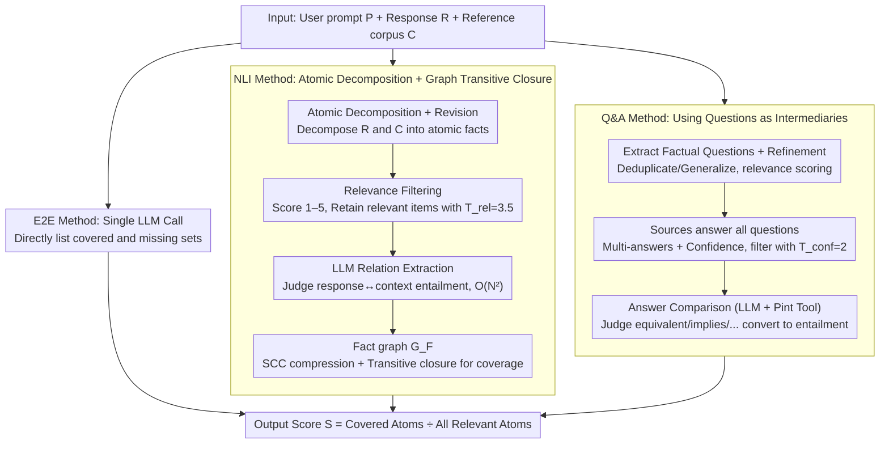

# Comprehensiveness Metrics for Automatic Evaluation of Factual Recall in Text Generation

**Conference**: ACL 2026 Findings  
**arXiv**: [2510.07926](https://arxiv.org/abs/2510.07926)  
**Code**: Not provided by the paper (None)  
**Area**: LLM Evaluation / Factuality / Information Coverage  
**Keywords**: Comprehensive evaluation, Factual recall, NLI graph, QA comparison, E2E LLM evaluation

## TL;DR
To address the difficulty of quantifying "omitted key information" in long-form text generation, the authors propose three comprehensiveness metrics—NLI decomposition + graph analysis, QA comparison, and end-to-end (E2E) LLM direct identification—calculating coverage $S = |\mathcal{A}_{in}| / (|\mathcal{A}_{in}| + |\mathcal{A}_{out}|)$ based on a reference corpus $\mathcal{C}$. Meta-evaluation on WikiContradict / ConflictBank reveals that the simplest E2E method is strongest on average (best LMR=0.85), but Q&A is more robust (across-model std only 0.009 vs. E2E's 0.044); each has specific suitable scenarios.

## Background & Motivation
**Background**: LLM factuality evaluation primarily focuses on precision—tools like FActScore / FacTool decompose responses into atomic facts for individual verification. A few recall-oriented works (e.g., SAFE's $R_K(y) = \min(S(y)/K, 1)$) rely on a preset number of expected facts $K$, failing to pinpoint specific missing content.

**Limitations of Prior Work**: (1) Precision-only metrics cannot identify "half-truths" where LLMs selectively answer or deliberately omit key information, which is as fatal as "hallucination" in high-risk scenarios like medical or legal fields; (2) Existing recall metrics use coarse-grained ratios and cannot identify "specifically which fact was missed," preventing diagnosis or real-time feedback; (3) There is a lack of specialized meta-benchmarks to evaluate comprehensiveness evaluators themselves.

**Key Challenge**: To identify "what was missed," one theoretically needs to know "what atomic facts should be included"—but the complete set of facts is inexhaustible (every response could involve infinite related facts).

**Goal**: (1) Transform the comprehensiveness evaluation problem into "coverage relative to a reference corpus $\mathcal{C}$" to make evaluation operable; (2) Design three metrics with different granularities and meta-evaluate their reliability; (3) Measure the comprehensiveness of mainstream open-source LLMs in real-world RAG scenarios.

**Key Insight**: Using modern retrievers and search engines to construct a reference corpus is already sufficient; the reachability of "absolute completeness" does not affect the utility of "relative coverage." Within the evaluator, methods can be implemented at three levels: NLI, QA, or direct LLM judgment.

**Core Idea**: Define comprehensiveness as the coverage of relevant items in the reference atomic fact set $\mathcal{A}_\mathcal{C}$ by the response atomic fact set $\mathcal{A}_R$, and implement this metric using three pipelines of varying complexity.

## Method

### Overall Architecture
All three metrics share the same input-output contract: they take a user prompt $P$, a response $R$, and a reference corpus $\mathcal{C}$, then output a covered set $\mathcal{A}_{in}$, an uncovered set $\mathcal{A}_{out}$, and a scalar score $S = |\mathcal{A}_{in}| / (|\mathcal{A}_{in}| + |\mathcal{A}_{out}|)$. The difference lies in "how $R$ is aligned with $\mathcal{C}$": the NLI and Q&A methods internally maintain a fact graph $G_F$ (where nodes are atomic statements or QA pairs and edges are entailment relationships), which allows for deduplication and counting via transitive closure and the derivation of an "uncovered context basis" $\mathcal{A}_{basis}$ (telling the user the minimum facts needed for completion); the E2E method collapses the entire pipeline into a single LLM call. These three form a spectrum of decreasing complexity, used to answer "how complex an evaluator needs to be."

### Key Designs

**1. NLI Method: Atomic Decomposition + Graph Transitive Closure.** This heaviest pipeline follows five stages, central to grounding "coverage" strictly in the entailment of atomic statements. First, LLM few-shot prompts decompose $R$ and each document in $\mathcal{C}$ into atomic facts, followed by atomic revision to resolve pronouns and split compound sentences (e.g., "A wrote X and Y" → "A wrote X" + "A wrote Y"). Next, each context atom is scored 1–5 for relevance, filtering out irrelevant items with $T_{rel} = 3.5$ to leave only the subset that "should have been covered."

The crucial fourth step is relation extraction: instead of specialized NLI models, a general LLM is used to judge entailment between response↔context and context↔context, as regulatory or knowledge-intensive statements are too difficult for specialized NLI. The trade-off is the need to traverse $2|\mathcal{A}_R||\mathcal{A}_\mathcal{C}| + |\mathcal{A}_\mathcal{C}|(|\mathcal{A}_\mathcal{C}|-1)$ pairs, resulting in $O(|\mathcal{A}|^2)$ complexity. Finally, these relationships form a fact graph $G_F$. Through Strongly Connected Component (SCC) compression to obtain $G_C$, any node in the reference corpus reachable from a response atom via an entailment path is considered covered: $\mathcal{A}_{in} = \{A_i \in \mathcal{V}_C \cap \mathcal{A}_\mathcal{C} \mid \exists A_j \in \mathcal{A}_R,\ \text{path}(A_j, A_i) \in G_F\}$. Using a graph instead of pairwise counting allows transitive relationships (X implies Y, Y implies Z) to be automatically closed to avoid overcounting; however, judgeing only isolated atoms results in information loss, which causes its lower accuracy.

**2. Q&A Method: Using Questions as Intermediaries.** Instead of direct pairwise atomic comparison, this pipeline switches to "asking questions first, then comparing answers to the same question." Self-contained factual questions are extracted from $R$ and $\mathcal{C}$ and refined (deduplication, generalization, resolving ambiguity, and relevance scoring). Then, a model answers all refined questions using each source—allowing multiple answers or no answer with confidence scores, filtering low-confidence items with $T_{conf} = 2$. In the answer comparison stage, the LLM, assisted by the Pint tool (dealing with physical unit conversions), classifies the relationship between answers as equivalent / first implies second / contradictory / neutral, which is then mapped to entailment for coverage calculation in the fact graph.

The benefit is compressing NLI's $O(N^2)$ atomic comparisons into an $O(M \cdot k)$ comparison of answers to the same question, significantly improving efficiency. Moreover, the model can see the full context when generating answers, making it more accurate than the isolated atom comparisons in the NLI stage—explaining its superior cross-model stability. The Pint tool specifically addresses LLM weaknesses in dimensional transformations.

**3. E2E Method: Single LLM Call.** The lightest solution bypasses decomposition, graphs, and pairwise classification. It places $(P, \mathcal{C}, R)$ into a single context and lets the model output $(\mathcal{A}_{in}, \mathcal{A}_{out}) = \text{CoverageEvaluator}(P, \mathcal{C}, R)$ in one step, using the same score formula. It bets on the reasoning power of modern long-context LLMs (like Llama 4 17Bx128E) to identify missing coverage directly, thereby avoiding cascading errors in multi-stage pipelines. The cost is the lack of interpretability and high dependence on the choice of evaluator LLM—experimental results show it is strongest on average but has the highest cross-model variance.

### Loss & Training
Ours does not train any models. All LLM calls use existing open-source models (gpt-oss-20b/120b, Llama 3.3 70B, Llama 4 17Bx128E, Qwen 2.5 72B) with temperature 0, top-p 1, and Llama 4 using FP8 quantization. The Pint tool is only available for Llama / Qwen (the gpt-oss inference engine does not support tool calls).

## Key Experimental Results

### Meta-evaluation Main Results (Label Match Rate, LMR↑)

| Metric × LLM | WikiContradict LMR | ConflictBank LMR | Average |
|--------------|-------------------|------------------|------|
| E2E × Llama 4 17Bx128E | — | — | **0.85** (Best) |
| Q&A × gpt-oss-20b | — | — | **0.81** (Best cross-model stability) |
| NLI (All LLMs) | Significantly lower than Q&A/E2E | Same as left | — |
| E2E × gpt-oss-120b on ConflictBank | — | Significantly lower than Q&A same model | — |

**Cross-model stability**: The Q&A method's LMR std across 5 LLMs is only **0.009**, while E2E's std is **0.044** (5× more sensitive to the choice of evaluator LLM). On WikiContradict, E2E is significantly better than Q&A (except for gpt-oss-120b, p < 0.05); on ConflictBank, results are mixed, with Q&A significantly outperforming E2E on 3 LLMs.

### Human Evaluation (50 WikiContradict Samples)

| Metric | % Correct Output | Primary Error Type |
|--------|----------------|-------------|
| NLI | 48.0% | CLASS_ERR (Classification error) + MISS_ATOM + IRR_ATOM |
| Q&A | 66.0% | MISS_ATOM + DUP_ATOM (Incomplete deduplication in refinement) |
| **E2E** | **88.0%** | CLASS_ERR + MISS_ATOM (Small amount) |

The agreement rate between automatic LMR judgment and human labels reaches **81.3%**, proving the reliability of the meta-evaluation protocol.

### LLM Comprehensiveness Measurements (ELI5 500 questions, Best Evaluator)

| Model | Q&A Score | E2E Score |
|------|---------|---------|
| **gpt-oss-120b** | **0.71** (Highest) | **0.83** (Highest) |
| Llama 4 17Bx128E | 0.69 | 0.78 |
| gpt-oss-20b | 0.67 | 0.76 |
| Llama 3.3 70B | 0.68 | 0.75 |
| **Qwen 2.5 72B** | **0.66** (Lowest) | **0.73** (Lowest) |

Q&A and E2E both agree that gpt-oss-120b is the most comprehensive and Qwen 2.5 72B is the least; however, Q&A's absolute scores are significantly lower than E2E's (due to generating more fine-grained questions, increasing the denominator).

### Key Findings
- **The simple E2E method is strongest on average**: On two meta-eval datasets, E2E using Llama 4 17Bx128E achieved the highest average LMR of 0.85, while the complex three-stage NLI pipeline performed the worst. This suggests that the end-to-end capability of modern long-context LLMs is sufficient for many evaluation tasks, and overly intricate pipeline designs may become an obstacle.
- **E2E cross-model variance is 5x higher than Q&A**: Performance drops sharply if the wrong evaluator LLM is chosen (e.g., E2E performs worse than Q&A on gpt-oss-120b). This indicates E2E's simplicity comes at the cost of high dependency on a specific LLM's capability. In production, if the evaluator choice is uncertain, Q&A should be prioritized.
- **Lost context is the root cause of NLI failure**: Human error analysis shows NLI has the highest CLASS_ERR rate, confirming that "judging entailment between two atoms requires original context." Pure NLI lacks this layer, serving as a warning for all factuality methods that "decompose first and analyze independently."
- **Q&A duplication issues**: Although refinement requires deduplication, semantically similar questions (e.g., "Who is the author?" vs. "Who wrote it?") often remain, leading to underestimation of coverage.
- **gpt-oss-120b is the most comprehensive**: It performs best in RAG scenarios on ELI5, consistent with the community's assessment of the gpt-oss series.

## Highlights & Insights
- **"Coverage relative to a reference corpus" bypasses the completeness problem**: Transforming the absolute question of "what should be said" into a relative question of "what was said in the reference and how much was covered" makes comprehensiveness evaluation actionable. This approach of "defining goals using existing datasets" can be migrated to any metric where the complete set is non-enumerable (e.g., helpfulness, safety).
- **Comparison of NLI / Q&A / E2E granularities**: Clearly demonstrates the trade-off between "evaluator complexity vs. accuracy"—the most complex NLI was the worst, while the simplest E2E was best on average but least stable. It reminds researchers that "more complex pipelines are not necessarily better."
- **Q&A uses Pint tool for dimensional comparison**: Identifying LLM weaknesses in physical unit conversion and patching them with specialized tools is a classic "hybrid neuro-symbolic" design that can be generalized to other LLM weakness areas.
- **Graph-theoretic definition of uncovered context basis $\mathcal{A}_{basis}$**: Defining the "minimum set of missing facts" using transitive closure allows the evaluation to provide not just scores but concrete suggestions for supplementation, which is useful for real-time feedback and model fine-tuning.
- **Comparison of 0.009 vs 0.044 cross-model std**: Reporting "evaluator robustness" alongside "accuracy" is a significant methodological contribution—every evaluation protocol should report these two dimensions.

## Limitations & Future Work
- The authors admit NLI and Q&A are computationally intensive (NLI requires $O(N^2)$ LLM calls), suitable for scenarios requiring fine-grained diagnosis, while E2E is for rapid large-scale evaluation at the cost of interpretability.
- The fact graph is a simple atom-based structure that cannot express complex relationships (e.g., composites of conditionality, quantification, negation); however, more complex graph structures would lead to exploding computational costs.
- The evaluator assumes the reference corpus $\mathcal{C}$ is reliable; if $\mathcal{C}$ contains misleading information, a model might be penalized for not repeating errors, requiring users to ensure data quality.
- The circular dependency of using LLMs to evaluate LLMs is mitigated by limiting the LLM's role to simple tasks with local context but cannot be entirely eliminated.
- Self-observed: Thresholds $T_{rel} = 3.5$ and $T_{conf} = 2$ are manually set and may need adjustment for different domains (e.g., medical vs. general), but no automatic tuning process is provided.
- The ELI5 experiment uses only 500 questions and 5 open-source models, lacking evaluation of closed-source models (e.g., GPT-4 / Claude).

## Related Work & Insights
- **vs. FActScore (Min et al. 2023) / FacTool (Chern et al. 2023)**: These work on precision (verification of correctness) and do not care about omissions; Ours specifically supplements the recall dimension.
- **vs. SAFE (Wei et al. 2024) $R_K$ metric**: SAFE uses a preset number of facts $K$ for coarse recall; Ours uses a reference corpus to output specific sets of missing facts, providing much stronger diagnostic capability.
- **vs. FEQA / QuestEval (Eyal 2019 / Scialom 2021)**: These QA-based summarization consistency metrics inspired the Q&A pipeline here, but ours extends from fixed source documents in summarization to multi-source RAG scenarios.
- **vs. Marinescu et al. (2025) FactReasoner**: Directly adapts its atomic extraction + graph analysis idea, but while FactReasoner targets precision, Ours targets recall.
- **vs. AutoNuggetizer (Pradeep et al. 2025)**: Also evaluates recall but uses fixed "nuggets" sets; Ours supports flexible granularity and identifies specific missing items.

## Rating
- Novelty: ⭐⭐⭐⭐ Explicitly splitting comprehensiveness into three granularities for comparison and meta-evaluating the evaluators themselves is a rare methodological contribution in factuality evaluation.
- Experimental Thoroughness: ⭐⭐⭐⭐ 2 meta-eval datasets × 5 LLMs × 3 metrics + Human evaluation + Real ELI5 application + BCa bootstrap + Permutation test; solid, though lacking closed-source LLM evaluation.
- Writing Quality: ⭐⭐⭐⭐⭐ Clear formal definitions, explicit pipeline steps, and all prompts provided in the appendix ensure excellent reproducibility.
- Value: ⭐⭐⭐⭐ Provides an actionable toolkit for "evaluating whether LLMs miss key information" and the NLI vs. Q&A vs. E2E comparison offers methodological insights for other evaluation protocols.

<!-- RELATED:START -->

## Related Papers

- [\[ACL 2026\] Minos: A Multimodal Evaluation Model for Bidirectional Generation Between Image and Text](minos_a_multimodal_evaluation_model_for_bidirectional_generation_between_image_a.md)
- [\[ACL 2026\] Stress Testing Factual Consistency Metrics for Long-Document Summarization](stress_testing_factual_consistency_metrics_for_long-document_summarization.md)
- [\[ACL 2026\] StratMem-Bench: Evaluating Strategic Memory Use in Virtual Character Conversation Beyond Factual Recall](stratmem-bench_evaluating_strategic_memory_use_in_virtual_character_conversation.md)
- [\[ACL 2026\] Attribution, Citation, and Quotation: A Survey of Evidence-based Text Generation with Large Language Models](attribution_citation_and_quotation_a_survey_of_evidence-based_text_generation_wi.md)
- [\[ACL 2026\] VC-Inspector: Advancing Reference-free Evaluation of Video Captions with Factual Analysis](vc-inspector_advancing_reference-free_evaluation_of_video_captions_with_factual_.md)

<!-- RELATED:END -->
