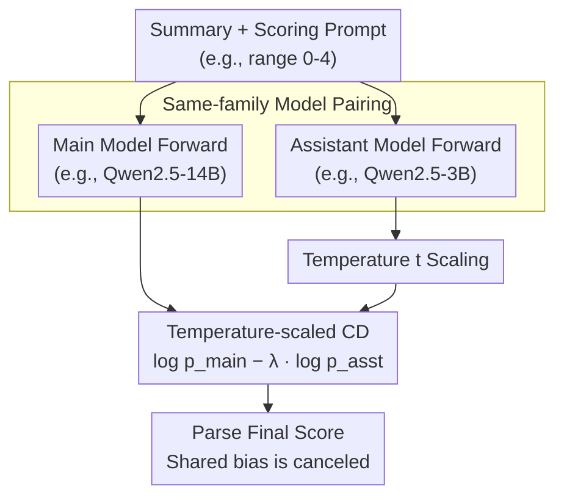

# Contrastive Decoding Mitigates Score Range Bias in LLM-as-a-Judge

**Conference**: ACL 2026  
**arXiv**: [2510.18196](https://arxiv.org/abs/2510.18196)  
**Code**: None  
**Area**: LLM Evaluation  
**Keywords**: LLM-as-a-Judge, Contrastive Decoding, Score Range Bias, Direct Assessment, Model Family Bias

## TL;DR

This paper reveals that LLM judges exhibit **score range bias** in direct assessment tasks, where model outputs are highly sensitive to predefined score ranges. It proposes using **contrastive decoding** to mitigate this issue by canceling out similar biases shared within the same model family, achieving an average relative improvement of up to 11.3% in Spearman correlation.

## Background & Motivation

**Background**: LLM-as-a-Judge has become an indispensable part of the evaluation ecosystem, widely used for both direct assessment (assigning a score to an output) and pairwise comparison tasks.

**Limitations of Prior Work**: Known biases in LLM judges include self-enhancement bias (favoring their own outputs) and family enhancement bias (favoring outputs from the same model family), but the existence of other hidden biases has not been fully explored. In direct assessment tasks, the correlation between LLM judges and human annotations has consistently lagged behind that of pairwise comparisons.

**Key Challenge**: When using different score ranges (e.g., 0-4, 1-5, 2-6, 3-7), the output correlation of LLM judges changes significantly. This implies that evaluation results are unstable, making it impossible to reliably search for an optimal score range.

**Goal**: To reveal and quantify score range bias in LLM judges and propose effective mitigation strategies.

**Key Insight**: It is observed that models of different sizes within the same model family encode similar score range biases (e.g., 3B, 7B, and 14B models in the Qwen2.5 family all tend to output Score 2). Therefore, contrastive decoding can be used to let these similar biases cancel each other out.

**Core Idea**: Apply contrastive decoding to the LLM-as-a-Judge scenario, using a smaller model from the same family as an "assistant model." By subtracting the assistant model's logits from the main model's logits, the shared score range bias can be eliminated.

## Method

### Overall Architecture

The method is based on the contrastive decoding framework. The core idea is to simultaneously run two judgment models **from the same model family**—a main model and an assistant model—on the same summary to be evaluated. Since models within the same family encode similar score range biases, subtracting the temperature-scaled and $\lambda$-weighted log-probabilities of the assistant model from those of the main model allows the shared bias to be canceled out, shifting the score distribution closer to human annotations. The process requires no additional training; a single subtraction is performed on the logits of the first score token during the decoding stage.

### Key Designs

**1. Same-family Model Pairing: Enabling Bias Cancellation**

The method's premise is the observation that score range bias is not random noise but is **systematically shared** along model families: in the 2-6 range, both Llama-3 3B and 8B favor Score 4; Qwen2.5 3B, 7B, and 14B all favor Score 2. This bias weakens as model size increases but does not disappear. Since the main and assistant models share the same systematic range bias, subtraction in contrastive decoding cancels out this **shared systematic bias** while preserving signals that reflect true summary quality. Specifically, Llama-3 uses 8B as the main model with 1B/3B as assistants, while Qwen2.5 uses 7B/14B as main models with 3B as the assistant. Using a smaller model is both cost-effective and allows for computation reuse similar to speculative decoding.

**2. Temperature-scaled Contrastive Decoding Formula: Aligning Logits Across Scales**

The final score is derived from $\log p_{\text{main}} - \lambda \log p_{\text{asst}}$, where $\lambda$ controls the strength of subtraction. A key modification from the original contrastive decoding (Li et al., 2023) is the **introduction of temperature $t$ on the assistant model**, such that $p_{\text{asst}} = e^{e_i/t} / \sum_j e^{e_j/t}$. This is motivated by logit analysis showing significant magnitude differences between scales (max logit of the first token: 3B $\approx$ 25, 7B $\approx$ 30, 14B $\approx$ 34). Direct subtraction would allow the larger magnitude model to dominate, distorting the cancellation. Temperature $t$ flattens the assistant's logit distribution to a scale comparable to the main model, ensuring the subtraction truly aligns with the "bias" dimension. $\lambda \in \{0.01, 0.1, 0.5, 1.0\}$ and $t \in \{0.5, 1.0, 2.0, 3.0, 4.0, 5.0\}$ are determined via grid search on a 10% development set, optimized for each model pair and score range.

## Key Experimental Results

### Main Results

| Model/Method | Score Range | Pearson | Spearman | Kendall |
|---|---|---|---|---|
| Llama 3.1-8B (greedy) | Average | 0.346 | 0.334 | 0.290 |
| Contrastive (8B-1B) | Average | **0.361** | **0.352** | **0.306** |
| Qwen2.5-14B (greedy) | Average | 0.383 | 0.384 | 0.334 |
| Contrastive (14B-3B) | Average | **0.424** | **0.433** | **0.376** |

### Ablation Study

| Analysis Dimension | Key Findings |
|---|---|
| Different Score Ranges (0-4/1-5/2-6/3-7) | Greedy decoding correlation fluctuates heavily across ranges (Llama 8B: 0.257~0.372); contrastive decoding is more stable (0.298~0.378). |
| Assistant Model Choice (1B vs 3B) | Differences are small; 1B slightly outperforms 3B (Spearman 0.352 vs 0.343). |
| Multi-dimensional Evaluation (coherence/relevance/consistency) | Score range bias exists across all dimensions; contrastive decoding improves results in most dimensions. |

### Key Findings

1. **Score range bias is pervasive**: Models across different families (Llama-3, Qwen-2.5) and scales (1B to 14B) exhibit score range bias, preferring specific score values.
2. **Same-family models encode similar biases**: Qwen 3B, 7B, and 14B all prefer Score 2; bias gradually weakens as scale increases but persists.
3. **Greatest improvement in the 2-6 range**: This is the range where greedy decoding performs worst; contrastive decoding provides the most significant boost here (Llama: Spearman 0.257 $\rightarrow$ 0.302).
4. **Qwen-14B achieves best performance with CD**: Average Spearman correlation increased from 0.384 to 0.433, a relative improvement of approximately 12.8%.

## Highlights & Insights

1. **High Value in Problem Discovery**: This work is the first to systematically reveal score range bias in LLM judges, an overlooked but impactful issue.
2. **Simple and Effective**: Contrastive decoding requires no additional training, only running two same-family models simultaneously, and is compatible with the computational overhead of speculative decoding.
3. **Clear Bias Visualization**: Logit distribution plots intuitively demonstrate model preference for specific scores and how contrastive decoding shifts distributions closer to human annotations.
4. **Expanding Evaluation Space**: Contrastive decoding makes it feasible to search for optimal score ranges beyond the standard 1-5 range.

## Limitations & Future Work

1. **Model Scale Constraints**: Experiments only cover up to 14B parameters; bias patterns and CD effects for larger models (e.g., 70B+) remain unknown.
2. **Limited Task Coverage**: Validation is only performed on summary evaluation; applicability to other tasks (e.g., code evaluation, dialogue evaluation) is untested.
3. **English Only**: Not tested in multilingual scenarios.
4. **Increased Inference Cost**: Requires forward passes for two models, and though potentially sharable via speculative decoding, it increases deployment complexity.
5. **Hyperparameter Sensitivity**: Optimal settings for each model pair and range require separate tuning, with generalization across applications yet to be verified.

## Related Work & Insights

1. **G-Eval (Liu et al., 2023)**: A classic work using GPT-4 for NLG evaluation; this paper builds on it by identifying score range bias.
2. **Family Enhancement Bias (Goel et al., 2025)**: Found that models from the same family favor each other; this paper creatively utilizes this "family similarity" for bias cancellation.
3. **Contrastive Decoding (Li et al., 2023)**: Originally used for open-ended text generation; this paper adapts it for LLM evaluation.
4. **Prometheus 2 (Kim et al., 2024)**: Specially trained evaluation models; serves as a contrast to this paper's training-free approach.

## Rating

- **Novelty**: ⭐⭐⭐⭐ — First to reveal score range bias and propose contrastive decoding as a mitigation; the problem discovery itself is highly valuable.
- **Experimental Thoroughness**: ⭐⭐⭐ — Covers two model families, four score ranges, and three evaluation dimensions, though limited to a single task type (summary evaluation).
- **Writing Quality**: ⭐⭐⭐⭐ — Clear structure, high-quality visualizations, and intuitive bias analysis.
- **Value**: ⭐⭐⭐⭐ — Provides a significant warning for the LLM-as-a-Judge community; the method is practical and compatible with existing inference acceleration techniques.

<!-- RELATED:START -->

## Related Papers

- [\[ICLR 2026\] BiasScope: Towards Automated Detection of Bias in LLM-as-a-Judge Evaluation](../../ICLR2026/llm_evaluation/biasscope_towards_automated_detection_of_bias_in_llm-as-a-judge_evaluation.md)
- [\[ACL 2026\] When Vision-Language Models Judge Without Seeing: Exposing Informativeness Bias](when_vision-language_models_judge_without_seeing_exposing_informativeness_bias.md)
- [\[ACL 2026\] Common to Whom? Regional Cultural Commonsense and LLM Bias in India](common_to_whom_regional_cultural_commonsense_and_llm_bias_in_india.md)
- [\[ACL 2026\] Fin-Bias: Comprehensive Evaluation for LLM Decision-Making under human bias in Finance Domain](fin-bias_comprehensive_evaluation_for_llm_decision-making_under_human_bias_in_fi.md)
- [\[ACL 2026\] Reasoning Model Is Superior LLM-Judge, Yet Suffers from Biases](reasoning_model_is_superior_llm-judge_yet_suffers_from_biases.md)

<!-- RELATED:END -->
