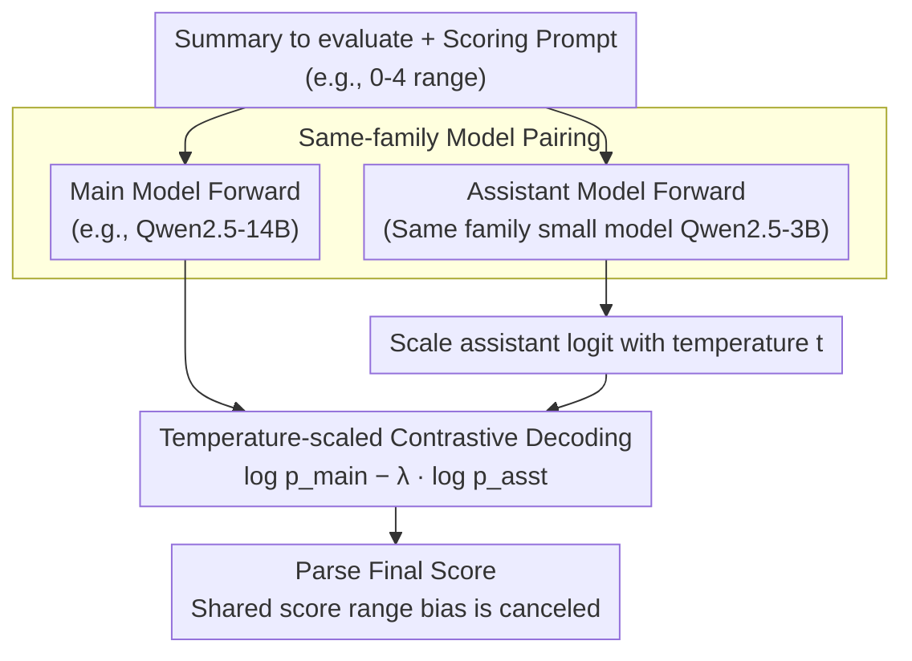

# Contrastive Decoding Mitigates Score Range Bias in LLM-as-a-Judge

**Conference**: ACL 2026  
**arXiv**: [2510.18196](https://arxiv.org/abs/2510.18196)  
**Code**: None  
**Area**: LLM Evaluation  
**Keywords**: LLM-as-a-Judge, Contrastive Decoding, Score Range Bias, Direct Assessment, Model Family Bias

## TL;DR

This paper reveals that LLM-as-a-Judge exhibits **score range bias** in direct assessment tasks, where model outputs are highly sensitive to predefined score ranges. It proposes using a **contrastive decoding** method to mitigate this issue by canceling out similar biases within the same model family, achieving an average relative improvement of up to 11.3% in Spearman correlation.

## Background & Motivation

**Background**: LLM-as-a-Judge has become an indispensable component of the evaluation ecosystem, widely used for both direct assessment (assigning a score to an output) and pairwise comparison tasks.

**Limitations of Prior Work**: Known LLM evaluation biases include self-enhancement bias (preferring own outputs) and family enhancement bias (preferring outputs from models in the same family), but whether other hidden biases exist has not been fully investigated. In direct assessment tasks, the correlation between LLM-as-a-Judge and human annotators has consistently lagged behind that of pairwise comparison.

**Key Challenge**: When using different score ranges (e.g., 0-4, 1-5, 2-6, 3-7), the output correlation of the LLM evaluator changes significantly. This implies that evaluation results are unstable and that it is impossible to reliably search for an optimal score range.

**Goal**: To reveal and quantify score range bias in LLM-as-a-Judge and propose effective mitigation strategies.

**Key Insight**: It is observed that models of different sizes within the same model family encode similar score range biases (for example, the 3B/7B/14B models of the Qwen2.5 family all tend to output Score 2). Therefore, contrastive decoding can be utilized to allow these similar biases to cancel each other out.

**Core Idea**: Apply contrastive decoding technology to the LLM evaluation scenario by using a small model from the same family as an "assistant model." By subtracting the assistant model's logits from the main model's logits, their shared score range bias can be eliminated.

## Method

### Overall Architecture

The proposed method is based on the contrastive decoding framework. The core idea is to simultaneously run two evaluation models **from the same model family**—a main model and an assistant model—on the same summary to be evaluated. Since models from the same family encode similar score range biases, subtracting the assistant model's log-probabilities (which are temperature-scaled and weighted by a coefficient $\lambda$) from the main model's log-probabilities allows their shared bias to be canceled out. This shifts the score distribution closer to human annotations. The entire process requires no additional training and involves only a single subtraction of the logits for the first score token during the decoding stage.

### Key Designs

**1. Model Pairing within the Same Family: Enabling Bias Cancellation**

The premise of this method is the observation that score range bias is not random noise but is **systematically shared** along model families: within the Llama-3 family, both 3B and 8B tend to assign Score 4 in the 2-6 range; in the Qwen2.5 family, 3B/7B/14B all tend to assign Score 2, and while the bias weakens as model size increases, it does not disappear. Since the main and assistant models come from the same family and share the same range bias, the "subtraction" in contrastive decoding only cancels out this **shared systematic bias**, while preserving the signals that truly reflect the quality of the summary. For specific pairings, Llama-3 uses 8B as the main model with 1B/3B as assistants; Qwen2.5 uses 7B/14B as the main model with 3B as the assistant—the assistant is always chosen as the smaller model in the family, which is computationally inexpensive and can reuse the same computations as speculative decoding.

**2. Temperature-scaled Contrastive Decoding Formula: Aligning Logits of Different Scales**

The final score is determined by $\log p_{\text{main}} - \lambda \log p_{\text{asst}}$, where $\lambda$ controls the strength of the assistant model subtraction. Compared to the original contrastive decoding by Li et al. (2023), the key modification is the **introduction of a temperature $t$ on the assistant model**, such that $p_{\text{asst}} = e^{e_i/t} / \sum_j e^{e_j/t}$. This is motivated by the authors' logit analysis: different model scales show significant differences in logit magnitudes (the max logit of the first token is $\approx 25$ for 3B, $\approx 30$ for 7B, and $\approx 34$ for 14B). If direct subtraction were used, the model with the larger magnitude would dominate, distorting the cancellation. The temperature $t$ flattens the assistant model's logit distribution to a scale comparable to the main model, allowing the subtraction to truly align on the "bias" dimension. $\lambda \in \{0.01, 0.1, 0.5, 1.0\}$ and $t \in \{0.5, 1.0, 2.0, 3.0, 4.0, 5.0\}$ are determined through grid search on a development set comprising 10% of the data, with the optimal combination selected for each model pair and score range.

## Key Experimental Results

### Main Results

| Model/Method | Score Range | Pearson | Spearman | Kendall |
|---|---|---|---|---|
| Llama 3.1-8B (greedy) | Average | 0.346 | 0.334 | 0.290 |
| Contrastive (8B-1B) | Average | **0.361** | **0.352** | **0.306** |
| Qwen2.5-14B (greedy) | Average | 0.383 | 0.384 | 0.334 |
| Contrastive (14B-3B) | Average | **0.424** | **0.433** | **0.376** |

### Ablation Study

| Analysis Dimension | Key Finding |
|---|---|
| Different Score Ranges (0-4/1-5/2-6/3-7) | Greedy decoding correlation fluctuates significantly across ranges (Llama 8B: 0.257~0.372), while contrastive decoding is more stable (0.298~0.378). |
| Assistant Model Selection (1B vs 3B) | Minimal difference; 1B performs slightly better than 3B (Spearman 0.352 vs 0.343). |
| Multi-dimensional Evaluation (coherence/relevance/consistency) | Score range bias exists across all dimensions; contrastive decoding provides improvements in most cases. |

### Key Findings

1. **Score range bias is prevalent**: Models from different families (Llama-3, Qwen-2.5) and different scales (1B to 14B) all exhibit score range bias, favoring specific score values.
2. **Models in the same family encode similar biases**: The 3B/7B/14B models in the Qwen family all tend to output Score 2; this bias gradually weakens as model size increases but persists.
3. **Contrastive decoding provides the largest improvement in the 2-6 range**: This is the range where greedy decoding performs worst, and contrastive decoding shows the most significant improvement here (Llama: Spearman 0.257 $\rightarrow$ 0.302).
4. **Qwen-14B achieves the best results with contrastive decoding**: Average Spearman correlation increased from 0.384 to 0.433, a relative improvement of approximately 12.8%.

## Highlights & Insights

1. **High value in problem discovery**: This is the first work to systematically reveal score range bias in LLM evaluators, a previously overlooked but far-reaching issue.
2. **Simple and effective method**: Contrastive decoding does not require additional training; it simply requires running two models from the same family simultaneously, and its overhead can be shared with speculative decoding techniques.
3. **Clear bias visualization**: The logit distribution plots intuitively demonstrate the preference of different models for specific scores and how contrastive decoding brings the score distribution closer to human annotations.
4. **Expanding the evaluation space**: Contrastive decoding makes it possible to search for optimal score ranges beyond the standard 1-5 range.

## Limitations & Future Work

1. **Model scale constraints**: The experiments only covered models up to 14B parameters; the bias patterns and effectiveness of contrastive decoding for larger models (e.g., 70B+) remain unknown.
2. **Limited task coverage**: The method was only validated on summarization evaluation tasks; its applicability to other evaluation tasks (e.g., code evaluation, dialogue evaluation) has not been verified.
3. **English only**: Testing was not conducted in multilingual scenarios.
4. **Increased inference overhead**: Running forward passes for two models simultaneously is required; although this can be shared via speculative decoding, it increases deployment complexity.
5. **Hyperparameter sensitivity**: Both $\lambda$ and $t$ need to be tuned separately for each model pair and score range, and the generalizability in practical applications remains to be verified.

## Related Work & Insights

1. **G-Eval (Liu et al., 2023)**: A seminal work using GPT-4 for NLG evaluation; this paper discovers the score range bias problem building upon it.
2. **Family Enhancement Bias (Goel et al., 2025)**: Discovered that models from the same family prefer each other; this paper cleverly uses this "family similarity" for bias cancellation.
3. **Contrastive Decoding (Li et al., 2023)**: Original contrastive decoding was used for open-ended text generation; this paper migrates it to the LLM-as-a-Judge scenario.
4. **Prometheus 2 (Kim et al., 2024)**: Specially trained evaluation models, which contrast with the training-free approach in this paper.

## Rating

- **Novelty**: ⭐⭐⭐⭐ — The first to reveal score range bias and propose a contrastive decoding solution; the problem discovery itself is of significant value.
- **Experimental Thoroughness**: ⭐⭐⭐ — Covers two model families, four score ranges, and three evaluation dimensions, but the task type is limited (only summarization).
- **Writing Quality**: ⭐⭐⭐⭐ — The paper is well-structured with good visualizations, and the bias analysis is deep and intuitive.
- **Value**: ⭐⭐⭐⭐ — Highly significant warning for the LLM-as-a-Judge community; the method is practical and compatible with existing inference acceleration technologies.

<!-- RELATED:START -->

## Related Papers

- [\[ICLR 2026\] BiasScope: Towards Automated Detection of Bias in LLM-as-a-Judge Evaluation](../../ICLR2026/llm_evaluation/biasscope_towards_automated_detection_of_bias_in_llm-as-a-judge_evaluation.md)
- [\[ACL 2026\] When Vision-Language Models Judge Without Seeing: Exposing Informativeness Bias](when_vision-language_models_judge_without_seeing_exposing_informativeness_bias.md)
- [\[ACL 2026\] Common to Whom? Regional Cultural Commonsense and LLM Bias in India](common_to_whom_regional_cultural_commonsense_and_llm_bias_in_india.md)
- [\[ACL 2026\] Fin-Bias: Comprehensive Evaluation for LLM Decision-Making under human bias in Finance Domain](fin-bias_comprehensive_evaluation_for_llm_decision-making_under_human_bias_in_fi.md)
- [\[ACL 2026\] Reasoning Model Is Superior LLM-Judge, Yet Suffers from Biases](reasoning_model_is_superior_llm-judge_yet_suffers_from_biases.md)

<!-- RELATED:END -->
