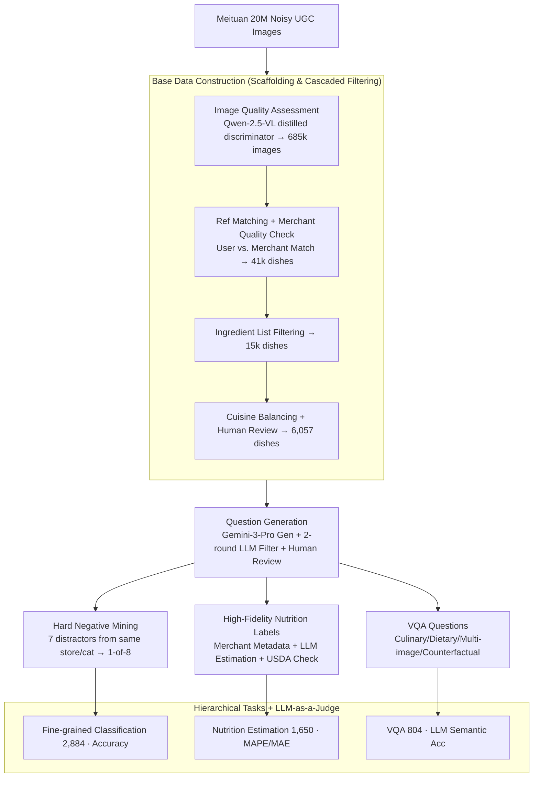

# DiningBench: A Hierarchical Multi-view Benchmark for Perception and Reasoning in the Dietary Domain

**Conference**: ACL 2026  
**arXiv**: [2604.10425](https://arxiv.org/abs/2604.10425)  
**Code**: https://huggingface.co/datasets/meituan/DiningBench (Available)  
**Area**: Multimodal VLM / Evaluation Benchmark / Food Visual Understanding  
**Keywords**: Food benchmark, Multi-view, Fine-grained classification, Nutrition estimation, VQA

## TL;DR
The authors constructed DiningBench, the first hierarchical multi-view food benchmark (3,021 dishes / 15,928 images / avg. 5.27 views per dish). It covers three levels of cognitive tasks: "Fine-grained classification (same-store hard negatives) → Nutrition estimation (4-dimensional regression) → VQA (reasoning)." Evaluation of 29 SOTA VLM systems reveals that existing models are significantly deficient in fine-grained visual discrimination and nutritional quantification, and that Chain-of-Thought (CoT) actually impairs pure visual perception.

## Background & Motivation

**Background**: With the rapid progress of VLMs like GPT-4o, Gemini-3, and Qwen-VL in general visual understanding, AI in the dietary domain (automated diet logging, smart kitchen assistants) is highly anticipated. However, evaluation benchmarks are still stuck on early datasets such as Food-101, UEC-Food, Recipe1M+, and Nutrition5K.

**Limitations of Prior Work**: The authors summarize four major flaws: (1) **Tasks are too simple**—most benchmarks only handle coarse-grained classification without considering nutritional quantification or culinary reasoning; (2) **Single-view constraints**—real-world users capture food from multiple angles, but datasets consist of single images; (3) **Lack of fine-grained discrimination**—distractors are randomly sampled, allowing models to guess based on semantic priors; (4) **Inaccurate nutrition labeling**—Recipe1M+ has poor image quality, while Nutrition5K/FastFood are limited to standardized canteen or fast-food chain scenarios.

**Key Challenge**: Real-world dishes contain hard negatives that are visually extremely similar within the same store and category (e.g., Smoked Salmon Salad vs. Fresh Salmon Avocado Salad). Furthermore, estimating nutrition requires inferring volume, portion size, and ingredients from images. Both require precise visual understanding beyond "bag-of-features," a capability current benchmarks fail to expose.

**Goal**: Construct a hierarchical food benchmark that simultaneously evaluates (i) fine-grained discrimination, (ii) numerical quantification, and (iii) high-order reasoning, with multi-view images for each dish.

**Key Insight**: Leveraging massive real UGC images and merchant metadata from Meituan (China's largest local life service platform), the authors use SOTA VLMs (Qwen-2.5-VL, Gemini-3-Pro-Preview) for AI-assisted data curation combined with strict human review, compressing 20M noisy images into 3,021 high-quality dishes.

**Core Idea**: Integrate "same-store same-category hard negatives + multi-view + high-fidelity nutrition labels + hierarchical tasks" into a single framework to expose the weaknesses of current VLMs.

## Method

DiningBench is a benchmark dataset; the "Method" refers to the data construction pipeline, task definitions, and evaluation protocols.

### Overall Architecture
The pipeline aims to extract high-quality evaluation items that expose VLM shortcomings from massive noisy UGC. It consists of two stages: first, Base Data construction, processing 20M Meituan UGC images through image quality assessment (Qwen-2.5-VL-7B discriminator distilled from GPT-4) → 685k images, reference image matching (verifying user photos match merchant reference photos) → 90k dishes, merchant reference image quality verification → 41k dishes, and detailed ingredient list filtering → 15k dishes. Finally, the data is balanced by cuisine and human-verified, converging to 6,057 dishes. Second, question generation uses Gemini-3-Pro-Preview to generate hard negatives, nutrition reasoning, and VQA questions. Each step undergoes two rounds of LLM filtering (one to remove "impossible-to-judge" items and another for "too-easy" items) followed by human review. This results in three subsets with increasing cognitive complexity: Fine-grained Classification (2,884), Nutrition Estimation (1,650), and VQA (804).

### Key Designs

**1. Same-store Hard Negative Mining: Refreshing the fine-grained problem.** In traditional benchmarks, distractors are chosen randomly across all categories, allowing models to exceed saturation using category-level priors (e.g., "this is a salad, not noodles"). DiningBench utilizes Meituan’s menu structure. For each target dish, Gemini-3-Pro-Preview selects 7 visually and semantically similar items from the **same menu category of the same merchant** as distractors (e.g., for a "Smoked Salmon Salad," distractors might be "Salmon Avocado Salad" or "Tuna Tartare Salad"), creating an 8-way multiple-choice task.

These distractors share ingredients, colors, and plating, forcing models to move beyond "bag-of-features" to analyze cutting styles, textures, and ingredient proportions. During construction, Gemini-3-Pro-Preview and Gemini-2.5-Pro perform two rounds of filtering—the first to remove samples too blurry to identify the ground truth (GT), and the second to remove trivial samples. Final manual review ensures quality. This pushes GPT-4o's accuracy down to 65.26%, highlighting the bottleneck in fine-grained discriminability.

**2. High-Fidelity Nutrition Labels: Triple verification via metadata, LLM estimation, and USDA cross-referencing.** Nutrition5K and FastFood are limited to specific canteens or chains and fail to generalize. Thus, the nutrition dimension was rebuilt. Each dish is assigned a 4D nutrition vector $\mathbf{v} = (\text{Cal}, \text{Carb}, \text{Prot}, \text{Fat}) \in \mathbb{R}^4$ as regression GT, using a dual-path pipeline: direct extraction from merchant metadata when available, and LLM-assisted estimation (using Gemini-3-Pro-Preview on "image + ingredients + weight") when missing.

Crucially, **all** estimates are cross-referenced with the USDA FoodData Central database and systematically verified by humans. Consistency checks using the Atwater system $E \approx 4P + 4C + 9F$ are performed in prompts, with explicit instructions to detect merchant fraud (e.g., underreporting calories/fat or overreporting protein). This triple verification covers 1,650 dishes with calorie counts ranging from light meals to calorie-dense items (mean 670.5 kcal), a much broader span than previous datasets.

**3. Hierarchical Tasks + LLM-as-a-Judge: Decomposing cognitive complexity.** Three subsets follow a progression of "Identification → Quantification → Reasoning," each with specific metrics to help researchers locate bottlenecks. Fine-Grained Classification uses Accuracy; Nutrition Estimation uses MAE / RMSE / MAPE, where $\mathrm{MAPE}_k = \frac{1}{N}\sum_i |v_{i,k} - \hat{v}_{i,k}| / v_{i,k}$ is averaged across the 4 components to reflect relative error.

For VQA, since answers are in natural language, LLM-as-a-Judge is used to perform binary semantic consistency checks between predictions and gold labels. This subset covers Culinary Technique (532), Dietary Suggestion (219), Multi-Image Analysis (35), and Counterfactual Reasoning (18). The hierarchical structure reveals phenomena such as Gemini-3-Pro-Preview achieving 90.42% on VQA while still suffering a 24.45% MAPE in nutrition estimation.

### Loss & Training
No models were trained; only evaluation was conducted. Commercial models were accessed via official APIs (temperature=0, max_tokens=16,384). Open-source models were deployed using vLLM. In the Base Data stage, knowledge distillation was used: Qwen-2.5-VL-7B was trained on a small GPT-4-labeled set for quality assessment and matching, then used for large-scale filtering.

## Key Experimental Results

### Main Results: Comparison of 29 VLMs (Selection)

| Model | Class. ACC↑ | Nutrition Avg MAPE↓ | VQA ACC↑ |
|------|-------------|---------------------|----------|
| **Gemini-3-Flash-Preview** | **81.83** | 25.21 | 88.56 |
| **Gemini-3-Pro-Preview** | 81.55 | **24.45** | **90.42** |
| Gemini-2.5-Pro | 73.51 | 38.21 | 89.93 |
| GPT-5 (Hypothetical) | 70.18 | 32.17 | 86.94 |
| Claude-Sonnet-4.5 | 54.40 | 42.62 | 83.58 |
| GPT-4o | 65.26 | 42.43 | 80.60 |
| Qwen-2.5-VL-72B | 65.29 | 40.56 | 76.62 |
| Qwen-3-VL-30B-A3B-Instruct | 65.43 | 37.35 | 80.60 |
| Qwen-3-VL-8B-Instruct | 64.15 | 39.24 | 72.76 |
| InternVL-3.5-38B | 54.20 | 46.13 | 72.51 |
| Gemma-3-12B-it | 48.61 | 43.15 | 61.82 |

Observations: (i) Even the strongest Gemini-3-Pro-Preview scores only 82% on classification; (ii) Nutrition estimation remains the hardest task, with the best MAPE at 24.45%; (iii) VQA is relatively easier; (iv) The gap between open and closed-source models is largest in Nutrition, suggesting heavy dependence on training data scale.

### Ablation Study: Multi-view Count + CoT Impact

| Config | Classification ACC | Nutrition MAPE | Description |
|------|--------------------|-----------------|------|
| 1 view | baseline | baseline | Single image |
| 2 views | Significant increase| Significant decrease| Largest jump in capability |
| 3 views | Slight increase | Marginal gain | Large models continue to benefit |
| 4 views | Near saturation | Worse for some small models | Information overload/noise |
| Large + CoT (Nutrition) | – | **Significant worsening** | Performance collapse in small models |
| Large + CoT (VQA) | – | – | Inconsistent results |
| Large + CoT (Class.) | Mostly decrease | – | Explicit reasoning interferes with visual perception |

### Key Findings
- **"Capability Jump" at 1→2 views**: Transitioning from single to dual views provides the largest performance boost by resolving occlusions and ambiguity. Returns diminish after 3 views.
- **CoT is not a silver bullet**: In pure perception tasks (Nutrition Estimation), CoT causes MAPE to skyrocket for most models. The authors hypothesize that explicit verbalization "decouples" predictions from visual evidence, leading to hallucination.
- **5 Failure Modes**: (1) Insufficient fine-grained discriminability, (2) Parameterized knowledge bias (defaulting to common dish names), (3) Lack of spatial-volume reasoning, (4) Ineffective multi-view aggregation, (5) Thinking-model infinite loops.
- **Translation impact**: Classification accuracy generally drops when translated to English, but Nutrition Estimation improves for Gemini/GPT-4o, likely triggering better numerical reasoning pathways.

## Highlights & Insights
- **Hard negatives from the same store** effectively refresh the saturated fine-grained recognition problem. This low-cost, high-impact data strategy is transferable to other vertical domains (e.g., medical or e-commerce).
- **The AI-assisted construction pipeline** (Gemini-3 generation + Gemini-2.5 audit + Qwen quality check + human audit) provides a template for "100% pass-rate" benchmark construction.
- **Hierarchical task design** allows for pinpointing whether a model "cannot see," "cannot quantify," or "cannot reason."
- The **5 failure modes** provide direct insights for VLM training, highlighting the need for stronger visual grounding losses and 3D-aware pretraining.

## Limitations & Future Work
- **Chinese Cuisine Bias**: 69% of the data is Chinese cuisine, which may limit global generalization.
- **Potential bias in LLM labeling**: Despite review, Gemini-3's estimations may inherit implicit biases.
- **Small VQA subset**: 804 samples may lack statistical significance for LLM-as-a-Judge, particularly in minority categories like Counterfactual Reasoning.
- **Lack of comparison with specialized models**: No comparison against models specifically tuned on Nutrition5K or specialized ConvNets.

## Related Work & Insights
- **vs. Food-101 / Food2K**: DiningBench adds nutrition quantification and reasoning with multi-view support.
- **vs. Nutrition5K**: DiningBench uses diverse real-world UGC rather than standardized canteen data and introduces the more intuitive MAPE metric.
- **vs. MMBench / SEED-Bench**: General benchmarks struggle with fine-grained vertical problems; DiningBench serves as a paradigm for domain-specific hierarchical benchmarks.

## Rating
- Novelty: ⭐⭐⭐⭐ 
- Experimental Thoroughness: ⭐⭐⭐⭐⭐ 
- Writing Quality: ⭐⭐⭐⭐ 
- Value: ⭐⭐⭐⭐⭐ 

<!-- RELATED:START -->

## Related Papers

- [\[ACL 2026\] ReCoQA: A Benchmark for Tool-Augmented and Multi-Step Reasoning in Real Estate Question and Answering](recoqa_a_benchmark_for_tool-augmented_and_multi-step_reasoning_in_real_estate_qu.md)
- [\[ICML 2026\] Multi$^2$: Hierarchical Multi-Agent Decision-Making with LLM-Based Agents in Interactive Environments](../../ICML2026/llm_evaluation/multi2_hierarchical_multi-agent_decision-making_with_llm-based_agents_in_interac.md)
- [\[ACL 2026\] K-MetBench: A Multi-Dimensional Benchmark for Fine-Grained Evaluation of Expert Reasoning, Locality, and Multimodality in Meteorology](k-metbench_a_multi-dimensional_benchmark_for_fine-grained_evaluation_of_expert_r.md)
- [\[NeurIPS 2025\] BLINK-Twice: You See But Do You Observe? A Reasoning Benchmark on Visual Perception](../../NeurIPS2025/llm_evaluation/blink-twice_you_see_but_do_you_observe_a_reasoning_benchmark_on_visual_perceptio.md)
- [\[ACL 2025\] KITAB-Bench: A Comprehensive Multi-Domain Benchmark for Arabic OCR and Document Understanding](../../ACL2025/llm_evaluation/kitab-bench_a_comprehensive_multi-domain_benchmark_for_arabic_ocr_and_document_u.md)

<!-- RELATED:END -->
