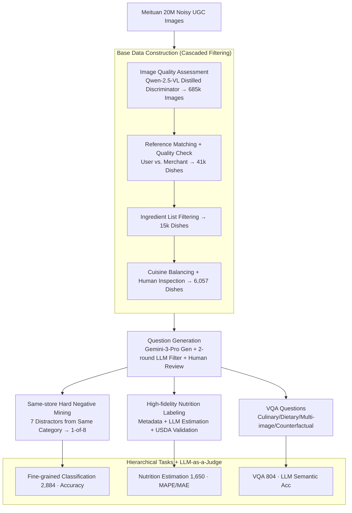

# DiningBench: A Hierarchical Multi-view Benchmark for Perception and Reasoning in the Dietary Domain

**Conference**: ACL 2026  
**arXiv**: [2604.10425](https://arxiv.org/abs/2604.10425)  
**Code**: https://huggingface.co/datasets/meituan/DiningBench (Available)  
**Area**: Multimodal VLM / Evaluation Benchmark / Food Visual Understanding  
**Keywords**: Food benchmark, Multi-view, Fine-grained classification, Nutrition estimation, VQA

## TL;DR
The authors constructed DiningBench, the first hierarchical multi-view food benchmark (3,021 dishes / 15,928 images / average 5.27 views per dish), covering three tiers of cognitive tasks: "fine-grained classification (hard negatives from the same restaurant) → nutrition estimation (4D regression) → VQA (reasoning)". Evaluation of 29 SOTA VLM systems reveals that existing models are significantly deficient in fine-grained visual discrimination and nutritional quantification, and that CoT actually impairs pure visual perception.

## Background & Motivation

**Background**: As VLMs such as GPT-4o / Gemini-3 / Qwen-VL make rapid progress in general visual understanding, high expectations have been placed on food-domain AI (automated dietary logging, intelligent kitchen assistants). However, evaluation benchmarks remain stuck on early datasets like Food-101 / UEC-Food / Recipe1M+ / Nutrition5K.

**Limitations of Prior Work**: The authors summarize four major defects: (1) **Overly simple tasks**—most benchmarks only perform coarse-grained classification without considering nutritional quantification or culinary reasoning; (2) **Single-view constraints**—real-world users often photograph dishes from multiple angles, but datasets consist of single images; (3) **Lack of fine-grained discrimination**—distractors are randomly selected, allowing models to guess correctly based on semantic priors; (4) **Inaccurate nutritional labeling**—Recipe1M+ has poor image quality, while Nutrition5K/FastFood are limited to standardized canteen or fast-food chain scenarios.

**Key Challenge**: Real-world dishes contain "hard negatives" that are visually extremely similar within the same restaurant and category (e.g., Smoked Salmon Salad vs. Fresh Salmon Avocado Salad). Furthermore, it is necessary to infer nutrition by estimating volume, portion size, and ingredients from images. Both tasks require fine-grained visual understanding beyond a "bag-of-features," a capability whose absence is not exposed by existing benchmarks.

**Goal**: Construct a hierarchical food benchmark that simultaneously assesses (i) fine-grained discrimination, (ii) numerical quantification, and (iii) high-order reasoning, with multiple views provided for each dish.

**Key Insight**: Leveraging massive real UGC (User Generated Content) data and merchant metadata from Meituan (China's largest local life service platform), the authors used SOTA VLMs (Qwen-2.5-VL, Gemini-3-Pro-Preview) for AI-assisted data curation followed by strict human review. This process compressed 20M noisy images into 3,021 high-quality dishes.

**Core Idea**: A four-in-one integration of "same-restaurant/same-category hard negatives + multi-view + high-fidelity nutritional labels + hierarchical tasks" to expose the weaknesses of current VLMs.

## Method

DiningBench is a benchmark dataset; the "Method" refers to the data construction pipeline, task definitions, and evaluation protocols.

### Overall Architecture
The pipeline addresses how to extract high-quality evaluation items that expose VLM shortfalls from massive noisy UGC. It consists of two stages: First, Base Data Construction, which processes 20M Meituan UGC images through image quality assessment (Qwen-2.5-VL-7B discriminator distilled from GPT-4) → 685k images, reference image matching (verifying consistency between user photos and merchant reference photos) → 90k dishes, merchant reference quality verification → 41k dishes, and detailed ingredient list filtering → 15k dishes. Finally, deduplication by cuisine and human inspection converged the set to 6,057 dishes. Second, Question Generation, where Gemini-3-Pro-Preview generated hard negatives, nutrition reasoning, and VQA questions. Each step included two rounds of LLM filtering (one to remove "too difficult to judge" and one to remove "too easy to distinguish") and concluded with human review. The final dataset consists of three subsets with increasing cognitive complexity: Fine-grained Classification (2,884), Nutrition Estimation (1,650), and VQA (804).

### Key Designs

**1. Same-restaurant Hard Negative Mining: Refreshing the fine-grained problem.** In traditional benchmarks, distractors are randomly sampled across categories. Models can eliminate most options using category-level priors (e.g., "this is a salad, not noodles"), and SOTA models have already saturated these tasks. DiningBench utilizes Meituan's menu structure to select 7 visually and semantically similar dishes from the **same menu category of the same merchant** as distractors (e.g., if the target is Smoked Salmon Salad, distractors include Salmon Avocado Salad, Tuna Tartare Salad, etc.) for an 8-choice multiple-choice task.

These distractors share ingredients, colors, and presentation, forcing the model to abandon "bag-of-features" and look for true fine-grained cues like cutting style, texture, and ingredient ratios. Two rounds of screening with Gemini-3-Pro-Preview and Gemini-2.5-Pro were used during construction—the first to remove samples too blurry to uniquely identify the ground truth (GT), and the second to remove samples where distractors were too easy to distinguish. Final human review was performed sample-by-sample. Consequently, GPT-4o's accuracy was suppressed to only 65.26%, proving that the bottleneck of fine-grained discriminability was effectively exposed.

**2. High-fidelity Nutritional Labeling: Triple validation with merchant metadata, LLM estimation, and USDA cross-referencing.** Nutrition5K only covers Google canteens, and FastFood only covers fast-food chains, both failing to generalize to diverse real-world dishes. Thus, the nutritional dimension was reconstructed. Each dish is assigned a 4D nutritional vector $\mathbf{v} = (\text{Cal}, \text{Carb}, \text{Prot}, \text{Fat}) \in \mathbb{R}^4$ as regression GT, using a dual-path labeling approach: dishes with explicit merchant nutrition information were copied directly (Direct Extraction); dishes lacking labels but having detailed ingredient lists and portions used Gemini-3-Pro-Preview to generate estimates from "image + ingredients + portion" (LLM-Assisted Estimation).

Crucially, **all** estimates were cross-referenced with the USDA FoodData Central database and systematically verified by humans. The prompts explicitly used the Atwater system ($E \approx 4P + 4C + 9F$) for consistency checks and warned the models that "merchants often under-report calories/fats and over-report protein; discard descriptions and estimate independently if fraud is detected." Through this triple validation, 1,650 dishes were covered, with calories ranging from light meals to calorie-dense (mean 670.5 kcal), a much wider span than existing datasets.

**3. Hierarchical Tasks + LLM-as-a-Judge: Decomposing cognitive complexity into three diagnosable layers.** The three subsets increase in complexity from "identification → quantification → reasoning," each with corresponding metrics, allowing researchers to locate different bottlenecks. Fine-Grained Classification uses Accuracy; Nutrition Estimation uses MAE / RMSE / MAPE, where $\mathrm{MAPE}_k = \frac{1}{N}\sum_i |v_{i,k} - \hat{v}_{i,k}| / v_{i,k}$ is calculated for each of the 4 nutritional components and averaged, providing a more intuitive reflection of relative error than pure MAE.

For VQA, because answers are in natural language, exact-string-match would penalize semantically correct expressions. Thus, LLM-as-a-Judge is used—an evaluator LLM performs a binary semantic consistency judgment between the prediction and gold answer to output Accuracy. This subset covers Cuisine Technique (532), Dietary Suggestion (219), Multi-Image Analysis (35), and Counterfactual Reasoning (18). The value of hierarchy lies in identifying phenomena like "correct reasoning, incorrect quantification" that a single Accuracy score hides—for example, Gemini-3-Pro-Preview achieves 90.42% on VQA, yet its nutrition estimation MAPE remains as high as 24.45%.

### Loss & Training
No models were trained; only evaluation was performed. All commercial models used official APIs (temperature=0, max_tokens=16,384), and open-source models were deployed via vLLM (<8B on single A100, 30–38B on two, 72B on four). Knowledge distillation was used during Base Data construction: a Qwen-2.5-VL-7B image quality evaluator and reference matcher were trained on a small batch of GPT-4 labeled data and used for large-scale filtering.

## Key Experimental Results

### Main Results: Comparison of 29 VLMs across 3 Tasks (Abridged)

| Model | Class. ACC↑ | Nutrition Avg MAPE↓ | VQA ACC↑ |
|------|-------------|---------------------|----------|
| **Gemini-3-Flash-Preview** | **81.83** | 25.21 | 88.56 |
| **Gemini-3-Pro-Preview** | 81.55 | **24.45** | **90.42** |
| Gemini-2.5-Pro | 73.51 | 38.21 | 89.93 |
| GPT-5 | 70.18 | 32.17 | 86.94 |
| Claude-Sonnet-4.5 | 54.40 | 42.62 | 83.58 |
| GPT-4o | 65.26 | 42.43 | 80.60 |
| Qwen-2.5-VL-72B | 65.29 | 40.56 | 76.62 |
| Qwen-3-VL-30B-A3B-Instruct | 65.43 | 37.35 | 80.60 |
| Qwen-3-VL-8B-Instruct | 64.15 | 39.24 | 72.76 |
| InternVL-3.5-38B | 54.20 | 46.13 | 72.51 |
| Gemma-3-12B-it | 48.61 | 43.15 | 61.82 |

Observations: (i) Even the strongest Gemini-3-Pro-Preview only reaches 82% in classification, leaving 18% unsolved; (ii) In Nutrition, even Gemini-3 has a 24.45% MAPE, while the strongest open-source model Qwen-3-VL-30B remains at 37.35%, making it the hardest task to conquer; (iii) In VQA, Gemini-3 approaches 90%, making it relatively the easiest; (iv) The gap between open-source and closed-source is largest in Nutrition (10+ points MAPE), indicating that nutrition estimation relies heavily on training data scale.

### Ablation Study: Number of Views + CoT Impact

| Configuration | Classification ACC | Nutrition MAPE | Description |
|------|--------------------|-----------------|------|
| 1 view | baseline | baseline | Single image |
| 2 views | Significant Gain | Significant Decrease | 1→2 is the largest "performance jump" |
| 3 views | Slight Gain | Marginal Benefit | Large models continue to benefit |
| 4 views | Near Saturation | MAPE Worsens for some Small Models | Information overload / noise |
| Large + CoT (Nutrition) | – | **Severe Degradation** | Small models experience "performance collapse" |
| Large + CoT (VQA) | – | – | Inconsistent: some improve, some worsen |
| Large + CoT (Class.) | Mostly Decreased | – | Explicit reasoning interferes with direct visual judgment |

### Key Findings
- **The "Capability Jump" occurs at 1→2 views**: Transitioning from single to dual views brings the largest performance leap (complementary angles resolve occlusion and ambiguity). After 3 views, marginal returns diminish rapidly, and 4 views even worsen the MAPE for 7B-level small models, suggesting they lack effective multi-view fusion mechanisms.
- **CoT is not a silver bullet**: On pure perception tasks (Nutrition Estimation), MAPE skyrocketed for most models after CoT, with small open-source models suffering "performance collapse." Results on VQA were mixed. The authors hypothesize that explicit verbalization "decouples" the final prediction from direct visual evidence, leading to hallucination or over-rationalization of incorrect features.
- **Five Failure Modes**: (1) Insufficient fine-grained discriminability (reliance on "bag-of-features"), (2) Parametric knowledge bias (defaulting to statistical common dish names rather than specific variants, e.g., mistaking Scallion Oil Chicken for Roasted Chicken), (3) Lack of spatial volume reasoning (weak 2D→3D inference, treating appetizers and main courses as nutritionally equivalent), (4) Ineffective multi-view aggregation, and (5) Inference models falling into "infinite thinking loops" (small thinking models repeating generation when faced with visual uncertainty).
- **Chinese-to-English translation generally reduced Classification accuracy** (Qwen-3-VL-8B-Instruct dropped from 64.15% to 58.56%), but Nutrition Estimation improved for Gemini-2.5/GPT-4o series, suggesting English prompts trigger stronger numerical reasoning pathways.
- **100% Quality Audit Pass Rate**: Three PhDs (Humanities/Social Science/STEM) independently audited 210 stratified random samples; all passed, verifying data quality.

## Highlights & Insights
- **"Same-restaurant/same-category hard negatives" is a clever way to refresh the fine-grained problem**: Traditional ImageNet-style random distractors are saturated. Using Meituan's menu structure to provide natural "visually similar + semantically distinct" control groups is a low-cost but highly effective data augmentation strategy applicable to any vertical domain (e.g., different lesions in the same patient for medical imaging, different sizes of the same SKU in e-commerce).
- **AI-assisted construction + 2-round LLM filtering + Human review** forms a reproducible "100% pass rate" pipeline template: Combining Gemini-3-Pro generation, Gemini-2.5-Pro review, Qwen-2.5-VL quality assessment, and independent PhD audits represents best practices for VLM benchmark construction.
- **"Hierarchical Tasks + LLM-as-a-Judge"** makes model bottlenecks transparent—allowing for individual diagnosis of "seeing vs. quantifying vs. reasoning," which is far more informative than a single Accuracy score.
- **The Five Failure Modes** (especially "parametric knowledge bias" and "lack of 2D→3D volume reasoning") provide direct insights for future VLM training objectives—requiring stronger visual grounding loss for the former and 3D-aware pretraining or explicit depth supervision for the latter.

## Limitations & Future Work
- **Chinese Cuisine Bias**: 2,086/3,021 (69%) are Chinese dishes, which the authors admit impairs generalization to global cuisines.
- **Potential Bias in LLM-assisted Labeling**: Despite human review, nutrition estimates and distractor choices generated by Gemini-3 may inherit implicit LLM biases (e.g., uneven familiarity with common cuisines).
- **Small VQA Subset**: 804 samples have weak statistical significance for LLM-as-a-Judge evaluation, and Multi-Image (35) and Counterfactual (18) categories are too small for definitive conclusions.
- **Lack of Comparison with Traditional Specialized Models**: There is no comparison against models tuned specifically on Nutrition5K or ConvNet baselines for fine-grained classification, making the VLM-vs-specialized-model trade-off unclear.
- **Future Directions**: (i) Expanding non-Chinese data; (ii) Integrating 3D volume reconstruction tasks (the multi-view data is inherently suitable for NVS / 3D Reconstruction); (iii) Exploring joint training of "visual grounding loss + CoT" to resolve CoT-induced perception damage; (iv) Adding head-to-head comparisons with single-task SOTA models.

## Related Work & Insights
- **vs. Food-101 / UEC-Food / Food2K**: Traditional food recognition only does classification; DiningBench adds nutritional quantification and reasoning layers with multi-view data per dish.
- **vs. Nutrition5K / FastFood**: Nutrition5K is limited to Google canteens, and FastFood to chains; DiningBench uses real, diverse restaurant UGC for stronger generalization and introduces a more intuitive MAPE metric.
- **vs. FoodieQA / IndiFoodVQA**: These focus on cultural reasoning; DiningBench separates recognition and reasoning through hierarchical tasks, making it better for diagnostic evaluation.
- **vs. MMBench / MME / SEED-Bench**: General VLMs struggle with vertical fine-grained problems; DiningBench serves as a "domain-specific + hierarchical" paradigm for other vertical domains (medicine/industry/law).
- **vs. Recipe1M+**: Recipe1M+ focuses on image-to-recipe retrieval, whereas DiningBench evaluates multi-level visual understanding, serving a complementary role.

## Rating
- Novelty: ⭐⭐⭐⭐ Hierarchical tasks + same-restaurant hard negatives is a relatively new combination, though individual innovations have precedents.
- Experimental Thoroughness: ⭐⭐⭐⭐⭐ 29 models × 3 tasks + multi-view ablation + CoT ablation + English version comparison + 5 failure mode analyses; an immense amount of engineering.
- Writing Quality: ⭐⭐⭐⭐ Clear structure; pipeline diagrams and tables are highly informative; prompt designs are fully disclosed in the appendix.
- Value: ⭐⭐⭐⭐⭐ HuggingFace datasets are public; directly promotes dietary VLM research; the 5 failure modes provide insights for general VLM design.

<!-- RELATED:START -->

## Related Papers

- [\[ACL 2026\] ReCoQA: A Benchmark for Tool-Augmented and Multi-Step Reasoning in Real Estate Question and Answering](recoqa_a_benchmark_for_tool-augmented_and_multi-step_reasoning_in_real_estate_qu.md)
- [\[ICML 2026\] Multi$^2$: Hierarchical Multi-Agent Decision-Making with LLM-Based Agents in Interactive Environments](../../ICML2026/llm_evaluation/multi2_hierarchical_multi-agent_decision-making_with_llm-based_agents_in_interac.md)
- [\[ACL 2026\] K-MetBench: A Multi-Dimensional Benchmark for Fine-Grained Evaluation of Expert Reasoning, Locality, and Multimodality in Meteorology](k-metbench_a_multi-dimensional_benchmark_for_fine-grained_evaluation_of_expert_r.md)
- [\[ACL 2025\] KITAB-Bench: A Comprehensive Multi-Domain Benchmark for Arabic OCR and Document Understanding](../../ACL2025/llm_evaluation/kitab-bench_a_comprehensive_multi-domain_benchmark_for_arabic_ocr_and_document_u.md)
- [\[NeurIPS 2025\] BLINK-Twice: You See But Do You Observe? A Reasoning Benchmark on Visual Perception](../../NeurIPS2025/llm_evaluation/blink-twice_you_see_but_do_you_observe_a_reasoning_benchmark_on_visual_perceptio.md)

<!-- RELATED:END -->
