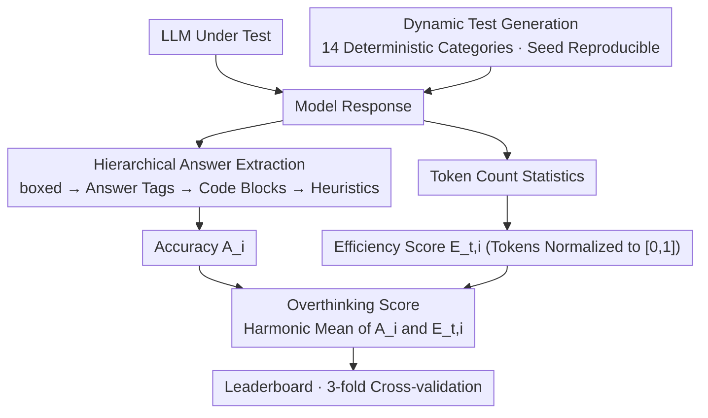

# Do LLMs Overthink Basic Math Reasoning? Benchmarking the Accuracy-Efficiency Tradeoff

**Conference**: ACL 2026 Findings  
**arXiv**: [2507.04023](https://arxiv.org/abs/2507.04023)  
**Code**: [GitHub](https://github.com/ctrl-gaurav/LLMThinkBench)  
**Area**: LLM Evaluation  
**Keywords**: Overthinking, Basic Mathematical Reasoning, Accuracy-Efficiency Tradeoff, Reasoning Tokens, Benchmarking

## TL;DR

Ours proposes LLMThinkBench, a systematic benchmark for evaluating the efficiency of LLMs in basic mathematical reasoning. It introduces the Overthinking Score (a harmonic mean of accuracy and token efficiency) and evaluates 53 LLMs using 14 dynamically generated deterministic math tasks. The study finds that reasoning models generate an average of approximately 18× more tokens, sometimes resulting in lower accuracy, and that scaling the reasoning budget yields diminishing returns.

## Background & Motivation

**Background**: LLMs perform exceptionally well on complex mathematical benchmarks (GSM8K, MATH), with reasoning models further enhancing performance through reasoning-time scaling (chain-of-thought). However, their performance and efficiency in basic mathematical operations have not been systematically evaluated.

**Limitations of Prior Work**: (1) Models scoring 90%+ on complex benchmarks may fall below 40% in basic addition, as performance on complex benchmarks does not transfer to basic operations; (2) Reasoning models generate excessively long reasoning chains for simple problems (e.g., generating hundreds of tokens to explain carry principles for 234+567), which wastes computational resources and sometimes decreases accuracy; (3) Existing evaluations only focus on accuracy, ignoring computational waste; (4) Static benchmarks are prone to data contamination; (5) There is a lack of metrics that jointly measure accuracy and efficiency.

**Key Challenge**: Reasoning models are trained to "think more" to improve performance, but for basic tasks, more thinking is detrimental—models confuse explanation with understanding, producing long texts that superficially resemble reasoning but Lack actual problem-solving capability.

**Goal**: (1) Formalize the accuracy-redundancy tradeoff; (2) Propose the Overthinking Score metric; (3) Establish a dynamically generated evaluation protocol; (4) Conduct a large-scale empirical study on the reasoning efficiency of 53 LLMs.

**Key Insight**: Focus on 14 deterministic basic mathematical tasks (sorting, summation, multiplication, finding maximums, etc.) with unique correct answers and known computational complexities, allowing for precise measurement of the relationship between accuracy and redundancy.

**Core Idea**: More reasoning tokens $\neq$ better mathematical reasoning. For basic tasks, redundant generation in reasoning models not only wastes computation but may also decrease accuracy due to error accumulation and self-contradiction.

## Method

### Overall Architecture

LLMThinkBench quantifies and reproduces the phenomenon of "overthinking in basic mathematics" as an evaluation loop. Given a model to be tested, the framework dynamically generates 14 categories of deterministic basic math problems (sorting, summation, multiplication, finding maximums, etc., each with a unique correct answer and known computational complexity). After the model responds, a hierarchical extractor derives the final answer to calculate accuracy, while reasoning token counts are recorded to measure efficiency. Finally, accuracy and efficiency are fused into a single Overthinking Score. The entire logic is encapsulated as an open-source tool installable via pip (`llmthinkbench`), supporting multiple inference backends, 3-fold cross-validation, and a leaderboard, covering 53 models (including base, instruction-tuned, reasoning, and quantized variants).

### Key Designs

Three designs correspond to the top-down steps of the evaluation loop: **Dynamic Test Generation** for reliable measurement, **Hierarchical Extraction** for robust answer retrieval, and **Overthinking Score** for fusing accuracy and efficiency.

**1. Dynamic Test Generation: Preventing Data Contamination**

The primary risk of static benchmarks is that problems may have leaked into the training set, meaning high scores do not necessarily reflect true capability. LLMThinkBench generates problems on-the-fly using reproducible seeds: list lengths are sampled from $\{8,16,32,64\}$, and values from $\text{Uniform}[-1000, 1000]$. Open-source models use 1,000 samples per fold with 3-fold cross-validation, while closed-source models use 100 samples due to cost constraints. Each model faces approximately 42,000 unique new problems. Since every evaluation uses newly generated instances, models cannot rely on memorization, making accuracy and efficiency measurements comparable.

**2. Hierarchical Answer Extraction: Stable Retrieval from Messy Outputs**

Output formats vary significantly across models, and unreliable extraction prevents fair scoring. Ours uses a four-level fallback strategy: prioritized extraction from `\boxed{}`, followed by parsing explicit answer markers ("The answer is..."), then extraction from code blocks or Markdown structures, and finally mission-specific heuristics. This design achieved a 98.7% success rate validated on 5,000+ real responses, ensuring accuracy statistics are not distorted by formatting noise.

**3. Overthinking Score: Integrating Correctness and Parsimony**

Focusing solely on accuracy masks redundancy—a model might be correct but use ten times the necessary tokens. Ours first normalizes the token count into an efficiency score $E_{t,i} = 1 - \frac{\bar{T}_i - T_{min}}{T_{max} - T_{min}}$, mapped to $[0,1]$, and then uses the harmonic mean $\mathcal{O}_i = \frac{2 \cdot A_i \cdot E_{t,i}}{A_i + E_{t,i}}$ to combine accuracy $A_i$ and efficiency $E_{t,i}$. The harmonic mean is chosen over the arithmetic mean because it is sensitive to imbalance: 90% accuracy + 10% efficiency yields only 0.18, while 60% + 60% yields 0.60. An arithmetic mean would yield 0.55 for the former, failing to distinguish between "efficiently correct" and "redundantly correct." This ensures the metric naturally favors models that are both accurate and concise.

## Key Experimental Results

### Main Results

**Comparison of Overthinking Scores for Representative Models**

| Model | Parameters | Accuracy | Overthinking Score | Avg. Output Tokens |
|------|------|--------|-------------------|---------------|
| Phi-4 | 14B | 78.92% | **0.863** | 378.6 |
| Phi-4-reasoning-plus | 14B | 69.54% | 0.234 | 6,780.7 |
| Qwen3-14B | 14B | 86.52% | 0.727 | 3,607.6 |
| Qwen3-0.6B | 0.6B | 49.99% | 0.545 | 3,162.8 |

### Ablation Study

**Reasoning Budget Constraint Experiment (Qwen3 Reasoning Model)**

| Configuration | Accuracy |
|------|--------|
| Full Budget | 72% |
| 1024 Token Limit | 44% (-28%) |
| Effort low→medium→high (GPT-5/o series) | Accuracy Gain $\approx$ 0 |

**Quantization Experiment (Qwen2.5 Family)**

| Configuration | Accuracy Change |
|------|-----------|
| FP16 → 8-bit | Almost no change for large models |
| FP16 → 4-bit | Slight decrease for large models, significant decrease for small models |

### Key Findings

- **Basic Math Paradox**: Models scoring 95%+ on GSM8K fall below 75% on these tasks, proving that performance on complex benchmarks does not represent basic mathematical ability.
- Reasoning models generate an average of 6,780 tokens vs. 378 tokens for standard models (18×), but with lower accuracy (Phi-4-reasoning-plus 69.54% vs. Phi-4 78.92%).
- The Overthinking Score reveals efficiency traps hidden by accuracy metrics: Phi-4 scores 0.863, far exceeding Phi-4-reasoning-plus at 0.234.
- Reasoning models suffer "catastrophic collapse" under token constraints—dropping from 72% to 44%—indicating that reasoning ability is deeply tied to long-chain reasoning.
- Scaling the reasoning budget yields diminishing returns—GPT-5/o series shows near-zero accuracy gain moving from low to high reasoning effort.
- Quantization preserves basic reasoning capabilities, suggesting that overthinking stems from training rather than hardware limitations.

## Highlights & Insights

- The Overthinking Score is an elegant and informative metric; the strict penalty of the harmonic mean distinguishes "efficiently correct" from "redundantly correct."
- The "Basic Math Paradox" is a significant finding that challenges the assumption "high complex benchmark score = strong mathematical ability."
- Dynamic test generation and open-source tools (PyPI package + Leaderboard) make the results reproducible and easily extensible.

## Limitations & Future Work

- Only 14 deterministic math tasks are covered, excluding complex math reasoning or non-mathematical domains.
- Token efficiency normalization depends on global max/min values in the evaluation set, which may be affected by outliers.
- Specific patterns of overthinking (e.g., proportions of error accumulation vs. self-contradiction) were not analyzed.
- How to train reasoning models that are both accurate and efficient remains unexplored.

## Related Work & Insights

- **vs. ThoughtTerminator/Self-Braking**: These works propose strategies to mitigate overthinking, whereas ours provides a metric to quantify it—measurement is a prerequisite for intervention.
- **vs. GSM8K/MATH Benchmarks**: These benchmarks focus on accuracy, while ours supplements the efficiency dimension.
- **vs. Graph of Thoughts/LogicPuzzleRL**: These methods enhance complex reasoning but do not address overthinking in basic operations.

## Rating

- **Novelty**: ⭐⭐⭐⭐ Overthinking Score is a novel and useful metric; the Basic Math Paradox is a significant discovery.
- **Experimental Thoroughness**: ⭐⭐⭐⭐⭐ 53 models, quantization analysis, budget constraints, and dynamic generation make it large-scale and comprehensive.
- **Writing Quality**: ⭐⭐⭐⭐ Formal definitions are rigorous, and experimental descriptions are clear.
- **Value**: ⭐⭐⭐⭐⭐ Provides standardized tools and profound insights for the efficiency evaluation of reasoning models.

<!-- RELATED:START -->

## Related Papers

- [\[ACL 2026\] BizCompass: Benchmarking the Reasoning Capabilities of LLMs in Business Knowledge and Applications](bizcompass_benchmarking_the_reasoning_capabilities_of_llms_in_business_knowledge.md)
- [\[ACL 2026\] Challenging the Boundaries of Reasoning: An Olympiad-Level Math Benchmark for Large Language Models](challenging_the_boundaries_of_reasoning_an_olympiad-level_math_benchmark_for_lar.md)
- [\[AAAI 2026\] Do LLMs Really Struggle at NL-FOL Translation? Revealing Their Strengths via a Novel Benchmarking Strategy](../../AAAI2026/llm_evaluation/do_llms_really_struggle_at_nl-fol_translation_revealing_their_strengths_via_a_no.md)
- [\[ACL 2026\] Personalized Benchmarking: Evaluating LLMs by Individual Preferences](personalized_benchmarking_evaluating_llms_by_individual_preferences.md)
- [\[ACL 2026\] ResearchBench: Benchmarking LLMs in Scientific Discovery via Inspiration-Based Task Decomposition](researchbench_benchmarking_llms_in_scientific_discovery_via_inspiration-based_ta.md)

<!-- RELATED:END -->
