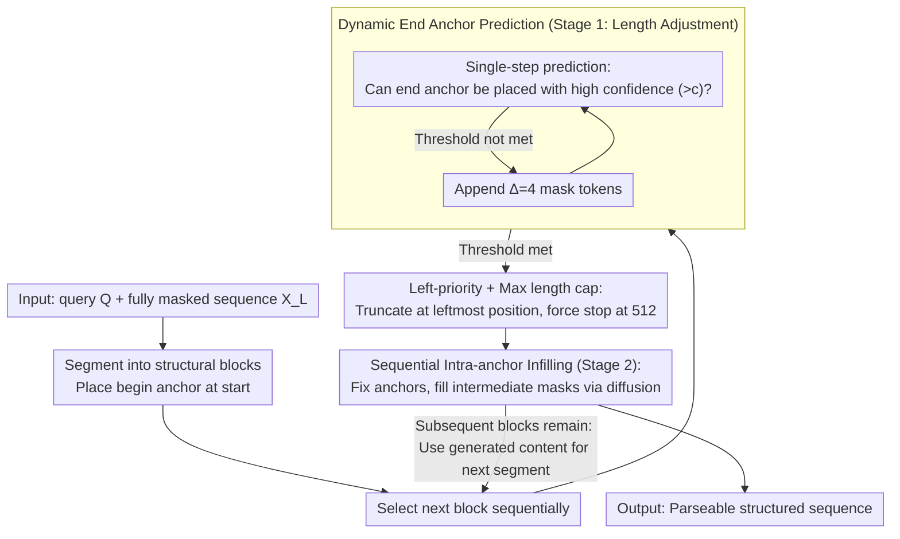

# Dynamic Infilling Anchors for Format-Constrained Generation in Diffusion Large Language Models

**Conference**: ACL 2026  
**arXiv**: [2606.04535](https://arxiv.org/abs/2606.04535)  
**Code**: https://github.com/Westlake-AGI-Lab/DIA  
**Area**: Diffusion Language Models / Format-Constrained Generation  
**Keywords**: diffusion LLM, format constraints, dynamic anchors, structured generation, JSON generation

## TL;DR
DIA is a training-free method for format-constrained generation in diffusion large language models. By predicting the position of end anchors before iteratively infilling between them, it significantly improves the format accuracy of reasoning templates and JSON outputs while mitigating truncation or redundancy caused by fixed anchors.

## Background & Motivation
**Background**: Unlike autoregressive LLMs, diffusion large language models (dLLMs) utilize bidirectional attention and parallel denoising for generation, inherently allowing the pre-filling of specific fixed tokens within an initial fully-masked sequence. Consequently, they appear well-suited for structured outputs, such as `<think>...</think><answer>...</answer>` or parseable JSON.

**Limitations of Prior Work**: Placing begin/end anchors at fixed positions constrains the format but partitions the generation space into fixed lengths. If the reasoning span is too short, the model suffers from premature truncation; if the span is too long, the model generates repetitive or redundant content. Prompt constraints, post-processing, and constrained decoding also present issues: prompts are unstable, post-processing may destroy semantics, and strict decoding impacts efficiency and flexibility.

**Key Challenge**: Format constraints require stable structural boundaries, whereas high-quality generation requires variable lengths. Fixed templates bind these two aspects together, making it difficult to achieve both structural correctness and semantic quality.

**Goal**: The authors aim to leverage the dLLM's perception of global masked sequences and end positions to dynamically estimate anchor positions without fine-tuning, allowing the model to plan the length of each structural segment before generating the content within.

**Key Insight**: The paper observes that dLLMs can estimate the eos or end positions through one or two prediction steps. Therefore, end anchors do not need to be hardcoded; they can be located dynamically via single-step prediction and confidence thresholds.

**Core Idea**: Format-constrained generation is decoupled into two phases: "length adjustment" and "intra-anchor infilling." The method iteratively expands mask blocks until the model predicts an end anchor with high confidence, after which the anchor is fixed and content is generated via diffusion within the boundaries.

## Method

### Overall Architecture
DIA is designed for pre-trained diffusion LLMs (Dream-7B used in experiments) and introduces no new parameters. Its goal is to make "planning structural boundaries before filling content" the default decoding behavior. Given a user query $Q$ and a fully masked target sequence $X_L$, DIA segments it into several blocks $\mathcal{C}=\{C_1,\dots,C_{|\mathcal{B}|}\}$, where each block corresponds to a structural segment (e.g., reasoning segment, answer segment) with a begin anchor at the start. Each block then proceeds through two stages: Stage 1 involves length adjustment, where masks are repeatedly expanded until the model predicts an end anchor with high confidence, dynamically determining the segment length; Stage 2 fixes the anchor and performs iterative diffusion-based infilling for the internal mask tokens. The entire process is training-free.

### Key Designs

**1. Dynamic End Anchor Prediction: Letting each segment determine its length**

Fixed spans are the root cause of format constraint failures—short spans force truncation, while long spans lead to repetition. DIA no longer hardcodes boundaries. Instead, after placing the begin anchor, it performs a single-step prediction to check if the model can place an end anchor or partial end anchor at some position within the block with a confidence exceeding threshold $c$. If so, the current length is deemed sufficient; otherwise, mask tokens are appended in steps of $\Delta=4$ for re-testing ($c=0.065$ for GSM8K, $c=0.05$ for MATH).

This is effective because dLLMs learn the prior of "where the answer ends" during pre-training. DIA leverages this prior to plan boundaries in advance rather than discovering length mismatches after content generation.

**2. Left-Priority + Max Length Cap: Preventing label instability and infinite expansion**

Structured generation often suffers from models repeatedly opening/closing labels or failing to find a termination point. DIA uses two fallback rules: when multiple positions satisfy the confidence threshold, the leftmost position is selected as the end anchor and subsequent redundant masks are truncated; if no valid anchor is found, generation is forcibly stopped at a maximum block length $M=512$.

Left-priority provides a conservative boundary to prevent spurious label generation, while the maximum length serves as a safety net for complex samples to avoid uncontrollable latency.

**3. Sequential Intra-anchor Infilling: Aligning answer length with reasoning**

For tasks like think-answer, the length and content of the answer depend on the preceding reasoning. If blocks are planned independently, the answer may become decoupled from the reasoning. DIA adopts sequential processing: it first determines and generates the thinking block, then uses the generated reasoning content to decide the length and content of the answering block. Anchors remain fixed during infilling, with only the intermediate mask tokens being iteratively updated.

### A Complete Example
Using the `<think>...</think><answer>...</answer>` task: DIA places `<think>` at the start of the think segment and performs a prediction step after every 4 mask tokens to check if `</think>` can be predicted with high confidence. Once predicted, the boundary is fixed, and the reasoning is generated within via diffusion. This reasoning is then fed back to determine the `</answer>` position and fill the final answer using the same method. The output is naturally a parseable structure with segment lengths dynamically determined by content. On Dream-7B, diffusion steps for GSM8K/MATH are 512, with max new tokens at 256 and 512, respectively.

## Key Experimental Results

### Main Results

| Dataset | Metric | DIA | Prev. SOTA | Gain / Description |
|--------|------|------|----------|------|
| GSM8K 0-shot | Format Score | 72.63 | Infilling: 58.83, Base/Instruct: 0.00 | Significant improvement in format accuracy |
| GSM8K 0-shot | Accuracy | 46.78 | Infilling: 14.86, Instruct: 15.01, Base: 68.99 | Substantial gain over fixed infilling, though lower than unformatted Base |
| MATH-500 0-shot | Format Score | 76.82 | Infilling: 29.10, Base/Instruct: 0.00 | Highest format benefit in complex math scenarios |
| MATH-500 0-shot | Accuracy | 20.08 | Infilling: 21.52, Base: 25.14, Instruct: 25.28 | Maintains comparable but not highest accuracy |
| WikiBio JSON | Valid JSON / Hallucination | 79.84 / 0.15 | Instruct raw: 52.80 / 4.81, Infilling: 0.01 / 0.00 | Consistent results across raw matching and regex extraction |

### Ablation Study

| Configuration | Key Metric | Description |
|------|---------|------|
| DIA w/o Stage 1, GSM8K | Acc. 10.31, Format 0.00, Latency 14.99 | Format collapses without confidence prediction |
| DIA Full, GSM8K | Acc. 47.54, Format 59.67, Latency 25.86 | Full method is significantly better under appendix hyperparams |
| DIA w/o Stage 1, MATH | Acc. 6.73, Format 0.84, Latency 15.33 | Complex tasks rely more heavily on length planning |
| DIA Full, MATH | Acc. 20.20, Format 75.62, Latency 29.37 | Full two-stage method preserves structural boundaries |
| GSM8K latency | DIA 26.52 vs Base 10.72 | Dynamic planning introduces extra latency |
| MATH latency | DIA 30.62 vs Base 31.71 | Prepaid length planning reduces redundant computation in complex tasks |

### Key Findings
- Fixed infilling can partially preserve anchors but fails to ensure overall format correctness and degrades answer quality. GSM8K accuracy for fixed infilling is only 14.86, compared to DIA's 46.78.
- DIA is most stable in JSON generation. In WikiBio, both raw matching and regex extraction achieve 79.84% valid JSON with a hallucination score of only 0.15%.
- Anchor retention analysis shows DIA consistently preserves all four anchor types (`<think>`, `</think>`, `<answer>`, `</answer>`) on GSM8K and MATH, whereas Base and Instruct models show severe degradation in end anchor retention.
- Hyperparameter analysis indicates $\Delta$ serves as a balance between format strictness and reasoning depth. Smaller $\Delta$ may truncate too early (high format score but low accuracy), while larger $\Delta$ provides more space for reasoning but may lower format scores or increase latency.

## Highlights & Insights
- DIA shifts format control from "post-hoc JSON/label correction" to "pre-generation boundary planning," which aligns with the bidirectional and parallel generation characteristics of diffusion LLMs.
- The method is training-free and suitable for rapid deployment on existing dLLMs, making it more lightweight than fine-tuning models for every output schema.
- The paper clearly demonstrates that the fundamental issue with fixed anchors is not the absence of structural tokens, but the mismatch in content space caused by rigid token positioning.
- For structured reasoning, a key insight is that models need to know not only the output format but also the generation budget for each format segment.

## Limitations & Future Work
- DIA still relies on manually specified anchors and their semantic roles. It may lack flexibility for open-domain dialogues, multi-turn tool calling, or creative writing where structural boundaries change dynamically.
- Length adjustment introduces additional inference overhead. DIA's latency on GSM8K (26.52) is significantly higher than Base (10.72), making it unsuitable for all real-time scenarios.
- A trade-off exists between accuracy and format. While DIA significantly improves format accuracy, its accuracy on MATH is lower than unformatted Base/Instruct and fixed infilling.
- Current evaluations focus on reasoning templates and WikiBio JSON. Future work should validate more complex schemas, code, proofs, multimodal structured outputs, and nested tool calls.

## Related Work & Insights
- **vs prompt-based constraints**: Relying solely on prompts for JSON or labels often loses boundaries during long reasoning; DIA controls anchors directly in the initial mask sequence, which is closer to the decoding process.
- **vs post-processing / repair**: Post-processing can fix formats but may alter semantics or lose reasoning steps. DIA plans structure before generation, reducing reliance on post-processing.
- **vs constrained decoding**: While grammar or FSM decoding is restrictive, it lacks flexibility. DIA preserves generation freedom through dynamic length allocation.
- **Insights for dLLMs**: The advantage of dLLMs is not just parallel acceleration but also the ability to plan global structures before filling content, which could be a primary application direction distinguishing them from AR LLMs.

## Rating
- Novelty: ⭐⭐⭐⭐☆ Dynamic anchor position prediction fits the dLLM mechanism well; training-free design is practical.
- Experimental Thoroughness: ⭐⭐⭐⭐☆ Covers GSM8K, MATH, WikiBio, stage ablation, hyperparameters, and latency, though task types remain somewhat limited.
- Writing Quality: ⭐⭐⭐⭐☆ Clear motivation and intuitive algorithm. Minor discrepancies in values between main and appendix tables require careful reading of experimental conditions.
- Value: ⭐⭐⭐⭐☆ High heuristic value for structured output, format-constrained reasoning, and dLLM decoding design, especially for applications requiring parseable output.

<!-- RELATED:START -->

## Related Papers

- [\[ACL 2026\] Attribution, Citation, and Quotation: A Survey of Evidence-based Text Generation with Large Language Models](attribution_citation_and_quotation_a_survey_of_evidence-based_text_generation_wi.md)
- [\[ACL 2026\] Capabilities and Evaluation Biases of Large Language Models in Classical Chinese Poetry Generation: A Case Study on Tang Poetry](capabilities_and_evaluation_biases_of_large_language_models_in_classical_chinese.md)
- [\[ACL 2026\] Challenging the Boundaries of Reasoning: An Olympiad-Level Math Benchmark for Large Language Models](challenging_the_boundaries_of_reasoning_an_olympiad-level_math_benchmark_for_lar.md)
- [\[ACL 2026\] E2EDev: Benchmarking Large Language Models in End-to-End Software Development Task](e2edev_benchmarking_large_language_models_in_end-to-end_software_development_tas.md)
- [\[ACL 2026\] Modeling Multi-Dimensional Cognitive States in Large Language Models under Cognitive Crowding](modeling_multi-dimensional_cognitive_states_in_large_language_models_under_cogni.md)

<!-- RELATED:END -->
