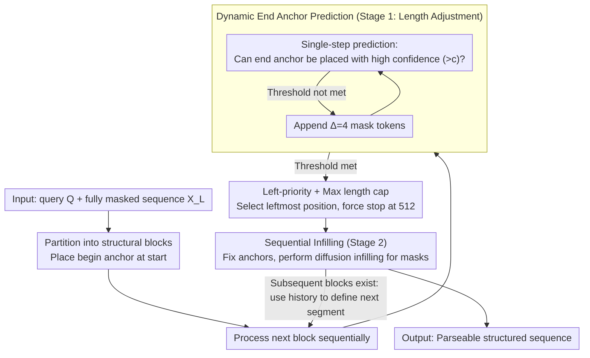

# Dynamic Infilling Anchors for Format-Constrained Generation in Diffusion Large Language Models

**Conference**: ACL 2026  
**arXiv**: [2606.04535](https://arxiv.org/abs/2606.04535)  
**Code**: https://github.com/Westlake-AGI-Lab/DIA  
**Area**: Diffusion Language Models / Format-Constrained Generation  
**Keywords**: diffusion LLM, format constraints, dynamic anchors, structured generation, JSON generation

## TL;DR
DIA is a training-free method for format-constrained generation in diffusion large language models. By predicting the end anchor position before iteratively infilling between anchors, it significantly improves the format accuracy of reasoning templates and JSON outputs while mitigating truncation or redundancy caused by fixed anchors.

## Background & Motivation
**Background**: Unlike autoregressive LLMs, diffusion large language models (dLLMs) utilize bidirectional attention and parallel denoising for generation, naturally allowing the pre-filling of certain fixed tokens within an initial fully masked sequence. Consequently, they appear well-suited for structured outputs, such as `<think>...</think><answer>...</answer>` or parseable JSON.

**Limitations of Prior Work**: Directly placing begin/end anchors at fixed positions constrains the format but partitions the generation space into fixed lengths. If the reasoning span is too short, the model truncates early; if the span is too long, the model repeats or generates redundant content. Prompt constraints, post-processing, and constrained decoding also present issues: prompts are unstable, post-processing may damage semantics, and strict decoding affects efficiency and flexibility.

**Key Challenge**: Format constraints require stable structural boundaries, while high-quality generation requires variable lengths. Fixed templates bind these two aspects together, making it difficult to achieve both structural correctness and semantic quality.

**Goal**: The authors aim to leverage the dLLM's perception of global masked sequences and end positions to dynamically estimate anchor positions without fine-tuning, allowing the model to plan the required length for each structural segment before generating its content.

**Key Insight**: Observations indicate that dLLMs can estimate the EOS or end position through one or two prediction steps. Therefore, end anchors do not need to be hardcoded but can be found dynamically using single-step prediction and a confidence threshold.

**Core Idea**: Format-constrained generation is decomposed into "length adjustment" and "infilling" stages: first, the masked block is repeatedly expanded until the model predicts the end anchor with high confidence, then the anchor is fixed and diffusion-based content generation is completed within the boundaries.

## Method

### Overall Architecture
DIA targets pre-trained diffusion LLMs (Dream-7B in experiments) without introducing new parameters. Its goal is to make "planning structural boundaries before filling content" the default decoding behavior. Given a user query $Q$ and a fully masked target sequence $X_L$, DIA partitions it into several blocks $\mathcal{C}=\{C_1,\dots,C_{|\mathcal{B}|}\}$, where each block corresponds to a structural segment (e.g., reasoning segment, answer segment) with a begin anchor at the start. Each block then undergoes two stages: Stage 1 involves length adjustment, where masks are repeatedly expanded until the model predicts the end anchor with high confidence to dynamically determine the segment length; Stage 2 fixes the anchor and performs iterative diffusion infilling solely on the internal masks. The entire process is training-free.

### Key Designs

**1. Dynamic End Anchor Prediction: Letting each segment determine its own length**
Fixed spans are the root of format constraint failures—spans that are too short force truncation, while those that are too long lead to repetition. DIA no longer hardcodes boundaries. Instead, after placing the begin anchor, it performs a single-step prediction to see if the model can place an end anchor or partial end anchor at any position within the block with a confidence exceeding threshold $c$. If so, the current length is deemed sufficient; otherwise, $\Delta=4$ mask tokens are appended (for GSM8K $c=0.065$, for MATH $c=0.05$). This works because dLLMs learn priors about where an answer ends during pre-training; DIA uses this prior to plan boundaries in advance.

**2. Left-Priority + Max Length Capping: Preventing label oscillation and infinite expansion**
Structured generation often suffers from labels opening and closing repeatedly or infinite expansion when an end position isn't found. DIA uses two fallback rules: when multiple positions meet the confidence threshold, the leftmost position is chosen as the end anchor to truncate redundant masks; if no valid anchor is found, generation is forced to stop at the maximum block length $M=512$. Left-priority ensures conservative boundaries, while the max length prevents latency from spiraling out of control.

**3. Sequential Infilling: Aligning answer length with reasoning**
For tasks like think-answer, the answer length and content depend on the preceding reasoning. If blocks are planned independently, the answer might decouple from the reasoning. DIA processes segments sequentially: it determines and generates the thinking block first, then uses the generated reasoning content to decide the length and content of the answering block. Anchors remain fixed during the filling process, with only internal mask tokens updated iteratively.

### A Complete Example
Using a `<think>...</think><answer>...</answer>` task: DIA places `<think>` at the start, performs a prediction step every 4 mask tokens added to check for `</think>` with high confidence. Once detected, it truncates and fixes the thinking boundary, then performs diffusion infilling to write the reasoning. This reasoning is fed back to determine the `</answer>` position and content using the same method. The output is naturally structured, with every segment length dynamically determined. On Dream-7B, diffusion steps are set to 512, with max new tokens at 256 for GSM8K and 512 for MATH.

## Key Experimental Results

### Main Results

| Dataset | Metric | DIA | Prev. Methods | Gain / Description |
|--------|------|------|----------|------|
| GSM8K 0-shot | Format Score | 72.63 | Infilling: 58.83, Base/Instruct: 0.00 | Significant format accuracy improvement |
| GSM8K 0-shot | Accuracy | 46.78 | Infilling: 14.86, Instruct: 15.01, Base: 68.99 | Significant gain over fixed infilling, but lower than unformatted Base |
| MATH-500 0-shot | Format Score | 76.82 | Infilling: 29.10, Base/Instruct: 0.00 | Maximum format gains in complex math scenarios |
| MATH-500 0-shot | Accuracy | 20.08 | Infilling: 21.52, Base: 25.14, Instruct: 25.28 | Comparable performance, though not peak accuracy |
| WikiBio JSON | Valid JSON / Hallucination | 79.84 / 0.15 | Instruct raw: 52.80 / 4.81, Infilling: 0.01 / 0.00 | Consistent results across raw matching and regex extraction |

### Ablation Study

| Configuration | Key Metrics | Description |
|------|---------|------|
| DIA w/o Stage 1, GSM8K | Acc. 10.31, Format 0.00, Latency 14.99 | Format collapses without confidence prediction |
| DIA Full, GSM8K | Acc. 47.54, Format 59.67, Latency 25.86 | Full method is significantly better under appendix hyperparams |
| DIA w/o Stage 1, MATH | Acc. 6.73, Format 0.84, Latency 15.33 | Complex tasks rely more heavily on length planning |
| DIA Full, MATH | Acc. 20.20, Format 75.62, Latency 29.37 | Full two-stage method preserves structural boundaries |

### Key Findings
- Fixed infilling can partially retain anchors but cannot guarantee overall format correctness and suppresses answer quality. GSM8K accuracy for fixed infilling is only 14.86, compared to 46.78 for DIA.
- DIA shows the most stable performance in JSON generation. In WikiBio, both raw matching and regex achieve 79.84% valid JSON with a hallucination score of only 0.15%.
- Anchor retention analysis shows DIA consistently retains all four types of anchors in GSM8K and MATH; retention in Base and Instruct models drops significantly.
- Hyperparameter analysis shows $\Delta$ is a knob between format strictness and reasoning depth. Smaller $\Delta$ may truncate early (high format rate, low accuracy); larger $\Delta$ provides more reasoning space but may lower format scores or increase latency.

## Highlights & Insights
- DIA moves format control from "post-hoc JSON/tag repair" to "pre-generation boundary planning," aligning well with the bidirectional and parallel generation characteristics of dLLMs.
- The method is training-free, facilitating rapid deployment on existing dLLMs; this is more lightweight than fine-tuning for every output schema.
- The paper clearly demonstrates the fundamental issue of fixed anchors: it is not the absence of structural tokens, but the rigidity of token positions that causes content space mismatch.
- Insight for structured reasoning: models need to know not only the output format but also the generation budget for each format segment.

## Limitations & Future Work
- DIA still relies on manually specified anchors and their semantic roles. For open-domain dialogue or multi-turn tool use where boundaries are dynamic, manual anchors may lack flexibility.
- Length adjustment introduces additional inference overhead. On GSM8K, DIA latency is 26.52, significantly higher than Base (10.72), making it unsuitable for real-time scenarios.
- A trade-off exists between accuracy and format. DIA significantly improves format accuracy, but on MATH, its accuracy is lower than unformatted Base/Instruct and fixed infilling.
- Evaluation is currently concentrated on reasoning templates and WikiBio JSON. Future work should validate more complex schemas, code, proofs, and nested tool calls.

## Related Work & Insights
- **vs prompt-based constraints**: Relying solely on prompts for JSON or tags often loses boundaries in long reasoning; DIA controls anchors directly in the initial mask sequence.
- **vs post-processing / repair**: Post-processing can fix formats but may alter semantics. DIA plans ahead to reduce reliance on post-processing.
- **vs constrained decoding**: Grammar or FSM decoding is rigid; DIA preserves generation freedom through dynamic length allocation.
- **Insight for dLLMs**: The advantage of dLLMs is not just parallel acceleration, but the ability to plan global structures before filling content, which may be a key application direction over AR LLMs.

## Rating
- Novelty: ⭐⭐⭐⭐☆ Dynamic anchor position prediction fits the dLLM mechanism well; training-free design is practical.
- Experimental Thoroughness: ⭐⭐⭐⭐☆ Covers GSM8K, MATH, WikiBio, and thorough ablations, though task types are still somewhat limited.
- Writing Quality: ⭐⭐⭐⭐☆ Clear motivation and intuitive algorithms.
- Value: ⭐⭐⭐⭐☆ Highly insightful for structured output and format-constrained reasoning in dLLMs.

<!-- RELATED:START -->

## Related Papers

- [\[ACL 2026\] Attribution, Citation, and Quotation: A Survey of Evidence-based Text Generation with Large Language Models](attribution_citation_and_quotation_a_survey_of_evidence-based_text_generation_wi.md)
- [\[ACL 2026\] Capabilities and Evaluation Biases of Large Language Models in Classical Chinese Poetry Generation: A Case Study on Tang Poetry](capabilities_and_evaluation_biases_of_large_language_models_in_classical_chinese.md)
- [\[ACL 2026\] Challenging the Boundaries of Reasoning: An Olympiad-Level Math Benchmark for Large Language Models](challenging_the_boundaries_of_reasoning_an_olympiad-level_math_benchmark_for_lar.md)
- [\[ACL 2026\] E2EDev: Benchmarking Large Language Models in End-to-End Software Development Task](e2edev_benchmarking_large_language_models_in_end-to-end_software_development_tas.md)
- [\[ACL 2026\] Modeling Multi-Dimensional Cognitive States in Large Language Models under Cognitive Crowding](modeling_multi-dimensional_cognitive_states_in_large_language_models_under_cogni.md)

<!-- RELATED:END -->
