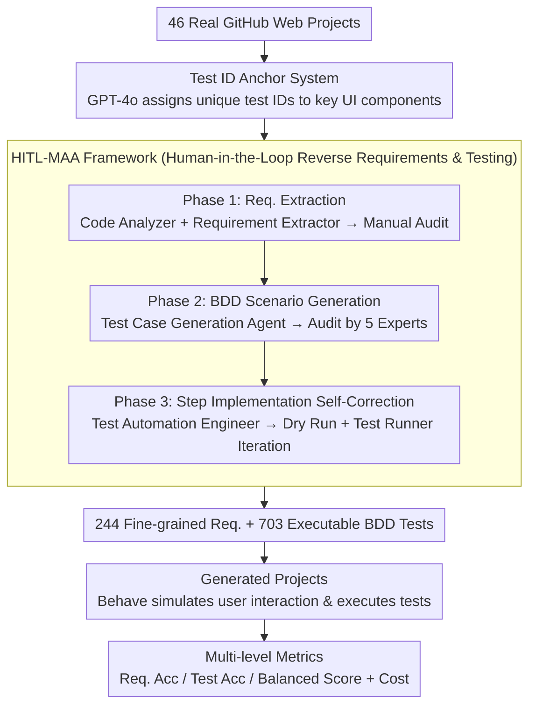

# E2EDev: Benchmarking Large Language Models in End-to-End Software Development Task

**Conference**: ACL 2026  
**arXiv**: [2510.14509](https://arxiv.org/abs/2510.14509)  
**Code**: [https://github.com/SCUNLP/E2EDev](https://github.com/SCUNLP/E2EDev)  
**Area**: LLM Evaluation  
**Keywords**: End-to-End Software Development, Behavior-Driven Development, Benchmarking, Multi-agent Coding, Requirement Verification

## TL;DR

This paper proposes E2EDev, an end-to-end software development benchmark based on Behavior-Driven Development (BDD) principles. It contains 46 real Web projects, 244 fine-grained requirements, and 703 executable BDD tests. The evaluation reveals that even the strongest LLMs (Claude series) do not exceed 60% in requirement accuracy, and the complex interaction costs of multi-agent frameworks are disproportionate to their performance gains.

## Background & Motivation

**Background**: LLM-driven End-to-End Software Development (E2ESD) is evolving from function-level code generation to full-project automated generation. Existing frameworks are divided into multi-agent methods (ChatDev, MetaGPT) and single-agent methods (GPT-Engineer), but the evaluation systems trail significantly behind framework development.

**Limitations of Prior Work**: (1) Existing benchmarks (SoftwareDev, SRDD) use coarse-grained requirement descriptions as input; vague descriptions like "Manage Words" fail to specify whether the user needs editing, bookmarking, or deletion functions. (2) Evaluation relies on subjective manual assessment or heuristic metrics, lacking systematic methodologies based on software engineering standards, which leads to inconsistent and unreliable cross-framework comparisons.

**Key Challenge**: E2ESD tasks require both high-level planning (deciding what to build) and fine-grained functional implementation (precisely satisfying requirement details). Vague requirements and unreliable evaluations in existing benchmarks prevent a true understanding of the bottlenecks in framework capabilities.

**Goal**: (1) Construct an E2ESD benchmark with fine-grained requirement specifications; (2) Design a BDD-based automated evaluation pipeline; (3) Systematically analyze the real capabilities and failure modes of various frameworks and LLMs in E2ESD tasks.

**Key Insight**: Borrowing from Behavior-Driven Development (BDD) principles in software engineering, Gherkin scenario descriptions in Given-When-Then format are used to simulate real user interactions, enabling verification from a user perspective on whether the generated software meets the requirements.

**Core Idea**: Transform E2ESD evaluation from vague manual scoring into executable BDD tests based on fine-grained requirements, deterministically verifying the requirement compliance of generated code by simulating real user interactions.

## Method

### Overall Architecture

E2EDev converts the vague and difficult-to-judge task of "End-to-End Software Development" into a deterministic scoring evaluation loop. Starting from 46 real GitHub Web projects, it uses HITL-MAA (Human-in-the-Loop Multi-Agent Annotation framework) to reverse-extract 244 fine-grained user requirements. It then writes BDD test scenarios in Gherkin format and corresponding Python step implementations for each requirement. During evaluation, the projects generated by the target framework are executed, and the Behave framework is used to simulate real user interactions, executing these BDD tests one by one to determine requirement fulfillment at both requirement and test levels.

### Key Designs

**1. HITL-MAA: Human-in-the-Loop Reverse Engineering of Source Code into Requirements and Executable Tests**

Pure manual annotation of 46 repository-level projects is too costly, while pure LLM generation lacks stability. HITL-MAA uses a three-stage pipeline to delegate heavy extraction and implementation to agents, while concentrating human effort on critical audit points in each stage. In the first stage, the Code Analyzer Agent parses the project's core functions and UI element interactions, the Requirement Extractor Agent generates candidate requirements, and human experts audit their accuracy. In the second stage, the Test Case Generation Agent writes BDD scenarios in Gherkin for each requirement, audited by five software testing experts. In the third stage, the Test Automation Engineer Agent generates Python step implementations, which are iteratively self-corrected through a Dry Run Verifier and Test Runner.

This self-correction mechanism allows over 80% of logical errors to be fixed without human intervention, making the highly labor-intensive task of "reversing high-quality requirements and tests from real code" scalable.

**2. Test ID Anchor System: Providing a Stable DOM Anchor for Cross-Project Testing**

HTML structures of projects generated by different frameworks vary significantly. If test scripts directly rely on DOM paths to locate components, they fail when applied to different projects. E2EDev's approach is to use GPT-4o to assign unique test IDs to key UI components as structurally invariant anchors before generating requirements and tests.

Thus, regardless of how the underlying DOM changes, BDD tests can consistently refer to the same logical component, ensuring that the same set of requirement verifications can be applied fairly across all framework outputs.

**3. Multi-level Evaluation Metrics: Dual-Granularity Scoring with Cost Analysis**

Relying solely on test pass rates can be biased by test granularity—some requirements might happen to have more test cases, thus gaining more weight. E2EDev therefore measures code effectiveness at two levels: Req. Acc measures the proportion of "fully satisfied" requirements (counting only if all test cases under that requirement pass), while Test Acc measures the proportion of passed tests. Balanced Score weights both to offset biases from uneven test counts. Simultaneously, the framework records API costs, carbon emissions, and time consumption as efficiency dimensions.

Requirement-level metrics are closer to the user's real experience: users care about "whether this function works" rather than "how many test points passed."

## Key Experimental Results

### Main Results

**Requirement Accuracy (Req. Acc %) of Different Frameworks and LLM Backbones**

| LLM Backbone | Vanilla LLM | GPT-Engineer | Self-Collab. | MapCoder | ChatDev | MetaGPT |
|---------|------------|-------------|-------------|---------|--------|--------|
| Claude-Haiku 4.5 | 48.69 | **53.75** | 49.01 | 49.61 | 44.73 | 5.39 |
| GPT-4o | 45.95 | **50.83** | 46.83 | 47.70 | 42.71 | 0.00 |
| GPT-4o-mini | **44.82** | 42.13 | 37.90 | 41.30 | 33.16 | 0.00 |
| Qwen-Max | 43.33 | **49.61** | 42.30 | 48.83 | 43.93 | 1.65 |
| Qwen-7B | 22.37 | **24.03** | 20.65 | 11.90 | 10.96 | 0.00 |

### Ablation Study

**Failure Mode Analysis (Manual Evaluation of 360 Projects)**

| Failure Type | Description | Primary Affected Frameworks |
|---------|------|-------------|
| Code Inconsistency | Missing/conflicting/empty functions | MetaGPT (44% of cases) |
| Requirement Omission | Essential functions not implemented | Vanilla LLM, ChatDev |
| Requirement Deviation | Implementation logic diverges from req. | All (Multi-agent improves this) |
| Detail Mismatch | Substantially correct but edge errors | Self-Collaboration (most severe) |

### Key Findings

- Even with the strongest Claude-Haiku 4.5 + GPT-Engineer combination, Req. Acc is only 53.75%, indicating that E2ESD remains a massive challenge.
- MetaGPT shows near 0% success rates across almost all LLM backbones, primarily due to communication breakdown between agents—programmers ignore the architect's file structure, and product managers rewrite and compress original requirements.
- Multi-agent frameworks incur high interaction costs (ChatDev averages 15.72 dialogue turns), but performance gains are limited, sometimes even underperforming Vanilla LLM.
- The gap between Soft Req. Acc and Req. Acc exceeds 25%: models can implement basic functions but fail to handle complex edge cases.
- Framework performance is heavily dependent on LLM backbone capability; with weaker models, frameworks may even degrade performance.

## Highlights & Insights

- The introduction of BDD testing methodology to LLM evaluation is an ingenious cross-domain transfer—applying mature software engineering practices (Given-When-Then) to the verification of AI-generated code.
- The iterative self-correction mechanism (Dry Run + Test Runner) in HITL-MAA resolved 80% of logical errors, demonstrating the practical value of LLMs in annotation pipelines.
- Failure mode analysis reveals a fundamental issue in multi-agent architectures: information is diluted at each layer as it passes between agents; while high-level functions are retained, details are lost.

## Limitations & Future Work

- Currently covers only Web application domains; although the authors argue this is a "lower-bound test," challenges in desktop, mobile, or backend applications may differ.
- The scale of 46 projects is limited because repository-level benchmark construction is extremely costly.
- Excludes CI/CD and deep backend detection, focusing instead on black-box testing via browser automation.
- Future work could expand this into a continuously updated public leaderboard supporting longitudinal evaluations.

## Related Work & Insights

- **vs rSDE-Bench**: rSDE-Bench uses function-level unit tests to verify output, while E2EDev uses BDD tests to verify behavior from a user perspective, providing a granularity closer to real usage scenarios.
- **vs SoftwareDev/SRDD**: These rely on vague descriptions and manual evaluation; E2EDev provides fine-grained requirements and automated deterministic evaluation.
- **vs Mle-Bench/GitTaskBench**: These focus on ML pipelines and repository operations, respectively; E2EDev focuses on the complete workflow from requirements to executable projects.

## Rating

- Novelty: ⭐⭐⭐⭐ Introducing BDD to LLM E2ESD evaluation is a meaningful innovation, though the benchmark construction methodology is relatively straightforward.
- Experimental Thoroughness: ⭐⭐⭐⭐⭐ 6 LLM backbones × 6 frameworks, plus supplemental manual failure mode analysis, is very comprehensive.
- Writing Quality: ⭐⭐⭐⭐ Clear structure, intuitive charts, and deep analysis.
- Value: ⭐⭐⭐⭐ Fills a gap in reliable E2ESD evaluation; the failure mode analysis provides direct guidance for framework design.

<!-- RELATED:START -->

## Related Papers

- [\[ACL 2025\] VoxEval: Benchmarking the Knowledge Understanding Capabilities of End-to-End Spoken Language Models](../../ACL2025/llm_evaluation/voxeval_benchmarking_the_knowledge_understanding_capabilities_of_end-to-end_spok.md)
- [\[ACL 2026\] CUB: Benchmarking Context Utilisation Techniques for Language Models](cub_benchmarking_context_utilisation_techniques_for_language_models.md)
- [\[ACL 2026\] Dynamic Infilling Anchors for Format-Constrained Generation in Diffusion Large Language Models](dynamic_infilling_anchors_for_format-constrained_generation_in_diffusion_large_l.md)
- [\[ACL 2026\] Challenging the Boundaries of Reasoning: An Olympiad-Level Math Benchmark for Large Language Models](challenging_the_boundaries_of_reasoning_an_olympiad-level_math_benchmark_for_lar.md)
- [\[ACL 2026\] Attribution, Citation, and Quotation: A Survey of Evidence-based Text Generation with Large Language Models](attribution_citation_and_quotation_a_survey_of_evidence-based_text_generation_wi.md)

<!-- RELATED:END -->
