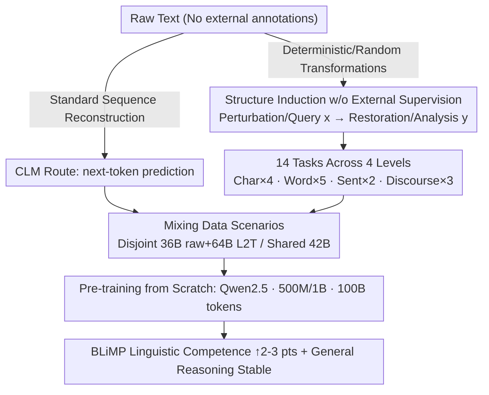

# Enhancing Linguistic Competence of Language Models through Pre-training with Language Learning Tasks

**Conference**: ACL 2026  
**arXiv**: [2601.03448](https://arxiv.org/abs/2601.03448)  
**Code**: [https://github.com/gucci-j/l2t](https://github.com/gucci-j/l2t)  
**Area**: LLM Evaluation  
**Keywords**: linguistic competence, pre-training, language learning tasks, language acquisition, structured stimuli

## TL;DR

L2T proposes a pre-training framework that mixes 14 language learning tasks (character-level to discourse-level) with standard next-token prediction. It improves BLiMP linguistic competence scores by 2-3 percentage points and accelerates the acquisition process at 500M/1B parameter scales, while maintaining general reasoning performance.

## Background & Motivation

**Background**: Language models pre-trained on raw text via causal language modeling (CLM) can learn world knowledge and reasoning abilities, but they are not explicitly optimized for linguistic competence—the ability to understand morphological, syntactic, and semantic phenomena.

**Limitations of Prior Work**:
- LMs often behave as "stochastic parrots," mimicking surface patterns without mastering the underlying linguistic structures.
- This is analogous to human rote learning, where patterns are copied without understanding generative rules.
- Existing improvement methods usually rely on architectural modifications or complex curriculum designs, increasing engineering complexity.

**Key Challenge**: CLM is a single-task objective that prioritizes learning surface statistical features rather than linguistic structural understanding. Humans, however, do not acquire language through a single objective, but through multi-task learning.

**Goal**: Introduce structured language learning tasks during the pre-training phase to enhance the linguistic competence of models and accelerate their acquisition process, without harming general reasoning performance.

**Key Insight**: Inspired by human language acquisition—where humans learn language through error correction, reorganization, and completion—raw text is automatically converted into multi-granularity structured input-output pairs to provide explicit linguistic structural stimuli during pre-training.

**Core Idea**: Pre-training should not only consist of sequence reconstruction (CLM), but should also include diverse language learning tasks that require "extracting and reorganizing information," forming a structured scaffold to promote the development of linguistic competence.

## Method

### Overall Architecture

L2T does not change the architecture or introduce external annotations; it operates solely at the data layer. It automatically rewrites raw text into structured $(input, output)$ pairs for 14 language learning tasks covering four linguistic granularities (character, word, sentence, and discourse). These are then mixed with standard CLM data for pre-training from scratch. When raw text enters, a portion is processed as standard next-token prediction, while another portion is "perturbed-queried-restored" via deterministic or random transformations into samples with structural signals. The model learns not just surface statistics but explicit linguistic structures from this mixed corpus.

### Key Designs

**1. Structure Induction w/o External Supervision: Training signals generated entirely from raw text**

This is the foundation of the framework, determining the source of L2T training signals. Unlike instruction tuning which requires external annotations, each task in L2T is a deterministic or randomized transformation that automatically converts a segment of text into an $(x, y)$ pair: $x$ is the perturbed/queried input, and $y$ is the restored/analyzed output. Structures are induced directly from raw text without manual labeling, making it low-cost and linearly scalable with corpus size.

**2. 14 Tasks Across 4 Levels: Bringing human language exercises into pre-training**

CLM only performs sequence reconstruction, allowing models to settle for surface patterns. L2T spreads a set of complementary tasks across linguistic granularities, each corresponding to strategies proven effective in human language acquisition. Character-level tasks (4 types: Char Count, Masked Char Reconstruction, Space Restoration, Spell Correction) enhance morphological awareness; Word-level tasks (5 types: Last Word Prediction, Masked Word Reconstruction, Random Word Correction, Word Reordering, Token Type Counting) break linear sequence dependency to force structural inference; Sentence-level tasks (2 types: Irrelevant Sentence Removal, Sentence Reordering) require understanding inter-sentence relationships; Discourse-level tasks (3 types: Infilling, Completion, Word-to-Text Generation) support global coherence and disambiguation.

**3. Mixing Data Scenarios: Separating gains from "data diversity" vs. "structured stimuli"**

Generated L2T samples are mixed with standard CLM data before pre-training. To determine if improvements stem from seeing more text or the task structure itself, L2T uses two configurations: **Disjoint** (sufficient data) splits 100B tokens into CLM and L2T samples (approx. 36B raw + 64B L2T) to measure the combined force of diverse data and structured tasks; **Shared** (data-constrained) uses the same 42B tokens for both CLM and L2T generation (totaling 100B tokens) to compare "multi-task transformations vs. simple repetitive exposure" on homologous data—directly testing the "multi-task learning vs. rote learning" hypothesis.

### Loss & Training

Loss is calculated on all tokens, including both input and output segments of L2T tasks. The model utilizes the Qwen2.5 architecture and Mistral tokenizer (32K vocabulary), pre-training 500M and 1B scales from scratch. The total budget is fixed at 100B tokens, intentionally exceeding the Chinchilla optimal threshold to observe the effects of structured stimuli in a "fully trained" scenario.

## Key Experimental Results

### Main Results (Linguistic Competence - BLiMP)

| Scale | Data | Raw | L2T | Gain |
|-------|------|-----|-----|------|
| 500M  | Disjoint | 78.6 | **80.2** | +1.6 |
| 500M  | Shared   | 78.1 | **80.9** | +2.8 |
| 1B    | Disjoint | 79.0 | **80.8** | +1.8 |
| 1B    | Shared   | 78.9 | **81.2** | +2.3 |

### General Benchmarks

| Scale | Data | Raw avg | L2T avg | Difference |
|-------|------|---------|---------|------------|
| 500M  | Disjoint | - | - | -0.87 (slight decrease) |
| 1B    | Disjoint | - | - | -0.07 (negligible) |
| 500M  | Shared   | - | - | +0.15 (slight increase) |
| 1B    | Shared   | - | - | -1.38 (decrease, mainly ARC) |

### Ablation Study (Single Task Analysis)

| Task | Linguistic Competence | Description |
|------|-----------------------|-------------|
| 9/14 Tasks | Exceeds Raw Baseline | Char Count, Reordering, etc., provide key structural scaffolds |
| Space, Masked Char | Below Raw Baseline | Training signals are unstable when used in isolation |
| Combined L2T | Exceeds most single tasks | Multi-task complementarity leads to better robustness |

### Key Findings
- **Island Effects** showed the most significant improvement (+6.9~11.3 points), indicating that multi-granularity structured tasks help capture long-distance dependencies.
- L2T models outperformed the Raw baseline starting from 5B tokens and maintained the advantage—**accelerating linguistic competence acquisition**.
- Effectiveness was more pronounced in the **Shared** scenario (+2.3~2.8 vs +1.6~1.8), suggesting "structured stimuli" is more effective than "repetitive exposure."
- L2T also enhanced broader cognitive intelligence, such as **fluid reasoning** (RPM +5.4%) and numerical abilities.

## Highlights & Insights
- The analogy of "Language Models = Rote Learning" is insightful; L2T uses multi-task structured stimuli to break the surface pattern learning of pure CLM.
- Task design is theoretically grounded: each task category corresponds to effective strategies in human language acquisition research (Correction → Morphology, Reordering → Syntax, etc.).
- No external labels or architectural changes are required; the intervention at the data layer makes the method highly scalable.
- The finding that multi-task transformations are more effective than repetitive exposure on the same source text (Shared) provides important insights for data efficiency research.

## Limitations & Future Work
- Validated only at 500M and 1B scales; effectiveness at 10B+ scales is unknown, as larger models might be more sensitive to the ratio of raw text.
- Based on single training runs, statistical significance is limited (though consistency across two scales × two data scenarios provides indirect evidence).
- Task design focuses on sentence-level and below, lacking more complex discourse-level and cross-sentence tasks.
- General reasoning decreased by 1.38 points in the 1B Shared scenario; larger models need a better balance between structural learning and knowledge consolidation.
- Evaluated only in English; multilingual generalization remains to be verified.

## Related Work & Insights
- **vs. Standard CLM Pre-training**: L2T improves linguistic competence by 2-3 points and accelerates acquisition at the cost of a slight decrease in general performance.
- **vs. Instruction Tuning**: L2T introduces structured signals during the pre-training phase without requiring external supervision data.
- **vs. Curriculum Learning/Architecture Modification**: L2T is implemented purely through data transformations, requiring no changes to model architecture or complex training strategies.

## Rating
- **Novelty**: ⭐⭐⭐⭐ The idea of mixing language learning tasks in pre-training is unique, and the human acquisition analogy is deep.
- **Experimental Thoroughness**: ⭐⭐⭐⭐ Covers multiple scales, data scenarios, single-task analysis, and cognitive assessments, though single runs are a limitation.
- **Writing Quality**: ⭐⭐⭐⭐⭐ The logical chain from theoretical motivation → task design → experimental validation is remarkably complete and clear.

<!-- RELATED:START -->

## Related Papers

- [\[NeurIPS 2025\] Exploiting Vocabulary Frequency Imbalance in Language Model Pre-training](../../NeurIPS2025/llm_evaluation/exploiting_vocabulary_frequency_imbalance_in_language_model_pre-training.md)
- [\[ACL 2026\] How Hypocritical Is Your LLM Judge? Listener–Speaker Asymmetries in the Pragmatic Competence of Large Language Models](how_hypocritical_is_your_llm_judge_listener-speaker_asymmetries_in_the_pragmatic.md)
- [\[ACL 2026\] Teaching Language Models to Forecast Research Success Through Comparative Idea Evaluation](teaching_language_models_to_forecast_research_success_through_comparative_idea_e.md)
- [\[ACL 2026\] Evaluating Temporal Consistency in Multi-Turn Language Models](evaluating_temporal_consistency_in_multi-turn_language_models.md)
- [\[ACL 2026\] Beyond Itinerary Planning: A Real-World Benchmark for Multi-Turn and Tool-Using Travel Tasks](beyond_itinerary_planning-a_real-world_benchmark_for_multi-turn_and_tool-using_t.md)

<!-- RELATED:END -->
