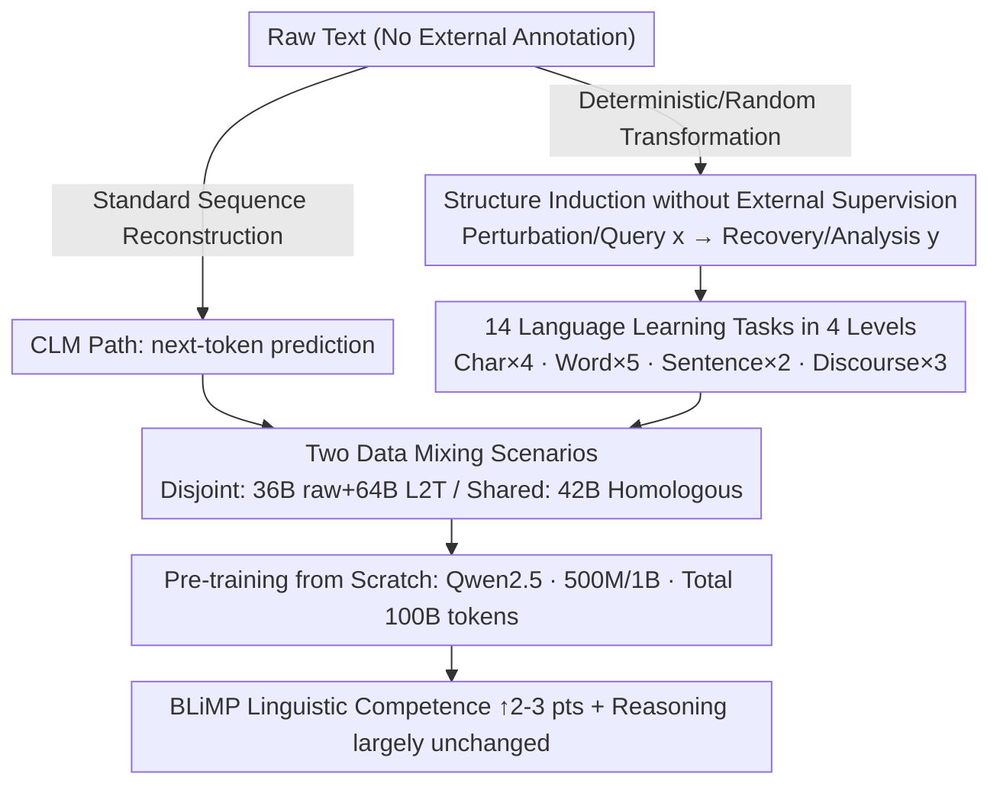

# Enhancing Linguistic Competence of Language Models through Pre-training with Language Learning Tasks

**Conference**: ACL 2026  
**arXiv**: [2601.03448](https://arxiv.org/abs/2601.03448)  
**Code**: [https://github.com/gucci-j/l2t](https://github.com/gucci-j/l2t)  
**Area**: LLM Evaluation  
**Keywords**: Linguistic Competence, Pre-training, Language Learning Tasks, Language Acquisition, Structured Stimuli

## TL;DR

L2T proposes a pre-training framework that integrates 14 language learning tasks (char-level to discourse-level) with standard next-token prediction. It improves BLiMP linguistic competence scores by 2-3 percentage points and accelerates the acquisition process at 500M and 1B parameter scales while maintaining general reasoning performance.

## Background & Motivation

**Background**: Language models are pre-trained on raw text via causal language modeling (CLM). While they acquire world knowledge and reasoning skills, linguistic competence—the ability to understand morphology, syntax, and semantic phenomena—is not explicitly optimized.

**Limitations of Prior Work**:
- LMs often behave as "stochastic parrots," mimicking surface patterns without mastering underlying linguistic structures.
- This resembles "rote learning" in humans, where patterns are copied without understanding generative rules.
- Existing improvement methods often rely on architectural modifications or complex curriculum designs, increasing engineering complexity.

**Key Challenge**: CLM is a single-objective goal that prioritizes surface statistical features over structural understanding. In contrast, humans do not acquire language through a single objective but via multi-task learning.

**Goal**: To introduce structured language learning tasks during the pre-training phase to enhance linguistic competence and accelerate acquisition without compromising general reasoning capabilities.

**Key Insight**: Inspired by human language acquisition—where humans learn through error correction, reorganization, and completion—raw text is automatically converted into multi-granularity structured input-output pairs to provide explicit linguistic structural stimuli during pre-training.

**Core Idea**: Pre-training should not be limited to sequence reconstruction (CLM); it should include diverse language learning tasks that require "extracting and reorganizing information," forming a structural scaffold to facilitate linguistic development.

## Method

### Overall Architecture

L2T maintains the existing architecture and does not introduce external annotations. Instead, it operates at the data layer: raw text is automatically rewritten into structured (input, output) pairs for 14 language learning tasks across four linguistic granularities (character, word, sentence, discourse). These are mixed with standard CLM data for pre-training from scratch. While one portion of the text undergoes standard next-token prediction, another portion is transformed via deterministic or random "perturbation-query-recovery" into samples with structural signals. Consequently, the model learns explicit linguistic structures rather than just surface statistics.

### Key Designs

**1. Structure Induction without External Supervision: Training signals generated entirely from raw text**

This forms the foundation of the framework. Unlike instruction tuning which requires external annotations, each L2T task is a deterministic or randomized transformation that converts text into $(x, y)$ pairs: $x$ is the perturbed or queried input, and $y$ is the recovered or analyzed output. Since structures are induced directly from raw text, the approach is cost-effective and scales linearly with corpus size.

**2. 14 Language Learning Tasks in 4 Levels: Porting human language exercises into pre-training**

CLM-only models risk stagnating at surface patterns. L2T introduces complementary tasks at various linguistic granularities, each corresponding to strategies proven effective in human language acquisition. 4 Character-level tasks (character counting, masked character reconstruction, whitespace recovery, typo correction) enhance morphological awareness. 5 Word-level tasks (final word prediction, masked word reconstruction, random word correction, word reordering, token type counting) break linear sequence dependence and force structural inference. 2 Sentence-level tasks (irrelevant sentence deletion, sentence reordering) require inter-sentential understanding. 3 Discourse-level tasks (fill-in-the-middle, suffix completion, text generation from words) support global coherence and disambiguation.

**3. Two Data Mixing Scenarios: Separating "Data Diversity" from "Structured Stimuli" gains**

Generated L2T samples are mixed with standard CLM data. Two configurations are established to identify the source of improvement: **Disjoint** (data-abundant) splits 100B tokens into CLM and L2T segments (~36B raw + 64B L2T) to measure the joint effort of diversity and structure. **Shared** (data-constrained) uses the same 42B tokens for both CLM and L2T generation (totaling 100B tokens) to compare multi-task transformations against simple repetitive exposure on the same data source, testing the "multi-task learning vs. rote learning" hypothesis.

### Loss & Training

Loss is calculated over all tokens, including both the input and output segments of L2T tasks. The models use the Qwen2.5 architecture and Mistral tokenizer (32K vocabulary), pre-trained from scratch at 500M and 1B scales. The total budget is fixed at 100B tokens, intentionally exceeding the Chinchilla optimal threshold to observe the effects of structured stimuli in a "fully trained" scenario.

## Key Experimental Results

### Main Results (Linguistic Competence - BLiMP)

| Scale | Data | Raw | L2T | Gain |
|-------|------|-----|-----|------|
| 500M | Disjoint | 78.6 | **80.2** | +1.6 |
| 500M | Shared | 78.1 | **80.9** | +2.8 |
| 1B | Disjoint | 79.0 | **80.8** | +1.8 |
| 1B | Shared | 78.9 | **81.2** | +2.3 |

### General Benchmarks

| Scale | Data | Raw avg | L2T avg | Difference |
|-------|------|---------|---------|------------|
| 500M | Disjoint | - | - | -0.87 (Slight decrease) |
| 1B | Disjoint | - | - | -0.07 (Negligible) |
| 500M | Shared | - | - | +0.15 (Slight increase) |
| 1B | Shared | - | - | -1.38 (Decrease, primarily ARC) |

### Ablation Study (Single Task Analysis)

| Task | Linguistic Competence | Description |
|------|-----------------------|-------------|
| 9/14 Tasks | Outperform Raw baseline | Char Count, Reordering, etc., provide key structural scaffolding |
| Space, Masked Char | Underperform Raw baseline | Unstable training signals when used in isolation |
| Combined L2T | Outperform most single tasks | Multi-task complementarity offers better robustness |

### Key Findings
- Improvements in "Island effects" are most significant (+6.9~11.3 points), indicating that multi-granularity tasks help capture long-distance dependencies.
- L2T models outperform the Raw baseline starting from 5B tokens, maintaining this advantage and thus accelerating linguistic acquisition.
- The effect is more pronounced in the **Shared** scenario (+2.3~2.8 vs. +1.6~1.8), suggesting that structured stimuli are more effective than repetitive exposure.
- L2T also enhances broader cognitive intelligence, including fluid reasoning (RPM +5.4%) and numerical capabilities.

## Highlights & Insights
- The analogy of "Language Models = Rote Learning" is insightful. L2T addresses the surface pattern learning limitation of CLM through multi-task structured stimuli.
- Task design is theoretically grounded: each category corresponds to effective strategies identified in human language acquisition research (e.g., error correction for morphology, reordering for syntax).
- The approach is highly scalable because it requires no external annotations or architectural changes.
- The finding that multi-task transformation is more effective than repetitive exposure on the same source text (Shared) provides important implications for data efficiency research.

## Limitations & Future Work
- Validated only at 500M and 1B scales; performance at 10B+ scales remains unknown, as larger models might be more sensitive to the ratio of raw text.
- Limited statistical significance due to single training runs (though consistency across scales and scenarios provides indirect evidence).
- Task design focuses on the sentence level and below, lacking complex discourse-level and cross-sentence tasks.
- A 1.38-point drop in general reasoning was observed in the 1B Shared scenario; larger models may need a better balance between structural learning and knowledge consolidation.
- Evaluation is restricted to English; multilingual generalization requires further validation.

## Related Work & Insights
- **vs. Standard CLM Pre-training**: L2T improves linguistic competence by 2-3 points and accelerates acquisition at the cost of a slight decrease in general performance.
- **vs. Instruction Tuning**: L2T introduces structural signals during the pre-training phase without requiring external supervised data.
- **vs. Curriculum Learning/Arch Modifications**: L2T is implemented purely through data transformation, requiring no modifications to the model architecture or complex training schedules.

## Rating
- Novelty: ⭐⭐⭐⭐ The idea of mixing language learning tasks in pre-training is unique, and the human acquisition analogy is deep.
- Experimental Thoroughness: ⭐⭐⭐⭐ Multi-scale, multi-scenario, single-task analysis, and cognitive evaluations are present, though the lack of multiple runs is a drawback.
- Writing Quality: ⭐⭐⭐⭐⭐ The logical progression from theoretical motivation to task design and experimental verification is comprehensive and clear.

<!-- RELATED:START -->

## Related Papers

- [\[ICLR 2026\] Detecting Data Contamination from Reinforcement Learning Post-training for Large Language Models](../../ICLR2026/llm_evaluation/detecting_data_contamination_from_reinforcement_learning_post-training_for_large.md)
- [\[ACL 2026\] Automated Creativity Evaluation of Language Models Across Open-Ended Tasks](automated_creativity_evaluation_of_language_models_across_open-ended_tasks.md)
- [\[NeurIPS 2025\] Exploiting Vocabulary Frequency Imbalance in Language Model Pre-training](../../NeurIPS2025/llm_evaluation/exploiting_vocabulary_frequency_imbalance_in_language_model_pre-training.md)
- [\[ACL 2026\] Teaching Language Models to Forecast Research Success Through Comparative Idea Evaluation](teaching_language_models_to_forecast_research_success_through_comparative_idea_e.md)
- [\[ACL 2026\] How Hypocritical Is Your LLM Judge? Listener–Speaker Asymmetries in the Pragmatic Competence of Large Language Models](how_hypocritical_is_your_llm_judge_listener-speaker_asymmetries_in_the_pragmatic.md)

<!-- RELATED:END -->
