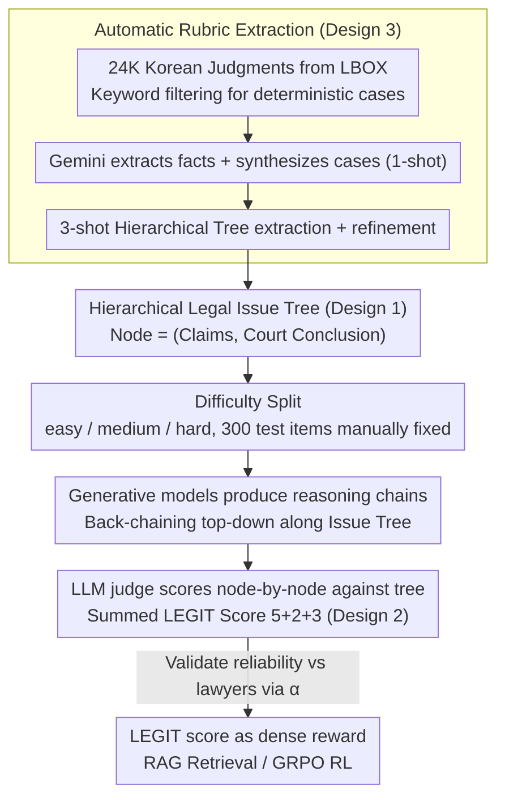

# Evaluating Legal Reasoning Traces with Legal Issue Tree Rubrics

**Conference**: ACL 2026  
**arXiv**: [2512.01020](https://arxiv.org/abs/2512.01020)  
**Code**: Claimed fully open-source (GitHub repo)  
**Area**: LLM Evaluation / Legal / Reasoning Chain Evaluation  
**Keywords**: legal judgment prediction, issue tree, rubric-based judge, RAG, GRPO

## TL;DR
LEGIT automatically extracts "hierarchical issue trees" from Korean civil/administrative judgments to serve as rubrics. This allows LLM-as-a-judge to evaluate both "issue coverage" and "issue correctness." The study reveals complementary effects between RAG and RL in legal reasoning: RAG improves comprehensiveness, while RL sacrifices coverage for higher correctness.

## Background & Motivation

**Background**: LLM-as-a-judge has become the mainstream for evaluating chain-of-thought reasoning, but most benchmarks focus solely on final answer accuracy (math, code) or use coarse-grained Likert scales. In expert tasks like Legal Judgment Prediction (LJP), looking only at the final verdict accuracy masks two critical dimensions in legal practice: whether the reasoning chain sufficiently covers key legal issues and whether it reaches correct conclusions for each issue point.

**Limitations of Prior Work**: (1) Manual rubric approaches like BigGen-Bench cannot scale due to the high cost of expert writing; (2) Likert scales suffer from poor inter-annotator consistency, as shown by multiple studies; (3) Existing LJP datasets (CMDL, ECHR, Hwang2022, etc.) almost exclusively cover criminal or binary judgments, leaving a void for civil/administrative cases which constitute 70-84% of court cases; (4) Even if the final order is correct, missing key issues or making errors in sub-questions remains hidden.

**Key Challenge**: Legal reasoning is inherently a **tree**—a main issue is entailed by several sub-issues, which are derived from facts and common sense. Compressing this into "single-label classification + scalar Likert score" erases this structure. Evaluators cannot distinguish between "decomposition errors" and "deduction errors," nor can they provide dense signals for RL rewards.

**Goal**: (1) Automatically extract large-scale, expert-level legal issue tree rubrics from judgments; (2) Validate the consistency between rubric-based LLM judges and licensed lawyers; (3) Characterize failure modes of SOTA LLMs in complex civil cases (decomposition vs. deduction); (4) Use rubrics directly as RL rewards to examine the specific influences of RAG and RL on the issue tree.

**Key Insight**: Legal reasoning can be formalized as "back-chaining top-down along an issue tree"—extracting each node ("party claims + court conclusion") provides a natural rubric. Judgments themselves contain vast natural labeling; LLM extraction → second-round refinement → three-tier difficulty classification yields 24K instances.

**Core Idea**: Use legal issue trees as "naturally scalable, expert-aligned" rubrics, decomposing single-score evaluation into {final order, issue coverage, issue correctness} (5/2/3). This provides both a robust metric and a dense signal for RL rewards.

## Method

LEGIT Task Input: Case facts + purpose of claim; Output: Free-form reasoning chain + final judgment. The evaluator scores the reasoning chain node-by-node against the issue tree, summing three components for a 0–10 LEGIT score.

### Overall Architecture

The Mechanism involves restoring legal reasoning to its natural shape—an Issue Tree—and using this tree as a rubric for both evaluation and RL rewards. Data construction follows four steps: First, 24,406 Korean District Court civil/administrative judgments are harvested from LBOX, filtering out non-deterministic cases (e.g., damages/negligence ratios) using keywords. Then, Gemini-2.0-Flash extracts atomic facts and synthesizes coherent case descriptions (1-shot). The same model extracts hierarchical issue trees (3-shot) with a second-round refinement for quality. Finally, each issue is converted into binary coverage/correctness labels and summed. Difficulty is categorized as easy/medium/hard based on the number of issues, and the test set (300 cases) is manually corrected by the authors. The evaluation pipeline involves 12 generator models, 10 judge models scoring against issue trees, and a Krippendorff α comparison with licensed lawyer annotations.

### Key Designs

**1. Hierarchical Legal Issue Tree as Rubric: Decomposing judgments into independently evaluatable nodes**

Judgment argumentation is naturally hierarchical, but flattening it into Likert scales obscures whether a failure occurred in decomposition or deduction. LEGIT extracts each judgment as a tree where nodes are "(party claims, court conclusion)." The root is the purpose of claim + final verdict, with branches drilling down—e.g., "Insurer should pay" ← "Event covered by contract" ← "Death was sudden, fortuitous, external" ← "Cause not a pre-existing condition." LJP is thus equivalent to top-down back-chaining, where each step involves two actions: identifying sub-issues (decomposition) and making judgments based on facts/sub-conclusions (deduction). The tree encodes what points to consider and what each conclusion should be, allowing evaluators to perform binary judgments on atomic nodes rather than consuming the entire chain at once.

**2. Three-tier Additive LEGIT Score (5+2+3=10): A scalar for explaining failure layers and direct RL reward**

One-shot Likert scores show poor inter-evaluator consistency and fail to localize failures. LEGIT splits the score: **Final order correctness** (5 pts, binary) for an exact match of the final verdict; **Issue coverage** (≤2 pts) where each of the $N \geq 1$ non-root nodes matched grants $2/N$; **Issue correctness** (≤3 pts) where each matched node with a correct conclusion grants $3/N$. High weight for the final order aligns with LJP goals, while correctness is weighted higher than coverage because a correct conclusion is more informative than mere mention. This additive score is an interpretable metric and a dense, decomposable reward signal for GRPO.

**3. Automatic Rubric Extraction + Reliability Loop: Scalable rubrics (24K) aligned with lawyers**

Manual rubrics (e.g., BigGen-Bench) are high quality but lack scale. LEGIT uses Gemini-2.0-Flash with two-round refinement to automatically extract issue trees, pushing expert-level rubric evaluation to 24K instances. Seven licensed Korean lawyers annotated 44 problems (300 issues) to calculate Krippendorff α. Finally, 10 judge LLMs were evaluated, comparing their α with humans and pairwise consistency against Likert scales. Results showed human intra-lawyer α=0.87, and strong LLM-lawyer α=0.62–0.74. Notably, LEGIT showed significantly higher LLM inter-judge consistency than Likert scales, proving that structured rubrics reduce subjectivity and are reliable for RL training.

### Loss & Training

- **Data Construction**: Prompt-based with 1/3-shot, zero additional training.
- **RL with Rubric**: Gemma-3-4B underwent RL via GRPO using the LEGIT score. During training, the evaluator was Gemma-3-27B (decoupled from the test-time Gemini-2.0-Flash to prevent overfitting). Hyperparameters: KL coef 1e-3, lr 1e-6, bs 32, 8 rollouts, AdamW, max prompt 2048 / output 4096, early stop at 60 steps, total 41.6h (4x A100 training + 4x A100 evaluation).
- **RAG**: BM25 (k1=1.5, b=0.75, Kiwi POS filtering), mContriever (Multilingual MS-MARCO, 512 token truncation), and fine-tuned Contriever on LEGIT train (3 epochs, bs 64, lr 1e-4).

## Key Experimental Results

### Main Results

Scores of 12 generator models on LEGIT test/300 (Gemini-2.0-Flash as judge):

| Model | LEGIT Score / 10 | Notes |
|------|------------------|------|
| GPT-4.1 | **5.71** | Highest, but far from saturated |
| Gemini-2.5-Pro | ~5.4 | Closed-source models cluster at 5+ |
| o3 | ~5.0 | Reasoning model |
| Gemma-3-27B | 4.82 | Strongest open-source |
| Gemma-3-4B | 4.02 | Base model, RL starting point |
| EXAONE-3.5-7.8B | < 4 | Language-specific Korean model is weaker |

Reliability: Lawyer vs. Lawyer Krippendorff α = **0.87**; GPT/Gemini judge vs. Lawyer α = **0.62–0.74**; Gemma-3-12B α = 0.53, Gemma-3-4B α = 0.20. LLM-LLM α for LEGIT rubrics is consistently higher than Likert ("modular > coarse").

### Ablation Study

| Configuration | LEGIT (Gemma-3-4B) | Final | Coverage | Correctness |
|------|------|------|------|------|
| Base | 4.02 | – | – | – |
| + BM25 RAG | 4.40 | ↑ | ↑ | ↑ |
| + Contriever RAG | 4.42 | ↑ | ↑ | ↑ |
| + GT citation RAG | ~5.0 | ↑↑ | ↑↑ | ↑↑ |
| + RL (LEGIT reward) | **4.77** | ↑↑ | **↓** | ↑↑ |
| + RL (final-order-only reward) | 4.31 | ↑ | ↓↓ | ↑ |

Gemma-3-4B trained with RL using the LEGIT reward nearly matched Gemma-3-27B (4.82) and **performed significantly better than RL using binary final-order rewards**, indicating that dense rubric rewards are better suited for legal reasoning than sparse rewards.

Error Attribution (Fig. 7): Parent issue accuracy vs. Sub-issue status:

| Sub-issue status | Parent issue accuracy |
|---------------|------------------|
| All covered and correct | Highest (near upper bound) |
| ≥1 covered but wrong (**deduction error**) | Severe decrease |
| None covered (**decomposition error**) | Severe decrease |

### Key Findings

- **SOTA LLMs are far from saturated**: The peak score of 5.71/10 proves significant room for growth in complex civil law.
- **Two major error categories**: Decomposition (missing sub-issues) and deduction (incorrect inference), both of which propagate upwards through the tree to affect the parent node.
- **RAG vs RL Complementarity**: RAG improves all three scores (broad exploration), while RL improves correctness at the cost of coverage (the policy learns to "mention less to avoid penalties"). This aligns with Fig. 7: incorrectness is penalized more than omission, so policies tend to skip ambiguous issues.
- **LLM Judges are generally lenient**: Compared to lawyers, judges tend to mark "similar but distinct legal concepts" as covered/correct; smaller models appear stricter, surprisingly leading to an α closer to lawyers (by coincidence, not capability).
- **Rubric Consistency > Likert**: Even providing full judgments and intermediate descriptions, Likert α remains lower than LEGIT, suggesting structured prompting is key to consistency.
- **Deeper issues are harder to cover, but once covered, shallower issues are more error-prone**: Reveals a layered failure pattern in reasoning chains.

## Highlights & Insights

- **Judgments are natural rubrics**: Using the "claims-conclusion" hierarchy as ground truth removes the cost barrier of manual rubrics, enabling expert-level evaluation at a 24K scale. This can be transferred to any domain with structured final documents (medical reports, audit reports, accident investigations).
- **Additive scores as both metric and reward**: Sparse binary rewards are a bottleneck for R1-style RL. Ours uses issue-level dense rewards to help a 4B model rival a 27B model, proving rubric rewards are more efficient for structured reasoning.
- **Inter-judge consistency as a core metric**: The authors use consistency across different evaluators as a quality criterion for rubrics, offering a better methodology for LLM-as-a-judge design—focusing on "mutual alignment" in addition to "human alignment."
- **RL risk-aversion**: The weight design (correctness > coverage) penalizes incorrectness more than missing information. This serves as a warning for evaluation design: if total coverage is required, weights must be adjusted or a coverage floor penalty added.
- **Leniency of judges**: In all LLM judge applications, one must be wary of "similar ≠ equivalent" confusion, especially in precision-heavy fields like law or medicine.

## Limitations & Future Work

- **Specific to Korean Law and Language**: Generalizability to Common Law or other languages remains an open question, though the decomposition/deduction structure is likely universal.
- **Computational Cost**: Rubric-based evaluation calls scale with the number of issues, making it much more expensive than Likert or final-order-only methods.
- **Citation accuracy not evaluated**: Because a single law/precedent often has multiple Case IDs, the false negative rate was too high, so the authors chose to exclude it.
- **Uncorrected Training Set**: Only 50 items were manually verified (92% feasible), meaning some errors like missing antecedents or over-specification likely remain.
- **Judge Leniency**: This leads to overestimating SOTA performance. Reaching a lawyer-level α ≥ 0.85 requires stronger evaluator models or multi-judge fusion.
- **RL Coverage Drop**: In applications where comprehensiveness is vital (e.g., due diligence), the current reward design may be counterproductive.

## Related Work & Insights

- **vs. BigGen-Bench (Kim et al. 2025b)**: BigGen uses high-quality manual rubrics but is limited in scale; LEGIT scales to 24K using judgments while maintaining lawyer alignment.
- **vs. CitaLaw / Legal RAG (Zhang et al. 2025)**: CitaLaw focuses on citation quality; Ours uses retrieval as a tool to expand reasoning coverage and quantifies effects via the issue tree.
- **vs. DeepSeek-R1 final-answer RL (Guo et al. 2025)**: R1 achieved breakthroughs in math with sparse binary rewards; Ours proves structured rubric rewards are superior for expert domains, providing a counter-case to the "universal sparse reward" trend.
- **vs. Rubrics as Rewards (Gunjal et al. 2025)**: Shared philosophy, but LEGIT provides a complete loop of "automatic generation + inter-judge validation," making it more reproducible.
- **vs. MathDial / Backward Chaining (Kazemi et al. 2023)**: Formalizing legal reasoning as backward-chaining borrows from symbolic reasoning; LEGIT applies this to a practical evaluation/training framework.
- **Transferable Insight**: Moving the "natural document → automatic rubric → RL reward" pipeline to medical guidelines or compliance auditing could significantly reduce expert annotation costs.

## Rating
- Novelty: ⭐⭐⭐⭐ Using the legal reasoning tree as a rubric is a clear, scalable new direction; the combination of three-tier scoring and RL reward creates a complete loop. Technical individual components (GRPO, BM25) are standard.
- Experimental Thoroughness: ⭐⭐⭐⭐⭐ 12 generators × 10 judges × 7 lawyers + Likert comparison + RAG/RL ablations + 5 retrievers + Error layering. Very comprehensive and solid.
- Writing Quality: ⭐⭐⭐⭐ Clear definitions, figures, and appendices, though the experimental density requires careful reading.
- Value: ⭐⭐⭐⭐⭐ Provides a 24K dataset + pipeline + strong evidence that "rubric reward > final-answer reward" for expert reasoning, significantly advancing legal AI and general reasoning evaluation.

<!-- RELATED:START -->

## Related Papers

- [\[ACL 2026\] Beyond Case Law: Evaluating Structure-Aware Retrieval and Safety in Statute-Centric Legal QA](beyond_case_law_evaluating_structure-aware_retrieval_and_safety_in_statute-centr.md)
- [\[ACL 2026\] ReTraceQA: Evaluating Reasoning Traces of Small Language Models in Commonsense Question Answering](retraceqa_evaluating_reasoning_traces_of_small_language_models_in_commonsense_qu.md)
- [\[ACL 2025\] SwiLTra-Bench: The Swiss Legal Translation Benchmark](../../ACL2025/llm_evaluation/swiltra-bench_the_swiss_legal_translation_benchmark.md)
- [\[ACL 2026\] Are They Lovers or Friends? Evaluating LLMs' Social Reasoning in English and Korean Dialogues](are_they_lovers_or_friends_evaluating_llms39_social_reasoning_in_english_and_kor.md)
- [\[ACL 2026\] HoWToBench: Holistic Evaluation for LLM's Capability in Human-level Writing using Tree of Writing](howtobench_holistic_evaluation_for_llms_capability_in_human-level_writing_using_.md)

<!-- RELATED:END -->
