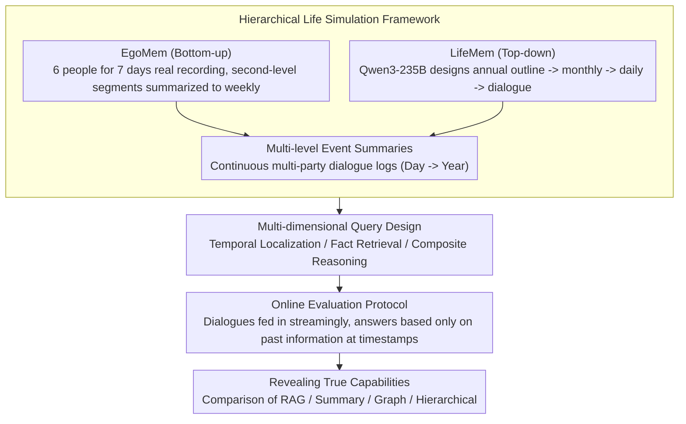

# Evaluating Memory Capability in Continuous Lifelog Scenario

**Conference**: ACL 2026 Findings  
**arXiv**: [2604.11182](https://arxiv.org/abs/2604.11182)  
**Code**: [https://github.com/RayNeo-AI-2025/LifeDialBench](https://github.com/RayNeo-AI-2025/LifeDialBench)  
**Area**: LLM Evaluation  
**Keywords**: Lifelog Memory, Online Evaluation, Wearable Devices, RAG Baseline, Long-term Dialogue

## TL;DR
This paper introduces LifeDialBench, a benchmark for evaluating memory capabilities in continuous lifelog scenarios (comprising EgoMem with 7 days of real data and LifeMem with 1 year of simulated data). It introduces an online evaluation protocol to ensure temporal causality and counter-intuitively finds that simple RAG baselines consistently outperform complex memory systems.

## Background & Motivation

**Background**: Wearable devices (such as Ray-Ban Meta smart glasses, Xiaomi AI glasses, etc.) can now achieve "always-on" microphones, continuously recording environmental conversations, which creates significant opportunities for memory system applications. LLM memory systems typically consist of a memory manager, a summarization agent, and a retriever.

**Limitations of Prior Work**: Existing memory benchmarks primarily focus on online one-on-one chats or human-AI interactions, ignoring the unique requirements of continuous lifelogs: multi-party interactions, casual and sequential event timelines, and simulated social networks. More critically, traditional offline evaluation protocols suffer from "temporal leakage"—allowing the system to access the complete dataset before answering any questions, systematically overestimating real-world performance.

**Key Challenge**: Existing complex memory systems (e.g., graph-based, hierarchical) introduce lossy compression (summarization, entity extraction, etc.), which may lose detailed information crucial in lifelog scenarios. However, due to the lack of strict online evaluation protocols, this information loss is obscured by the temporal leakage in offline evaluations.

**Goal**: (1) Construct a memory evaluation benchmark matching the characteristics of continuous lifelogs; (2) Propose an online evaluation protocol following temporal causality; (3) Reveal the true capabilities of existing memory systems.

**Key Insight**: Utilize the EgoLife real first-person video dataset (recorded by 6 people over 7 days) to construct real-world scenario data, while using LLMs to simulate one year of life to extend the temporal span. Introduce strict online evaluation—where information flows in linearly over time, and the system can only answer using information from "before the current timestamp."

**Core Idea**: Evaluating memory systems under strict temporal causality constraints reveals a counter-intuitive finding—simple RAG baselines outperform all complex specialized memory systems because raw text preservation is more important than lossy compression.

## Method

### Overall Architecture

The core problem LifeDialBench addresses is how much a memory system can remember in "always-on microphone, continuous dialogue inflow" wearable scenarios. To achieve this, it integrates data, queries, and evaluation: first, two complementary subsets (EgoMem from real first-person recordings and LifeMem simulated by LLM) are used to create continuous multi-party dialogue logs ranging from days to a year. Then, QA pairs covering different temporal granularities are derived from multi-level event summaries of these logs. Finally, an online protocol enforcing temporal causality feeds dialogues to the system in a streaming fashion, posing questions at specific timestamps along the way. The key to the entire pipeline is not the volume of data, but preventing the system from "seeing the future" during evaluation, thereby exposing the true capabilities of memory systems.

### Key Designs

**1. Hierarchical Life Simulation Framework: Balancing authenticity and temporal span using two opposing construction directions.**

The difficulty of continuous lifelogs lies in being both authentic and long enough; a single source rarely satisfies both. EgoMem follows a bottom-up route, summarizing 7 days of real 6-person recordings from EgoLife from second-level video segments to minutes, hours, days, and weeks, ensuring every event has real grounding. LifeMem follows a top-down route, where Qwen3-235B-Instruct first designs an annual outline, then expands it into monthly plans, daily events, and finally specific dialogues, extending the time span to a full year and covering a multi-party social network. The 7 days of real samples are sufficient for proof-of-concept, while the 1-year simulated samples complement long-term memory and scenario diversity.

**2. Multi-dimensional Query Design: Probing memory capabilities at different granularities with three categories of queries.**

Questions in lifelogs go far beyond "what happened." This study generates three types of QA based on multi-level event summaries: temporal localization (determining when an event occurred), fact retrieval (recalling specific details), and composite reasoning (cross-event association and inference). These queries naturally fall into different temporal granularities, covering both single-point recall and cross-event temporal reasoning. This allows for a distinction between "remembering details" and "correct timing"—two capabilities often conflated in previous benchmarks. Experiments reveal that "when it happened" is a universal bottleneck for all methods.

**3. Online Evaluation Protocol: Eliminating "temporal leakage" with strict temporal linearity.**

Traditional offline evaluation assumes the system has read the entire dataset before answering any question, giving it a "God's eye view"—for instance, it could peek at events from December while answering a question about February, thus systematically overestimating performance. This paper requires the system to start from an empty state and receive dialogues incrementally in chronological order. At each evaluation point with a query timestamp, the system can only answer using information stored before that moment. This accurately replicates the real-world deployment condition of "maintaining and retrieving memory in a continuous data stream," which is the prerequisite for the subsequent counter-intuitive conclusions.

> Evaluated subjects include four representative categories of memory systems: simple RAG baselines, summarization compression methods, graph-structure methods, and hierarchical memory methods; this paper does not involve model training.

## Key Experimental Results

### Main Results

| Memory System | EgoMem | LifeMem | Notes |
|---------|--------|---------|------|
| Simple RAG | **Highest** | **Highest** | Simple retrieval of raw text |
| Summarization | Lower than RAG | Lower than RAG | Lossy compression loses details |
| Graph-based | Lower than RAG | Lower than RAG | Over-engineering is detrimental |
| Hierarchical | Lower than RAG | Lower than RAG | Complex structure but poor results |

### Ablation Study

| Eval Protocol | Performance Difference | Notes |
|---------|---------|------|
| Online Evaluation | Scores drop for all systems | Performance decreases after eliminating leakage |
| Offline Evaluation | Generally higher | Temporal leakage exists |
| Online vs Offline Ranking | Ranking inversion exists | Offline evaluation may misjudge system quality |

### Key Findings
- Counter-intuitive conclusion: Simple RAG baselines consistently outperform all complex memory systems, including advanced graph-based and hierarchical methods.
- Lossy compression (summarization, entity extraction) does more harm than good in lifelog scenarios—preservation of detailed information is more important than structural abstraction.
- Temporal retrieval is a universal bottleneck for all methods—questions about "when it happened" are harder to answer than "what happened."
- Online evaluation reveals the true capability gaps masked by offline evaluation; some systems performing well in offline tests degrade significantly in online tests.
- Current design directions for memory systems may involve a fundamental misjudgment—high-fidelity context preservation is more vital than intelligent compression.

## Highlights & Insights
- **Importance of the Online Evaluation Protocol**: Revealed the temporal leakage issue in offline evaluation, providing broad inspiration for all time-series-related AI benchmarks. Many NLP benchmarks might suffer from similar information leakage.
- **Counter-intuitive Finding that Simple is Effective**: Elaborately designed complex memory systems are Inferior to simple RAG, suggesting that at the current stage, data fidelity is more critical than structural abstraction.
- **Foresight in Wearable Scenarios**: With the popularization of devices like smart glasses, continuous lifelogs will become a major AI application scenario. This benchmark provides the evaluation infrastructure for this direction.

## Limitations & Future Work
- LifeMem dialogues are synthesized by LLMs and may not fully reflect the randomness and chaos of real-world conversations.
- EgoMem only covers 6 people over 7 days, with limited temporal and demographic diversity.
- Simple RAG may face retrieval efficiency issues when data volume becomes extreme (e.g., several years of logs).
- Multimodal memory (e.g., memory combined with visual information) was not evaluated.

## Related Work & Insights
- **vs LoCoMo**: Focuses on human-human dialogue but lacks continuous recording and online evaluation. LifeDialBench is closer to real-world scenarios.
- **vs LongMemEval**: Human-AI interaction scenario with up to 50K sessions but lacks multi-party and continuous characteristics.
- **vs MemBank**: 10 days of human-AI interaction with small scale and single scenario. LifeDialBench covers 1-year multi-party scenarios.

## Rating
- Novelty: ⭐⭐⭐⭐⭐ The online evaluation protocol and counter-intuitive findings are significant contributions.
- Experimental Thoroughness: ⭐⭐⭐⭐ Multiple memory systems, two subsets, and online/offline comparisons.
- Writing Quality: ⭐⭐⭐⭐ Clear problem definition and in-depth discussion of findings.
- Value: ⭐⭐⭐⭐⭐ Points out fundamental design flaws in current memory systems, with a broad impact.

<!-- RELATED:START -->

## Related Papers

- [\[ICLR 2026\] RefineBench: Evaluating Refinement Capability of Language Models via Checklists](../../ICLR2026/llm_evaluation/refinebench_evaluating_refinement_capability_of_language_models_via_checklists.md)
- [\[ACL 2026\] StratMem-Bench: Evaluating Strategic Memory Use in Virtual Character Conversation Beyond Factual Recall](stratmem-bench_evaluating_strategic_memory_use_in_virtual_character_conversation.md)
- [\[ACL 2026\] Exploring the Capability Boundaries of LLMs in Mastering of Chinese Chouxiang Language](exploring_the_capability_boundaries_of_llms_in_mastering_of_chinese_chouxiang_la.md)
- [\[ACL 2026\] SCAN: Structured Capability Assessment and Navigation for LLMs](scan_structured_capability_assessment_and_navigation_for_llms.md)
- [\[ACL 2026\] HoWToBench: Holistic Evaluation for LLM's Capability in Human-level Writing using Tree of Writing](howtobench_holistic_evaluation_for_llms_capability_in_human-level_writing_using_.md)

<!-- RELATED:END -->
