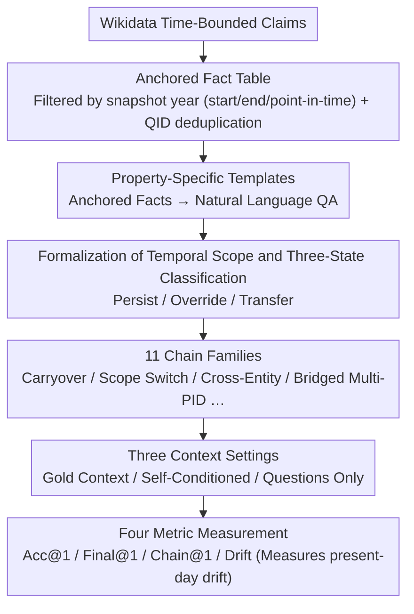

# Evaluating Temporal Consistency in Multi-Turn Language Models

**Conference**: ACL 2026  
**arXiv**: [2604.23051](https://arxiv.org/abs/2604.23051)  
**Code**: <https://github.com/yashkumaratri/ChronoScope>  
**Area**: LLM Evaluation / Temporal Reasoning / Multi-turn Dialogue  
**Keywords**: Temporal Consistency, Multi-turn QA, ChronoScope, Wikidata, present-day bias

## TL;DR
This paper introduces ChronoScope, an evaluation suite containing 1.46 million automatically synthesized multi-turn QA chains based on Wikidata. It specifically tests whether LLMs can "maintain previously implied temporal scopes" during multi-turn interactions. The study finds that high-performing models, including GPT-4 and Gemini-2.5, systematically suffer from "present-day drift," which worsens as interactions lengthen and cannot be eliminated even with oracle context.

## Background & Motivation

**Background**: Single-turn temporal QA (e.g., TempQuestions, TimeQA, TimeR1, PAT-Questions) has been extensively studied. However, these benchmarks typically provide "explicit time markers in every question"—models can correctly retrieve information simply by identifying markers like "in 2010" in the prompt. In real multi-turn dialogues, users often set the temporal framework only in the first turn, with subsequent follow-ups implicitly adopting it without repeating the year.

**Limitations of Prior Work**: LLMs exhibit highly unstable performance in these "implicit temporal inheritance" scenarios. While a model may possess the correct factual knowledge (e.g., answering correctly about the UK Prime Minister in 2010 in a single turn), it often shifts to answers relevant to 2024 when the context requires carrying over the 2010 scope to the next sentence (e.g., "What policies did he lead?"). This "factually correct but temporally mismatched" failure mode has not been systematically quantified by existing benchmarks.

**Key Challenge**: Single-turn factual accuracy $\neq$ multi-turn temporal consistency. The parameters and knowledge base remain unchanged, yet the model's interpretation of queries drifts during multi-turn inference. This reveals a failure in inference-time context binding rather than a knowledge gap.

**Goal**: (i) Formalize "temporal scope stability" as a measurable multi-turn property; (ii) construct a benchmark that isolates this failure mode under controlled conditions; (iii) systematically quantify failure rates of SOTA models across four temporal patterns: implicit carryover, explicit switch, cross-entity transfer, and long trajectories.

**Key Insight**: The authors adopt the linguistic framework of Reichenbach (1947) involving "speech time / event time / reference time" and Discourse Representation Theory. They treat "temporal scope" as an implicit discourse state variable maintained across turns, which can be explicitly overridden, implicitly inherited, or transferred to related entities.

**Core Idea**: Utilizing time-bounded facts from the Wikidata knowledge graph and deterministic templates, the authors generate 1.46 million chains. Each chain is explicitly labeled with its scope transition pattern (11 chain families) and evaluated under three context settings, allowing "present-day bias" to be measured as an independent metric (Drift).

## Method

### Overall Architecture

ChronoScope aims to isolate the "correct facts, mismatched time" failure: where a speaker sets a temporal scope in the first turn, but the model silently drifts back to the present in subsequent turns. To achieve this, the authors developed an entirely deterministic, two-stage pipeline requiring no human or LLM generation. First, an anchored fact table is constructed (filtering Wikidata claims via start/end/point-in-time for each snapshot year and anchored date, deduplicating via QID). Then, property-specific templates convert these facts into natural language QA pairs, combined into multi-turn chains according to 11 chain families. The evaluation process runs these chains under three context settings and measures performance using four metrics: Acc@1, Final@1, Chain@1, and Drift, where Drift specifically captures the "drift back to the present" phenomenon.

### Key Designs

**1. Formalization of Temporal Scope and Three-State Classification: Turning "implicit context inheritance" into a scorable discrete state.** 

"Whether a model maintains time" was previously an ambiguous concept. This study formalizes a chain as $\{(q_1,a_1),\dots,(q_L,a_L)\}$, where the first turn explicitly provides an anchor year (e.g., "In 2010"). Subsequent turns follow three evolution paths: Persist (inheritance), Override (replaced by a new time), or Transfer (migration to a related entity while retaining time). Each chain is labeled as one of 11 families, with "Avg Scope Shift" and "Implicit Turns %" quantitatively defined. Unlike previous multi-turn QA benchmarks (e.g., HotpotQA, CoQA) that assume factual stability, this classification allows precise attribution of failures to inheritance, switching, or transfer errors.

**2. 11 Chain Families: Covering the temporal pattern space with a minimal yet complete set of templates.** 

To prevent models from overfitting to a single template, 11 categories explore different failure modes: Carryover/Carryover-Then test basic implicit inheritance; Scope Switch tests explicit overriding; Cross-Entity Then tests entity switching while maintaining time; Multi-Turn Chain (3–6 turns) tests long-range stability; Change Point tests sudden explicit switches after implicit turns; Interval Reasoning/Change/Distinct Count test duration-based temporalities; Temporal Narrative simulates chronicles; and Bridged Multi-PID tests multiple properties under a fixed temporal constraint. Varying chain lengths and scope shifts allow for stress testing and attribution—for instance, high failure rates in Bridged Multi-PID highlight weaknesses in multi-hop reasoning under temporal constraints.

**3. Three Context Settings + Drift Metric: Decoupling "knowledge gaps" from "temporal drift."** 

Incorrect answers may stem from a lack of knowledge or choosing the wrong time; these must be separated. The study employs three settings: Gold Context injects ground-truth answers in each turn to eliminate single-turn factual errors; Self-Conditioned uses the model's own previous prediction as context to observe error propagation; and Questions Only provides no context as a baseline. The Drift metric specifically measures if an incorrect answer matches the ground truth for the present day (2025). If Drift remains high under Gold Context, it proves the issue is not error accumulation but the model's inability to maintain the implicit temporal state—this constitutes the most diagnostic experimental design in the paper.

> No models are trained in this study; all evaluations are performed in a zero-shot setting. Details on prompting, decoding, sampling, and matching are provided in Appendix A.2.1. Higher values are better for Acc@1, Final@1, and Chain@1, while lower values are better for Drift.

## Key Experimental Results

### Main Results

| Model | Gold Acc@1 | Gold Final@1 | Gold Drift | Self Final@1 | Self Drift |
|------|------------|--------------|------------|--------------|------------|
| ChatGPT-4 | 0.441 | 0.516 | 0.163 | 0.353 | 0.215 |
| Gemini-2.5-Flash | 0.384 | 0.446 | 0.197 | 0.264 | 0.254 |
| ChatGPT-3.5 | 0.323 | 0.384 | 0.226 | 0.226 | 0.284 |
| Qwen-2.5-7B | 0.306 | 0.387 | 0.042 | 0.286 | 0.007 |
| Qwen-3-4B | 0.292 | 0.382 | 0.066 | 0.130 | 0.013 |
| DeepSeek-V3 | 0.247 | 0.276 | 0.081 | 0.291 | 0.008 |
| LLaMA-3.1-8B | 0.253 | 0.306 | 0.022 | 0.249 | 0.008 |

The strongest model, GPT-4, achieves a Final@1 of only 0.516 under Gold Context, with a Drift as high as 0.163. Gemini-2.5-Flash shows a Drift near 0.20. While commercial models are generally stronger, they exhibit higher Drift, suggesting that RLHF may bias them toward providing "the most current facts."

### Ablation Study

| Configuration / Failure Mode | Performance | Key Observation |
|----------------|------|----------|
| Gold Context (Oracle) | GPT-4 Final@1=0.516, Drift=0.163 | Systematic drift persists even with oracle context |
| Self-Conditioned | Final@1 generally drops by 0.1-0.2 | Error propagation amplifies scope drift |
| Questions Only | Acc@1 < 0.2 across the board | Without context, models almost entirely shift to present-day answers |
| Open-source vs. Commercial | Drift: Qwen/LLaMA < 0.05, GPT-4/Gemini > 0.15 | Stronger models exhibit more severe present-day bias |
| Long Chains (Multi-Turn) | Final@1 declines monotonically | Increased interaction length exacerbates drift |

### Key Findings
- **The Counter-intuitive Drift Trend**: Smaller open-source models (Qwen 7B / LLaMA 8B) generally show Drift < 0.05, while GPT-4 and Gemini-2.5 exceed 0.15-0.20. The authors hypothesize that more aggressive RLHF training to "always be helpful and current" leads these models to favor 2024 information.
- **Oracle Context Does Not Eliminate Drift**: Even when previous correct answers are injected via Gold Context, Drift remains between 0.04 and 0.23. This critical finding suggests the problem is not a retrieval or memory issue but an inherent flaw in inference-time scope binding.
- **Chain Length Correlation**: Final@1 scores continuously drop from 2-turn to 11-turn chains, indicating that processing more context does not mitigate the issue but amplifies it.
- **Extremely Low Chain@1 (Generally < 0.10)**: Metrics requiring the entire chain to be correct are near zero, showing that multi-turn consistency in LLMs still requires orders of magnitude of improvement.

## Highlights & Insights
- **Decoupling Present-Day Bias from Hallucination**: Previous research often categorized incorrect current facts as hallucinations. ChronoScope's Drift metric proves these are not "unknowns" but "mis-selected times." This distinction points toward fixing inference-time scope binding rather than just updating knowledge.
- **Full Determinism at a 1.46M Scale**: Sourcing questions from Wikidata and fixed templates without human or LLM intervention ensures perfect reproducibility and scalability to new data snapshots with zero labeling costs.
- **Revitalizing Linguistic Theory**: Applying the Reichenbach framework to LLM evaluation is a clever use of classical linguistics, suggesting the NLP community should refer back to discourse theory rather than reinventing concepts.

## Limitations & Future Work
- The evaluation covers factoid QA only and does not address non-factual information (e.g., opinions or plans) that change over time, which may have different scope binding properties.
- The Drift metric relies on finding a corresponding present-day answer, which is not possible for attributes without a 2025 equivalent (e.g., the current profession of a deceased individual).
- No mitigation strategies were provided. Future work could explore explicit "today is 2010" prompts or adding temporal-anchored preference data during RLHF.
- The 11 chain families are manually designed and may miss certain scope evolution patterns in real-world dialogues, such as negative temporal constraints.

## Related Work & Insights
- **vs. TimeQA / TimeR1 / PAT-Questions**: These are single-turn tasks with explicit time; ChronoScope treats temporal scope as an implicit multi-turn state variable, uncovering unique failure modes.
- **vs. Laban et al. (2025) / Parrot / MTSA**: While other multi-turn benchmarks focus on underspecified queries, this work isolates the temporal dimension, making it more controllable and diagnostic.
- **Continual Learning Perspective**: The authors compare "temporal scope stability" to an inference-time version of "continual knowledge retention." While continual learning addresses parameter-level knowledge, this work addresses inference-level context binding, providing a bridge for potential mitigation techniques.

## Rating
- Novelty: ⭐⭐⭐⭐⭐ The first multi-turn benchmark specifically targeting "implicit temporal scope stability."
- Experimental Thoroughness: ⭐⭐⭐⭐ Extensive testing (9 models × 3 settings × 11 families), though limited to zero-shot without few-shot or CoT comparisons.
- Writing Quality: ⭐⭐⭐⭐⭐ Clear concepts, logical progression, and an intuitive Drift metric.
- Value: ⭐⭐⭐⭐⭐ 1.46M automatically generated, reproducible samples exposing a significant failure mode in strong models.

<!-- RELATED:START -->

## Related Papers

- [\[ICLR 2026\] Multi-turn Evaluation of Anthropomorphic Behaviours in Large Language Models](../../ICLR2026/llm_evaluation/multi-turn_evaluation_of_anthropomorphic_behaviours_in_large_language_models.md)
- [\[ACL 2026\] Beyond Itinerary Planning: A Real-World Benchmark for Multi-Turn and Tool-Using Travel Tasks](beyond_itinerary_planning-a_real-world_benchmark_for_multi-turn_and_tool-using_t.md)
- [\[ICLR 2026\] LLMs Get Lost In Multi-Turn Conversation](../../ICLR2026/llm_evaluation/llms_get_lost_in_multi-turn_conversation.md)
- [\[ACL 2026\] Modeling Multi-Dimensional Cognitive States in Large Language Models under Cognitive Crowding](modeling_multi-dimensional_cognitive_states_in_large_language_models_under_cogni.md)
- [\[ACL 2026\] ReTraceQA: Evaluating Reasoning Traces of Small Language Models in Commonsense Question Answering](retraceqa_evaluating_reasoning_traces_of_small_language_models_in_commonsense_qu.md)

<!-- RELATED:END -->
