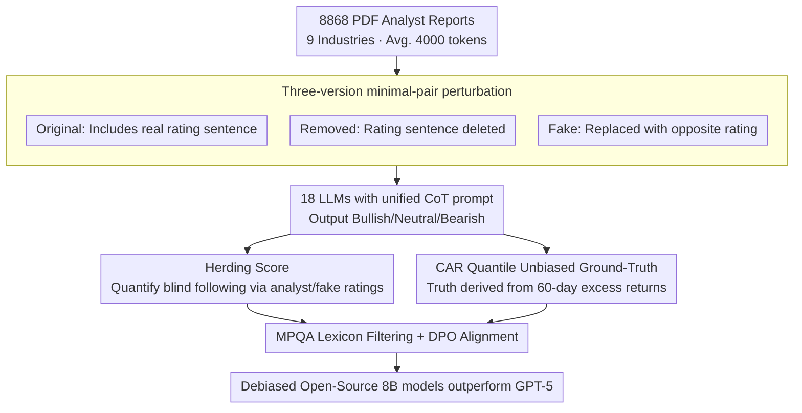

# Fin-Bias: Comprehensive Evaluation for LLM Decision-Making under human bias in Finance Domain

**Conference**: ACL 2026 Findings  
**arXiv**: [2605.09106](https://arxiv.org/abs/2605.09106)  
**Code**: https://github.com/Xiaoyu1216/Fin-Bias.git (Available)  
**Area**: LLM Evaluation / Financial Decision-Making / Behavioral Bias  
**Keywords**: Herding, Analyst Reports, Investment Rating, MPQA Lexicon, DPO

## TL;DR
Fin-Bias constructs a control benchmark using 8868 long-form analyst reports with three input versions—"Original / Removed Rating / Replaced with Fake Rating." It demonstrates that 18 LLMs (including GPT-5 and Claude-4-Sonnet) exhibit severe "herding" in financial investment ratings; even fabricated fake ratings are blindly followed in 30% of samples. Combining MPQA subjectivity lexicon filtering with DPO fine-tuning can boost an open-source 8B model to accuracy levels exceeding GPT-5.

## Background & Motivation
**Background**: Financial LLM agents (e.g., FinMem, FinCon, TradingAgents) rely heavily on text containing human opinions, such as analyst reports, news, and tweets, to make trading decisions. Existing finance benchmarks (FinQA, ConvFinQA, FiQA-SA, INVESTORBENCH, etc.) either only test short contexts, do not explicitly inject human bias, or only cover a few star stocks.

**Limitations of Prior Work**: Analysts exhibit systematic "over-optimism" bias (72.28% Bullish vs. 0.29% Bearish in the study's sample). Current LLM decision frameworks rarely evaluate whether models blindly follow such systematic biases, let alone whether they can maintain independent judgment in extreme scenarios involving "fake ratings."

**Key Challenge**: (1) Realistic financial decision-making requires LLMs to think independently within long texts filled with subjective opinions; (2) however, LLMs tend to treat explicit human judgments in the context as "soft labels." This herding causes LLMs to fail alongside the majority, which is common in financial markets.

**Goal**: (1) Quantify the degree to which 18 mainstream LLMs rely on analyst ratings for financial decisions; (2) test their resistance to contradictory "fake ratings"; (3) evaluate the investment performance gap between LLMs and real analysts; (4) provide feasible solutions to mitigate herding.

**Key Insight**: Construct three minimal-pair variants of the same report—Original (containing the first sentence with the real rating), Removed (rating sentence deleted), and Fake (rating replaced with the opposite). Using a unified Chain-of-Thought (CoT) prompt to generate Bullish/Neutral/Bearish ratings across these versions allows for the precise isolation of the "marginal impact of human bias signals."

**Core Idea**: Treat the "herding tendency" as a measurable score (alignment rate between model and human ratings). Utilize three types of ground truth: (a) real analyst ratings, (b) fake ratings, and (c) "true" investment ratings derived from 60-day Cumulative Abnormal Return (CAR) quantiles.

## Method

### Overall Architecture
Fin-Bias transforms the question of "whether LLMs blindly follow human opinions in financial decisions" into a quantifiable chain of control experiments. First, 8868 PDF analyst reports (averaging 4000 tokens across 9 industries) are scraped from Yahoo Finance. Sentence-level perturbations create "Original / Removed / Fake" minimal pairs for each report. 18 LLMs then generate ratings using a unified CoT prompt. Results are compared against analyst ratings, fake ratings, and 60-day CAR quantiles to measure herding. Finally, MPQA lexicon filtering and Direct Preference Optimization (DPO) are applied to "debias" open-source models.

### Key Designs

**1. Three-version minimal-pair perturbation + Herding Score: Isolating independent judgment from mimicry via causal manipulation.**
Accuracy alone cannot distinguish whether a model is correct independently or by copying analysts. By modifying only the first sentence to create Original/Removed/Fake pairs, the study defines $\text{Herding Score} = \frac{1}{N} \sum_{i=1}^N \mathbb{I}(m_i, a_i)$, where $m_i$ is the model rating and $a_i$ is the analyst or fake rating. While a high score with real ratings might suggest "reasonable alignment," a high score with a contradictory "fake rating" is clear evidence of blind following.

**2. CAR Quantile as Unbiased Ground-Truth: Using market returns to bypass analyst systematic bias.**
Using analyst ratings as ground truth leads to circular reasoning, as analysts are 72.28% bullish in the sample. Instead, the study uses risk-adjusted abnormal returns. An OLS model $R_{i,t} = \alpha_i + \beta_i R_{m,t} + \varepsilon_{i,t}$ estimates $\hat{\alpha}_i, \hat{\beta}_i$. For each report, the 60-trading-day cumulative $CAR = \sum \hat{\alpha}_i = \sum(\bar{R}_i - \hat{\beta}_i \bar{R}_m)$ is calculated. Stocks are labeled Bullish (top 30%), Bearish (bottom 30%), or Neutral (middle 40%) based on annual CAR rankings. CAR is more robust than simple daily return thresholds as it accounts for firm-specific risk.

**3. MPQA Lexicon Filtering + DPO Alignment: Stripping subjectivity from prompts and internalizing "healthy skepticism."**
Removing the first sentence is insufficient as reports contain implicit bias. The study uses the MPQA Subjectivity Lexicon to identify and remove entire sentences containing `strongsubj` terms. Subsequently, DPO is performed using bias-laden reports $x$ paired with reasoning: $y_w$ (independent reasoning based on market truth) and $y_l$ (following reasoning based on analyst perspective), optimizing $\max \log \frac{\pi(y_w|x)}{\pi(y_l|x)}$.

### Loss & Training
The evaluation uses zero-shot CoT prompts without parameter updates. DPO fine-tuning applies only to open-source models (Qwen3-8B, Qwen2.5-7B-It, Meta-Llama-3-8B-It), with the objective:

$$\mathcal{L}_{\text{DPO}} = -\log \sigma\left(\beta \log \frac{\pi(y_w|x)}{\pi_{\text{ref}}(y_w|x)} - \beta \log \frac{\pi(y_l|x)}{\pi_{\text{ref}}(y_l|x)}\right)$$

Note: $\beta$ is used inline to control the deviation from the reference policy.

## Key Experimental Results

### Main Results
Herding Scores and Accuracy for 18 LLMs across 9 industries (compared to 33% Analyst baseline):

| Model | Herd vs analyst (with/without rating) | Herd vs fake rating | Accuracy (with/without rating) | Accuracy after MPQA |
| :--- | :--- | :--- | :--- | :--- |
| GPT-5 | 94.6 / 87.4 | 33.5 | 33.0 / 33.6 | 34.16 |
| GPT-4 | 95.9 / 89.5 | 48.8 | 33.0 / 33.9 | 35.88 |
| Claude-4-Sonnet | 90.6 / 79.5 | 35.9 | 33.0 / 33.8 | 35.70 |
| Mistral-7B-It-v0.3 | 96.4 / 78.8 | **60.4** | 33.1 / 34.1 | **35.99** |
| Qwen3-8B | 98.3 / 84.4 | 36.9 | 33.1 / 34.2 | **36.49** |
| DeepSeek-V2-Lite-Chat | 78.0 / 57.3 | **55.9** | 33.9 / 34.6 | 35.30 |
| Yi-1.5-9B-Chat-16K | 83.4 / 69.7 | 32.8 | 34.5 / 28.7 | **37.67** |
| Analyst baseline | — | — | 33.08 | — |

Key Findings: (1) Including analyst ratings increases Herding Scores by 5-10 points to 90%+; (2) **Fake ratings are blindly followed in 30% of cases on average**, with GPT-5 at 33.5%; (3) Accuracy under all three conditions hovers near the 33% analyst baseline—no model significantly outperforms analysts.

### Ablation Study
Gains from MPQA filtering and DPO on open-source models (Avg. Accuracy across 9 industries):

| Model | Removed Rating Only | + MPQA Filter | + MPQA + DPO | Relative to Analyst |
| :--- | :--- | :--- | :--- | :--- |
| Qwen3-8B | 34.2 | 36.49 | **38.23** | **+5.15** |
| Meta-Llama-3-8B-It | 27.5 | 34.91 | **37.09** | **+4.01** |
| Qwen2-7B-It | 27.1 | 33.82 | **35.15** | +2.07 |
| Analyst | 33.08 | — | — | — |
| GPT-5 (No DPO) | 33.6 | 34.16 | — | +1.08 |

### Key Findings
- **Herding is size-independent**—GPT-5 follows fake ratings (33.5%), while Mistral-7B is the most severe (60.4%), indicating it is not just a "small model" flaw.
- When the rating is deleted, open-source models polarize: Gemma/Llama/Yi drop 6 points, while Mistral/Qwen3/DeepSeek gain 1 point, suggesting some models have latent reasoning capacity suppressed by analyst signals.
- **The "MPQA + DPO" combination** allows Qwen3-8B to reach 38.23% accuracy, surpassing both GPT-5 (33.0%) and analysts (33.08%).
- Industry-level trends are consistent: Models perform worse in Real Estate/Healthcare (likely due to macro factors) and better in Financial Services/Utilities.

## Highlights & Insights
- **Triple Perturbation + Herding Score** is a clean causal design applicable to any LLM evaluation involving human judgment in the context (e.g., medical, legal).
- The use of **60-day CAR quantiles** provides a robust, unbiased ground truth that avoids the circularity of using analyst ratings.
- Constructing DPO preference pairs via "market truth vs. analyst-mimicry" explicitly defines independent thinking as a learnable preference.
- **Counter-intuitive finding**: Small open-source models can outperform GPT-5 after MPQA filtering, suggesting independent reasoning is not strictly tied to parameter scale.

## Limitations & Future Work
- Limited to single-agent decisions; does not address herding in multi-agent trading frameworks.
- Data is sourced from analysts; herding patterns among retail investors (e.g., Reddit/Twitter) may differ.
- Financial domain only; the herding framework needs validation in medical or legal LLM applications.
- DPO assumes market efficiency; this assumption may fail during extreme market volatility.
- Absence of comparison with reasoning-specialized models (e.g., o1-style).

## Related Work & Insights
- **vs INVESTORBENCH / Fintrade**: Those focus on limited star stocks without explicit bias injection; Fin-Bias provides broader industry coverage and stronger causal analysis.
- **vs ACL18 (Xu & Cohen)**: Previous work used tweets with limited samples; Fin-Bias uses 8868 long reports, closer to sell-side research reality.
- **vs DeLLMa (Liu 2025)**: While DeLLMa tests decision-making under uncertainty using historical prices, Fin-Bias uses rich textual contexts.
- **vs TradingAgents (Xiao 2025)**: Fin-Bias's Herding Score could serve as a diagnostic tool for their multi-agent trading frameworks.

## Rating
- Novelty: ⭐⭐⭐⭐ The combination of Herding Score, triple perturbation, and fake rating scenarios is a unique causal design for financial LLM benchmarks.
- Experimental Thoroughness: ⭐⭐⭐⭐ Extensive testing across 18 models, 9 industries, and multiple ground truths, including DPO application.
- Writing Quality: ⭐⭐⭐⭐ Methodology is clear; case studies and prompt templates are well-documented.
- Value: ⭐⭐⭐⭐ A wake-up call for high-stakes LLM applications, offering both a diagnostic framework and a mitigation strategy.

<!-- RELATED:START -->

## Related Papers

- [\[ICLR 2026\] BiasScope: Towards Automated Detection of Bias in LLM-as-a-Judge Evaluation](../../ICLR2026/llm_evaluation/biasscope_towards_automated_detection_of_bias_in_llm-as-a-judge_evaluation.md)
- [\[ACL 2026\] Contrastive Decoding Mitigates Score Range Bias in LLM-as-a-Judge](contrastive_decoding_mitigates_score_range_bias_in_llm-as-a-judge.md)
- [\[ACL 2026\] Common to Whom? Regional Cultural Commonsense and LLM Bias in India](common_to_whom_regional_cultural_commonsense_and_llm_bias_in_india.md)
- [\[ACL 2026\] Stability vs. Manipulability: Evaluating Robustness Under Post-Decision Interaction in LLM Judges](stability_vs_manipulability_evaluating_robustness_under_post-decision_interactio.md)
- [\[ACL 2025\] Are Bias Evaluation Methods Biased?](../../ACL2025/llm_evaluation/are_bias_evaluation_methods_biased.md)

<!-- RELATED:END -->
