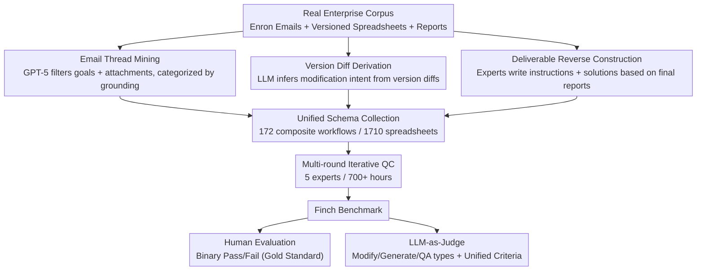

# Finch: Benchmarking Finance & Accounting across Spreadsheet-Centric Enterprise Workflows

**Conference**: ACL 2026 Findings  
**arXiv**: [2512.13168](https://arxiv.org/abs/2512.13168)  
**Code**: [HuggingFace](https://huggingface.co/FinWorkBench)  
**Area**: LLM Evaluation  
**Keywords**: Finance & Accounting, Spreadsheets, Enterprise Workflows, Agent Evaluation, Long-horizon Tasks

## TL;DR

This paper introduces Finch (FinWorkBench), a benchmark for financial and accounting (F&A) workflows constructed from authentic enterprise environments (e.g., the Enron dataset). It comprises 172 composite workflows and 1,710 spreadsheets (27 million cells). Even the most advanced Agent, GPT 5.1 Pro, achieves only a 38.4% success rate despite an average execution time of 16.8 minutes, highlighting significant deficiencies of state-of-the-art AI Agents in real-world corporate scenarios.

## Background & Motivation

**Background**: Frontier AI systems (Claude, ChatGPT, Gemini, Copilot) are increasingly integrated into daily enterprise workflows. Finance and Accounting (F&A) is a high-stakes, knowledge-intensive domain critical to every organization. The impact of AI-assisted tools is growing across document drafting, data exploration, and spreadsheet manipulation.

**Limitations of Prior Work**: (1) Real-world F&A work is inherently messy—artifacts are interconnected across heterogeneous spreadsheets, PDFs, and other documents, undergoing collaborative editing through multiple versions; (2) Spreadsheets contain complex structures—cross-sheet references, irregular layouts, merged cells, implicit formula chains, and charts; (3) Workflows are long-horizon—requiring multi-step reasoning that spans data entry, editing, retrieval, calculation, modeling, validation, and report generation; (4) Existing benchmarks typically rely on clean, single-table inputs, failing to reflect authentic complexity.

**Key Challenge**: Can today's frontier AI Agents truly handle the messy, long-horizon, knowledge-intensive workflows that professionals encounter daily?

**Goal**: To construct the first truly enterprise-grade F&A workflow benchmark sourced from real corporate environments while maintaining original multimodal complexity.

**Key Insight**: Mine authentic workflows from collaboration threads and spreadsheet version histories within the Enron email corpus—following the principle that "existence precedes essence."

**Core Idea**: Workflows should be formalized after being observed in real enterprise environments rather than being manually designed. The benchmark is constructed through three paths: email thread extraction, version difference analysis, and expert annotation.

## Method

### Overall Architecture

Finch adheres to the philosophy that "existence precedes essence"—workflows should not be designed in a vacuum by humans but should first be observed in real enterprise environments and then formalized. Starting from the Enron email corpus and versioned spreadsheets, the data is constructed along three paths: business objectives naturally described in email threads, modification intentions implicit in continuous version differences, and task instructions reverse-engineered from final delivery reports. Workflows produced by these three paths are integrated into a unified schema (natural language instructions + input files + reference solutions). Following over 700 hours of multi-round iterative quality control by five experts, the benchmark was finalized with 172 composite workflows and 1,710 spreadsheets (27 million cells). The evaluation adopts a two-tier human-machine framework: human evaluation provides the gold-standard binary pass/fail, while LLM-as-Judge automatically scores modification, generation, and QA tasks for scalable assessment. The evaluation targets include both product-side Agents (ChatGPT GPT 5.1 Pro, Claude Sonnet/Opus 4.5 Thinking Mode) and API-side models (GPT 5.1, Gemini 3 Pro, Grok 4, Qwen 3 Max, etc.), utilizing SpreadsheetBench as the baseline code generation framework.

### Key Designs

**1. Workflow Mining from Email Threads: Treating collaboration as the "natural documentation" of workflows**  
Real F&A goals and contexts are often scattered across daily emails rather than explicit task specifications. This study uses GPT-5 to filter the Enron corpus (15,000 files + 500,000 emails) for collaborative messages that meet two criteria: an explicitly stated business goal and the inclusion of one or more spreadsheet attachments. Cases with both input and reference artifacts available are classified as "strongly grounded," while those with partial artifacts are classified as "weakly grounded" and completed by experts, thereby solidifying real intentions hidden in communication streams into evaluable workflows.

**2. Workflow Derivation from Version Differences: Conducting "archaeology" on spreadsheet modification history**  
Many workflows are not described in emails but are clearly written in the evolution of file versions. This study collects versioned workbook families and uses LLMs to perform pairwise comparisons of continuous version differences (diffs) to infer the underlying data transformation and analysis steps, along with their detailed descriptions. These are then verified by human experts to ensure the differences constitute meaningful workflows rather than accidental changes. This path supplements implicit workflows not covered by email mining and serves as a unique data source for Finch.

**3. Reverse Construction from High-Quality Deliverables: Deducing tasks from expert-level final products**  
While the first two paths mine workflows from "process traces," enterprises also possess large volumes of completed, high-quality products. Domain experts used these final deliverables as reference solutions to reverse-engineer workflow instructions that fit real scenarios and construct corresponding input files. Examples include transforming investment banking valuation models into financial modeling tasks, World Bank reports into data summarization and visualization tasks, and Canadian government bilingual documents into translation and consistency check tasks. Additionally, a small number of samples from existing datasets like WideSearch and DABStep were expanded into multi-step workflows to further enrich task coverage. All flows were unified into the same schema and underwent multi-round QC (approx. 40% required at least one revision, 20+ required over three rounds).

**4. Two-Layer Human-Machine Evaluation Framework: Ensuring reliable judging for messy spreadsheets**  
Spreadsheets cannot be evaluated by simple cell-by-cell comparison—equivalent formulas or alternative layouts may be valid. A two-layer framework was established: human experts provide a binary pass/fail by comparing inputs, references, and model outputs as the gold standard; LLM-as-Judge categorizes tasks into Modify, Generate, and QA, using specialized prompts but shared scoring criteria for automatic grading. Both layers focus on completeness, numerical and logical correctness, avoidance of over-editing, and formatting readability, ensuring consistency while enabling scalability (automated evaluation aligns with human judgment on 82%–90% of workflows).

## Key Experimental Results

### Main Results

| Model/Agent | Workflow Pass Rate |
|-----------|------------|
| GPT 5.1 Pro (Human Eval) | 38.4% |
| Claude Opus 4.5 | Second strongest but <50% |
| Gemini 3 Pro | Significantly lower than GPT 5.1 |
| GPT 5.1 Pro ≤2 tasks | 44.3% |
| GPT 5.1 Pro >2 tasks | 23.5% |
| GPT 5.1 Pro (with PDF/Image) | 35.0% |

### Ablation Study

| Complexity Dimension | Impact |
|-----------|------|
| Task Composability | ≤2 tasks 44.3% → >2 tasks 23.5%, severe error accumulation |
| Multimodal Artifacts | Drops to 35.0% when PDFs/Images are included |
| Spreadsheet Complexity | Median 15K cells, Max 3.7 million cells |
| Tool Invocation Frequency | Median 16 calls, Range 6-107 calls |
| Long-horizon Dependencies | Frequent failures due to cross-table references and implicit formula chains |

### Key Findings

- Even the strongest Agent (GPT 5.1 Pro) passes only 38.4% on the benchmark annotated with 700+ hours of expert labor.
- Composability is a critical bottleneck—the pass rate for multi-task workflows is nearly half that of single-task workflows.
- Messy spreadsheet structures (merged cells, nested headers, irregular layouts) frequently lead to data retrieval errors.
- Agents struggle to reconstruct implicit business logic encoded within spreadsheet formulas.
- LLM-as-Judge demonstrates high consistency with human evaluation, providing a scalable evaluation solution.

## Highlights & Insights

- The "existence precedes essence" philosophy for dataset construction is compelling—mining workflows from real corporate emails and version histories is more authentic than manual design.
- 92.4% of workflows involve multiple spreadsheets, and the average scale of 8 sheets far exceeds existing benchmarks—reflecting actual enterprise scenarios.
- The 38.4% pass rate serves as a sobering reminder for the industry—AI is still far from achieving full "automation" in corporate F&A tasks.
- The investment of 700+ hours in annotation and multi-round QC ensures the high quality of the benchmark.

## Limitations & Future Work

- Primarily English-based and does not cover multilingual enterprise scenarios.
- While the Enron data is authentic, it is dated (the 2000s), and some business practices may be obsolete.
- Binary pass/fail evaluation for workflows may be unfair to partially completed high-quality work.
- Real-time collaboration and multi-Agent scenarios are not yet covered.

## Related Work & Insights

- **vs SpreadsheetBench**: The latter is designed for smaller, cleaner spreadsheet tasks, while Finch extends to large, messy, enterprise-grade artifacts.
- **vs DABStep**: The latter focuses on data analysis steps, whereas Finch covers end-to-end composite workflows.
- **vs WideSearch**: The latter focuses on web search tasks, which Finch integrates as components of larger workflows.

## Rating

- Novelty: ⭐⭐⭐⭐⭐ The first truly enterprise-grade F&A workflow benchmark; the methodology of mining workflows from emails/version history is novel.
- Experimental Thoroughness: ⭐⭐⭐⭐⭐ Includes multiple frontier models/Agents, human + automatic evaluation, and detailed complexity analysis.
- Writing Quality: ⭐⭐⭐⭐⭐ The dataset construction process is transparent and detailed, with comprehensive statistical analysis.
- Value: ⭐⭐⭐⭐⭐ Provides a much-needed high-quality authentic benchmark for evaluating enterprise AI Agents.

<!-- RELATED:START -->

## Related Papers

- [\[ACL 2026\] AgentEval: DAG-Structured Step-Level Evaluation for Agentic Workflows with Error Propagation Tracking](agenteval_dag-structured_step-level_evaluation_for_agentic_workflows_with_error_.md)
- [\[ACL 2026\] Fin-Bias: Comprehensive Evaluation for LLM Decision-Making under human bias in Finance Domain](fin-bias_comprehensive_evaluation_for_llm_decision-making_under_human_bias_in_fi.md)
- [\[ICLR 2026\] DRBench: A Realistic Benchmark for Enterprise Deep Research](../../ICLR2026/llm_evaluation/drbench_a_realistic_benchmark_for_enterprise_deep_research.md)
- [\[ICLR 2026\] DAComp: Benchmarking Data Agents across the Full Data Intelligence Lifecycle](../../ICLR2026/llm_evaluation/dacomp_benchmarking_data_agents_across_the_full_data_intelligence_lifecycle.md)
- [\[ACL 2026\] AJ-Bench: Benchmarking Agent-as-a-Judge for Environment-Aware Evaluation](aj-bench_benchmarking_agent-as-a-judge_for_environment-aware_evaluation.md)

<!-- RELATED:END -->
