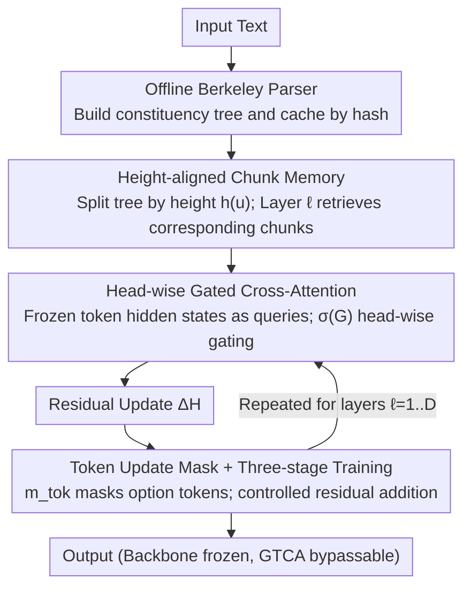

# Gated Tree Cross-Attention for Checkpoint-Compatible Syntax Injection in Decoder-Only LLMs

**Conference**: ACL 2026  
**arXiv**: [2602.15846](https://arxiv.org/abs/2602.15846)  
**Code**: <https://github.com/Pineandgrass/GatedTreeCrossAttention>  
**Area**: LLM Architecture / Syntax Injection / Checkpoint Compatibility  
**Keywords**: GTCA, syntax injection, checkpoint-compatible, constituency chunk memory, token update mask

## TL;DR
The authors attach a Gated Tree Cross-Attention side branch to frozen decoder-only LLMs (Qwen-2.5-7B, Llama-3-8B). An offline Berkeley parser pre-computes constituency trees, which are indexed by height into chunk memory. Token hidden states retrieve residual updates from this memory via head-wise gated cross-attention, combined with a token update mask and three-stage training to prevent interference. BLiMP accuracy improves from 78.58/79.95 to 83.12/84.61, while performance on MCQA, HellaSwag, and WinoGrande remains stable.

## Background & Motivation
**Background**: While decoder-only LLMs achieve high scores on aggregate benchmarks, they frequently fail fine-grained syntactic stress tests (BLiMP, HANS, CoLA). Probing work has repeatedly demonstrated that internal hidden states of LLMs can recover dependency geometry (Hewitt & Manning 2019), meaning syntax is "encoded."

**Limitations of Prior Work**: ① "Encoding $\neq$ usage"; recoverability does not imply active utilization—GPT-2 remains far from human performance on BLiMP. ② Mainstream syntax injection methods (modifying attention bias, tree-RNNs, dependency-aware attention) usually require architectural rewrites or full retraining, which are incompatible with pre-trained LLMs and can trigger catastrophic forgetting. ③ Parameter-efficient methods like LoRA/QLoRA do not alter the attention structure and cannot introduce explicit inductive biases like tree structures.

**Key Challenge**: Injecting explicit hierarchical signals into a pre-trained checkpoint without modifying the backbone or interfering with pretrained competence. Crucially, this must not affect likelihood-based MCQA scoring (modifying the hidden states of option tokens would pollute relative likelihoods).

**Goal**: Construct a "pluggable and bypassable" syntax injection path that allows the model to learn when and how much to rely on syntactic signals, achieving stable gains on syntactic benchmarks without degrading other capabilities.

**Key Insight**: Constituency parse trees are computed **offline** and cached by hash (eliminating parser overhead during training). Trees are partitioned into chunk memory by height and fed to corresponding Transformer layers in a layer-aligned fashion—higher layers receive higher chunks, while lower layers receive leaf chunks—aligning hierarchical inductive bias with the Transformer's natural layering.

**Core Idea**: Treat the tree structure as an **external cache + gated attention source** for the decoder-only LLM—similar to RAG, but retrieving syntactic chunks instead of documents—and use head-wise gates to let the model learn whether to utilize them.

## Method

### Overall Architecture
The core idea of GTCA is to attach a "pluggable" syntactic side branch to a pre-trained LLM without modifying the backbone. Input text is parsed offline into constituency trees using the Berkeley Neural Parser and cached. During training, the tree is partitioned into multi-layer chunk memory based on height. At layer $\ell$, the current token hidden state acts as a query to read the corresponding chunk memory via head-wise gated cross-attention, producing a residual update $\Delta H^\ell$. This update is filtered by a token update mask before being added back to the hidden state. The backbone parameters remain frozen, and the GTCA branch can be bypassed at any time.

### Key Designs

**1. Height-aligned Chunk Memory: Aligning Tree Height with Transformer Layers**

Feeding the entire parse tree into every layer introduces leaf-level noise to higher layers and violates the Transformer principle where "lower layers capture local syntax and higher layers capture global semantics." GTCA aligns with this by defining chunk height as $h(u)=D-\text{depth}(u)$, where leaf tokens have height 0. Each chunk $p_u$ is derived via mean-pooling tokens in its span $S(u)$, followed by a height-specific projection $W_{h(u)}\in\mathbb{R}^{d\times d}$ and LayerNorm to obtain $c_u$. Layer $\ell$ only retrieves chunks where $h(u)=\min(\ell, D)$, keeping up to $K=64$ chunks. This ensures that the interface for external tree information naturally matches the backbone's syntactic stratification.

**2. Head-wise Gated Cross-Attention: Learning to Use Syntax via Gating**

Hard-coding the backbone to absorb chunk signals at every layer can pollute pre-trained representations. GTCA introduces a head-level gate logit $G^\ell = H_{\text{pre}}^\ell W_G^\ell$ on top of standard cross-attention. The attention output is multiplied by a sigmoid gate: $\text{Gated\_Attn}^\ell = \text{Attn}^\ell \odot \sigma(G^\ell)$. Using a scalar gate per head rather than element-wise gating reduces parameters and stabilizes training. A causal mask is applied to maintain auto-regressivity. The final residual is $\Delta H^\ell = \text{Merge}(\text{Gated\_Attn}^\ell)W_O^{ca,\ell}$. Gating transforms explicit trees from "hard constraints" into "optional priors," allowing the model to perform self-learned sparse routing.

**3. Token Update Mask + Three-stage Training: Preserving Pretrained Capability**

To satisfy the "checkpoint-compatible" constraint, GTCA uses two safety mechanisms. Spatially, a binary mask $m_{\text{tok}}\in\{0,1\}^n$ controls the residual application: $H_{\text{post}}^\ell \leftarrow H_{\text{pre}}^\ell + \alpha_{\text{struct}}(m_{\text{tok}} \odot \Delta H^\ell)$. Option tokens in MCQA tasks are forced to $m_{\text{tok}}=0$ to prevent anchor log-probability shifts. Temporally, a three-stage schedule is used: first, only the GTCA projection and gates are trained; second, sub-modules interacting with GTCA are unfrozen; finally, the whole system is fine-tuned with a low learning rate. This prevents large cold-start $\Delta H$ values from destabilizing token states.

### Loss & Training
The model is trained using language modeling loss with an MCQA-friendly format. The three-stage schedule ensures stability. Chunk capacity is capped at $K=64$, and the scaling factor $\alpha_{\text{struct}}$ controls residual magnitude. Offline parsing via Berkeley Neural Parser ensures zero parser overhead during training.

## Key Experimental Results

### Main Results (BLiMP Syntactic Capability)

| Model | Baseline BLiMP | + GTCA | $\Delta$ |
|------|---------------|--------|----------|
| Qwen-2.5-7B | 78.58 | **83.12** | **+4.54** |
| Llama-3-8B | 79.95 | **84.61** | **+4.66** |

| Category | Task | Baseline | + GTCA | Description |
|------|------|----------|--------|------|
| Syntax | BLiMP | 78.58-79.95 | 83.12-84.61 | ~4-5 pp gain |
| Syntax | CoLA (GLUE) | — | Consistent gain | Grammaticality |
| MCQA | CLOTH | — | Stable/Slight gain | Cloze test |
| MCQA | MMLU | — | Stable/Slight gain | Knowledge QA |
| Common Sense | HellaSwag | — | Stable | Completion |
| Common Sense | WinoGrande | — | Stable | Coreference |

### Ablation Study

| Configuration | Key Metrics | Interpretation |
|------|---------|------|
| Full GTCA | BLiMP 83.12 | Complete model |
| w/o head-wise gate (Hard injection) | Significant drop | Backbone representation polluted |
| w/o token update mask (Modify options) | MCQA drop | Option likelihood drift |
| w/o three-stage training | Instability | Pretrained knowledge corrupted |
| Shared projection (vs. height-specific) | Slight BLiMP drop | Hierarchical coupling is necessary |

### Key Findings
- **Gating is critical for success**: Head-wise gating allows the backbone to preserve its representations while selectively utilizing structural information, transforming the "syntax vs. competence" trade-off into a learning problem.
- **Option tokens must be read-only**: In MCQA, applying syntactic updates to option tokens shifts their log-probabilities, corrupting answer selection. This is a vital engineering insight for continued training on decoders.
- **Layer-aligned chunk memory provides interpretable hierarchy**: UUAS probes show that GTCA enhances unlabeled undirected attachment consistency, with higher layers relying more on higher-level chunks.
- **Syntactic gains do not compromise general capability**: Stable performance on MCQA and common sense tasks proves that the three safety mechanisms (gate, mask, and schedule) successfully isolate interference.

## Highlights & Insights
- **"Syntax as RAG" Paradigm**: Treating parse trees as cacheable, bypassable, and gated external memory aligns syntax injection with RAG philosophies. This "hot-swappable" approach could extend to morphology or logic modules.
- **Checkpoint Compatibility is Essential**: Given the high cost of training modern LLMs, methods requiring architectural changes are often impractical. GTCA’s forward wrapper approach provides a flexible "add-on" strategy.
- **Token Update Mask as a Precise Detail**: Many methods overlook distinguishing which tokens should be modified. This work demonstrates how hidden state changes leak into likelihood-based evaluations.
- **Hierarchical Alignment**: Systematically verifying the "tree height $\leftrightarrow$ Transformer layer" mapping through UUAS probes and ablation provides a solid foundation for hierarchical inductive bias.

## Limitations & Future Work
- Evaluation is limited to ~7-8B models; scalability to larger MoE or hybrid architectures is untested.
- Dependency on external constituency parsers; parser errors are permanently cached, and noise robustness was not significantly discussed.
- Storage and engineering complexity for chunk memory management (hash indexing, span alignment) may hinder real-time streaming applications.
- While the 4-5 pp gain on BLiMP is significant, it remains below the 95+ human level; specific long-range syntactic dependencies were not analyzed in detail.
- Lack of an "equivalent parameter budget" comparison with standard PEFT methods like LoRA to isolate the benefit of structural bias versus extra parameters.

## Related Work & Insights
- **vs. Strubell et al. 2018**: Unlike methods that modify self-attention bias, GTCA uses bypass cross-attention, making it significantly more friendly to released checkpoints.
- **vs. Bai et al. 2021**: While sharing a "plug-in" philosophy, GTCA addresses the specific pain points of decoder-only models, such as MCQA-likelihood interference.
- **vs. Iwamoto et al. 2023**: GTCA provides a concrete engineering solution (token update mask) to the catastrophic forgetting problem discussed in their work.
- **vs. LoRA / Prefix-tuning**: GTCA is "structure-aware," providing an orthogonal path that could theoretically be combined with traditional PEFT.
- **vs. Hewitt & Manning 2019**: This work moves from "probing" (proving syntax exists) to "intervention" (proving syntax utilization improves performance), validated by increased attachment consistency.

## Rating
- Novelty: ⭐⭐⭐⭐ Combining external tree chunks, head-wise gating, and dual safety mechanisms is novel and robust.
- Experimental Thoroughness: ⭐⭐⭐⭐ Multiple backbones and benchmarks with internal probing, though limited in model scale.
- Writing Quality: ⭐⭐⭐⭐ Clear formalization and excellent explanation of the safety mechanisms.
- Value: ⭐⭐⭐⭐ Highly practical for industrial deployment due to checkpoint compatibility.

<!-- RELATED:START -->

## Related Papers

- [\[ACL 2026\] Evaluating Legal Reasoning Traces with Legal Issue Tree Rubrics](evaluating_legal_reasoning_traces_with_legal_issue_tree_rubrics.md)
- [\[ACL 2026\] HoWToBench: Holistic Evaluation for LLM's Capability in Human-level Writing using Tree of Writing](howtobench_holistic_evaluation_for_llms_capability_in_human-level_writing_using_.md)
- [\[ACL 2025\] CuLEmo: Cultural Lenses on Emotion - Benchmarking LLMs for Cross-Cultural Emotion Understanding](../../ACL2025/llm_evaluation/culemo_cultural_lenses_on_emotion_-_benchmarking_llms_for_cross-cultural_emotion.md)
- [\[NeurIPS 2025\] PARROT: A Benchmark for Evaluating LLMs in Cross-System SQL Translation](../../NeurIPS2025/llm_evaluation/parrot_a_benchmark_for_evaluating_llms_in_cross-system_sql_translation.md)
- [\[AAAI 2026\] MCTS-SQL: Light-Weight LLMs can Master the Text-to-SQL through Monte Carlo Tree Search](../../AAAI2026/llm_evaluation/mcts-sql_light-weight_llms_can_master_the_text-to-sql_through_monte_carlo_tree_s.md)

<!-- RELATED:END -->
