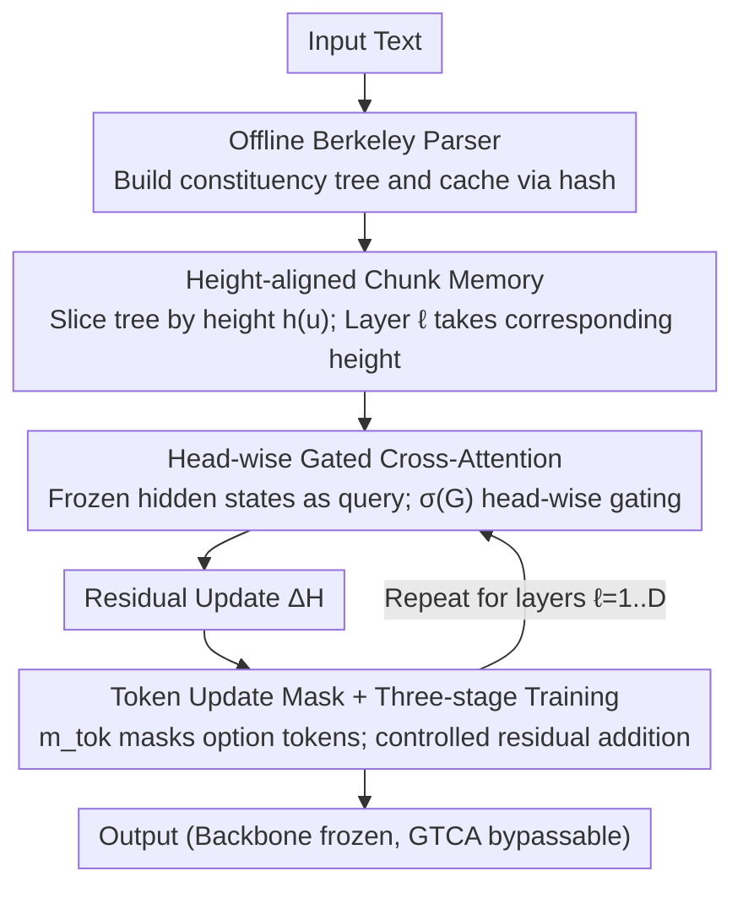

# Gated Tree Cross-Attention for Checkpoint-Compatible Syntax Injection in Decoder-Only LLMs

**Conference**: ACL 2026  
**arXiv**: [2602.15846](https://arxiv.org/abs/2602.15846)  
**Code**: <https://github.com/Pineandgrass/GatedTreeCrossAttention>  
**Area**: LLM Architecture / Syntax Injection / Checkpoint-compatible  
**Keywords**: GTCA, syntax injection, checkpoint-compatible, constituency chunk memory, token update mask

## TL;DR
The authors attach a Gated Tree Cross-Attention side branch to frozen decoder-only LLMs (Qwen-2.5-7B, Llama-3-8B). An offline Berkeley parser pre-calculates constituency trees, which are indexed into chunk memory by height. Token hidden states retrieve residual updates from this memory via head-wise gated cross-attention, combined with a token update mask and three-stage training to prevent interference. BLiMP accuracy improves from 78.58/79.95 to 83.12/84.61, while performance on MCQA, HellaSwag, and WinoGrande remains stable.

## Background & Motivation
**Background**: Decoder-only LLMs achieve high scores on aggregate benchmarks but often fail fine-grained linguistic stress tests (BLiMP, HANS, CoLA). The user experience reflects a "same meaning, different phrasing, opposite answers" fragility, which cascades into downstream reasoning. Probing work has repeatedly demonstrated that internal hidden states of LLMs can recover dependency geometry (Hewitt & Manning 2019), implying that syntax is "encoded."

**Limitations of Prior Work**: ① "encoding $\neq$ usage": recoverability does not equate to actual utilization—GPT-2 remains far from human-level performance on BLiMP; ② Mainstream syntax injection methods (modifying attention bias, tree-RNNs, or adding dependency-aware attention) typically require architectural rewrites or full retraining, which is unfriendly to pre-trained LLMs and may trigger catastrophic forgetting; ③ Parameter-efficient methods like LoRA/QLoRA do not alter the attention structure and cannot introduce explicit "tree structure" inductive biases.

**Key Challenge**: The goal is to introduce explicit hierarchical syntactic signals into a pre-trained checkpoint without modifying the backbone or interfering with pre-trained competence. Simultaneously, likelihood-based MCQA scoring must not be compromised (modifying the hidden states of option tokens would contaminate the relative likelihood between options).

**Goal**: Construct a "pluggable and bypassable" syntax injection path that allows the model to learn when and how much to trust the signal, ensuring stable improvements on syntactic benchmarks without damaging other capabilities while keeping the backbone frozen.

**Key Insight**: The authors pre-calculate constituency parse trees **offline** and cache them via hash (eliminating parser overhead during training). The trees are sliced into chunk memory by tree height and fed to corresponding transformer layers in a layer-aligned manner—higher chunks to higher layers, leaf chunks to lower layers—aligning hierarchical inductive bias with the natural stratification of transformers.

**Core Idea**: Treat the tree structure as an **external cache + gated attention source** for the decoder-only LLM—similar to RAG, but retrieving syntactic chunks instead of documents—then leave the decision of "to use or not to use" entirely to the model's self-learning via head-wise gates.

## Method

### Overall Architecture
The core philosophy of GTCA is to attach a "pluggable" syntactic side branch to a pre-trained LLM without rewriting the backbone itself. Input text is parsed into a constituency tree offline using the Berkeley Neural Parser and cached by hash to avoid runtime overhead. The tree is sliced into multi-layer chunk memory by height and fed layer-by-layer to the corresponding transformer layers. At layer $\ell$, the current token hidden state serves as a query to read the chunk memory of that layer through a head-wise gated cross-attention, yielding a residual update $\Delta H^\ell$. This update is filtered by a token update mask before being added back to the hidden state for the next layer. Throughout the process, the backbone parameters remain frozen, and the GTCA branch can be bypassed at any time.

### Key Designs

**1. Height-aligned Chunk Memory: Aligning tree height with Transformer layers**

Naively feeding the entire parse tree to every layer causes higher-layer tokens to be repeatedly disturbed by leaf-level noise, violating the observed pattern where transformers capture local syntax in lower layers and global semantics in higher layers. GTCA slices the tree according to this law: define chunk height $h(u) = D - \text{depth}(u)$, where leaf tokens have height 0 and the root node is highest. Each chunk performs mean-pooling on tokens within its span $p_u = \text{MeanPool}(E^i, i \in S(u))$, followed by a height-specific projection matrix $W_{h(u)} \in \mathbb{R}^{d \times d}$ and LayerNorm to obtain $c_u$. Layer $\ell$ only retrieves chunks where $h(u) = \min(\ell, D)$, keeping up to $K=64$ chunks in BFS order. This allows lower layers to process local phrases while higher layers handle global structures.

**2. Head-wise Gated Cross-Attention: Learning syntax usage per head**

Ungated syntax injection can contaminate pre-trained representations. GTCA learns a head-level gate logit $G^\ell = H_{\text{pre}}^\ell W_G^\ell$ on top of standard cross-attention ($Q=H_{\text{pre}}^\ell W_Q^\ell, K=C^\ell W_K^\ell, V=C^\ell W_V^\ell$). The attention output is multiplied by a sigmoid gate: $\text{Gated\_Attn}^\ell = \text{Attn}^\ell \odot \sigma(G^\ell)$. Using a scalar gate per head rather than element-wise gating ensures fewer parameters and stable training. A causal mask is applied to prevent the model from seeing chunks whose right boundary exceeds the current token. This mechanism transforms the "explicit tree" from a hard constraint into an optional prior.

**3. Token Update Mask + Three-stage Training: Protecting pre-trained capabilities**

To maintain "checkpoint-compatibility," GTCA employs two safeguards. Spatially, a binary mask $m_{\text{tok}} \in \{0,1\}^n$ controls the residual scope: $H_{\text{post}}^\ell \leftarrow H_{\text{pre}}^\ell + \alpha_{\text{struct}}(m_{\text{tok}} \odot \Delta H^\ell)$. Option tokens in MCQA inputs are forced to $m_{\text{tok}}=0$ to prevent drifting their log-probabilities, as likelihood-based scoring depends on these distributions. Temporally, a three-stage schedule is used: first, freeze the backbone to train only GTCA projections and gates; second, unfreeze interaction sub-modules; and finally, converge with full-parameter training at a low learning rate.

### Loss & Training
Continued training utilizes standard language modeling loss with MCQA-friendly formatting. The three-stage schedule prevents a large initial $\Delta H$ from disrupting learned token states. The maximum number of chunks is set to $K=64$, and a scaling factor $\alpha_{\text{struct}}$ controls residual magnitude. Offline parsing via the Berkeley Neural Parser ensures zero parser overhead during training.

## Key Experimental Results

### Main Results (BLiMP Syntactic Capability)

| Model | Baseline BLiMP | + GTCA | Gain ($\Delta$) |
|------|---------------|--------|----------|
| Qwen-2.5-7B | 78.58 | **83.12** | **+4.54** |
| Llama-3-8B | 79.95 | **84.61** | **+4.66** |

| Category | Task | Baseline | + GTCA | Description |
|------|------|----------|--------|------|
| Syntax | BLiMP | 78.58-79.95 | 83.12-84.61 | 4-5 pp Improvement |
| Syntax | CoLA (GLUE) | — | Consistently Higher | Grammaticality judgment |
| MCQA | CLOTH | — | Stable or slight improvement | Cloze test, no regression |
| MCQA | MMLU | — | Stable or slight improvement | Knowledge QA, no regression |
| Common Sense | HellaSwag | — | Stable | Common sense completion |
| Common Sense | WinoGrande | — | Stable | Coreference resolution |

### Ablation Study

| Configuration | Key Metric | Insight |
|------|---------|------|
| Full GTCA | BLiMP 83.12 | Complete model |
| w/o head-wise gate (Hard injection) | Significant drop | Backbone representation contaminated |
| w/o token update mask | MCQA regression | Option likelihood drift |
| w/o three-stage training | Unstable / Lower performance | Large $\Delta H$ damages pre-trained states |
| Single projection (Shared $W$) | Slight BLiMP drop | Hierarchical coupling is necessary |

### Key Findings
- **Gating is the key to success**: Head-wise gates allow the model to decide whether to trust chunk memory, balancing pre-trained capability with structural priors.
- **Option tokens must be read-only**: In MCQA tasks, applying syntactic updates to option tokens modifies their log-probabilities, leading to incorrect answer selection.
- **Layer-aligned chunk memory provides interpretable hierarchy**: UUAS probes show that GTCA enhances unlabeled undirected attachment consistency in hidden states, with higher layers relying more on global chunks.
- **Syntactic gains do not come at the cost of general ability**: Stable performance across MCQA and common sense tasks proves the efficacy of the three safety mechanisms (gate, mask, and schedule).

## Highlights & Insights
- **"Syntax as an External Retrieval Source" Paradigm**: Treating the parse tree as a cacheable, bypassable, and gated external memory aligns syntax injection with RAG engineering. This paradigm is transferable to morphological, logical, or ontological "plug-ins."
- **Checkpoint-compatibility is the most critical industrial attribute**: Given the high cost of training modern LLMs, any method requiring backbone modification or re-training is often commercially unfeasible. GTCA's "add-on" approach is a model for future differentiable modules.
- **Token Update Mask as a neglected detail**: Many continued training methods fail to distinguish which tokens should remain unmodified. The MCQA example illustrates how hidden state changes leak into likelihood-based evaluations.
- **Height-specific Projection + Layer Alignment**: Hard-binding tree height to transformer layers is a natural yet rarely validated choice. The ablation and UUAS probe evidence provide a solid foundation for this intuition.

## Limitations & Future Work
- Evaluation was limited to ~7-8B decoder-only models; performance on 70B+, MoE, or hybrid architectures remains untested.
- Dependency on external constituency parsers: Parser errors are cached and injected; the impact of parser noise was not extensively discussed.
- Memory overhead for caching chunk memory (hash indexing, span alignment) requires specific engineering pipelines for online or streaming scenarios.
- While the 4-5 pp improvement on BLiMP is significant, it remains below the 95+ human benchmark; the impact on long-range dependencies (e.g., islands, binding) requires further analysis.
- Lack of "parameter budget equivalent" comparison with PEFT methods (e.g., LoRA).

## Related Work & Insights
- **vs. Strubell et al. 2018 / Bugliarello & Okazaki 2020**: These methods modify self-attention bias for dependency injection, requiring retraining. GTCA adds a bypass cross-attention, making it significantly more checkpoint-friendly.
- **vs. Bai et al. 2021 (plug-in syntax)**: Similar "plug-in" philosophy but focused on encoder-only PLMs; GTCA addresses the specific likelihood interference problem in decoder-only MCQA.
- **vs. Iwamoto et al. 2023**: They focus on catastrophic forgetting; GTCA's token update mask and staged training provide specialized engineering solutions for this issue.
- **vs. Hewitt & Manning 2019 probing**: Probing proves syntax exists; GTCA moves from observation to intervention, using UUAS probes to provide causal evidence of improved internal attachment consistency.

## Rating
- Novelty: ⭐⭐⭐⭐ Combining external tree storage, head-wise gating, and dual safety mechanisms is novel and robust.
- Experimental Thoroughness: ⭐⭐⭐⭐ Multiple backbones and benchmarks with interpretive probes, though backbone scale is limited.
- Writing Quality: ⭐⭐⭐⭐ Clear formulas and well-explained safety mechanisms.
- Value: ⭐⭐⭐⭐ Checkpoint-compatibility is highly practical for industrial deployment.

<!-- RELATED:START -->

## Related Papers

- [\[ACL 2026\] Evaluating Legal Reasoning Traces with Legal Issue Tree Rubrics](evaluating_legal_reasoning_traces_with_legal_issue_tree_rubrics.md)
- [\[ACL 2026\] HoWToBench: Holistic Evaluation for LLM's Capability in Human-level Writing using Tree of Writing](howtobench_holistic_evaluation_for_llms_capability_in_human-level_writing_using_.md)
- [\[ACL 2025\] CuLEmo: Cultural Lenses on Emotion - Benchmarking LLMs for Cross-Cultural Emotion Understanding](../../ACL2025/llm_evaluation/culemo_cultural_lenses_on_emotion_-_benchmarking_llms_for_cross-cultural_emotion.md)
- [\[NeurIPS 2025\] PARROT: A Benchmark for Evaluating LLMs in Cross-System SQL Translation](../../NeurIPS2025/llm_evaluation/parrot_a_benchmark_for_evaluating_llms_in_cross-system_sql_translation.md)
- [\[ICML 2026\] Who Flips? Self- and Cross-Model Counterarguments Reveal Answer Instability in LLMs](../../ICML2026/llm_evaluation/who_flips_self-_and_cross-model_counterarguments_reveal_answer_instability_in_ll.md)

<!-- RELATED:END -->
