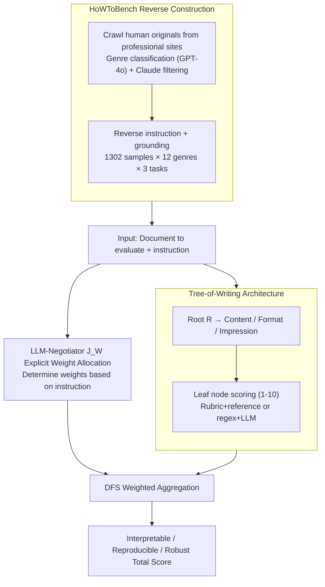

# HoWToBench: Holistic Evaluation for LLM's Capability in Human-level Writing using Tree of Writing

**Conference**: ACL 2026  
**arXiv**: [2604.19071](https://arxiv.org/abs/2604.19071)  
**Code**: https://github.com/ZhuoerFeng/ACL2026-Tree-of-Writing (Available)  
**Area**: LLM Evaluation / Writing / LLM-as-a-judge  
**Keywords**: Tree-of-Writing, Writing Evaluation, negotiation bias, length paradox, robustness

## TL;DR
This paper identifies that LLM-as-a-judge exhibits "negotiation inconsistency" in long-form open-ended writing—where sub-score aggregation is unstable and uninterpretable. It proposes Tree-of-Writing (ToW), which explicitly models writing evaluation as a tree pipeline consisting of three main nodes (Content / Format / Impression), leaf nodes, and an explicit LLM-negotiator for weights. On HoWToBench (1,302 Chinese samples across 12 genres), it increases system-level Pearson correlation from 0.85-0.89 to **0.93** while remaining robust to text perturbations.

## Background & Motivation

**Background**: LLM writing evaluation typically relies either on reference-based overlap metrics like BLEU/ROUGE (which lack discriminative power for long open-ended generation), the LLM-as-a-judge paradigm where GPT-4 provides a total score (suffering from severe verbosity/position bias), or Auto-Plan where the LLM dynamically determines sub-dimensions and weights (leading to inconsistent results across runs).

**Limitations of Prior Work**: The authors define the uncertainty of on-the-fly LLM aggregation as **Negotiation Inconsistency**. In Auto-Plan with self-consistency $N=5$, the sub-score weight trajectory fluctuates with $\delta = 0.273, \sigma = 0.059$, meaning the sub-score weighting logic drifts for the same article. Moreover, multi-dimensional evaluation (language, logic, plot, format, paragraphing) is inherently required for long texts, making simple averaging unreasonable.

**Key Challenge**: Human experts evaluate writing through explicit hierarchical decision-making—scoring sub-criteria first and then aggregating based on genre-specific weights. However, LLM-as-a-judge collapses this process into a single generation, causing interference between weight decisions and sub-scoring decisions, leading to non-reproducibility and lack of interpretability.

**Goal**: (1) Propose a writing evaluation framework that reduces negotiation bias, is interpretable, and is robust to perturbations; (2) Establish a large-scale Chinese benchmark covering diverse human professional writing genres.

**Key Insight**: Explicitly decouple the human scoring process into two independent LLM calls: "sub-scoring" and "instruction-based weight planning." Sub-scores are provided by expert agents (using rubrics and references), while weights are determined separately by a negotiator $J_W$ based on the instruction, followed by weighted aggregation via DFS.

**Core Idea**: Transform the "evaluation as a single generation" in LLM-as-a-judge into an "evaluation as a reproducible graph traversal" using a tree structure and explicit weights, turning an uninterpretable black box into an auditable workflow.

## Method

### Overall Architecture
The HoWToBench work proceeds along two parallel tracks: the ToW evaluation framework and an accompanying benchmark. The Mechanism of ToW is to externalize the implicit process of human expert evaluation. ToW constructs an evaluation tree: the root node $R$ connects to three main nodes: Content, Format, and Impression. The first two contain multiple leaf nodes. Each leaf node receives a 1-10 score from an LLM using a rubric and reference (format uses a hybrid of regex and LLM). The importance of each dimension is assigned to an independent negotiator $J_W$, which determines weights after reviewing the instruction. Total scores are aggregated via DFS. The benchmark is constructed through reverse engineering: 1,302 human original texts were crawled from five high-quality professional writing sites to derive instructions and grounding information, covering 12 genres across 3 task types (Completion, Guide, Open).

### Key Designs

**1. Tree-of-Writing Architecture: Decomposing holistic scoring into a traversable graph**
Replacing a "single total score" with "node-by-node scoring and aggregation" completely decouples scoring from aggregation. The aggregation follows hierarchical weighting: $\text{Score}(R) = \sum_{j \in \{C,F,I\}} w_{E_j} \text{Score}(V_j)$. Each main node is a weighted sum of its leaves, e.g., $\text{Score}(V_C) = \sum_{L_i \in \text{Child}(V_C)} w_{E_{V_C L_i}} \text{Score}(L_i)$. Content leaves (opening-ending, language-rhetoric, argumentative-logics, emotion) use rubrics for standards and references as anchors to prevent the model from fabricating criteria. Format leaves (plots-structure, paragraphing, formatting) use a hybrid of regex for hard rules and LLM for soft rules.

**2. LLM-Negotiator $J_W$ Explicit Weight Allocation: Extracting "weights" from implicit aggregation**
The most subtle source of instability in writing evaluation is that LLMs bundle weight decisions into the same generation as scoring. ToW extracts this step: for each instruction $\mathcal{I}^i$, the negotiator $J_W$ outputs a set of leaf weights $(w_{E_{V_X L_1}}, \cdots, w_{E_{V_X L_n}})^i$ subject to $\sum w = 1, w \in (-1, 1)$. Weight distributions vary by genre—"logics" has higher weight and variance in argumentative essays. Empirical tests show ToW's weight trajectory variance is $\delta = 0.080, \sigma = 0.017$, significantly lower than Auto-Plan's $0.273 / 0.059$.

**3. HoWToBench Reverse Construction: Ensuring references are the human ceiling**
To evaluate "human-level writing," references must be high-quality human texts. The process starts by crawling originals $\mathcal{R}$, classifying them by genre with GPT-4o (98.6% accuracy), and filtering those with scores $\ge 4$ (out of 5) via Claude-3.5. For the Completion task, paragraphs are manually removed to serve as grounding $\mathcal{G}$; for Guide/Open tasks, Gemini-2.0-Flash generates $(S, T, \mathcal{G})$ triplets. This ensures references are human-authored and the three task types allow for differentiated capability evaluation.

### Loss & Training
The ToW framework is training-free; all LLM calls are implemented via prompt engineering. GPT-4o serves as the primary judge model. HoWToBench underwent quality audits by three humanities experts (96.85% pass rate). The MetaEditor meta-evaluation set (221 instructions × 9 LLMs) was annotated twice by 36 writers (Cohen's $\kappa=0.71$, Pearson=$0.87$).

## Key Experimental Results

### Main Results

| Method (Overall) | Cost ($) | Pearson $\rho$ | Kendall $\tau$ | Spearman $\sigma$ |
|---|---|---|---|---|
| BLEU-1 | - | 0.75 | 0.56 | 0.72 |
| ROUGE-L | - | 0.46 | 0.06 | 0.17 |
| Elaborated Rubric - best | 1.31 | 0.89 | 0.67 | 0.87 |
| Elaborated Rubric + SC (n=10) | 13.17 | 0.89 | 0.61 | 0.82 |
| Auto-Plan - best | 0.89 | 0.88 | 0.67 | 0.83 |
| Auto-Plan + SC (n=10) | 8.93 | 0.88 | 0.61 | 0.82 |
| Average scoring (ToW w/o plan) | 7.02 | 0.89 | 0.61 | 0.82 |
| **ToW (Ours)** | 7.34 | **0.93** | **0.83** | **0.93** |

| LLM | All | Completion | Guide | Open |
|---|---|---|---|---|
| DeepSeek-R1 | **6.10** | 6.10 | 6.15 | 6.06 |
| o3-mini | 5.86 | 6.16 | 5.80 | 5.69 |
| GPT-4o-1120 | 5.81 | **6.60** | 5.61 | 5.36 |
| Claude-3.5-Sonnet | 5.58 | 5.55 | 5.76 | 5.43 |
| Gemini-2.0-Flash | 5.43 | 5.43 | 5.53 | 5.33 |
| DeepSeek-V3 | 5.42 | 5.44 | 5.52 | 5.31 |

### Ablation Study

| Configuration (Guide / Open) | $\rho$ Guide | $\tau$ Guide | $\rho$ Open | $\tau$ Open |
|---|---|---|---|---|
| ToW (full) | **0.85** | **0.76** | **0.89** | **0.78** |
| w/o Content | 0.81 | 0.76 | 0.84 | 0.78 |
| w/o Format | 0.80 | 0.65 | 0.89 | 0.72 |
| w/o Impression | 0.81 | 0.70 | 0.90 | 0.72 |

| Robustness Perturbation | ToW | Auto-Plan | BLEU |
|---|---|---|---|
| Initial Score | 5.41 | 6.82 | 24.66 |
| Drop Paragraph | -0.36 | -0.06 | -7.27 |
| Repeat Paragraph | -0.49 | -0.30 | **+4.23** |
| Change to Poem | -0.62 | **+0.82** | -8.50 |

### Key Findings
- **ToW achieves SOTA correlation and robustness**: Auto-Plan is "tricked" by the "Change to Poem" perturbation (score $+0.82$), and BLEU benefits from "Repeat Paragraph" ($+4.23$) due to reward hacking. ToW correctly identifies score decreases across all 6 perturbations.
- **Evidence of Negotiation Bias**: Auto-Plan weight trajectories show high variance ($\delta=0.273$), whereas ToW is more stable ($\delta=0.080$).
- **Length-Quality Paradox**: Input length vs. Guide overall correlation is $-0.44$, suggesting providing more grounding does not necessarily improve LLM performance, contradicting the simple narrative of verbosity bias.
- **GPT-4o vs. DeepSeek-R1**: GPT-4o excels in Completion ($6.60$) but drops in Open tasks ($5.36$), indicating strong imitation but weaker creation. DeepSeek-R1 is most stable across tasks, validating the potential of reasoning models in open-ended writing.

## Highlights & Insights
- **Turning Evaluation into Graph Traversal**: The explicit pipeline concept in ToW can be transferred to any complex subjective evaluation (code review, medical diagnosis), with the negotiator being key to stable weighting.
- **Reverse Construction Value**: Applying reverse construction ensures 1,302 professional human references with 96.85% expert approval, providing a solid ground truth for Chinese long-form writing.
- **The "Length Paradox" Insight**: While LLMs are often thought to prefer longer outputs, this paper proves that for high-quality evaluation, "long $\neq$ good," correcting simplified views on verbosity bias in literature.

## Limitations & Future Work
- **Genre Depth**: Only covers the category level of 12 genres; performance differences in sub-genres (suspense vs. romance) remain untested.
- **Single-round Generation**: Real-world processes like iterative editing and human-AI collaboration are not covered.
- **Tree Scalability**: Whether adding new leaf nodes disrupts existing correlations was not systematically verified.
- **Cost**: At approximately $\$0.50-\$1.00$ per evaluation, industrial deployment requires further cost reduction.

## Related Work & Insights
- **vs WritingBench (Wu et al. 2025)**: While they use Auto-Plan for rubric generation, Ours demonstrates that implicit aggregation fails to converge under self-consistency, requiring an explicit negotiator $J_W$.
- **vs AlignBench (Liu et al. 2024)**: ToW expands dimensions to 8+ leaf nodes and 12 genres, while introducing reverse construction to improve reference quality.
- **vs HelloBench (Que et al. 2024)**: ToW adopts a similar hierarchical philosophy but provides a fully reproducible framework and benchmark.

## Rating
- Novelty: ⭐⭐⭐⭐ ToW's "evaluation as graph traversal" and the "negotiation inconsistency" concept are original contributions.
- Experimental Thoroughness: ⭐⭐⭐⭐⭐ 1,302 tasks, 12 genres, 10 LLMs, and extensive meta-evaluation by 36 experts.
- Writing Quality: ⭐⭐⭐⭐ Clear motivation, framework, and validation structure.
- Value: ⭐⭐⭐⭐⭐ HoWToBench is a high-quality resource, and the negotiator concept is highly transferable.

<!-- RELATED:START -->

## Related Papers

- [\[ACL 2026\] Reward Modeling for Scientific Writing Evaluation](reward_modeling_for_scientific_writing_evaluation.md)
- [\[ACL 2026\] AgentEval: DAG-Structured Step-Level Evaluation for Agentic Workflows with Error Propagation Tracking](agenteval_dag-structured_step-level_evaluation_for_agentic_workflows_with_error_.md)
- [\[ACL 2026\] HumanLLM: Benchmarking and Improving LLM Anthropomorphism via Human Cognitive Patterns](humanllm_benchmarking_and_improving_llm_anthropomorphism_via_human_cognitive_pat.md)
- [\[ACL 2026\] Evaluating Legal Reasoning Traces with Legal Issue Tree Rubrics](evaluating_legal_reasoning_traces_with_legal_issue_tree_rubrics.md)
- [\[ICML 2026\] From Human-Level AI Tales to AI Leveling Human Scales](../../ICML2026/llm_evaluation/from_human-level_ai_tales_to_ai_leveling_human_scales.md)

<!-- RELATED:END -->
