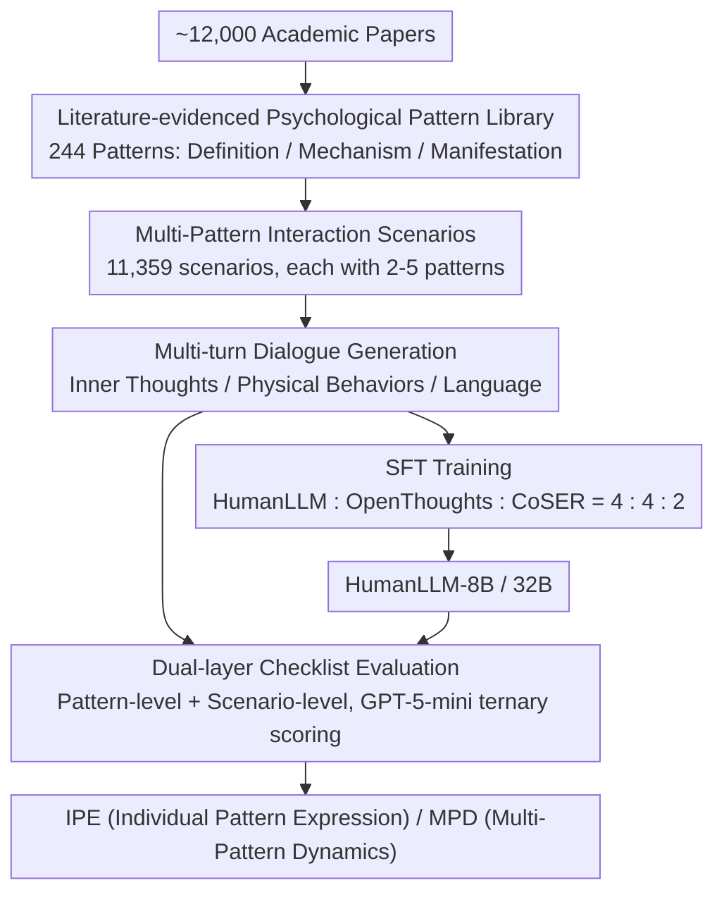

# HumanLLM: Benchmarking and Improving LLM Anthropomorphism via Human Cognitive Patterns

**Conference**: ACL 2026  
**arXiv**: [2601.10198](https://arxiv.org/abs/2601.10198)  
**Code**: [GitHub](https://github.com/YJGoodbye2024/HumanLLM)  
**Area**: Role-playing / Personality Simulation  
**Keywords**: Anthropomorphism, Cognitive Patterns, Multi-modal Dynamics, Role-playing Agents, Psychological Modeling

## TL;DR

This paper proposes the HumanLLM framework, which models 244 psychological patterns (100 personality traits + 144 social cognitive patterns) as interacting causal forces rather than isolated labels. It constructs 11,359 scenarios featuring interactions of 2-5 patterns and a multi-turn dialogue dataset. Through a dual-layer checklist evaluation, it achieves high alignment with human judgment ($r=0.90$). HumanLLM-8B outperforms Qwen3-32B in multi-pattern dynamics despite having 4x fewer parameters.

## Background & Motivation

**Background**: Role-playing Language Agents (RPLA) have evolved from conceptual frameworks to practical applications such as digital clones, AI companions, and social simulations. Existing personality injection methods include: (1) Prompting—assigning personality labels via instructions; (2) Fine-tuning—training on role-specific data; (3) Activation steering—manipulating internal representations via persona vectors.

**Limitations of Prior Work**: (1) Existing methods model personality as isolated label-to-behavior mappings ("extroverted" → "talkative"), ignoring dynamic interactions between multiple cognitive patterns—in reality, a talkative person might remain silent when the "spotlight effect" is activated; (2) This leads to "personality hallucinations," where models claim to possess a trait in self-reports but exhibit inconsistent behavior; (3) Existing evaluations use holistic metrics (e.g., CoSER’s Anthropomorphism), which implicitly equate "good anthropomorphism" with "pro-social behavior," penalizing realistic but negative human traits like defensive attribution.

**Key Challenge**: Human behavior is the product of dynamic interactions between multiple cognitive patterns—a confident person might yield under peer pressure, and a talkative person may become quiet when under scrutiny. Existing methods simulate single traits but fail to capture this "tension and modulation between patterns."

**Goal**: (1) Build a large-scale psychological pattern dataset (each pattern based on ~50 academic papers); (2) Design multi-pattern interaction scenarios to let models learn dynamic relationships between patterns; (3) Propose an evaluation framework that decouples "simulated accuracy" from "social desirability."

**Key Insight**: Based on Lewin’s Field Theory, human cognition consists of two dimensions: stable personality traits (Person) and situationally triggered social cognitive patterns (Environment). By treating patterns as interacting causal forces rather than isolated labels, models can implicitly learn reinforcement, conflict, and conditional modulation between patterns through training in multi-pattern scenarios.

**Core Idea**: Modeling psychological patterns as interacting causal forces and training LLMs in multi-pattern interaction scenarios allows the model to learn "not just what humans do, but the psychological processes that generate those behaviors"—upgrading from behavioral imitation to cognitive modeling.

## Method

### Overall Architecture

HumanLLM upgrades "anthropomorphism" from labeling characters to modeling cognitive processes themselves. The pipeline progresses through three stages: "Psychological Knowledge → Interaction Scenarios → Behavior Evaluation." It first distills 244 psychological patterns (100 personality traits + 144 social cognitive patterns) into structured representations of "Definition + Mechanism + Manifestation" from ~12,000 academic papers. These patterns are combined in groups of 2 to 5 into 11,359 scenarios to generate multi-turn dialogues with three-dimensional expressions: inner thoughts, physical behaviors, and verbal language. Finally, a dual-layer checklist decomposes each character's output into verifiable behavioral indicators to measure Individual Pattern Expression (IPE) and Multi-Pattern Dynamics (MPD).

### Key Designs

**1. Literature-evidenced Psychological Pattern Library: Anchoring traits in ~50 papers each**

Most current character descriptions are "hallucinated" from the model's parametric knowledge, lacking psychological validity. HumanLLM uses academic literature as the single source of truth: personality traits follow Goldberg's 100 unipolar markers (20 descriptors per Big Five dimension), while social cognitive patterns are curated from cognitive biases (Tversky & Kahneman), social influence (Cialdini), and evolutionary psychology. From 232 candidates, 144 were selected based on empirical validation and non-redundancy. Each pattern was processed by Gemini Deep Search to retrieve ~50 papers, then synthesized by Gemini 2.5 Pro into a three-layer structure.

Human validation confirmed this approach, with average ratings between 3.20–3.70 (on a 4-point scale) and a Krippendorff’s $\alpha$ of 0.58–0.76. This anchoring ensures the model learns the underlying psychological mechanisms rather than surface-level mappings like "extroverted → talkative."

**2. Multi-pattern Interaction Scenarios: Learning "tension between patterns" as training signals**

Personality hallucinations stem from isolated modeling. To address this, HumanLLM mounts 2-5 patterns per scenario, specifically covering three types of interactions: reinforcement (e.g., "self-serving bias" amplifying "overconfidence"), conflict (e.g., "confidence" vs. "conformity"), and conditional modulation (e.g., "talkativeness" suppressed by "spotlight effect"). Characters carry both self-perception and other-perception to create information asymmetry, and the DIAMONDS model is used to ensure situational diversity.

The 12-20 turn dialogues generated by Claude Sonnet 4.5 use three-dimensional expression: inner thoughts [bracketed], physical behaviors (parenthesized), and verbal language. This explicit separation of internal cognition vs. external behavior forces the model to learn modulation rules within the tension of interacting patterns.

**3. Dual-layer Checklist Evaluation: Decoupling simulation accuracy from social desirability**

Traditional holistic metrics correlate poorly with human judgment ($r=0.43$) and suffer from "normative confusion"—LLMs often penalize realistic "defensive attribution" as low anthropomorphism simply because it lacks empathy. HumanLLM uses value-neutral behavioral checks: pattern-level checklists derive 12-15 cross-scenario indicators per pattern, and scenario-level checklists derive 2-6 situation-specific expectations per character. GPT-5-mini performs ternary scoring (+1 Satisfied / 0 Not Shown / −1 Violated).

Two core metrics are defined: IPE (Individual Pattern Expression) for single-pattern fidelity and MPD (Multi-Pattern Dynamics) for emergent behaviors in interactions. This approach improves human alignment to $r=0.90$ and allows negative traits to be evaluated objectively.

### Loss & Training

Training follows standard Supervised Fine-Tuning (SFT). Each character's dialogue is converted to ShareGPT format, resulting in 30,543 HumanLLM samples. These are mixed with OpenThoughts-114k (instruction following) and CoSER (role-playing) in a 4:4:2 ratio (76,358 total samples) to fine-tune Qwen3-8B/32B bases. This mixture preserves general instruction-following capabilities while strengthening psychological pattern expression.

## Key Experimental Results

### Main Results

**IPE and MPD Evaluation (%, mean of 3 runs ± std)**

| Model | IPE | MPD |
|------|-----|-----|
| GPT-5 | 15.5±0.4 | 43.4±1.1 |
| Claude Sonnet 4.5 | 34.8±0.3 | 79.5±0.4 |
| Gemini 3 Pro | 41.3±0.3 | 85.1±0.4 |
| Qwen3-8B | 18.6±0.7 | 54.4±2.1 |
| Qwen3-32B | 26.0±0.4 | 65.8±0.7 |
| DeepSeek-R1 | 23.3±0.6 | 69.0±0.5 |
| **HumanLLM-8B (Ours)** | **25.7±0.4** | **70.3±0.6** |
| **HumanLLM-32B (Ours)** | **32.8±0.3** | **73.6±0.4** |

### Ablation Study

**Data Ablation (8B Variants)**

| Configuration | IPE | MPD |
|------|-----|-----|
| Qwen3-8B (base) | 18.6 | 54.4 |
| Qwen3-8B (OT+CoSER, no HumanLLM data) | 9.1 | 31.3 |
| HumanLLM-8B (Full) | 25.7 | 70.3 |

**Evaluation Framework Alignment (100 Scenarios)**

| Metric Type | Human | LLM | Δ | Correlation r |
|---------|------|-----|---|----------|
| Anthropomorphism (Holistic) | 84.6 | 53.8 | -30.8 | 0.43 |
| Character Fidelity (Holistic) | 83.1 | 65.4 | -17.7 | 0.61 |
| **IPE (Checklist)** | **38.4** | **37.8** | **-0.6** | **0.90** |
| **MPD (Checklist)** | **72.1** | **75.8** | **+3.7** | **0.88** |

### Key Findings

- HumanLLM-8B outperforms Qwen3-32B in MPD (70.3% vs 65.8%), proving that psychological training data is more critical than model scale.
- GPT-5 performs surprisingly low (IPE: 15.5%); analysis suggests its strong instruction-following tendency leads to overly literal role-playing—general capability does not automatically transfer to psychological simulation.
- Negative transfer: Training solely on OpenThoughts+CoSER significantly degrades performance (IPE: 18.6 → 9.1), as general data suppresses psychological pattern expression. HumanLLM data compensates for this and creates synergistic effects.
- Holistic metrics suffer from "normative confusion"—LLM judges equate social desirability with simulation accuracy, whereas the checklist method effectively decouples the two.

## Highlights & Insights

- Modeling psychological patterns as "interacting causal forces" rather than "isolated labels" is a significant conceptual breakthrough, applicable to game NPCs, social simulations, and therapy training.
- The discovery of normative confusion has methodological value, revealing systematic biases in LLM-as-a-Judge for human behavior simulation.
- The negative transfer finding provides insights for SFT data ratios—general data can "drown out" domain-specific capabilities, requiring anchoring data (like HumanLLM) to maintain performance.

## Limitations & Future Work

- Dialogues average 16.4 turns; long-term character consistency (50+ turns) has not been evaluated.
- Psychological theories are primarily sourced from WEIRD populations; cross-cultural applicability (e.g., conformity pressure in collectivist cultures) remains to be explored.
- The training data is entirely LLM-synthesized; a gap persists between synthetic data and real human interaction.
- High-fidelity simulation of negative traits (e.g., manipulation, bias) introduces safety and ethical risks, requiring additional guardrails.

## Related Work & Insights

- **vs CoSER**: CoSER extracts dialogues from 771 books and uses holistic metrics. HumanLLM builds patterns from academic papers and uses checklists, achieving $r=0.90$ human alignment compared to CoSER's $r=0.43$.
- **vs Character-LLM**: Focuses on specific historical characters. HumanLLM focuses on universal cognitive patterns, offering better generalizability.
- **vs Persona Vectors (Chen et al.)**: Uses activation steering for traits but cannot handle multi-trait conflicts. HumanLLM learns multi-pattern dynamics implicitly through scenario-based training.

## Rating

- Novelty: ⭐⭐⭐⭐⭐ Framework of "cognitive patterns as interacting causal forces" + library backed by 12,000 papers + discovery of normative confusion.
- Experimental Thoroughness: ⭐⭐⭐⭐⭐ Multi-baseline comparison + ablation + external benchmarks + human alignment validation.
- Writing Quality: ⭐⭐⭐⭐ Clear framework and natural transition between psychology and engineering, though the paper is long.
- Value: ⭐⭐⭐⭐⭐ Paradigm shift from label mapping to cognitive modeling for LLM personality; the dataset and evaluation framework are independently reusable.

<!-- RELATED:START -->

## Related Papers

- [\[ACL 2026\] The Silent Vote: Improving Zero-Shot LLM Reliability by Aggregating Semantic Neighborhoods](the_silent_vote_improving_zero-shot_llm_reliability_by_aggregating_semantic_neig.md)
- [\[ACL 2026\] Erosion of Correct Beliefs: A Study of LLM Cognitive Resilience under Clinical Stress](when_correct_beliefs_collapse_epistemic_resilience_of_llms_under_clinical_pressu.md)
- [\[ACL 2026\] Modeling Multi-Dimensional Cognitive States in Large Language Models under Cognitive Crowding](modeling_multi-dimensional_cognitive_states_in_large_language_models_under_cogni.md)
- [\[ACL 2026\] HoWToBench: Holistic Evaluation for LLM's Capability in Human-level Writing using Tree of Writing](howtobench_holistic_evaluation_for_llms_capability_in_human-level_writing_using_.md)
- [\[ACL 2026\] arXiv2Table: Toward Realistic Benchmarking and Evaluation for LLM-Based Literature-Review Table Generation](arxiv2table_toward_realistic_benchmarking_and_evaluation_for_llm-based_literatur.md)

<!-- RELATED:END -->
