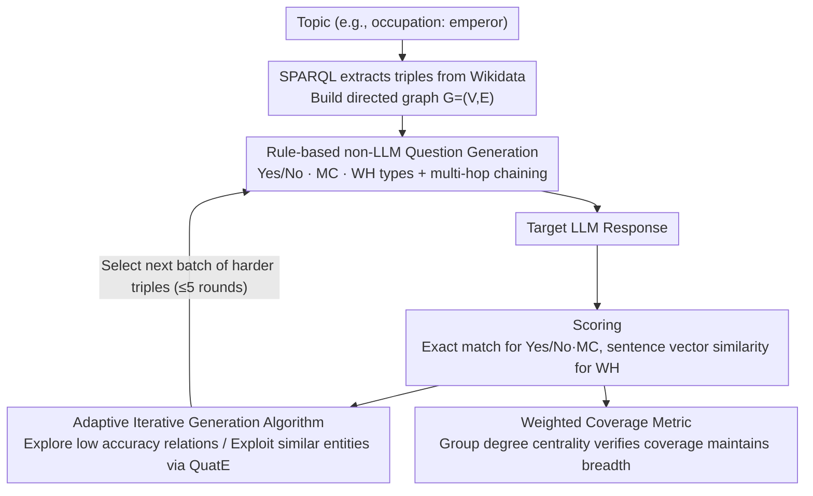

<!-- Generated automatically by src/gen_stubs.py -->
# Identifying the Achilles' Heel: An Iterative Method for Dynamically Uncovering Factual Errors in Large Language Models

**Conference**: ACL 2026 Findings  
**arXiv**: [2401.00761](https://arxiv.org/abs/2401.00761)  
**Code**: <https://github.com/Mysterchan/HalluHunter>  
**Area**: LLM Evaluation / Factuality / Automated Testing  
**Keywords**: Knowledge Graph testing, Factual error detection, Adaptive question generation, Multi-hop reasoning, Data contamination  

## TL;DR
HalluHunter is a fully automated LLM factual error testing framework based on Knowledge Graphs (KG). It extracts factual triples from Wikidata, generates three question types (Yes/No, Multiple Choice, and WH-questions) using rule-based methods, and supports multi-hop reasoning. Through an "adaptive iterative algorithm" that selects the next batch of difficult questions based on entity similarity and relationship accuracy from previous incorrect responses, it reduces the accuracy of nine mainstream LLMs by 32–42% after five iterations, triggers errors in up to 55% of items, and significantly outperforms static benchmarks.

## Background & Motivation

**Background**: Current mainstream paths for LLM factuality evaluation include: (1) Static benchmarks (TruthfulQA, SimpleQA, LAMA, PopQA) designed or annotated manually; (2) Semi-automated QA generation (PAQ, KQA Pro); (3) Small-scale automated evaluation based on KGs (Head-to-Tail, DyKnow).

**Limitations of Prior Work** (summarized into four points in Table 1):
- **High Manual Cost**: Benchmarks like TruthfulQA and CommonsenseQA rely on human design and annotation.
- **Data Contamination**: Static evaluation sets are likely included in the training data of LLMs (OpenAI's 2023 report admitted GPT-4 training data came from the entire web), making results unreliable.
- **Limited Coverage**: The LAMA series only tests a few relations like "place of birth"; most benchmarks use only MC questions and lean toward specific topics.
- **Weak Error Exposure**: Existing benchmarks are "single-round," lacking mechanisms to target specific model weaknesses based on error patterns.

**Key Challenge**: To thoroughly test LLM factual weaknesses, one must simultaneously achieve: (a) dynamic generation to avoid contamination, (b) broad coverage and diverse question types, and (c) the ability to locate weak areas based on model feedback. Random sampling on KGs solves (a) and (b) but fails to pinpoint specific weaknesses efficiently.

**Goal**: Construct an automated framework to solve the four limitations above and verify its effectiveness in exposing LLM weaknesses compared to random sampling and existing benchmarks.

**Key Insight**: Treat "finding LLM factual errors" as a **search problem** where the KG is the search space, and weak relations or difficult entities are high-reward regions. The system starts with seed questions and adaptively narrows down to "frequently failed relations + structurally similar entities."

**Core Idea**: KG-grounded rule-based generation combined with an adaptive iterative algorithm (selecting triples based on relationship accuracy and entity embedding similarity). The process involves zero LLM intervention in question generation to avoid contamination.

## Method

### Overall Architecture

HalluHunter treats factual error detection as a feedback-driven search over a Knowledge Graph. The KG serves as the search space, while relations and entities frequently answered incorrectly by the model are high-reward areas. The framework avoids using LLMs to generate questions to prevent data contamination. Given a topic (e.g., "occupation: emperor"), the system uses SPARQL to extract (SUBJECT, relation, OBJECT) triples from Wikidata to build a directed graph $G=(V,E)$ (approx. 500k–600k triples and 10k+ entities per domain). Triples are converted into Yes/No, MC, and WH questions via pure rules. Multi-hop questions are constructed by chaining adjacent triples (e.g., (Michelle Obama, spouse, Barack Obama) and (Barack Obama, educated at, Harvard) become "Where was Michelle Obama's spouse educated at?"). After the model responds, Yes/No and MC are scored via exact match, and WH via sentence-transformer similarity. Scores are fed back into the adaptive iteration algorithm, which selects more difficult triples based on rolling accuracy and similar neighbors for up to five rounds.

### Key Designs

**1. Rule-based non-LLM Question Generation: Verifiability and Contamination Resistance**

Generating questions with LLMs introduces bias, API costs, and potential overlap with training data. HalluHunter deterministically maps triples to three question types: Yes/No questions select auxiliary verbs based on POS tags (e.g., "is" for nouns, "does" for verbs) and generate balanced "No" questions by replacing objects with incorrect entities to suppress sycophancy. MC questions use NER for interrogative words, with one correct and three incorrect options from the same relation. WH questions strictly use triples with a "unique outgoing edge" (e.g., (China, capital, Beijing)) to ensure unique answers. 

Multi-hop questions use a chain format $(s, \{r_1, r_2\}, o)$. This rule-based approach ensures reproducible, controllable questions with certain answers. Appendix G.2 shows 98.5% of questions are semantically correct, whereas 26 out of 200 ChatGPT-generated questions deviated from instructions.

**2. Adaptive Iterative Generation Algorithm (Algorithm 1): From Random Sampling to Precision Guidance**

The authors assume factual errors are not isolated; if a model does not know the atomic mass of Hydrogen (1.008), it likely does not know that of Oxygen. Errors cluster around knowledge points. The algorithm maintains the rolling accuracy $R^{(l)}(r)$ of each relation and the set of used triples $T^{(l)}$. It switches between explore and exploit: with probability $e=0.2$, it explores by selecting relations where $R(r) < a=0.4$. Otherwise, it exploits: if the previous answer was wrong ($c_i = \text{False}$), it uses QuatE-trained KG embeddings to find the top $k=10$ similar entities $C$ to the subject and asks questions about the same relation. If correct, it picks a new random triple.

Searching around similar entities helps hit weaknesses faster than random sampling, while the $e=0.2$ exploration rate prevents the algorithm from getting stuck in local regions. 

**3. Weighted Coverage Metric (Group Degree Centrality): Breadth remains high**

To ensure the algorithm doesn't focus solely on obscure corners, the authors use the set of queried entities $S$ as a node subset. They calculate the open neighborhood $N(S)=\{v\in V\setminus S:\exists u\in S,(u,v)\in E\}$ and compute the normalized group degree centrality:

$$\widehat{C}_{\deg}(S) = \frac{|N(S)|}{|V| - |S|} \in [0,1]$$

Higher values indicate that queried entities are closer to KG hubs, representing broader coverage. Average coverage in Trial 5 (0.473) was higher than random sampling (0.406), addressing concerns about the algorithm becoming too narrow.

### Loss & Training

This is a testing framework, not a training method; no LLM parameters are updated. The only "training" involves the KG embedding $\mathcal{M}$ using QuatE via PyKEEN to facilitate similar entity retrieval. Key hyperparameters include exploration constant $e=0.2$, low-accuracy threshold $a=0.4$, and $k=10$ similar entities. The process involves 1,000 questions per domain/type per round for five iterations.

## Key Experimental Results

### Main Results (Median Accuracy of 9 LLMs after 5 iterations across 3 domains)

| Trial | Humanity Median Acc | Social Science | STEM |
|-------|---------------------|----------------|------|
| Seed (Trial 0) | 0.712 (0%) | 0.699 (0%) | 0.649 (0%) |
| Trial 1 | 0.542 (−19.5%) | 0.524 (−28.1%) | 0.478 (−24.8%) |
| Trial 2 | 0.516 (−24.1%) | 0.462 (−31.5%) | 0.428 (−31.7%) |
| Trial 3 | 0.492 (−29.2%) | 0.439 (−37.5%) | 0.406 (−36.1%) |
| Trial 5 | **0.462 (−32.7%)** | **0.384 (−40.2%)** | **0.373 (−41.8%)** |

GPT-4o dropped from 84.4% to 65.8% in Humanity Yes/No and from 82.9% to 54.1% in MC. WH questions generally dropped to ~10%. WH questions remained the most difficult, with an overall average of 37.4% (Trial 0). Multi-hop: Accuracy dropped sharply from 1→2 hops (GPT-4o STEM MC from 72.6% to 49.6%), with a slower but continuous decline from 2→4 hops.

### Ablation Study (Hyperparameter Sensitivity)

| Configuration | Trial 5 Accuracy | Trial 5 Coverage |
|------|------------------|-------------------|
| $e=0.2, a=0.3$ (Aggressive Exploit) | 0.371 | **0.417** (Low) |
| $e=0.2, a=0.4$ (Default) | **0.373** | 0.471 |
| $e=0.2, a=0.5$ (Relaxed Exploit) | 0.450 | 0.468 |
| $e=0.1, a=0.4$ (Less Explore) | 0.430 | 0.460 |
| $e=0.3, a=0.4$ (More Explore) | 0.412 | 0.472 |

**Trial 5 Coverage Comparison**: HalluHunter (0.473) > Random (0.406), proving the iterative algorithm does not sacrifice KG coverage.

### Key Findings
- **Adaptive Iteration is Highly Effective**: Accuracy in the STEM domain dropped by 41.8% after five rounds, exposing significantly more errors than random questions.
- **Difficulty Ranking: STEM > Social Science > Humanity**: STEM accuracy dropped the most (−41.8%), while Humanity remained the most stable (−32.7%), showing LLMs are more fragile regarding precise knowledge (atomic mass, prime factors) than cultural memory.
- **GPT-4o Blind Spots - Physics**: "binding energy" accuracy was only 0.258, and "mass excess" only 0.237, while biological "genetic association" reached 0.778.
- **Claude-3.5-Haiku Blind Spots - Number Theory**: "prime factor" accuracy was only 0.313, whereas Gemini-2.0 and GPT-4o reached ~0.60 on the same topic.
- **WH Questions are the Hardest**: Averaging 37.4% across all models, consistent with findings in SimpleQA that open generation puts higher demands on parametric knowledge than selection.
- **Multi-hop Amplification**: The drop from 1 to 2 hops is the steepest (GPT-4o STEM MC −31.7%), suggesting the initial step of multi-step reasoning is the primary bottleneck.
- **Coverage Improvement**: Trial 5 coverage (0.473) outperformed Random (0.406), confirming that the exploration mechanism ($e=0.2$) prevents localization.

## Highlights & Insights
- **Applying Exploit-Explore via KG Embeddings**: Treating "LLM incorrect answers" as a reward signal and KG embeddings as a structural similarity metric is a clever adaptation of active testing to Knowledge Graphs.
- **Avoiding the LLM Bias Loop**: By using rule-based KG generation rather than LLM-based generation, HalluHunter avoids self-bias and contamination, making the results more credible.
- **Fine-grained Diagnosis**: The error pattern analysis identifies model-domain level weaknesses (e.g., GPT-4o's biological vs. physical knowledge), providing high-value data for model refinement.
- **Sophisticated Coverage Metrics**: Using group degree centrality to measure breadth is more robust than simple entity counts, reflecting the real knowledge distribution around hubs.
- **Engineering Precision**: Using a single-outgoing-edge constraint for multi-hop questions ensures unique answers for automated exact-match scoring, a critical detail for scalability.

## Limitations & Future Work
- The framework relies on a single KG (Wikidate), meaning KG errors or incompleteness propagate to the results.
- No new mitigation methods are proposed; the focus is purely diagnostic.
- Multi-hop reasoning is limited to 2–4 chain-like hops, without considering tree or cycle-like structures.
- Sentence Transformer F1 for WH evaluation is only 87%, introducing some noise compared to manual or LLM-as-judge scoring.
- The adaptive algorithm depends on QuatE embeddings; dynamic KGs with frequent updates would require re-training.
- No strict numerical comparison was made with LLM-driven adversarial probing (e.g., AutoDetect).

## Related Work & Insights
- **vs. Head-to-Tail (2023)**: Both use KG factuality testing, but Head-to-Tail uses only one question type (cloze) and lacks multi-hop or iterative features.
- **vs. AutoDetect / Self-Challenge**: These rely on LLMs to find LLM weaknesses (self-bias), while HalluHunter breaks the loop using KGs.
- **vs. DyKnow**: DyKnow focuses on temporal staleness of facts; HalluHunter focuses on general facts and iterative attacks.
- **Insight**: The combination of adaptive iteration, structured search, and reward-driven exploitation can be migrated to other domains like code bug detection (CodeKG) or safety testing (adversarial prompt trees).

## Rating
- Novelty: ⭐⭐⭐⭐ (KG-grounded automated + adaptive iteration is a strong combination).
- Experimental Thoroughness: ⭐⭐⭐⭐⭐ (massive scale across 9 LLMs, multiple domains, and 5 rounds).
- Writing Quality: ⭐⭐⭐⭐ (Clear narrative, excellent comparative tables).
- Value: ⭐⭐⭐⭐ (Open-source, avoids contamination, long-term utility for evaluation).

<!-- RELATED:START -->

## Related Papers

- [\[ICML 2025\] Correlated Errors in Large Language Models](../../ICML2025/llm_evaluation/correlated_errors_in_large_language_models.md)
- [\[ACL 2026\] EngiBench: A Benchmark for Evaluating Large Language Models on Engineering Problem Solving](engibench_a_benchmark_for_evaluating_large_language_models_on_engineering_proble.md)
- [\[ACL 2026\] Comprehensiveness Metrics for Automatic Evaluation of Factual Recall in Text Generation](comprehensiveness_metrics_for_automatic_evaluation_of_factual_recall_in_text_gen.md)
- [\[ACL 2026\] How Hypocritical Is Your LLM Judge? Listener–Speaker Asymmetries in the Pragmatic Competence of Large Language Models](how_hypocritical_is_your_llm_judge_listener-speaker_asymmetries_in_the_pragmatic.md)
- [\[ACL 2026\] Capabilities and Evaluation Biases of Large Language Models in Classical Chinese Poetry Generation: A Case Study on Tang Poetry](capabilities_and_evaluation_biases_of_large_language_models_in_classical_chinese.md)

<!-- RELATED:END -->
