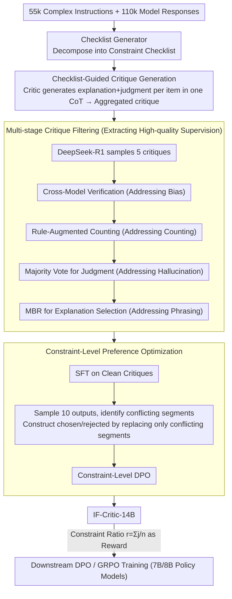

# IF-Critic: Towards a Fine-Grained LLM Critic for Instruction-Following Evaluation

**Conference**: ACL 2026  
**arXiv**: [2511.01014](https://arxiv.org/abs/2511.01014)  
**Code**: https://github.com/thu-coai/IF-CRITIC (Available)  
**Area**: LLM Evaluation / Reward Model / Instruction Following  
**Keywords**: Instruction-following evaluation, Checklist Critic, constraint-level DPO, Critique Filtering, GRPO reward signals

## TL;DR
This paper proposes IF-Critic-14B: it first utilizes a Checklist Generator to decompose complex instructions into a constraint checklist, then allows the critic to provide "explanation + 0/1 judgment" for each constraint within a **single inference**. Through multi-stage filtering of high-quality critiques and constraint-level DPO training, it surpasses o4-mini / Gemini-3-Pro on four instruction-following benchmarks. Furthermore, it enables 7B/8B policy models to match the performance of 32B/70B models in the same family on Multi-IF / CFBench / SysBench via GRPO training with approximately 1/3 of the computational cost.

## Background & Motivation

**Background**: Utilizing LLMs as a Judge to evaluate instruction following and using their scores as rewards for DPO / RLHF / GRPO is the current mainstream paradigm for enhancing complex instruction-following capabilities (e.g., SPaR, RECAST, Conifer).

**Limitations of Prior Work**: The authors highlight two chronically underestimated issues: (1) **High computational cost**—mainstream methods use large models like GPT-4o / QwQ-32B to perform a **separate** invocation for each constraint. Complex instructions often contain 5–20 constraints, meaning a single sample requires over a dozen inference passes. (2) **Unreliable judgment**—LLM Judges show low recall in error detection and perform poorly on constraints requiring counting (e.g., "length = 8 words"), leading to noisy reward signals.

**Key Challenge**: While current mitigation methods (such as introducing code-verifiable constraints) are reliable, they offer **limited constraint types and cannot cover the compositionality of natural language instructions** (e.g., "each of the first 3 paragraphs ends with a question mark and the total word count is $\le 300$"). Thus, a trade-off exists between "reliability" and "broad coverage."

**Goal**: The problem is decomposed into three sub-questions: (a) How to compress "one evaluation per constraint" into "one evaluation per checklist" to save computation; (b) How to simultaneously overcome LLM bias and counting deficiencies during the critique data collection phase; (c) How to focus preference optimization only on key segments with "differing judgments" without being diluted by irrelevant tokens.

**Key Insight**: Rewrite instruction evaluation as "checklist-guided critique generation"—using a checklist as a unified intermediate representation, allowing the critic to output (explanation, judgment) pairs for all constraints in a single CoT pass. On the data side, apply a four-stage filter (cross-model + rule-augmented + self-consistency); on the training side, reduce the DPO comparison granularity from "whole critique" to "segments with differing judgments."

**Core Idea**: Replace the large model judge (which runs once per constraint) with a 14B "checklist-aware critic," achieving both "fine-grained reliability" and "single-inference efficiency."

## Method

### Overall Architecture
The core of this paper is replacing the expensive practice of "invoking a large model judge for each constraint" with a 14B checklist-aware critic. Given a complex instruction and a model response, the Checklist Generator first decomposes the instruction into a constraint list $\{c_k\}_{k=1}^n$. Then, the critic produces an "explanation $e_k$ + 0/1 judgment $j_k$" for each item along the list in a single CoT inference. Aggregating these yields the full critique. Downstream, the constraint satisfaction ratio $r_i=\frac{1}{n}\sum_k j_{ik}$ is used as the reward for GRPO/DPO training of 7B/8B policy models. System training data consists of 55k real complex instructions (classified into 10 categories via CritiqueLLM, with constraint complexity scored by a small classifier). For each, 2 models (from a pool of 15) generate responses, resulting in 110k evaluation samples. The Checklist Generator is distilled from DeepSeek-R1's constraint decomposition results, achieving 99.29% accuracy per constraint and 97.50% per checklist in manual audits. The critic is based on Qwen2.5-14B-Instruct, trained via SFT + constraint-level DPO.

### Key Designs

**1. Checklist-Guided Critique Generation: Batch Evaluation in One Forward Pass**

Mainstream judges invoke large models for 5–20 constraints individually, requiring over a dozen inferences per sample, with costs scaling linearly. IF-Critic feeds (instruction, response, checklist) to the critic together, allowing it to produce each $(e_k, j_k)$ segment sequentially in a single CoT to aggregate a complete critique, compressing $O(n)$ inferences into one. Since the "checklist of constraints" is explicitly provided, the critic does not need to infer hidden constraints, and self-consistency can be based on $j_k$ voting rather than full-text comparison. The authors observed that reasoning models (o4-mini, QwQ-32B) perform better with Checklist-Level Prompts than Constraint-Level Prompts, suggesting that long-chain reasoning utilizes the global view of the checklist to perceive inter-constraint relationships, validating this training objective.

**2. Multi-stage Critique Filtering: Four-level Pipeline for High-quality Supervision**

DeepSeek-R1 is used to sample $N=5$ expert critiques for each $(x, y, \text{checklist})$, but LLM judges suffer from inherent bias, hallucinations, and "counting flaws." To avoid polluting the critic, a four-stage filter selects the cleanest $(e_k^*, j_k^*)$ for each constraint: (i) **Cross-Model Verification** uses GLM-4-Plus and Qwen2.5-72B for blind verification of whether the "explanation is correct" and "explanation matches judgment," discarding roughly 11.3% that fail (addresses bias); (ii) **Rule-Augmented Verification** uses Qwen2.5-72B to extract segments subject to length constraints, performs ground-truth counting with Python, and has DeepSeek-R1 revise the critique based on these results (addresses counting); (iii) **Final Judgement Selection** uses majority voting across 5 critiques for each constraint, discarding those with confidence $<0.75$ (addresses hallucination); (iv) **Final Explanation Selection** performs Minimum Bayes Risk (MBR) selection on the set of explanations $\mathcal{H}_k$ consistent with the final judgment: $e_k^* = \arg\max_{e \in \mathcal{H}_k} \frac{1}{|\mathcal{H}_k|} \sum_{\tilde e \in \mathcal{H}_k} u(\tilde e, e)$ (similarity $u$ implemented by difflib, addresses phrasing noise). These four levels correspond to the four typical failure modes of LLM-as-a-Judge. Manual review of 353 constraints from 70 samples showed 96.03% correct judgments and 92.35% correct explanations.

**3. Constraint-Level Preference Optimization: Localizing Preference Pairs to Conflicting Segments**

Traditional response-level DPO includes "segments that are both correct" in the comparison, diluting the judgment differences with irrelevant tokens. This work splits data 6:4 into $D_\text{sft} \cup D_\text{ref}$. The SFT stage minimizes $\mathcal{L}_\text{SFT} = -\sum_i \log P_\theta(C_i \mid p_i)$. In the preference stage, $M=10$ critiques are sampled from the SFT critic for each $D_\text{ref}$ sample. Critiques with "at least one judgment differing from the expert" are used as $C_l$. $C_w$ is constructed by keeping segments consistent with the expert and replacing inconsistent segments with "the MBR-optimal explanation $\hat e_k$ from the self-sampled pool that matches the expert judgment + the expert judgment $j_k^*$." This ensures token differences between $C_w$ and $C_l$ only fall on judgment-conflicting segments. Standard DPO loss is then applied: $\mathcal{L}_\text{DPO}(\pi_\theta;\pi_\text{ref}) = -\mathbb{E}\big[\log \sigma\big(\beta\log \frac{\pi_\theta(C_w|p)}{\pi_\text{ref}(C_w|p)} - \beta\log \frac{\pi_\theta(C_l|p)}{\pi_\text{ref}(C_l|p)}\big)\big]$. Using "self-sampled explanations" rather than "expert explanations" as the replacement source ensures $C_w$ remains within the decoding space of the SFT critic, stabilizing optimization.

### Loss & Training
Two stages for the critic: SFT (Eq. 3) + Constraint-level DPO (Eq. 5), with $\beta$ at the DPO standard. The base model is Qwen2.5-14B-Instruct. Downstream policy training employs both DPO and GRPO. For GRPO, 32 rollouts are sampled per instruction, with the reward defined as the constraint satisfaction ratio $r_i = \frac{1}{n}\sum_k j_{ik}$. Policies used are Qwen2.5-7B-Instruct and Llama-3.1-8B-Instruct.

## Key Experimental Results

### Main Results

Average of "Positive F1 + Negative F1" on four meta-eval benchmarks (higher is better):

| Evaluator | Prompt Format | EvalCritic Avg F1 | CFBench Avg F1 | TRACE Avg F1 | Multi-IF Avg F1 | Four-Bench Avg |
|-----------|---------------|-------------------|----------------|--------------|-----------------|----------------|
| Gemini-3-Pro | Checklist-Level | 0.822 | 0.877 | 0.794 | 0.926 | 0.855 |
| o4-mini | Checklist-Level | 0.832 | 0.848 | 0.782 | 0.932 | 0.849 |
| GPT-4.1 | Checklist-Level | 0.722 | 0.778 | 0.720 | 0.866 | 0.771 |
| DeepSeek-R1 | Checklist-Level | 0.806 | 0.827 | 0.745 | 0.883 | 0.815 |
| QwQ-32B | Checklist-Level | 0.778 | 0.819 | 0.746 | 0.863 | 0.801 |
| **IF-Critic-14B (Ours)** | Checklist-Level | **0.867** | **0.861** | **0.841** | **0.895** | **0.866** |

Downstream policy training (Qwen2.5-7B-Instruct as the base):

| Training Method | Reward Source | Relative Compute | Multi-IF Turn1 | CFBench PSR | SysBench SSR |
|-----------------|---------------|------------------|----------------|-------------|--------------|
| Baseline | - | - | 76.14 | 0.56 | 19.10 |
| DPO | Skywork-V2-8B | 0.79× | 77.86 | 0.63 | 23.60 |
| DPO | QwQ-32B | 13.4× | 80.44 | 0.61 | 24.23 |
| DPO | **IF-Critic-14B**| **1.00×** | **81.25** | 0.63 | 28.71 |
| GRPO | QwQ-32B | 3.08× | 78.59 | 0.64 | 37.58 |
| GRPO | **IF-Critic-14B**| **1.00×** | **81.87** | **0.69** | **44.44** |

GRPO + IF-Critic pushed Qwen2.5-7B on SysBench SSR from 19.10 to 44.44, matching Qwen2.5-32B-Instruct (44.83) while using only 1/3 the compute compared to the QwQ-32B route.

### Ablation Study

| Configuration | EvalCritic | CFBench | TRACE | Multi-IF |
|---------------|------------|---------|--------|----------|
| Full IF-Critic-14B | **0.861** | **0.863** | **0.840** | **0.895** |
| w/ Constraint-Level Critique (Separate assessment) | 0.844 | 0.830 | 0.816 | 0.859 |
| w/ Raw Data (No filtering) | 0.814 | 0.792 | 0.774 | 0.780 |
| w/o Cross-Model Verification | 0.851 | 0.858 | 0.832 | 0.874 |
| w/o Rule-Augmented Verification | 0.827 | 0.823 | 0.789 | 0.825 |
| w/o Final Judgement Selection | 0.840 | 0.804 | 0.821 | 0.849 |
| w/o Final Explanation Selection | 0.840 | 0.846 | 0.807 | 0.858 |
| w/ Vanilla DPO (Response-level pairs) | 0.797 | 0.797 | 0.785 | 0.841 |
| w/ Expert Critique (Expert as chosen replacement) | 0.828 | 0.836 | 0.801 | 0.840 |
| w/o Preference Learning (SFT only) | 0.815 | 0.810 | 0.810 | 0.841 |

### Key Findings
- **Checklist-guided training is the performance cornerstone**: Reverting from checklist-based batch evaluation to per-constraint critique leads to drops across all four benchmarks (up to -3.6pt), signifying that "clue provided + long-chain CoT" is necessary to learn inter-constraint relationships.
- **Rule-Augmented verification is the most critical filter**: Removing it caused drops of 4–5pt on CFBench/TRACE, proving that LLM counting failures on length constraints are the primary source of evaluation noise. Training on raw data caused the largest drop (-5 to 12pt), showing that noisy labels severely degrade the critic.
- **Constraint-level DPO outperforms Response-level DPO**: Localizing chosen/rejected pairs to "segments with differing judgments" resulted in a 5.4pt lead on Multi-IF over Vanilla DPO, validating the hypothesis that "irrelevant tokens dilute preference signals."
- **Downstream GRPO > DPO**: GRPO outperformed DPO across all critics, and the gain provided by IF-Critic was the most significant, indicating that a reliable reward is a true bottleneck release for RL.
- **Human Evaluation of Explanation Quality**: IF-Critic showed win-rate improvements of +9.3% and +7.7% over QwQ-32B and DeepSeek-R1 respectively, matching o4-mini. This indicates that the 14B critic's explanation capabilities approach those of top-tier reasoning models.

## Highlights & Insights
- **"Checklist as intermediate representation" is a clever decoupling**: It separates "instruction understanding" (done by the Checklist Generator) from "constraint judgment" (done by IF-Critic). Both use LLMs but have independent training data/losses. This acts as an explicit inductive bias, relieving the critic of the cognitive burden of inferring hidden constraints.
- **Multi-stage Critique Filtering is a practical "manual" for taming LLM Judges**: Cross-model for bias, rules for counting, self-consistency for hallucinations, and MBR for phrasing—this quartet can be directly applied to any fine-grained evaluation scenario requiring an LLM-as-a-Judge (e.g., long-form fact-checking, code security auditing).
- **Constraint-level DPO offers a new perspective on "where preference pairs should be"**: While traditional DPO considers the whole response, the idea of "localized preference pairs" in structured multi-segment critiques can be migrated to step-level reward modeling and reasoning chain DPO.
- **Impressive Efficiency**: The QwQ-32B reward route consumes 13.4× more compute for DPO and 3.08× for GRPO than IF-Critic, while yielding worse results. This suggests that "small and precise critics" are more valuable than "large and coarse judges" in the RLHF/RLAIF era.

## Limitations & Future Work
- The authors acknowledge that **Rule-Augmented Verification currently only covers length constraints**, leaving other code-verifiable constraints (e.g., keyword presence, structural formatting) for future inclusion.
- Like all LLM Judges, IF-Critic may still be affected by **self-enhancement and verbosity bias**; the paper does not introduce mitigation mechanisms like multi-agent debate at inference time.
- Personal observation: (a) Evaluation sets are somewhat biased towards Chinese, and generalization to English long-context scenarios was not deeply explored; (b) The 99% accuracy of the checklist generator was measured on the "complex instruction" distribution; it might drop significantly for ambiguous instructions (e.g., open-ended creative writing), and the downstream error of the critic is the product of the generator and critic in series; (c) A 14B critic is not cost-free; it may still become a bottleneck during large-scale online RLHF rollouts. Distilling the critic to smaller sizes or converting it to a regression reward head could be considered.

## Related Work & Insights
- **vs SPaR (ICLR 25)**: SPaR uses self-play tree-search refinement to construct DPO data, relying on a strong LLM refiner. IF-Critic focuses on making the reward signal itself strong and fine-grained, benefiting both DPO and GRPO without a refiner.
- **vs RECAST**: RECAST splits constraints into soft (evaluated by GPT-4o) and hard (evaluated by code). IF-Critic offers a "unified LLM critic + selective rule augmentation" scheme, providing broader coverage at lower cost.
- **vs Skywork-Reward-V2 and other general RMs**: General reward models show almost no improvement on instruction-following tasks (CFBench +0.04), indicating that "general rewards" and "fine-grained instruction-following preferences" occupy different reward spaces.
- **vs Prometheus / RM-R1**: General critics achieve only 0.4–0.7 in pairwise agreement on instruction following, while IF-Critic reaches 0.88–0.98, demonstrating that "checklist-guided single inference + multi-constraint output" is the correct modeling approach for this task.

## Rating
- Novelty: ⭐⭐⭐⭐ The checklist-guided critique paradigm + constraint-level DPO are clear, solid combinatorial innovations.
- Experimental Thoroughness: ⭐⭐⭐⭐⭐ 4 meta-evals + 3 downstream benchmarks + cross-model baselines (including o4-mini/Gemini-3-Pro/QwQ-32B/Skywork-V2) + detailed ablations + human eval; the coverage is exemplary.
- Writing Quality: ⭐⭐⭐⭐ Clear logical flow in chapters; formulas, algorithms, and data flow diagrams are well-aligned, though some details require the appendix for full reproduction.
- Value: ⭐⭐⭐⭐⭐ Directly provides an open-source 14B critic and training recipe for instruction-following RLHF/GRPO, offering significant computational savings for the engineering community.

<!-- RELATED:START -->

## Related Papers

- [\[ACL 2026\] IF-RewardBench: Benchmarking Judge Models for Instruction-Following Evaluation](if-rewardbench_benchmarking_judge_models_for_instruction-following_evaluation.md)
- [\[ACL 2026\] Rethinking Meeting Effectiveness: A Benchmark and Framework for Temporal Fine-grained Automatic Meeting Effectiveness Evaluation](rethinking_meeting_effectiveness_a_benchmark_and_framework_for_temporal_fine-gra.md)
- [\[ACL 2026\] Revisiting the Reliability of Language Models in Instruction-Following](revisiting_the_reliability_of_language_models_in_instruction-following.md)
- [\[ACL 2026\] LoCar: Localization-Aware Evaluation of In-Vehicle Assistants through Fine-Grained Sociolinguistic Control](locar_localization-aware_evaluation_of_in-vehicle_assistants_through_fine-graine.md)
- [\[ACL 2026\] K-MetBench: A Multi-Dimensional Benchmark for Fine-Grained Evaluation of Expert Reasoning, Locality, and Multimodality in Meteorology](k-metbench_a_multi-dimensional_benchmark_for_fine-grained_evaluation_of_expert_r.md)

<!-- RELATED:END -->
