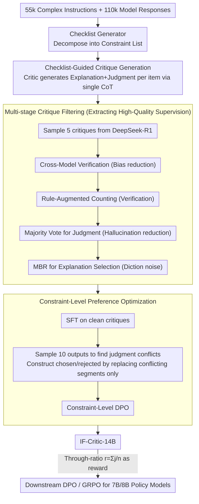

# IF-Critic: Towards a Fine-Grained LLM Critic for Instruction-Following Evaluation

**Conference**: ACL 2026  
**arXiv**: [2511.01014](https://arxiv.org/abs/2511.01014)  
**Code**: https://github.com/thu-coai/IF-CRITIC (Available)  
**Area**: LLM Evaluation / Reward Models / Instruction Following  
**Keywords**: Instruction following evaluation, Checklist Critic, constraint-level DPO, Critique Filtering, GRPO reward signals

## TL;DR
This paper proposes IF-Critic-14B: it first uses a Checklist Generator to decompose complex instructions into a list of constraints, then enables the critic to provide "explanation + 0/1 judgment" for all constraints within a **single inference**. Through high-quality critique training with multi-stage filtering and constraint-level DPO, it outperforms o4-mini / Gemini-1.5-Pro (noted as Gemini-3-Pro in original text) on four instruction-following benchmarks. Furthermore, using approximately 1/3 of the compute, it enables 7B/8B policy models to match the performance of 32B/70B family models on Multi-IF / CFBench / SysBench after GRPO training.

## Background & Motivation

**Background**: Utilizing LLMs as a Judge to evaluate instruction following and using their scores as rewards for DPO / RLHF / GRPO is the current mainstream paradigm for enhancing complex instruction following capabilities (adopted by SPaR, RECAST, Conifer, etc.).

**Limitations of Prior Work**: The authors highlight two long-underestimated issues: (1) **High computational cost**—the standard approach uses large models like GPT-4o / QwQ-32B to perform **separate** calls for every single constraint. Since complex instructions often involve 5–20 constraints, a single sample requires over a dozen inferences. (2) **Unreliable judgment**—LLM judges show low recall in error detection and perform poorly on counting constraints (e.g., "length = 8 words"), leading to noisy reward signals.

**Key Challenge**: While existing mitigations (such as introducing code-verifiable constraints) are reliable, they tackle **limited constraint types and fail to cover the compositionality of natural language instructions** (e.g., "each of the first 3 paragraphs must end with a question mark and total word count ≤ 300"). Thus, a trade-off exists between "reliability" and "breadth of coverage."

**Goal**: Address three sub-problems—(a) compressing "one-by-one evaluation" into "checklist evaluation" to save compute; (b) overcoming LLM bias and counting deficiencies during critique data collection; (c) focusing preference optimization only on key segments with "differing judgments" rather than diluting signals with irrelevant tokens.

**Key Insight**: Reframe instruction evaluation as "checklist-guided critique generation"—using a checklist as the unified intermediate representation, allowing the critic to output (explanation, judgment) pairs for all constraints in one CoT. Data-wise, a four-stage filtering process (cross-model + rule-augmented + self-consistency) is used. Training-wise, the DPO granularity is shifted from "entire critique" to "segments with differing judgments."

**Core Idea**: Replace the heavy per-constraint judge with a 14B "checklist-aware critic" to achieve both "fine-grained reliability" and "single-inference efficiency."

## Method

### Overall Architecture
The core of this work is a 14B checklist-aware critic that replaces the expensive practice of calling a large model judge for each individual constraint. Given a complex instruction and a model response, a Checklist Generator first decomposes the instruction into a constraint list $\{c_k\}_{k=1}^n$. The critic then generates "explanation $e_k$ + 0/1 judgment $j_k$" sequentially in a single CoT inference. The through-constraint ratio $r_i=\frac{1}{n}\sum_k j_{ik}$ is used as the reward for training 7B/8B policy models via DPO/GRPO. Training data consists of 110k evaluation samples derived from 55k complex instructions. The Checklist Generator is distilled from DeepSeek-R1 (achieving 99.29% per-constraint accuracy). The critic is built on Qwen2.5-14B-Instruct via SFT + constraint-level DPO.

### Key Designs

**1. Checklist-Guided Critique Generation: Batch Evaluating All Constraints in One Forward Pass**

Standard judges invoke a large model for each of the 5–20 constraints, leading to linear compute scaling. IF-Critic feeds the (instruction, response, checklist) to the critic together, producing $(e_k, j_k)$ segments in a single CoT. Since the "checklist of constraints" is explicitly provided, the critic does not need to infer hidden requirements, and self-consistency can be calculated via $j_k$ voting. Observations show that reasoning models (o4-mini, QwQ-32B) perform better under Checklist-Level Prompts than Constraint-Level Prompts, suggesting long-chain reasoning benefits from a global view of constraint relationships.

**2. Multi-stage Critique Filtering: A Four-Stage Pipeline for High-Quality Supervision**

DeepSeek-R1 is used to sample $N=5$ expert critiques, but LLM judges suffer from bias and "inability to count." A four-stage filter selects the cleanest $(e_k^*, j_k^*)$: (i) Cross-Model Verification uses GLM-4-Plus and Qwen2.5-72B to double-blind verify if "explanations are correct" and "explanation matches judgment" (filtering ~11.3%); (ii) Rule-Augmented Verification uses Qwen2.5-72B to extract length-related segments, validates them with Python, and asks DeepSeek-R1 to revise accordingly; (iii) Final Judgement Selection uses majority voting on judgments across 5 critiques, discarding those with confidence $<0.75$; (iv) Final Explanation Selection uses MBR on the consistent explanation set $\mathcal{H}_k$ where $e_k^* = \arg\max_{e \in \mathcal{H}_k} \frac{1}{|\mathcal{H}_k|} \sum_{\tilde e \in \mathcal{H}_k} u(\tilde e, e)$ (similarity $u$ via difflib). Human review of 353 constraints showed 96.03% judgment accuracy.

**3. Constraint-Level Preference Optimization: Localizing Preference Pairs to Judgment-Conflict Segments**

Traditional response-level DPO includes correct descriptions in the contrastive loss, diluting the judgment signal. The authors split data into $D_\text{sft} \cup D_\text{ref}$. For $D_\text{ref}$, they sample $M=10$ critiques from the SFT critic and identify those with at least one judgment differing from the expert. For $C_w$, they keep segments matching the expert and only replace conflicting segments with "self-sampled explanations that match the expert judgment + the expert judgment itself." This ensures the token difference between $C_w$ and $C_l$ is localized to judgment-conflicting sections. The standard DPO loss is then applied:
$$\mathcal{L}_\text{DPO}(\pi_\theta;\pi_\text{ref}) = -\mathbb{E}\big[\log \sigma\big(\beta\log \frac{\pi_\theta(C_w|p)}{\pi_\text{ref}(C_w|p)} - \beta\log \frac{\pi_\theta(C_l|p)}{\pi_\text{ref}(C_l|p)}\big)\big]$$

### Loss & Training
The critic is trained in two stages: SFT (Eq. 3) + Constraint-Level DPO (Eq. 5). $\beta$ follows standard DPO settings, with Qwen2.5-14B-Instruct as the base. Downstream policy training uses DPO and GRPO. For GRPO, each instruction samples 32 rollouts, with rewards $r_i = \frac{1}{n}\sum_k j_{ik}$.

## Key Experimental Results

### Main Results

Meta-eval averages (Positive F1 + Negative F1) across four benchmarks (higher is better):

| Critic | Prompt Style | EvalCritic Avg F1 | CFBench Avg F1 | TRACE Avg F1 | Multi-IF Avg F1 | Four-Bench Avg |
|--------|-------------|--------------------|------------------|----------------|-------------------|----------|
| Gemini-1.5-Pro | Checklist-Level | 0.822 | 0.877 | 0.794 | 0.926 | 0.855 |
| o4-mini | Checklist-Level | 0.832 | 0.848 | 0.782 | 0.932 | 0.849 |
| GPT-4o | Checklist-Level | 0.722 | 0.778 | 0.720 | 0.866 | 0.771 |
| DeepSeek-R1 | Checklist-Level | 0.806 | 0.827 | 0.745 | 0.883 | 0.815 |
| QwQ-32B | Checklist-Level | 0.778 | 0.819 | 0.746 | 0.863 | 0.801 |
| **IF-Critic-14B (Ours)** | Checklist-Level | **0.867** | **0.861** | **0.841** | **0.895** | **0.866** |

Downstream policy training (starting from Qwen2.5-7B-Instruct):

| Training Method | Reward Source | Rel. Compute | Multi-IF Turn1 | CFBench PSR | SysBench SSR |
|----------|----------|----------|----------------|--------------|---------------|
| Baseline | - | - | 76.14 | 0.56 | 19.10 |
| DPO | Skywork-V2-8B | 0.79× | 77.86 | 0.63 | 23.60 |
| DPO | QwQ-32B | 13.4× | 80.44 | 0.61 | 24.23 |
| DPO | **IF-Critic-14B** | **1.00×** | **81.25** | 0.63 | 28.71 |
| GRPO | QwQ-32B | 3.08× | 78.59 | 0.64 | 37.58 |
| GRPO | **IF-Critic-14B** | **1.00×** | **81.87** | **0.69** | **44.44** |

GRPO + IF-Critic boosted Qwen2.5-7B's SysBench SSR from 19.10 to 44.44, matching Qwen2.5-32B-Instruct (44.83) while using 1/3 the compute compared to the QwQ-32B reward route.

### Ablation Study

| Configuration | EvalCritic | CFBench | TRACE | Multi-IF |
|------|------------|---------|--------|----------|
| Full IF-Critic-14B | **0.861** | **0.863** | **0.840** | **0.895** |
| w/ Constraint-Level Critique (Iterative evaluation) | 0.844 | 0.830 | 0.816 | 0.859 |
| w/ Raw Data (No filtering) | 0.814 | 0.792 | 0.774 | 0.780 |
| w/o Cross-Model Verification | 0.851 | 0.858 | 0.832 | 0.874 |
| w/o Rule-Augmented Verification | 0.827 | 0.823 | 0.789 | 0.825 |
| w/o Final Judgement Selection | 0.840 | 0.804 | 0.821 | 0.849 |
| w/o Final Explanation Selection | 0.840 | 0.846 | 0.807 | 0.858 |
| w/ Vanilla DPO (Response-level pairs) | 0.797 | 0.797 | 0.785 | 0.841 |
| w/ Expert Critique (Chosen uses expert explanation) | 0.828 | 0.836 | 0.801 | 0.840 |
| w/o Preference Learning (SFT only) | 0.815 | 0.810 | 0.810 | 0.841 |

### Key Findings
- **Checklist-guided training is the foundation**: Performance dropped across all benchmarks (up to -3.6pt) when reverting to per-constraint critiques.
- **Rule-Augmented filtering is the most critical stage**: Removing it caused a 4-5pt drop on CFBench/TRACE, confirming that counting errors are the largest noise source.
- **Constraint-level DPO outperforms Response-level DPO**: Localizing pairs to judgment-conflicting segments yielded a +5.4pt Gain on Multi-IF compared to Vanilla DPO.
- **Downstream GRPO > DPO**: GRPO consistently outperformed DPO across all critics, with IF-Critic providing the largest boost, highlighting that reliable rewards remove the bottleneck for RL.
- **Explanation Quality**: IF-Critic achieved human evaluation win-rates against QwQ-32B (+9.3%) and DeepSeek-R1 (+7.7%), nearly matching o4-mini.

## Highlights & Insights
- **Checklist as an intermediate representation is an elegant decoupling**: It separates "instruction understanding" (Checklist Generator) from "constraint judgment" (Critic). This inductive bias relieves the critic of the cognitive burden of inferring requirements.
- **Multi-stage Critique Filtering is a practical "recipe" for LLM Judges**: Cross-model for bias, rule-based for counting, self-consistency for hallucinations, and MBR for diction. This can be directly ported to other fine-grained evaluation tasks.
- **Constraint-Level DPO offers a new perspective on preference segments**: While traditional DPO treats the response as an atomic unit, "local preference" can be applied to any structured multi-segment output, such as step-level reasoning chains.
- **Computational Efficiency**: The QwQ-32B route takes 13.4× more compute for DPO and 3.08× for GRPO compared to IF-Critic, yet performs worse. Highly accurate small critics often have more engineering value than large, generic judges.

## Limitations & Future Work
- **Rule-Augmented Verification currently only covers length constraints**, leaving keywords or structural formats to future work.
- Like all LLM judges, it may still be susceptible to **self-enhancement and verbosity bias**.
- Personal Observations: (a) The dataset is somewhat heavy on Chinese; (b) the 99% generator accuracy was measured on "complex instructions"—it might decline on ambiguous/creative prompts; (c) a 14B critic is still a cost factor for large-scale online RLHF.

## Related Work & Insights
- **vs SPaR (ICLR 25)**: SPaR relies on strong LLM refiners; IF-Critic focuses on making the reward signal itself stronger and more fine-grained.
- **vs RECAST**: RECAST splits constraints into soft (LLM) and hard (code). IF-Critic uses a unified LLM critic with selective rule-augmentation, offering broader coverage.
- **vs Generic Reward Models (e.g., Skywork-Reward-V2)**: Generic RMs barely improve instruction following (CFBench +0.04), indicating that "general preference" and "fine-grained constraint following" occupy different reward spaces.
- **vs Prometheus / RM-R1**: Generic critics achieve 0.4–0.7 agreement on instruction following; IF-Critic reaches 0.88–0.98, proving that checklist-guided single-inference is the superior modeling choice for this task.

## Rating
- Novelty: ⭐⭐⭐⭐ The checklist-guided critique paradigm and constraint-level DPO are clear, effective combinatorial innovations.
- Experimental Thoroughness: ⭐⭐⭐⭐⭐ 4 meta-evals + 3 downstream benchmarks + strong baselines (o4-mini/Gemini-1.5-Pro) + detailed ablations.
- Writing Quality: ⭐⭐⭐⭐ Logic is clear; formulas and data flow diagrams are well-matched.
- Value: ⭐⭐⭐⭐⭐ Provides an open-source 14B critic and training recipe that significantly reduces compute for RLHF/GRPO.

<!-- RELATED:START -->

## Related Papers

- [\[ACL 2026\] IF-RewardBench: Benchmarking Judge Models for Instruction-Following Evaluation](if-rewardbench_benchmarking_judge_models_for_instruction-following_evaluation.md)
- [\[ACL 2026\] WildIFEval: Instruction Following in the Wild](wildifeval_instruction_following_in_the_wild.md)
- [\[ACL 2026\] Rethinking Meeting Effectiveness: A Benchmark and Framework for Temporal Fine-grained Automatic Meeting Effectiveness Evaluation](rethinking_meeting_effectiveness_a_benchmark_and_framework_for_temporal_fine-gra.md)
- [\[ACL 2026\] Revisiting the Reliability of Language Models in Instruction-Following](revisiting_the_reliability_of_language_models_in_instruction-following.md)
- [\[ACL 2026\] LoCar: Localization-Aware Evaluation of In-Vehicle Assistants through Fine-Grained Sociolinguistic Control](locar_localization-aware_evaluation_of_in-vehicle_assistants_through_fine-graine.md)

<!-- RELATED:END -->
