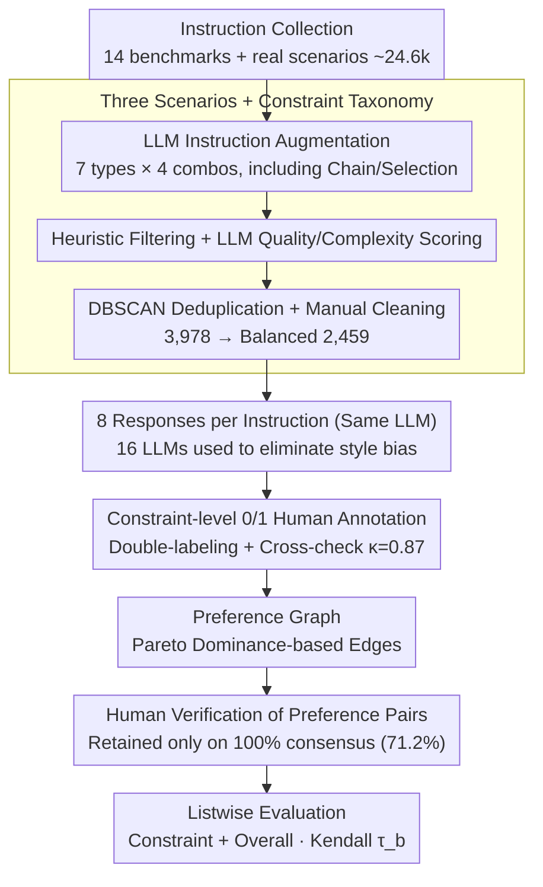

# IF-RewardBench: Benchmarking Judge Models for Instruction-Following Evaluation

**Conference**: ACL 2026  
**arXiv**: [2603.04738](https://arxiv.org/abs/2603.04738)  
**Code**: https://github.com/thu-coai/IF-RewardBench (Available)  
**Area**: LLM Evaluation / Reward Models / Judge Benchmark  
**Keywords**: Instruction Following, Judge Model, Preference Graph, Listwise Evaluation, Pareto Dominance

## TL;DR
This paper introduces IF-RewardBench: the first meta-evaluation benchmark for judges that covers single-turn, multi-turn, and system-prompt instructions. It features responses generated by 16 LLMs and rigorous human annotation (Cohen's $\kappa=0.87$). The benchmark upgrades the traditional pairwise/BoN evaluation paradigm to listwise evaluation based on **Pareto-dominance preference graphs**. Evaluations of 22 SOTA judges (including Gemini-3-Pro, GPT-5.1, and various reward models) reveal that the strongest judge achieves a Kendall $\tau_b$ of only 0.609 (far below the human baseline of 0.755), all specialized RMs score below 0.2, and this benchmark shows significantly higher correlation with downstream BoN performance compared to existing benchmarks like RewardBench-2 and PPE-IF.

## Background & Motivation

**Background**: LLM-as-a-Judge has become a core component for instruction-following evaluation and RLHF/DPO reward signals. However, the reliability of the "judge itself" is mostly estimated empirically. Current meta-evaluation benchmarks (LLMBar, InfoBench, IFBench, PPE-IF, RewardBench-2-IF) primarily use pairwise or BoN (Best-of-N) selection formats.

**Limitations of Prior Work**: The authors identify three major weaknesses: (1) **Narrow Data Coverage**: Existing benchmarks focus almost exclusively on code-verifiable constraints (IFEval lineage) and AND combinations, lacking multi-turn dialogues and system-prompt scenarios; (2) **Simplified Evaluation Paradigm**: Pairwise/BoN follow "winner-take-all" logic, but real RLHF optimization requires "fine-grained ranking of multiple responses," which winner-take-all cannot measure; (3) **Unreliable GT**: Many benchmark preference pairs are synthesized by LLMs or judged by scripts without human verification, leading to evaluation bias and length/style confounding.

**Key Challenge**: When using benchmarks like RewardBench to select a judge as a reward model for DPO/GRPO, the correlation between benchmark scores and downstream alignment performance is weak. This is because benchmarks test "which response is better," while downstream tasks require "reranking N responses"—a misalignment of capability dimensions.

**Goal**: (a) To construct an instruction pool covering single-turn/multi-turn/system-prompt scenarios with complete constraint types and combinations; (b) To upgrade "binary preference" to "multi-response preference graphs" to test ranking ability; (c) To ensure all ground truth (GT) comes from trained human annotation with multi-round cross-checking.

**Key Insight**: The evaluation of a judge should be derived from two core capabilities—Verification (correctly assigning 0/1 to each constraint) and Ranking (aligning multi-response rankings with ground truth based on constraint-level judgments). Both capabilities correspond to the actual signals used in downstream reinforcement learning.

**Core Idea**: Replace "pairwise accuracy" with "Pareto-dominance induced preference graphs + listwise Kendall $\tau_b$" to align judge evaluation with real optimization scenarios.

## Method

### Overall Architecture
IF-RewardBench is a "dataset + evaluation protocol" rather than a model. It aims to align judge evaluation from pairwise/BoN selection to the listwise ranking required by RLHF. On the data side, ~24.6k instructions were collected from 14 open-source benchmarks and real-world scenarios. These were augmented with complex instructions (7 constraint categories × 4 combinations) using LLMs, filtered by length, scored for quality/complexity, de-duplicated via DBSCAN (Conan-embedding), and manually cleaned to yield a balanced set of 2,459 instructions. For each instruction, $m=8$ responses were generated by the same LLM (16 LLMs covered in total, with same-model generation per instruction to eliminate style confounding). On the annotation side, 22 students performed constraint-level 0/1 labeling $j^*_{ik}$. Preference graphs were then constructed using Pareto-dominance and underwent an additional round of human verification. Each instruction is associated with a preference graph (averaging 7.14 responses and 10.86 preference edges). Judges are evaluated on Constraint Assessment (aligning 0/1 judgments, measured by Positive/Negative F1) and Overall Assessment (scoring response sets or pairwise comparisons, converted to listwise via ELO) using Kendall $\tau_b$.

### Key Designs

**1. Preference Graph: Upgrading Evaluation to Listwise via Pareto-dominance**

Ranking responses by simple mean scores $r_y=\frac{1}{n}\sum j_k$ can lead to ambiguous pairs (responses satisfying different constraints but having the same total score), polluting the GT. This paper equips each instruction with a graph $G=(I,\{c_k\},\{y_i\},\mathcal{J},\mathcal{E})$: nodes are the 8 responses, and edges exist only when strict Pareto-dominance $\forall k,\, j^*_{vk} \ge j^*_{uk} \,\land\, \exists k,\, j^*_{vk} > j^*_{uk}$ holds. This ensures every preference edge is "strictly correct." Evaluation uses Kendall $\tau_b$ to compare judge rankings against the graph-induced partial order, providing more information than pairwise accuracy and aligning with downstream reranking needs.

**2. Scenarios + Constraint Taxonomy: Maximizing Coverage**

The IFEval lineage focuses on "code-verifiable" constraints, often limiting types to objective ones like word count or format, which fails to test judgments of subjective constraints. This work extends coverage across two axes: Scenarios include Single-Turn, Multi-Turn (cross-turn constraint inheritance), and System-Prompt Steerability (system prompt priority over user prompt); Constraint Taxonomy includes seven categories (Numerical, Format, Content, Linguistic, Style, Situation, Action) and four combinations (Single, And, Chain, Selection). LLM-synthesized instructions specifically address the scarcity of Chain and Selection types. Findings show that subjective constraints like Style/Situation are the primary weaknesses for judges.

**3. Multi-step Human Annotation + Pareto Verification: Eliminating Synthetic Noise**

Previous instruction-following judge benchmarks rarely include a "manual verification of derived preference pairs" step, allowing confounding samples (e.g., those with non-instructional differences or different violation levels) to enter. This paper employs a dual-layer quality control: first, 22 students perform constraint-level 0/1 labeling (independent double-labeling + third-party cross-check, initial $\kappa=0.67$, post-check $\kappa=0.87$); second, two different annotators verify the Pareto-constructed pairs, retaining only those with 100% consensus (71.2% retention rate). Length-difference analyses (Appendix F) were also performed to ensure pairs were not confounded by length bias.

## Key Experimental Results

### Main Results

Average results of 22 judges on Constraint Assessment (constraint-level verification + aggregated ranking $\tau_b$):

| Category | Model | Avg P-F1 | Avg N-F1 | Avg Kendall $\tau_b$ |
| :--- | :--- | :--- | :--- | :--- |
| Human Baseline | 22 Students | **0.923** | **0.744** | **0.755** |
| Proprietary | Gemini-3-Pro | 0.909 | 0.681 | **0.609** |
| Proprietary | Gemini-3-Flash | 0.901 | 0.660 | 0.572 |
| Proprietary | GPT-5.1 | 0.887 | 0.610 | 0.525 |
| Proprietary | GPT-5-mini | 0.897 | 0.628 | 0.519 |
| Open-source | DeepSeek-V3.2 | 0.882 | 0.496 | 0.395 |
| Open-source | GLM-4.6 | 0.880 | 0.531 | 0.422 |
| Open-source | QwQ-32B | 0.865 | 0.455 | 0.356 |
| Open-source | Qwen-3-32B | 0.853 | 0.336 | 0.285 |
| Open-source | Llama-3.3-70B-Instruct | 0.845 | 0.335 | 0.238 |
| Open-source | Qwen-2.5-72B-Instruct | 0.840 | 0.251 | 0.181 |
| Open-source | Llama-3.1-8B-Instruct | 0.751 | 0.297 | 0.089 |

All specialized reward models (Skywork-V2, RM-R1, RRM, etc.) score $\tau_b < 0.2$ (reported in Appendix).

### Ablation Study (Overall Assessment vs. Constraint Assessment, $\tau_b$)

| Judge | Single-Turn | Multi-Turn | System-Prompt | Avg | vs. Own Constraint Avg |
| :--- | :--- | :--- | :--- | :--- | :--- |
| Gemini-3-Flash | 0.589 | 0.460 | 0.489 | 0.513 | 0.572 (Constraint +0.06) |
| GPT-5-mini | 0.521 | 0.438 | 0.410 | 0.456 | 0.519 (+0.06) |
| DeepSeek-V3.2 | 0.397 | 0.257 | 0.208 | 0.288 | 0.395 (+0.11) |

**Constraint-level evaluation consistently outperforms Overall pairwise**, with the gap widening for weaker models.

### Key Findings
- **Top judges are still far from human performance**: Gemini-3-Pro achieved the highest score (0.609 Kendall), but remains 0.15 below the human baseline (0.755), indicating instruction-following judges are not yet "satisfactory."
- **N-F1 (Error Detection) is the bottleneck**: While P-F1 (Positive F1) is high across models (0.85+), N-F1 for open-source models typically ranges between 0.2 and 0.5. Judges "fail to report errors" rather than "misidentify correct responses."
- **Constraint-Level > Overall Pairwise**: Scoring each constraint individually and aggregating results is more stable than holistic comparisons. This provides clear engineering guidance for prompting LLM-as-a-Judge.
- **Multi-Turn / System-Prompt are new frontiers**: Benchmarked judges perform worse in multi-turn and system-prompt scenarios compared to single-turn, suggesting attention mechanisms lack sensitivity to "cross-turn instructions" and "system prompt priority."
- **Style / Situation constraints are the most difficult**: Performance drops by 5-10 pts for subjective constraints compared to code-verifiable objective ones.
- **Stronger Downstream Correlation**: On Best-of-N tasks, judge rankings on IF-RewardBench show significantly higher Spearman correlation with BoN-1@8 performance than RewardBench-2-IF or PPE-IF.

## Highlights & Insights
- The data pipeline using **Preference Graphs + Pareto derivation** is an elegant design: (i) 0/1 GT provides granularity; (ii) Pareto strictness avoids ambiguous pairs; (iii) Generating responses for a single instruction using the **same LLM** eliminates writing style bias—a detail often neglected by other benchmarks.
- The paper provides a diagnosis for **why RewardBench is losing relevance**: Pairwise/BoN dimensions fail to measure the "fine-grained ranking" capability required for RLHF. Listwise $\tau_b$ should become the default metric for next-gen reward benchmarks.
- The observation that **N-F1 matters more than P-F1** applies to any binary LLM judge scenario. The failure mode of most judges is "missing errors," implying that reward model training should oversample negative samples.
- The **failure of specialized RMs** ($\tau_b < 0.2$) is a wake-up call: Current reward models are virtually unusable for structured instruction-following tasks and must be used in conjunction with critic-style LLM evaluations.

## Limitations & Future Work
- The benchmark is primarily English-based, and synthetic instructions may rely on LLM internal biases. The difficulty distribution is mid-hard, with limited coverage of extreme scenarios like ultra-long system prompts.
- Personal Observation: (a) Preference graphs rely solely on Pareto-dominance and cannot express "equal quality" ties, potentially losing "soft preference" info; (b) Human-only GT is difficult to scale—could a critic trained on IF-RewardBench be used to bootstrap the benchmark? (c) Correlation experiments focused solely on BoN; correlation with full GRPO pipelines remains untested.

## Related Work & Insights
- **vs. RewardBench-2-IF (2025)**: RewardBench-2 uses BoN with synthetic pairs. This work uses listwise + Pareto + human verification, covers 3x the instruction types, and shows higher downstream correlation.
- **vs. PPE-IF (2025)**: PPE uses synthetic GT for pairwise/BoN. Significant differences in judge rankings between this work and PPE highlight the impact of the evaluation paradigm.
- **vs. IFBench / InfoBench**: These lack multi-turn/system-prompt scenarios, and InfoBench is pointwise. This benchmark expands into these critical dimensions.
- **vs. IF-Critic (same group, 2511.01014)**: IF-Critic is a model, whereas IF-RewardBench is a benchmark. Together, they demonstrate that specialized critics are valuable and that general reward models are inadequate for instruction following.

## Rating
- Novelty: ⭐⭐⭐⭐ The combination of Preference Graphs, listwise $\tau_b$, and human verification is a clear paradigm upgrade.
- Experimental Thoroughness: ⭐⭐⭐⭐⭐ Comprehensive meta-evaluation across 22 judges, three scenarios, and two task types, including downstream validation.
- Writing Quality: ⭐⭐⭐⭐ Motivations and data construction are well-defined, though the density of details requires cross-referencing the appendix.
- Value: ⭐⭐⭐⭐⭐ Directly reveals that general RMs are unsuitable for instruction-following rewards, providing immediate guidance for the RLHF/GRPO community.

<!-- RELATED:START -->

## Related Papers

- [\[ACL 2026\] IF-Critic: Towards a Fine-Grained LLM Critic for Instruction-Following Evaluation](if-critic_towards_a_fine-grained_llm_critic_for_instruction-following_evaluation.md)
- [\[ACL 2026\] Revisiting the Reliability of Language Models in Instruction-Following](revisiting_the_reliability_of_language_models_in_instruction-following.md)
- [\[ACL 2026\] WildIFEval: Instruction Following in the Wild](wildifeval_instruction_following_in_the_wild.md)
- [\[ACL 2026\] AJ-Bench: Benchmarking Agent-as-a-Judge for Environment-Aware Evaluation](aj-bench_benchmarking_agent-as-a-judge_for_environment-aware_evaluation.md)
- [\[ACL 2025\] StructFlowBench: A Structured Flow Benchmark for Multi-turn Instruction Following](../../ACL2025/llm_evaluation/structflowbench_a_structured_flow_benchmark_for_multi-turn_instruction_following.md)

<!-- RELATED:END -->
