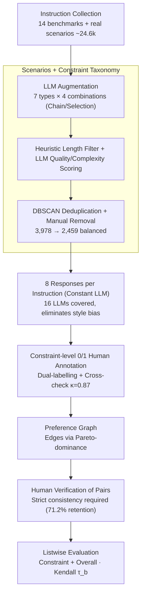

# IF-RewardBench: Benchmarking Judge Models for Instruction-Following Evaluation

**Conference**: ACL 2026  
**arXiv**: [2603.04738](https://arxiv.org/abs/2603.04738)  
**Code**: https://github.com/thu-coai/IF-RewardBench (Available)  
**Area**: LLM Evaluation / Reward Models / Judge Benchmarks  
**Keywords**: Instruction Following, Judge Model, Preference Graph, Listwise Evaluation, Pareto Dominance

## TL;DR
This paper introduces IF-RewardBench: the first meta-evaluation benchmark for judge models that simultaneously covers single-turn, multi-turn, and system-prompt instructions. It features responses generated by 16 LLMs and rigorous human annotation (Cohen's $\kappa=0.87$). The benchmark upgrades the traditional pairwise/BoN evaluation paradigm to listwise evaluation based on **Pareto-dominance preference graphs**. After evaluating 22 SOTA judges (including Gemini-3-Pro, GPT-5.1, and various reward models), findings show the strongest judge achieves a Kendall $\tau_b$ of only 0.609 (significantly lower than the human baseline of 0.755). All specialized reward models (RMs) scored below 0.2, and this benchmark's correlation with downstream BoN performance is notably higher than existing benchmarks like RewardBench-2 and PPE-IF.

## Background & Motivation

**Background**: LLM-as-a-Judge has become a core component for evaluating instruction-following capabilities and providing reward signals for RLHF/DPO. However, the reliability of the judges themselves is largely estimated empirically. Existing meta-evaluation benchmarks (LLMBar, InfoBench, IFBench, PPE-IF, RewardBench-2-IF) mostly adopt pairwise or BoN "choose-one" formats.

**Limitations of Prior Work**: The authors identify three major weaknesses: (1) **Narrow Data Coverage**: Existing benchmarks rely almost exclusively on code-verifiable constraints (IFEval lineage) and AND combinations, lacking multi-turn dialogues and system-prompt scenarios. (2) **Simplified Evaluation Paradigm**: Pairwise/BoN follow "winner-take-all" logic, but real RLHF optimization requires fine-grained ranking of multiple responses; winner-take-all metrics fail to measure this capability. (3) **Unreliable Ground Truth (GT)**: Many benchmarks use LLM-synthesized preference pairs or script-based determinations without human verification, leading to evaluation bias and confounding factors like length or style.

**Key Challenge**: When selecting a top-performing judge from benchmarks like RewardBench to serve as a reward model for DPO/GRPO, the correlation between benchmark scores and downstream alignment performance is weak. This is because benchmarks measure "which single response is better," while downstream tasks involve reranking multiple responses—a misalignment in capability dimensions.

**Goal**: (a) Construct an instruction pool covering single-turn, multi-turn, and system-prompt scenarios with comprehensive constraint types and combinations; (b) Upgrade "one good vs. one bad" to "preference graphs of multiple responses" to measure ranking ability; (c) Ensure all GT is derived from trained human annotation with multi-round cross-checking.

**Key Insight**: Data formats are derived by asking what core capabilities a judge should possess: Verification (correctly determining 0/1 for each constraint) and Ranking (aligning the ranking of multiple responses with ground truth based on constraint-level checks). Both capabilities correspond to signals used in downstream RL.

**Core Idea**: Replace "pairwise accuracy" with "preference graphs derived from Pareto-dominance + listwise Kendall $\tau_b$" to align judge evaluation with actual optimization scenarios.

## Method

### Overall Architecture
IF-RewardBench is a "dataset + evaluation protocol" rather than a model. It aims to align judge evaluation with the "ranking of multiple responses" needed for RLHF. On the data side, ~24.6k instructions were collected from 14 open-source benchmarks and real-world scenarios. Complex instructions were supplemented via LLMs across 7 constraint categories $\times$ 4 combinations, followed by heuristic length filtering, LLM quality/complexity scoring, Conan-embedding-based DBSCAN clustering for deduplication, and manual exclusion of unsolvable items, resulting in a balanced set of 2,459 instructions (from 3,978 candidates). For each instruction, one LLM generated $m=8$ responses (16 LLMs covered in total; same model per instruction to eliminate style confounding). On the annotation side, 22 students performed constraint-level 0/1 binary checks $j^*_{ik}$ for every response. Preference graphs were then derived using Pareto-dominance and verified by humans. Each instruction corresponds to a preference graph (averaging 7.14 responses and 10.86 preference edges). Judges are evaluated on Constraint Assessment (0/1 per constraint, aggregated via Eq. 1, using Positive/Negative F1) and Overall Assessment (scoring sets or pairwise comparison, converted to listwise via ELO) using Kendall $\tau_b$ to measure ranking quality.

### Key Designs

**1. Preference Graph: Upgrading Evaluation to Listwise via Pareto-dominance**  
Deriving preferences based on mean scores $r_y=\frac{1}{n}\sum j_k$ can lead to ambiguous pairs where "two responses satisfy different constraints but have the same total score," polluting the GT. This paper equips each instruction with a graph $G=(I,\{c_k\},\{y_i\},\mathcal{J},\mathcal{E})$: nodes are 8 responses, and an edge $(y_u,y_v)$ exists only under strict Pareto-dominance: $\forall k,\, j^*_{vk} \ge j^*_{uk} \,\land\, \exists k,\, j^*_{vk} > j^*_{uk}$. This ensures every preference edge is "truly correct." Evaluation uses Kendall $\tau_b$ to compare judge rankings with the graph-induced partial order, which is more informative than pairwise accuracy and aligns with downstream reranking requirements.

**2. Three Instruction Scenarios + Complete Constraint Taxonomy**  
The IFEval lineage sacrifices subjective constraints for "code-verifiability," limiting its ability to test how judges handle subjective requirements. This paper expands coverage along two axes: instruction scenarios include Single-Turn, Multi-Turn (constraints inherited across turns), and System-Prompt Steerability (system prompt priority over user prompt). The constraint taxonomy spans seven categories (Numerical, Format, Content, Linguistic, Style, Situation, Action) $\times$ four combinations (Single, And, Chain, Selection). LLM-synthesized complex instructions specifically fill the gap in Chain and Selection constraints lacking in existing benchmarks. This comprehensive coverage reveals that subjective constraints like Style/Situation are the true weaknesses of judge models.

**3. Multi-step Human Annotation + Pareto Verification**  
Existing instruction-following benchmarks often skip manual verification of derived preference pairs, allowing confusing samples (e.g., "both violated but to different degrees" or "non-instruction factors cause variance") to enter evaluation. This paper applies two layers of quality control: first, 22 trained students perform constraint-level 0/1 annotation (two independent annotators + a third cross-checker, initial Cohen's $\kappa=0.67$, post-check $\kappa=0.87$). After Pareto-based pair construction, two different annotators verify each pair; pairs are only kept if there is total agreement (71.2% retention rate). Length-difference analysis (Appendix F) confirms that preference pairs are not confounded by length bias.

## Key Experimental Results

### Main Results

Average results for 22 judges on Constraint Assessment (constraint-level verification + ranking $\tau_b$ aggregated from verification):

| Category | Model | Avg P-F1 | Avg N-F1 | Avg Kendall $\tau_b$ |
| :--- | :--- | :--- | :--- | :--- |
| Human Baseline | 22 Students | **0.923** | **0.744** | **0.755** |
| Proprietary | Gemini-3-Pro | 0.909 | 0.681 | **0.609** |
| Proprietary | Gemini-3-Flash | 0.901 | 0.660 | 0.572 |
| Proprietary | GPT-5.1 | 0.887 | 0.610 | 0.525 |
| Proprietary | GPT-5-mini | 0.897 | 0.628 | 0.519 |
| Open-source | DeepSeek-V3.2 | 0.882 | 0.496 | 0.395 |
| Open-source | GLM-4.6 | 0.880 | 0.531 | 0.422 |
| Open-source | QwQ-32B | 0.865 | 0.455 | 0.356 |
| Open-source | Qwen-3-32B | 0.853 | 0.336 | 0.285 |
| Open-source | Llama-3.3-70B-Instruct | 0.845 | 0.335 | 0.238 |
| Open-source | Qwen-2.5-72B-Instruct | 0.840 | 0.251 | 0.181 |
| Open-source | Llama-3.1-8B-Instruct | 0.751 | 0.297 | 0.089 |

All specialized reward models (Skywork-V2, RM-R1, RRM, etc.) scored $\tau_b < 0.2$ (reported in detail in the Appendix).

### Ablation Study (Overall Assessment vs. Constraint Assessment, selected $\tau_b$)

| Judge | Single-Turn | Multi-Turn | System-Prompt | Avg | vs. Own Constraint Avg |
| :--- | :--- | :--- | :--- | :--- | :--- |
| Gemini-3-Flash | 0.589 | 0.460 | 0.489 | 0.513 | 0.572 (Constraint $+0.06$ higher) |
| GPT-5-mini | 0.521 | 0.438 | 0.410 | 0.456 | 0.519 ($+0.06$) |
| DeepSeek-V3.2 | 0.397 | 0.257 | 0.208 | 0.288 | 0.395 ($+0.11$) |

**Constraint-level evaluation is consistently stronger than Overall pairwise comparison**, and the gap widens as the model weakens (e.g., DeepSeek-V3.2 shows a 0.11 difference).

### Key Findings
- **Top judges are still far from human performance**: Gemini-3-Pro achieved the highest score of 0.609 (Kendall), yet remained 0.15 below the human baseline of 0.755. This indicates that instruction-following judges are far from "solved."
- **N-F1 (Negative Detection) is the true bottleneck**: All models showed high P-F1 (0.85+), but N-F1 for open-source models usually ranged between 0.2 and 0.5. Judges rarely report "false positives" for correct responses; instead, they "miss" errors, which drastically reduces listwise ranking quality.
- **Constraint-Level is superior to Overall Pairwise**: Scoring each constraint individually and then aggregating is more stable than asking an LLM to make a holistic "which is better" comparison. This provides clear engineering guidance for LLM-as-a-Judge prompting.
- **Multi-Turn / System-Prompt are new frontiers**: In these scenarios, almost all judges performed worse in Overall pairwise comparisons than in single-turn tasks, suggesting current judge attention mechanisms are insensitive to "cross-turn constraints" and "system prompt priority."
- **Style / Situation constraints are the hardest**: Compared to objective code-verifiable constraints, subjective categories caused performance drops of 5-10 pts, highlighting structural weaknesses in subjective judgment.
- **Downstream correlation is significantly stronger**: On BoN sampling tasks, IF-RewardBench rankings showed significantly higher Spearman correlation with BoN-1@8 performance compared to PPE-IF or RewardBench-2-IF, meaning this benchmark is better at selecting judges effective for real alignment.

## Highlights & Insights
- The **Preference Graph + Pareto derivation** pipeline is a clever design: (i) using constraint-level 0/1 GT instead of holistic scores provides granularity; (ii) strict Pareto dominance avoids "equivalent mean score" ambiguities; (iii) using the **same LLM** for all responses to a single instruction eliminates style confounding—a detail ignored by most other benchmarks.
- The paper provides a diagnosis for **why RewardBench is becoming less effective**: simple pairwise/BoN metrics cannot measure the ability to perform fine-grained ranking of multiple responses, which is exactly what RLHF requires. Listwise $\tau_b$ should become the default metric for the next generation of reward benches.
- The observation that **N-F1 is more critical than P-F1** applies to any binary LLM judge scenario—most judge failure modes are "omissions" rather than "false accusations." This suggests reward training should intentionally upsample negative samples.
- The **total failure of specialized RMs** ($\tau_b < 0.2$) is a wake-up call: current mainstream reward models are unusable for structured tasks like instruction following and must be paired with critic-style LLM evaluations (aligning with the IF-Critic work from the same group).

## Limitations & Future Work
- The authors acknowledge the benchmark is predominantly English and that synthetic instructions rely on LLM biases. The difficulty distribution is mid-to-hard, lacking coverage of extreme scenarios like "ultra-long system prompts + multi-turn cross-lingual" tasks.
- Personal observations: (a) Preference graphs only use Pareto-dominance and cannot express "equal quality" preferences, potentially missing "soft preference" info; (b) Human annotation makes scaling costly—could a critic trained on IF-RewardBench be used to bootstrap the benchmark? (c) Downstream correlation was only verified on BoN tasks, without running full GRPO pipelines.
- Future directions: Applying listwise + preference graph approaches to reasoning/coding judge benches and adding "uncertainty" dimensions (e.g., an "abstain" option rather than just 0/1).

## Related Work & Insights
- **vs. RewardBench-2-IF (2025)**: RewardBench-2 is BoN-based with synthetic preference pairs; this benchmark is listwise with Pareto + human verification, covering 3x more types and showing stronger downstream correlation.
- **vs. PPE-IF (2025)**: PPE uses both pairwise and BoN but relies on synthetic GT. The 22 judge rankings here differ significantly from PPE, highlighting the impact of evaluation paradigms on leaderboard results.
- **vs. IFBench / InfoBench**: These lack multi-turn/system-prompt scenarios, and InfoBench is pointwise (no preference). This benchmark expands through all three dimensions.
- **vs. IF-Critic (Same group, 2511.01014)**: IF-Critic is the model; IF-RewardBench is the benchmark. They complement each other—the former proves "training specialized critics for instruction following is worth it," while the latter proves "general reward models fail at instruction following," forming a complete argumentative chain.

## Rating
- Novelty: ⭐⭐⭐⭐ The combination of Preference Graph + listwise $\tau_b$ + human verification is a clear paradigm upgrade.
- Experimental Thoroughness: ⭐⭐⭐⭐⭐ Eval of 22 judges $\times$ 3 scenarios $\times$ 2 task types + downstream verification makes it the most complete meta-eval for instruction-following judges to date.
- Writing Quality: ⭐⭐⭐⭐ Motivations and data construction are well-defined, though details are dense and require cross-referencing the appendix.
- Value: ⭐⭐⭐⭐⭐ Directly reveals that general RMs cannot be used as instruction-following rewards, providing immediate guidance for the RLHF/GRPO communities.

<!-- RELATED:START -->

## Related Papers

- [\[ACL 2026\] IF-Critic: Towards a Fine-Grained LLM Critic for Instruction-Following Evaluation](if-critic_towards_a_fine-grained_llm_critic_for_instruction-following_evaluation.md)
- [\[ACL 2026\] Revisiting the Reliability of Language Models in Instruction-Following](revisiting_the_reliability_of_language_models_in_instruction-following.md)
- [\[ACL 2026\] AJ-Bench: Benchmarking Agent-as-a-Judge for Environment-Aware Evaluation](aj-bench_benchmarking_agent-as-a-judge_for_environment-aware_evaluation.md)
- [\[ACL 2026\] When Vision-Language Models Judge Without Seeing: Exposing Informativeness Bias](when_vision-language_models_judge_without_seeing_exposing_informativeness_bias.md)
- [\[ACL 2026\] arXiv2Table: Toward Realistic Benchmarking and Evaluation for LLM-Based Literature-Review Table Generation](arxiv2table_toward_realistic_benchmarking_and_evaluation_for_llm-based_literatur.md)

<!-- RELATED:END -->
