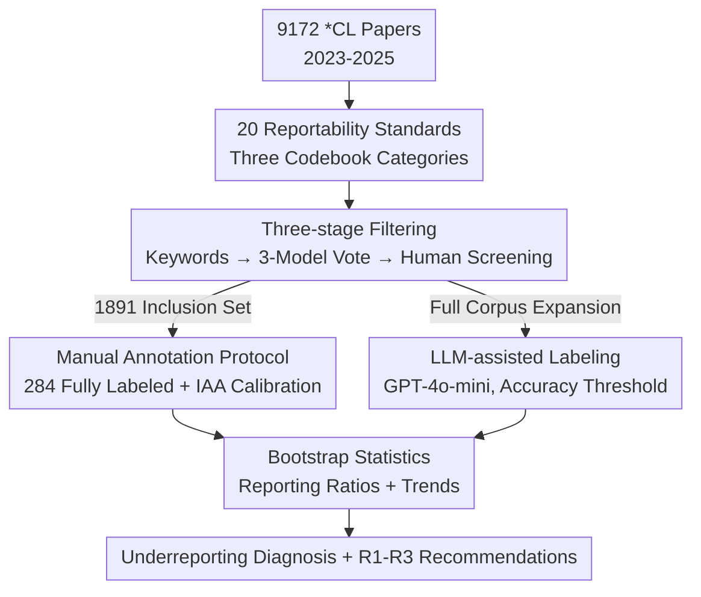

# Illusions of the Gold Standard: A Large-scale Analysis of Human Evaluation Protocols for Long-form Text Generation

**Conference**: ACL 2026  
**arXiv**: [2606.07936](https://arxiv.org/abs/2606.07936)  
**Code**: https://github.com/larchlab/Illusions-of-the-Gold-Standard  
**Area**: LLM Evaluation / NLP Generation / Reproducibility  
**Keywords**: Human Evaluation, Reproducibility, Reporting Standards, Long-form Text Generation, LLM-as-judge

## TL;DR
The authors turn the research lens on the NLP community itself: using a "reportability codebook" of 20 standards, they perform a large-scale audit of 9100+ *CL papers from 2023–2025 (284 fully manually annotated + 1800+ LLM-assisted). They demonstrate that human evaluation, revered as the "gold standard," suffers from widespread underreporting—more than half of the papers report $\le 7$ out of 20 items, statistical significance is rarely mentioned, and power analysis is virtually non-existent, suggesting the gold standard is more of an "illusion."

## Background & Motivation
**Background**: With the proliferation of LLMs, long-form/open-ended generation has become the mainstream of NLP research (compering approximately half of *CL 2025 papers). These tasks lack reliable automatic metrics, making human evaluation the default "gold standard," especially in highly professional fields such as medicine, science, law, policy, and rumor detection.

**Limitations of Prior Work**: The credibility of human evaluation relies on transparent and reproducible protocols, yet these details are frequently missing in practice. Readers often struggle to understand what was measured, how it was measured, who judged it, and how to interpret the judgments. Existing reproducibility frameworks (conference checklists, evaluation sheets, model/data cards) have limited impact—checklists are self-filled by authors and rarely verified during peer review, leading to persistent omissions of critical design details.

**Key Challenge**: Human evaluation is being assigned an increasingly critical role—not only for direct model assessment but also for "meta-evaluation" to verify the reliability of LLM-as-judge. If human evaluation itself is poorly documented and incomparable across studies, it cannot uphold its reputation as a gold standard: if the foundation is loose, the upper structure will inevitably collapse.

**Goal**: The objective is not to criticize specific papers but to characterize the current state of reporting norms across the community, quantify the severity of underreporting, and provide actionable recommendations for improvement. Specifically: ① What should be reported? ② How much is currently reported? ③ What are the temporal trends?

**Key Insight**: The authors map the core operational stages of the scientific method (design, data collection, analysis/interpretation) to specific reportable decisions by authors. They form a deliberately "lenient" judgment criterion—an item is marked as passed if the paper reports *any* content related to it, without judging the quality of that content. This yields a conservative picture of underreporting, implying the reality is likely worse.

**Core Idea**: An empirical large-scale audit of the community using a "20-item reportability codebook + three-stage corpus filtering + human/LLM dual-track labeling" to substantiate the "illusion of the gold standard" with data.

## Method

### Overall Architecture
This paper does not propose a new model; its "method" is an **audit pipeline**: distilling what human evaluation should report into a codebook (37 questions, 20 core items), filtering 9172 *CL papers to find a target set of "long-form generation + human eval" (1891 papers), manually annotating 356 sampled papers (284 included), and extending to the full corpus using LLM-assisted labeling. Finally, bootstrap statistics are used to estimate reporting ratios and temporal trends.

### Key Designs

**1. 20-Item Reportability Codebook: Solidifying "What Should Be Reported" into Checkable Items**
To address the ambiguity of omissions, the authors map three stages of reproducible science to 37 questions, with 20 core binary items (Yes/No/NA), categorized into: **Task Documentation (4 items)**—dimensions evaluated, rationale for choices, and instructions; **Annotation Design (9 items)**—interface, sample size, QA processes, recruitment platforms, inclusion criteria, compensation, and count; **Analysis & Interpretation (7 items)**—demographics, Inter-Annotator Agreement (IAA), disagreement resolution/filtering, statistical metrics, and limitations.

**2. Three-stage Progressive Corpus Filtering: Pinpointing 1891 Target Papers from 9172**
Step 1: **Keyword Filtering**—GPT-4 expanded seed words (summarize, dialogue, etc.) for case-insensitive matching (9172 → 8408). Step 2: **LLM Filtering**—Majority vote by Gemini-2.5-Pro, Claude-3.7-Sonnet, and GPT-4o-mini on two binary questions (long-form? human eval?). Papers with at least two "Yes" votes were retained (1891 papers). Step 3: **Stratified Sampling**—356 papers were sampled for manual labeling, focusing on 2024–2025 practices.

**3. Manual Annotation Protocol: Lenient Criteria + Multi-week Calibration**
Five annotators annotated 284 papers. Two key design choices were made: first, **deliberate leniency**—any mention of an item counts as "Yes," making the results a lower bound for underreporting; second, **rigorous calibration**—a three-week onboarding process until a 73% agreement rate was reached. IAA on the final set achieved 81% agreement for binary items (Cohen's $ \kappa = 0.51 $). Bootstrap resampling ($ n=500 $) was used to estimate reporting ratios and standard errors.

**4. LLM-assisted Labeling: Scaling the Audit while Maintaining Credibility**
GPT-4o-mini labeled the remaining papers. Inputs included the abstract, introduction, and relevant sections located via keywords. A critical safeguard was implemented: LLM results were only reported for questions where the **validation accuracy exceeded 0.75**. This prevents automated labeling from contaminating the conclusions.

## Key Experimental Results

### Corpus Filtering and Sampling Scale

| Stage | Papers | Description |
|------|--------|------|
| Initial Corpus (*CL 2023–2025) | 9172 | ACL/EMNLP/NAACL/EACL/AACL |
| Step 1: Keyword Filtering | 8408 (92%) | Long-form generation candidates |
| Step 2A: LLM Filter: Long-form | 3620 (39%) | Three-model majority vote |
| Step 2B: LLM Filter: + Human Eval | 1891 (21%) | Final inclusion set |
| Step 3: Manual Annotation | 356 | 284 papers met all inclusion criteria |

### Key Findings: Reporting Ratios (Representative Items)

| Reported Item | Ratio | Interpretation |
|--------|---------|------|
| Evaluation Dimensions | 98% | Almost always reported |
| Annotation Sample Size | 85% | Frequently reported |
| Number of Annotators | 77% | Frequently reported |
| Rationale for Dimensions | ~50% | Half of the papers lack justification |
| Task Instructions | ~50% | How judges decided is often omitted |
| Compensation Information | 29% | Rare |
| Discussion of Limitations | 19% | Very rare |
| IRB Approval/Status | 11% | Rare |
| Statistical Significance | 9% | Shockingly low |
| Power Analysis for Sample Size| 0% | Never used |

### Key Findings
- **The "Gold Standard" is an Illusion**: The mode of reported items is 7/20; over half of the papers report $\le 7$ items (Median 7, SD 3). No paper reported all 20 items.
- **Sample Size and Annotator Count follow "Conventions" without Justification**: Sample sizes range from 10 to 23,040 (Median 170). The median number of annotators is 3 (32% use 3; 20% use 2). Among papers reporting $>1$ annotator, only 51% report IAA.
- **Annotator Information is Widespreadly Missing**: 29% provide no demographic info; 65% do not report recruitment platforms. Among those that do, 50% recruit experts, 31% recruit students, and 13% use the authors themselves.
- **Temporal Trends**: Long-form paper count rose (30% to 50% in 2025), but the proportion using human evaluation remained stable (~20%). Critically, while the use of human eval to **meta-evaluate LLM-judges** jumped (4% in EMNLP'23 to 30% in EMNLP'24), the reporting quality for these papers showed no improvement.

## Highlights & Insights
- **Turning the Audit Tool into a Reproducible Template**: In the R1 recommendations, authors provide an "exemplary reporting paragraph" that packs all 20 items into a short block—proving that thorough reporting does not require excessive space.
- **"Lenient Judgment" as a Methodological Strength**: By awarding points for any mention, the findings become an indisputable lower bound for underreporting. It transforms a subjective labeling task into conservative, robust evidence.
- **The "Meta-evaluation Paradox"**: As the community increasingly uses human evaluation to validate LLM-judges, the rigor of human evaluation needs to increase, not stagnate. You cannot calibrate a ruler using another ruler that lacks markings.

## Limitations & Future Work
- **Scope**: Limited to *CL conferences over three years; generalizability to other fields is unproven.
- **IAA Reporting**: IAA is calculated at the overall level; item-level difficulty or variance might be masked.
- **Definition of "Reportability"**: What counts as "necessary" may vary by task. The authors suggest that specialized checklists for different evaluation roles are needed.
- **Speed vs. Overhead**: While documentation is a burden in fast-paced research, the authors argue that human evaluation involves human subjects and requires a baseline of documentation that cannot be ignored.

## Related Work & Insights
- **Vs. Reproducibility Frameworks**: Unlike self-filled checklists, this study provides an external, large-scale empirical audit quantifying what those frameworks failed to catch.
- **Vs. Fleisig et al. (2024)**: While others have criticized specific human eval flaws (e.g., disagreement reporting), this work incorporates those insights into a comprehensive codebook and applies it at a community-wide scale.
- **Vs. Howcroft et al. (2020)**: Moves from anecdotal criticism to systematic quantification of 9100+ papers, turning impressions of underreporting into hard data.

## Rating
- Novelty: ⭐⭐⭐⭐ Auditing the community's own practices at this scale is a necessary and novel perspective.
- Experimental Thoroughness: ⭐⭐⭐⭐⭐ 9100+ corpus, dual-track labeling, and rigorous bootstrap calibration.
- Writing Quality: ⭐⭐⭐⭐⭐ Logical flow from codebook design to pipeline and recommendations; very cohesive.
- Value: ⭐⭐⭐⭐⭐ Directly challenges the "Gold Standard" credibility and provides templates for immediate adoption.

<!-- RELATED:START -->

## Related Papers

- [\[ACL 2026\] Comprehensiveness Metrics for Automatic Evaluation of Factual Recall in Text Generation](comprehensiveness_metrics_for_automatic_evaluation_of_factual_recall_in_text_gen.md)
- [\[ACL 2026\] Minos: A Multimodal Evaluation Model for Bidirectional Generation Between Image and Text](minos_a_multimodal_evaluation_model_for_bidirectional_generation_between_image_a.md)
- [\[ACL 2026\] Attribution, Citation, and Quotation: A Survey of Evidence-based Text Generation with Large Language Models](attribution_citation_and_quotation_a_survey_of_evidence-based_text_generation_wi.md)
- [\[ACL 2025\] Atomic Calibration of LLMs in Long-Form Generations](../../ACL2025/llm_evaluation/atomic_calibration_of_llms_in_long-form_generations.md)
- [\[ACL 2025\] Pap2Pat: Benchmarking Outline-Guided Long-Text Patent Generation with Patent-Paper Pairs](../../ACL2025/llm_evaluation/pap2pat_benchmarking_outline-guided_long-text_patent_generation_with_patent-pape.md)

<!-- RELATED:END -->
