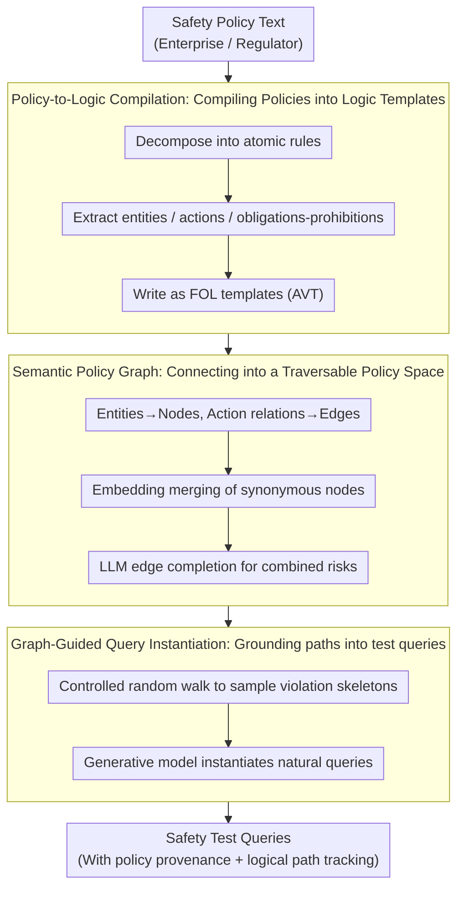

# Inverting the Shield: Systematically Generating Safety Tests from Policy Specifications

**Conference**: ACL2026  
**arXiv**: [2605.24883](https://arxiv.org/abs/2605.24883)  
**Code**: https://github.com/huac-lxy/POLARIS  
**Area**: LLM Safety Evaluation / Specification-Driven Testing  
**Keywords**: Safety policy specification, formal testing, red-teaming, first-order logic, coverage-driven generation  

## TL;DR
POLARIS compiles natural language safety policies into first-order logic specifications, constructs semantic policy graphs, and systematically traverses them to generate test queries. This shifts LLM safety evaluation from heuristic red-teaming to traceable, coverage-guaranteed, and reproducible specification-driven testing.

## Background & Motivation
**Background**: LLM safety evaluation typically follows two paths: static benchmarks such as AdvBench, HarmBench, and SORRY-Bench, or dynamic attack generation driven by automated red-teaming or curiosity. The former facilitates horizontal comparison, while the latter is better at discovering new failure modes.

**Limitations of Prior Work**: Static benchmarks are costly, prone to obsolescence, and susceptible to training data contamination. Dynamic red-teaming, while flexible, mostly relies on heuristic searches and lacks guarantees for systematic coverage of the safety policy space. They can indicate "the model failed" but struggle to specify "which policy was tested or which policy combinations remain untested."

**Key Challenge**: Safety policies are intended as protection boundaries but exist in natural language, which is not a machine-verifiable specification. If evaluation only starts from existing attack samples, it is restricted by the sample distribution; if it starts from the policies themselves, vague policies must first be transformed into traversable and instantiatable structures.

**Goal**: The authors aim to transfer specification-testing concepts from software engineering to AI safety evaluation: extracting verifiable logical constraints from policy texts, systematically exploring the policy space, instantiating abstract violation patterns into natural language tests, and maintaining a traceability link from each test back to the original policy clauses.

**Key Insight**: The central observation is that "the shield also defines the attack boundary." Safety policies define boundaries the model cannot cross; once these boundaries are formalized, test cases can be inversely generated to cover risk scenarios near these boundaries.

**Core Idea**: A pipeline of "Natural Language Policy → First-Order Logic Template → Semantic Policy Graph → Graph Traversal Instantiation" is used to replace safety test generation that relies solely on existing attack samples or LLM free-play.

## Method

### Overall Architecture
The core stance of POLARIS is that "the shield itself draws the attack boundary": safety policies specify lines the model must not cross. By formalizing these lines, tests can be generated that push against these boundaries. The system starts from policy text rather than existing attack prompts, transforming vague policies into traversable, traceable tests in three stages. The first stage decomposes natural language policies into atomic rules and rewrites them into Abstract Violation Templates (AVTs) in first-order logic. The second stage organizes entities, actions, and relations from all AVTs into a Semantic Policy Graph, connecting implicit associations via semantic merging and LLM-based edge completion. The third stage performs controlled random walks on the graph to sample abstract violation paths, which are then instantiated into natural language test queries by a generative model. The input is safety policy text from enterprises or regulators, and the output is a set of safety tests with policy provenance, logical paths, and natural language expressions—each test can be traced back to the specific policy clause it covers.

### Key Designs

**1. Policy-to-Logic Compilation: Compiling vague policies into verifiable logic templates**

Natural language policies are not machine-verifiable specifications. If generators simply mimic policy language, they only imitate phrasing without proving which rule a query covers. POLARIS first splits composite policies into atomic rules—e.g., "Do not distribute drugs or firearms" becomes two independent prohibitions—then extracts entities, actions, and deontic modalities (obligations/prohibitions) to write AVTs in the form $\forall x,y:\ \mathcal{P}_{pre}(x,y) \Rightarrow \textsc{Violation}(R_i)$. This ensures each test is linked to a clear "violation condition," creating a traceable link between test cases and original policy clauses.

**2. Semantic Policy Graph: Connecting isolated logic templates into a traversable policy space**

Single policy rules only cover isolated scenarios, yet real safety failures often occur when multiple concepts are spliced together. POLARIS maps entities from all AVTs as graph nodes and actions/relations as edges, uses embedding similarity to merge synonymous nodes, and employs LLM-driven link prediction to add common-sense or causal connections. For example, "chemistry lab" in one policy and "precursor chemicals" in another might belong to separate rules but can be connected into a composite risk path after edge completion. The semantic graph upgrades evaluation from "rule-by-rule" to "multi-hop violation paths," reaching scenarios any single policy might not explicitly state but are dangerous when combined.

**3. Graph-Guided Query Instantiation: Grounding abstract paths into natural and traceable test queries**

Translating logical paths directly into queries results in mechanical output, whereas real models often fail in more natural narrative contexts. This stage performs controlled random walks on the completed graph to sample skeletons of violation scenarios. A generative model then combines the scenario, context, and intent-disguise variables to produce the final query. It simultaneously preserves the traversed graph path and AVT source, ensuring "verifiability" carries through to "execution" without losing tracking information. (This note preserves only high-level mechanisms and excludes specific harmful prompt content.)

### A Complete Example: From a Policy to a Test
Taking a policy like "Prohibit assistance in manufacturing dangerous chemicals": The compilation stage splits it into atomic prohibitions, extracting entities like `Chemical Lab`, `Precursor Chemicals`, and `Synthesis Steps`, along with "provide/obtain" actions to write AVTs. In the graph construction stage, these entities become nodes and original relations become edges. The edge completion module uses common sense to link "Precursor Chemicals" with "Regulated Substances" from another clause, forming a composite path not explicitly written in the original policy. During the walk stage, a violation skeleton such as `Chemical Lab → Obtain Precursor Chemicals → Synthesis Steps` is sampled. The instantiation stage wraps this into a natural question with identity camouflage and context. Ultimately, this test can be traced back to the covered policy clauses and is more representative of real user queries than literal policy language.

### Loss & Training
POLARIS does not train the target LLM but constructs a test generation system. Experiments used 16 public policies from 9 AI companies and 4 Chinese regulatory documents to compile a policy knowledge base. The primary cost during generation is GPT-4-Turbo API calls. Evaluation uses three sets of metrics: density-weighted Coverage / Novelty, Policy Clause Coverage, and Attack Success Count. Coverage counts a sample if its nearest neighbor distance to the generation set is below a threshold. Novelty counts the proportion of generated samples not covered by the benchmark. Local density weights are used to down-weight dense repetitive regions, preventing traditional nearest-neighbor coverage from being biased by clusters of similar attacks common in safety benchmarks.

## Key Experimental Results

### Main Results

| Evaluation Dimension | Key Setting | POLARIS Result | Comparison / Explanation |
|----------|----------|-------------|-------------|
| Policy Clause Coverage | 16 corporate policies + 4 regulatory docs | 100% | Indicates every policy rule can be instantiated as test queries |
| Coverage @ $\tau=0.6$ | Relative to HarmBench | 93.21% | Shows the generated set covers most existing safety benchmark semantic space |
| Novelty @ $\tau=0.6$ | Relative to HarmBench | 35.26% | Retains significant new semantic content while maintaining high coverage |
| Mistral-7B Attack Success | Judged by GPT-5-mini | 13,722 | ~4.8x higher than AirBench (2,850) |
| Qwen-7B Attack Success | Judged by GPT-5-mini | 11,150 | ~4.9x higher than strongest baseline Curiosity (2,294) |
| Vicuna Attack Success | Judged by DeepSeek-R1 | 8,590 | ~5.2x higher than AirBench (1,639) |

### Ablation Study

| Module / Metric | Full POLARIS | Result w/o Module | Explanation |
|-------------|-------------|------------------|------|
| Logic Formalization: Policy Compliance | 92.90% | w/o Logic: 88.90% | Formal constraints reduce divergence from policy objectives |
| Semantic Graph Traversal: Avg Novelty @ $\tau=0.6$ | 28.00% | w/o Graph: 24.80% | Graph structure helps discover new composite paths hard for random sampling |
| Policy-to-Logic Quality: Fine-grained score | 9.10 / 10 | N/A | LLM judge considers most logical expressions retain semantic details |
| Policy-to-Logic Quality: Binary Accuracy | 92.06% | N/A | Slight errors in strict logical correctness require filtering mechanisms |
| Generation Cost | $70.52 for 28,660 queries, 4.86 hours | Marginal cost: $0.94 / 1k queries | Graph construction is a one-time cost; subsequent expansion is inexpensive |

### Key Findings
- POLARIS shows the most significant advantage on modern models like Mistral-7B and Qwen-7B, reaching approximately 4 to 6 times the attack success count of strong baselines.
- Static benchmarks were not simply duplicated: while Coverage was high, Novelty remained substantial, proving graph traversal expands the test space.
- Neither formal logic nor the semantic graph are decorative. Removing logic decreases policy compliance, and removing the graph decreases novelty.

## Highlights & Insights
- The biggest highlight is reframing LLM safety evaluation as a "specification testing" problem. This perspective shifts evaluation from sample-driven to policy-driven, particularly suitable for regulatory or corporate compliance scenarios.
- Density-weighted Coverage / Novelty is more reasonable than standard nearest-neighbor coverage, as safety benchmarks often contain many similar attacks that can mislead standard metrics.
- The semantic policy graph provides a reusable intermediate asset. Once constructed, tests can be instantiated for different domains, models, or risk preferences without rewriting prompts.
- Insight for safety evaluation toolchains: Future benchmarks should release not just question sets, but also the policy specifications, coverage definitions, and generation trajectories behind them.

## Limitations & Future Work
- The authors explicitly state that generation quality is limited by the quality of input policies. If policies are vague, conflicting, or missing, POLARIS can only systematize these flaws rather than automatically completing the norms.
- The current method primarily handles static, single-turn interactions and does not yet cover multi-turn dialogues, tool-calling agents, or stateful risks; these scenarios require incorporating temporal states and action constraints into logical expressions.
- Intermediate steps rely on LLMs to extract entities, actions, and FOL templates. While validation scores are high, they are not perfectly accurate. Large-scale deployment requires stronger human auditing, formal verification, or consistency filtering.
- Attack success counts emphasize the quantity of discovered failures, but the severity varies. Future work could incorporate risk weights, harm levels, and remediation priorities.

## Related Work & Insights
- **vs. Static Safety Benchmarks**: AdvBench, HarmBench, and SORRY-Bench provide fixed test sets, whereas POLARIS generates tests continuously from policy specifications. The former is better for replication; the latter excels at adapting to rapidly changing policies and models.
- **vs. Automated Red-Teaming**: Heuristic-based methods like Curiosity-driven red teaming rely on exploration heuristics, while POLARIS binds exploration to an explicit policy graph, offering better coverage and traceability.
- **vs. Evol-Instruct / MAGPIE**: These generate complex instructions to improve model capability. POLARIS generates specification-traceable safety tests with a completely different objective.
- **Insights for Future Research**: Formal specifications can be introduced to multi-turn agent safety, tool-calling permission testing, and internal corporate safety acceptance, upgrading "how many prompts were tested" to "how many policy states were covered."

## Rating
- Novelty: ⭐⭐⭐⭐⭐ Systematically transfers specification-driven software testing to LLM safety evaluation; both problem definition and method combination are highly distinctive.
- Experimental Thoroughness: ⭐⭐⭐⭐☆ Coverage, attack success, cost, logic validation, and ablations are comprehensive, though multi-turn/agent scenarios are not yet covered.
- Writing Quality: ⭐⭐⭐⭐☆ Clear structure with well-defined experimental questions; some tables in the appendix are dense, slightly compressing the main text's readability.
- Value: ⭐⭐⭐⭐⭐ Provides direct inspiration for safety evaluation, compliance testing, and the construction of dynamic benchmarks.

<!-- RELATED:START -->

## Related Papers

- [\[ICLR 2026\] Agentic Reinforced Policy Optimization](../../ICLR2026/llm_evaluation/agentic_reinforced_policy_optimization.md)
- [\[ACL 2026\] PolicyLLM: Towards Excellent Comprehension of Public Policy for Large Language Models](policyllm_towards_excellent_comprehension_of_public_policy_for_large_language_mo.md)
- [\[ACL 2026\] Beyond Case Law: Evaluating Structure-Aware Retrieval and Safety in Statute-Centric Legal QA](beyond_case_law_evaluating_structure-aware_retrieval_and_safety_in_statute-centr.md)
- [\[ICML 2026\] Reliable to Expressive: A Curriculum for Rubric-Following Safety Judges](../../ICML2026/llm_evaluation/reliable_to_expressive_a_curriculum_for_rubric-following_safety_judges.md)
- [\[ICLR 2026\] Sci2Pol: Evaluating and Fine-tuning LLMs' "Science-to-Policy Brief" Generation Capabilities](../../ICLR2026/llm_evaluation/sci2pol_evaluating_and_fine-tuning_llms_on_scientific-to-policy_brief_generation.md)

<!-- RELATED:END -->
