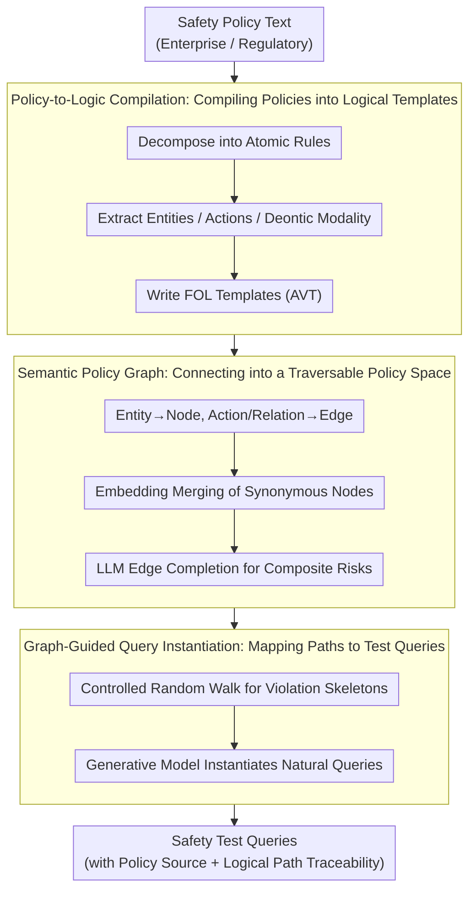

# Inverting the Shield: Systematically Generating Safety Tests from Policy Specifications

**Conference**: ACL2026  
**arXiv**: [2605.24883](https://arxiv.org/abs/2605.24883)  
**Code**: https://github.com/huac-lxy/POLARIS  
**Area**: LLM Safety Evaluation / Specification-driven Testing  
**Keywords**: Safety policy specification, formal testing, red-teaming evaluation, first-order logic, coverage-driven generation  

## TL;DR
POLARIS compiles natural language safety policies into first-order logic specifications, constructs a semantic policy graph, and systematically traverses it to generate test queries. This shifts LLM safety evaluation from heuristic red-teaming to traceable, coverage-guaranteed, and reproducible specification-driven testing.

## Background & Motivation
**Background**: LLM safety evaluation typically follows two paths: static benchmarks such as AdvBench, HarmBench, and SORRY-Bench, or dynamic attack generation through automated red-teaming or curiosity-driven methods. The former facilitates horizontal comparison, while the latter excels at discovering novel failure modes.

**Limitations of Prior Work**: Static benchmarks are costly to produce, become outdated quickly, and face potential contamination in training data. While flexible, dynamic red-teaming largely relies on heuristic searches and lacks systematic coverage guarantees for the safety policy space. They indicate that a "model failed" but struggle to specify "which policy was tested or which policy combinations remain unexplored."

**Key Challenge**: Safety policies serve as protective boundaries, but when they exist only in natural language, they are not machine-verifiable specifications. If evaluation starts only from existing attack samples, it is constrained by the sample distribution; if it starts from the policies themselves, vague text must first be transformed into a traversable and instantiatable structure.

**Goal**: The authors aim to migrate specification testing concepts from software engineering to AI safety evaluation: extracting verifiable logical constraints from policy texts, systematically exploring the policy space, instantiating abstract violation patterns into natural language tests, and maintaining a traceability link from each test back to the original policy clauses.

**Key Insight**: The central observation of the paper is that "the shield also defines the boundary of attack." Safety policies specify boundaries that the model must not cross; once formalized, these boundaries can be used to inversely generate test cases covering risks near these limits.

**Core Idea**: A pipeline of "Natural Language Policy $\rightarrow$ First-Order Logic Templates $\rightarrow$ Semantic Policy Graph $\rightarrow$ Graph Traversal Instantiation" is proposed to replace safety test generation that relies solely on existing attack samples or LLM free-play.

## Method

### Overall Architecture
The core stance of POLARIS is that the shield itself delineates the attack boundary. Since safety policies define the lines a model cannot cross, formalizing these lines allows for the inverse generation of tests that push these boundaries. The system processes policy text in three stages to transform vague policies into traversable and traceable tests. The first stage decomposes natural language policies into atomic rules and rewrites them as Abstract Violation Templates (AVT) in first-order logic. The second stage organizes entities, actions, and relations from all AVTs into a Semantic Policy Graph, using semantic merging and LLM-based edge completion to link implicit associations. The third stage performs controlled random walks on the graph to sample abstract violation paths, which a generative model then instantiates into natural language test queries. The input consists of safety policy texts from enterprises or regulators, and the output is a set of safety tests with policy sources, logical paths, and natural language descriptions—each test is traceable to the specific policy clause it covers.

### Key Designs

**1. Policy-to-Logic Compilation: Compiling vague policies into verifiable logical templates**

Natural language policies are not machine-verifiable specifications. If a generator merely follows policy language, it can only mimic phrasing without proving which rule a query covers. POLARIS decomposes complex policies into atomic rules—e.g., "do not distribute drugs or firearms" becomes two prohibited items—and extracts entities, actions, and deontic modalities (obligations/prohibitions) to write AVTs in the form $\forall x,y:\ \mathcal{P}_{pre}(x,y) \Rightarrow \textsc{Violation}(R_i)$. This ensures each test is associated with an explicit "violation condition," creating a traceable link between test cases and original policy clauses.

**2. Semantic Policy Graph: Connecting isolated logical templates into a traversable policy space**

Individual policy rules often cover isolated scenarios, yet real-world safety failures frequently occur at the intersection of multiple concepts. POLARIS maps entities in all AVTs to graph nodes and actions/relations to edges. It then uses embedding similarity to merge synonymous nodes and LLM-driven link prediction to add commonsense or causal connections. For instance, a "chemistry lab" appearing in one policy and "precursor chemicals" in another may be linked to form a composite risk path. The semantic graph elevates evaluation from "rule-by-rule" to "multi-hop violation paths," reaching scenarios not explicitly stated in any single policy but dangerous when combined.

**3. Graph-Guided Query Instantiation: Mapping abstract paths to natural and traceable test queries**

Translating logical paths directly into queries results in mechanical output; real models often fail within a more natural narrative context. In this stage, a controlled random walk is performed on the completed graph to sample skeletons of violation scenarios. A generative model then combines these with scene, context, and intent disguise variables to produce final queries. Crucially, the traversed graph path and AVT source are preserved, maintaining traceability from "verifiable" to "executable." (Specific harmful prompt content is omitted here, focusing on the high-level mechanism.)

### Example Walkthrough: From one policy to one test
Consider a policy such as "Prohibit assistance in manufacturing dangerous chemicals": The compilation phase splits it into atomic prohibitions, extracting entities like `Chemical Lab`, `Precursor Chemicals`, and `Synthesis Steps`, and the action `Provide/Obtain`, each written as an AVT. During graph construction, these entities become nodes and the original policy relations become edges; the edge completion module then uses commonsense to link `Precursor Chemicals` with `Controlled Substances` from another clause, forming a composite path not explicitly written. In the traversal phase, a violation skeleton like `Chemical Lab → Obtain Precursor Chemicals → Synthesis Steps` is sampled. Finally, the instantiation phase wraps this into a natural query with identity disguise and context. This test both covers the intended policy clause and resembles a real-world user query more closely than literal policy language.

### Loss & Training
POLARIS does not train the target LLM; it builds a test generation system. Experiments utilize 16 public policies from 9 AI companies and 4 Chinese regulatory documents to compile a policy knowledge base. The primary cost during the generation phase is GPT-4-Turbo API calls. Evaluation employs three sets of metrics: density-weighted Coverage / Novelty, Policy Clause Coverage, and Attack Success Count. Coverage is marked if the nearest neighbor distance from existing benchmarks to the generated set is below a threshold. Novelty counts the proportion of generated samples not covered by the baseline, using local density weights to penalize densely populated regions—safety benchmarks often contain many similar attacks that can bias standard nearest-neighbor coverage.

## Key Experimental Results

### Main Results
| Metric | Key Setting | POLARIS Result | Comparison / Explanation |
|----------|----------|-------------|-------------|
| Policy Clause Coverage | 16 corporate policies + 4 regulatory documents | 100% | Indicates every policy rule can instantiate at least one test query |
| Coverage @ $\tau=0.6$ | Relative to HarmBench | 93.21% | Shows the generated set covers most of the existing safety benchmark space |
| Novelty @ $\tau=0.6$ | Relative to HarmBench | 35.26% | Retains significant new semantic content while maintaining high coverage |
| Mistral-7B Attack Success | Judged by GPT-5-mini | 13,722 | AirBench is 2,850 (~4.8x increase) |
| Qwen-7B Attack Success | Judged by GPT-5-mini | 11,150 | Strongest baseline Curiosity is 2,294 (~4.9x increase) |
| Vicuna Attack Success | Judged by DeepSeek-R1 | 8,590 | AirBench is 1,639 (~5.2x increase) |

### Ablation Study
| Module / Metric | Full POLARIS | Result w/o Module | Explanation |
|-------------|-------------|------------------|------|
| Logical Formalization: Policy Compliance | 92.90% | w/o Logic: 88.90% | Formal constraints reduce deviation from policy objectives |
| Semantic Graph Traversal: Avg Novelty @ $\tau=0.6$ | 28.00% | w/o Graph: 24.80% | Graph structure helps discover new composite paths missed by random sampling |
| Policy-to-Logic Quality: Fine-grained score | 9.10 / 10 | N/A | LLM judge suggests logical expressions retain semantic details |
| Policy-to-Logic Quality: Binary Accuracy | 92.06% | N/A | Some minor errors in strict logical correctness; needs filtering |
| Generation Cost | $70.52 for 28,660 queries | Marginal: $0.94 / 1k | Graph construction is a one-time cost; scaling is inexpensive |

### Key Findings
- POLARIS shows the most significant advantage on modern models (Mistral-7B, Qwen-7B), with attack success counts reaching 4 to 6 times that of strong baselines.
- Static benchmarks were not simply duplicated: while Coverage is high, Novelty remains substantial, indicating that graph traversal effectively expands the test space.
- Formal logic and the semantic graph are essential components. Removing logic decreases policy compliance, and removing the graph reduces novelty.

## Highlights & Insights
- The primary highlight is reframing LLM safety evaluation as a "specification testing" problem. This perspective shifts evaluation from being example-driven to policy-driven, which is particularly suitable for regulatory or corporate compliance.
- Density-weighted Coverage / Novelty is more robust than standard nearest-neighbor coverage, as safety benchmarks often contain clusters of highly similar attacks that can mislead standard metrics.
- The Semantic Policy Graph serves as a reusable intermediate asset. Once constructed, it can be used to instantiate tests for different domains, models, or risk appetites without rewriting prompts from scratch.
- An insight for safety evaluation toolchains: future benchmarks should release not only query sets but also the underlying policy specifications, coverage definitions, and generation trajectories.

## Limitations & Future Work
- The authors state that generation quality is constrained by the quality of input policies. If policies are vague, conflicting, or incomplete, POLARIS can only systematize these defects and cannot automatically complete the specification.
- The current method primarily addresses static single-turn interactions and does not yet cover multi-turn dialogues, tool-calling agents, or stateful risks; these scenarios require incorporating temporal states and action constraints into logical expressions.
- Intermediate steps rely on LLMs for extracting entities, actions, and FOL templates; while verification scores are high, they are not perfectly accurate. Large-scale deployment requires stronger manual audits, formal verification, or consistency filtering.
- Attack success counts emphasize the quantity of failures discovered, but the severity of failures varies. Subsequent work could integrate risk weights, harm levels, and remediation priorities.

## Related Work & Insights
- **vs. Static Safety Benchmarks**: While AdvBench, HarmBench, and SORRY-Bench provide fixed test sets, POLARIS generates tests continuously from policy specifications. The former is better for reproducibility, the latter for adapting to rapidly changing policies and models.
- **vs. Automated Red-Teaming**: Unlike methods like curiosity-driven red-teaming that rely on exploration heuristics, POLARIS explicitly binds the exploration space to a policy graph, offering superior coverage and traceability.
- **vs. Evol-Instruct / MAGPIE**: While those methods generate complex instructions to enhance model capabilities, POLARIS generates specification-traceable safety tests, serving a different objective.
- **Inspiration for Future Research**: Formal specifications could be introduced to multi-turn agent safety, tool-calling permission testing, and internal enterprise safety acceptance, upgrading "how many prompts were tested" to "how many policy states were covered."

## Rating
- Novelty: ⭐⭐⭐⭐⭐ Systematically migrating specification-driven software testing to LLM safety evaluation creates a distinct problem definition and methodology.
- Experimental Thoroughness: ⭐⭐⭐⭐☆ Coverage, attack success, cost, logical validation, and ablations are comprehensive, though multi-turn/agent scenarios are not yet addressed.
- Writing Quality: ⭐⭐⭐⭐☆ Clear structure and well-defined experimental questions; some main-text readability is slightly compressed due to extensive appendix tables.
- Value: ⭐⭐⭐⭐⭐ Highly relevant for safety evaluation, compliance testing, and the construction of dynamic benchmarks.

<!-- RELATED:START -->

## Related Papers

- [\[ACL 2026\] PolicyLLM: Towards Excellent Comprehension of Public Policy for Large Language Models](policyllm_towards_excellent_comprehension_of_public_policy_for_large_language_mo.md)
- [\[ACL 2026\] Stability vs. Manipulability: Evaluating Robustness Under Post-Decision Interaction in LLM Judges](stability_vs_manipulability_evaluating_robustness_under_post-decision_interactio.md)
- [\[ACL 2026\] NovBench: Evaluating Large Language Models on Academic Paper Novelty Assessment](novbench_evaluating_large_language_models_on_academic_paper_novelty_assessment.md)
- [\[ACL 2026\] Question Difficulty Estimation for Large Language Models via Answer Plausibility Scoring](question_difficulty_estimation_for_large_language_models_via_answer_plausibility.md)
- [\[ACL 2026\] Same Voice, Different Lab: On the Homogenization of Frontier LLM Personalities](same_voice_different_lab_on_the_homogenization_of_frontier_llm_personalities.md)

<!-- RELATED:END -->
