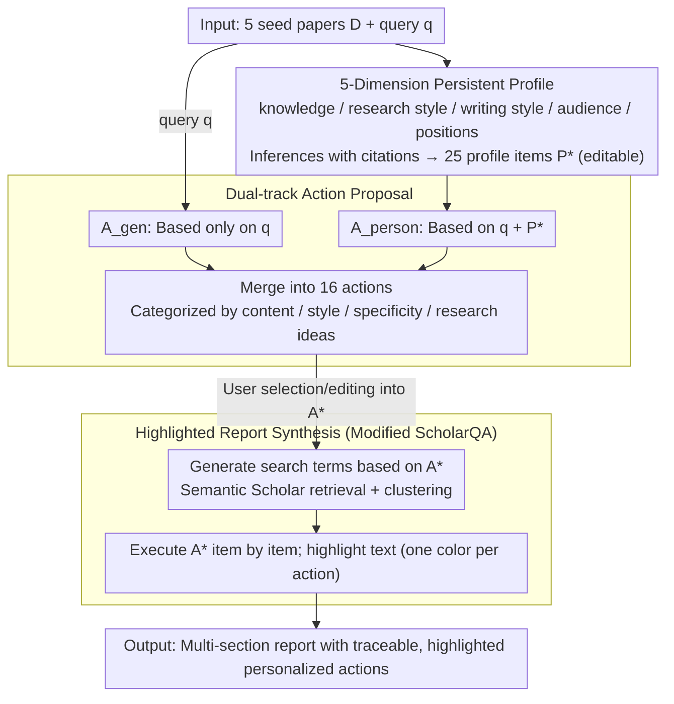

# Language Models Don't Know What You Want: Evaluating Personalization in Deep Research Needs Real Users

**Conference**: ACL 2026  
**arXiv**: [2603.16120](https://arxiv.org/abs/2603.16120)  
**Code**: https://github.com/allenai/personalized-scholarqa-eval  
**Area**: LLM Evaluation / Personalization / Deep Research / Human-Computer Interaction  
**Keywords**: Personalized Deep Research, LLM-as-Judge, User Study, Interpretable Agents, User-centered Eval

## TL;DR
The authors developed MyScholarQA, the first open-source personalized Deep Research (DR) system (utilizing a profile → action → report three-stage pipeline). While it outperformed other DR baselines across 16 offline metrics, a 90-minute interview study with 21 real researchers revealed 9 types of personalization failure modes that offline evaluations completely failed to detect. Furthermore, four major LLM judges were unable to accurately predict user satisfaction, serving as a warning against replacing real users with LLM judges.

## Background & Motivation

**Background**: Deep Research (DR) tools, which use LLMs to retrieve and synthesize papers into multi-section reports with citations, have become essential for researchers. However, most DR systems lack personalization; asking "What is Attention?" yields nearly identical answers for a Diffusion researcher and an NLP researcher. Some systems (e.g., OpenAI/Gemini DR) ask clarifying questions, but users must re-explain themselves for every new query.

**Limitations of Prior Work**: Among 31 personalization-related papers at ACL'25, **all 31** relied on offline evaluation (18 used synthetic user datasets and 17 used LLM judges), while only 2 conducted human user studies. This "offline evaluation hegemony" assumes LLM judges can effectively substitute for user judgment—a premise the authors challenge as a potential "systemic illusion."

**Key Challenge**: (1) Personalization is not a verifiable objective attribute; it is fundamentally about whether a specific user finds the output useful, yet an LLM judge lacks a subjective "I." (2) DR reports take minutes to generate, necessitating a persistent user model rather than repeated prompting. (3) Metrics where real users find value may not overlap with metrics that score highly in offline evaluations.

**Goal**: (1) Build a deployable, controllable, and interpretable personalized DR system. (2) Validate its performance across 16 offline metrics. (3) Use this system as a "technology probe" for real users to expose failure modes missed by LLM judges. (4) Extract methodologies and design lessons for user-centered evaluation.

**Key Insight**: Drawing from Brusilovsky’s adaptive hypermedia (1980s), the authors construct a persistent user model (inferred from papers chosen by the user), transform it into an editable list of actions for each query, and drive a multi-step retrieval-writing pipeline. Making each step toggleable/editable allows "where and how personalization occurs" to be an observable experimental variable.

**Core Idea**: Running two sets of evaluations—offline metrics and 21 human interviews—on a functional personalized DR system to demonstrate that LLM judges cannot replace real users.

## Method

### Overall Architecture
To resolve the conflict between the long generation time of DR reports and the need for preference alignment, MyScholarQA (MYSQA) decomposes personalization into a three-stage pipeline visible to and editable by the user. It extracts a persistent profile from user-selected papers, translates the profile and query into a checklist of actions, and finally synthesizes a multi-section report where personalized segments are color-coded. The input consists of 5 seed papers and a query; intermediate products are editable profiles $P^*$ and actions $A^*$; and the output is a report traceable to specific actions. This makes "personalization" an explicit entity for user intervention and observation. The backbone LLM is Claude-4 Sonnet, and all steps are open-sourced.

### Key Designs

**1. Inferring 5-dimension persistent profiles: Building a chain of evidence for "Who you are"**
A pain point in DR is the high cost of expressing preferences. MYSQA allows users to upload 5 papers $D$, and prompts an LLM to generate 5 sentence-level inferences across five aspects: knowledge, research style, writing style, audience, and positions, resulting in $n_1{=}25$ profile items $P=\{I_1,\dots,I_{25}\}$. Each inference $I$ must explicitly cite specific passages in $D$, transforming the profile from vague labels into a verifiable chain of evidence. Gemini-2.5 Pro achieved an inference accuracy of 97.1% and citation relevance of 97.4%, making it the preferred backbone for profiling.

**2. Generic and Personalized dual-track action proposals: Exposing personalization strategies before writing**
Direct generation from a profile makes personalization a black box. MYSQA instead generates two sets of actions: $A_{\text{gen}}$ (query only) and $A_{\text{person}}$ (query + $P^*$), resulting in $n_2{=}16$ actions organized into four categories. This externalizes "how to personalize" as a discrete set of actions, allowing for fine-grained attribution of which types of personalization succeed or fail. LLM judges preferred $A_{\text{person}}$ with a win rate of 91–95%, confirming these actions are distinctively tailored to the profile.

**3. Color-highlighted report synthesis: Using minimal prompts for observability and probing**
The report generation, based on the ScholarQA pipeline, is modified to inject $A^*$ during both the retrieval stage (generating search terms based on actions) and the generation stage (executing actions and color-coding results). This transparency allows users to easily see which sentences were influenced by which actions. User research found a "trust trap": when an action was not highlighted, participants often assumed the information was irrelevant rather than recognizing the system failed to execute the action.

### Loss & Training
No new models are trained; MYSQA relies on prompt engineering and LLM chains. Backbones were selected per stage: Gemini-2.5 Pro for profiling, Claude-4 Sonnet for actions and reporting. Evaluation used 200 queries from ScholarQA-CS2, simulating three levels of user expertise (low/medium/high) based on author publications from CS-PaperSum, categorized by cosine similarity using GRIT-LM embeddings.

## Key Experimental Results

### Main Results
**Profiles** (4 LLMs across 4 metrics, 0-100% / specificity 1-5):

| LLM | Inf. Acc | Cit. Rel. | Cat. Acc. | Specificity |
|-----|----------|-----------|-----------|-------------|
| Gemini-2.5 Pro | **97.1** | **97.4** | 99.4 | 3.73 |
| Claude-4 Sonnet | 92.5 | 97.4 | 99.1 | 4.12 |
| OpenAI o3 | 88.6 | 91.8 | **99.8** | **4.20** |
| DeepSeek-R1 | 77.8 | 80.7 | 97.2 | 3.56 |

**Reports** (vs. 5 DR baselines):

| System | Ans. Cov ↑ | Ans. Prec ↑ | Cit. Prec ↑ | Cit. Rec ↑ | Action Adh ↑ |
|------|------------|-------------|-------------|------------|--------------|
| **MYSQA** | **91.4** | 89.9 | **91.8** | **81.4** | 83.2 |
| ScholarQA (Base) | 88.9 | 89.1 | 90.5 | 76.9 | 81.3 |
| OpenScholar | 77.2 | **97.4** | 82.5 | 60.4 | 82.5 |
| STORM | 72.0 | 92.2 | 73.3 | 64.7 | 74.4 |
| Sonar DR | 81.0 | 82.9 | 64.3 | 46.3 | 75.0 |
| o3 DR | 89.1 | 90.2 | 79.2 | 56.7 | **93.8** |

MYSQA achieved the best performance in 3 out of 5 metrics and remained superior to its base model, ScholarQA.

### Ablation Study (9 Failure Modes Missed by Offline Metrics)

| Output | Failure Type | Description | Frequency |
|------|----------|------|----------|
| Profile | DOMAIN | Misused domain-specific terminology | 27.6% |
| Profile | OVERCLAIM | Extrapolated specific paper conclusions to the user | 17.9% |
| Profile | CONVENTION | Mistook general field practices for user-specific traits | 12.8% |
| Profile | CONTRAST | Distorted user stance via incorrect comparisons | 12.2% |
| Action | NARROW | Action was too specific, lacking coverage | 43.8% |
| Action | OFFTOPIC | Action drifted from query intent | 23.6% |
| Report | UNINFORM | Content was too generic or lacked depth | 38.0% |
| Report | PRESENT | Presentation style or format mismatch | 25.3% |
| Report | IGNORE | Failed to execute implicit/explicit action requirements | 22.8% |

**LLM Judge Performance**: Four LLM judges performed a binary classification on whether a user would be satisfied given these 9 failure types. **No LLM judge significantly outperformed the majority-class baseline** for any failure category (verified via Binomial test with Bonferroni correction).

### Key Findings
- **MYSQA Usability (73%)**: Real users were satisfied with the profile/action/report overall, but the remaining 27% unsatisfied cases were missed by offline metrics.
- **Primary Pain Points**: DOMAIN, NARROW, and UNINFORM failures constitute the main axis of "personalization hallucinations."
- **Preference Divergence**: LLM judges gave personalized actions a 91-95% win rate, but humans only preferred personalized actions over generic ones about 60% of the time, suggesting LLM judges over-prefer "specialized-looking" responses.
- **Desire for Control**: Users wanted to add new actions, weight emphasis, and use paper filters, validating the "persistent + editable" user model approach.
- **The Trust Trap**: When actions were not highlighted, users tended to assume the information was irrelevant rather than spotting a system execution failure.
- **LLM Judges as "Necessary but Insufficient"**: The authors argue that offline evaluations should act as a preliminary screen rather than a final verdict.

## Highlights & Insights
- Reconceptualizes DR personalization as an HCI adaptive hypermedia problem, making personalization observable through persistent models and editable actions.
- Quantifies the "offline evaluation hegemony" at ACL'25 (0/31 papers used real users), highlighting a major community blind spot.
- The experimental design—directly comparing offline metrics and human satisfaction on the same system—provides robust evidence against the reliability of LLM-as-a-Judge for personalization.
- Identifies that while some failures are known NLP issues (e.g., factuality), others (e.g., TRUST, UNINFORM) are only discoverable through user studies.

## Limitations & Future Work
- **Execution Speed**: Reports take ~5 minutes and profiles ~3 minutes; distillation into smaller models is needed.
- **Task Scope**: Findings are limited to the DR setting; replicability in personalized RAG or dialogue is yet to be tested.
- **Prompt Sensitivity**: Stronger prompts or specialized reward models for LLM judges might improve correlation with humans.
- **User Representation**: The system relies on published papers, limiting utility for students or industry researchers without a publication record.
- **Ethical Risks**: Potential for reinforcing filter bubbles or introducing identity biases (e.g., associating linguistic patterns with research quality).

## Related Work & Insights
- **Comparison with Co-STORM / OpenAI DR**: These rely on clarifying questions per query; MYSQA’s persistent profile is preferred by users.
- **Comparison with STORM / OpenScholar**: MYSQA leads in objective quality, but its core contribution is proving that "high scores $\neq$ good personalization."
- **Critique of LaMP / Persona-DB**: These benchmarks rely on offline paradigms that this paper calls into question.

## Rating
- **Novelty**: ⭐⭐⭐⭐ First open-source personalized DR system + large-scale user study challenging the LLM-judge paradigm.
- **Experimental Thoroughness**: ⭐⭐⭐⭐⭐ Comprehensive combination of 16 offline metrics, 5 baselines, 4 LLM judges, and 21 qualitative human interviews.
- **Writing Quality**: ⭐⭐⭐⭐ Logical flow between system design, experimentation, and derived lessons.
- **Value**: ⭐⭐⭐⭐⭐ A methodological wake-up call for the personalization community and a viable architecture for personalized agents.

<!-- RELATED:START -->

## Related Papers

- [\[ACL 2026\] Can LLMs Act as Historians? Evaluating Historical Research Capabilities of LLMs via the Chinese Imperial Examination](can_llms_act_as_historians_evaluating_historical_research_capabilities_of_llms_v.md)
- [\[ACL 2026\] ReTraceQA: Evaluating Reasoning Traces of Small Language Models in Commonsense Question Answering](retraceqa_evaluating_reasoning_traces_of_small_language_models_in_commonsense_qu.md)
- [\[ACL 2026\] Teaching Language Models to Forecast Research Success Through Comparative Idea Evaluation](teaching_language_models_to_forecast_research_success_through_comparative_idea_e.md)
- [\[ACL 2026\] Evaluating Temporal Consistency in Multi-Turn Language Models](evaluating_temporal_consistency_in_multi-turn_language_models.md)
- [\[ACL 2025\] AbGen: Evaluating Large Language Models in Ablation Study Design and Evaluation for Scientific Research](../../ACL2025/llm_evaluation/abgen_evaluating_large_language_models_in.md)

<!-- RELATED:END -->
