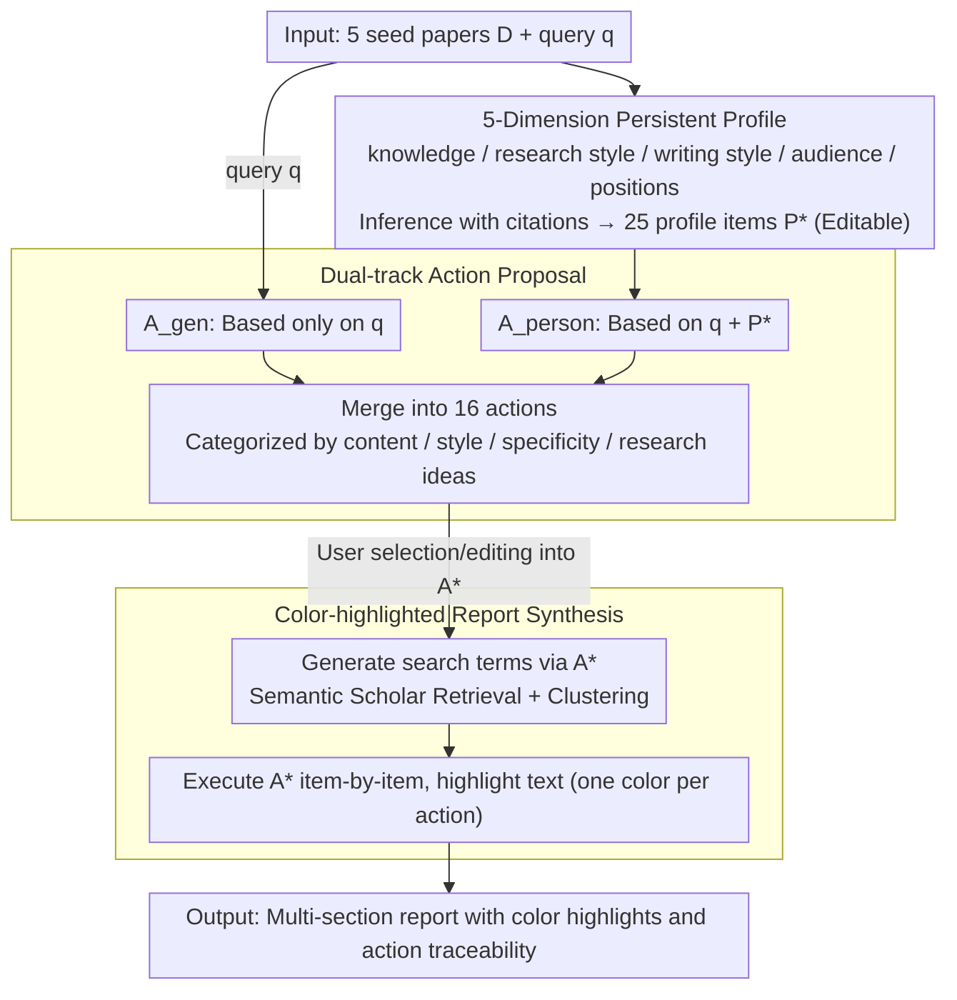

# Language Models Don't Know What You Want: Evaluating Personalization in Deep Research Needs Real Users

**Conference**: ACL 2026  
**arXiv**: [2603.16120](https://arxiv.org/abs/2603.16120)  
**Code**: https://github.com/allenai/personalized-scholarqa-eval  
**Area**: LLM Evaluation / Personalization / Deep Research / Human-Computer Interaction  
**Keywords**: Personalized Deep Research, LLM-as-Judge, User Study, Interpretable Agents, User-centered Eval

## TL;DR
The authors develop MyScholarQA, the first open-source personalized Deep Research (DR) system using a profile-action-report tripartite architecture, which outperforms other DR baselines across 16 offline metrics. However, 90-minute interviews with 21 researchers reveal nine types of personalization failure modes completely undetected by offline evaluations. Furthermore, four major LLM judges fail to accurately predict user satisfaction, serving as a warning against replacing real users with LLM judges.

## Background & Motivation

**Background**: Deep Research (DR) tools, which use LLMs to retrieve and synthesize papers into multi-section reports with citations, have become essential for researchers. However, most DR systems lack personalization; asking "What is Attention?" yields the same answer for a diffusion researcher as for an NLP researcher. Some DR systems (e.g., OpenAI/Gemini DR) ask clarifying questions, but users must re-explain themselves for every new query.

**Limitations of Prior Work**: Among 31 personalization-related papers at ACL'25, **all 31** relied on offline evaluation (18 used synthetic user datasets and 17 used LLM judges), while only 2 conducted human user studies. This "hegemony of offline evaluation" assumes LLM judges can effectively substitute for human judgment. The authors question whether this is a systemic illusion.

**Key Challenge**: (1) Personalization is not a verifiable objective attribute; it is inherently about whether a specific user finds it useful, yet LLM judges lack a "self." (2) DR reports take minutes to generate, necessitating a persistent user model rather than repeated prompting. (3) Metrics derived from user satisfaction may not align with high-scoring offline metrics.

**Goal**: (1) Build a deployable, controllable, and interpreable personalized DR system. (2) Validate its performance across 16 offline metrics. (3) Use the system as a "technology probe" for real users to expose failure modes missed by LLM judges. (4) Derive methodologies and design lessons for user-centered evaluation.

**Key Insight**: Drawing from Brusilovsky's 1980s adaptive hypermedia, the authors construct a persistent user model inferred from user-selected papers. This model is transformed into an editable list of actions per query, driving a multi-step LLM retrieval-writing pipeline. Allowing users to toggle/edit each step makes personalization an observable experimental variable.

**Core Idea**: Running two sets of evaluations—offline metrics and 21-person interviews—on the same functional personalized DR system to demonstrate that LLM judges cannot substitute for real users.

## Method

### Overall Architecture
MyScholarQA (MYSQA) addresses the conflict between slow DR report generation and the need for personalized preferences by decomposing personalization into a three-stage pipeline visible to and editable by the user. First, a persistent profile is extracted from user-selected papers. Second, the profile and query are translated into a checklist of actions. Finally, these actions drive the retrieval-writing process, with personalized segments color-coded in the output. The input consists of 5 seed papers and a query $q$. Intermediate products include an editable profile $P^*$ and actions $A^*$. The output is a multi-section report where personalization is traceable to specific actions. This makes "personalization" an explicit entity that users can intervene in, rendering it an observable variable. The system uses Claude-3.5 Sonnet as the backbone.

### Key Designs

**1. Inferring 5-Dimension Persistent Profiles: Turning "Who You Are" into a Reusable Chain of Evidence**
Expressing preferences in DR is costly. MYSQA creates a profile by having users upload 5 papers $D$. An LLM generates 5 sentence-level inferences across five aspects: knowledge, research style, writing style, audience, and positions, totaling $n_1{=}25$ items $P=\{I_1,\dots,I_{25}\}$. Each inference $I$ must cite specific passages in $D$, ensuring the profile is a verifiable chain of evidence rather than vague labels. Users can edit or disable items to form $P^*$. Gemini-1.5 Pro performed best here with 97.1% inference accuracy and 97.4% citation relevance.

**2. Generic and Personalized Dual-Track Action Proposals: Exposing Personalization Intent for User Control**
Generating reports directly from a profile makes personalization a "black box." MYSQA generates $A_{\text{gen}}$ (query-only) and $A_{\text{person}}$ (query + profile), merging them into $n_2{=}16$ actions organized by category. This allows users to control how personalization occurs before the report is written. This design externalizes personalization into discrete actions, enabling fine-grained attribution of failures. LLM judges give $A_{\text{person}}$ a win rate of 91–95%, confirming they are distinct from generic actions.

**3. Color-Highlighted Report Synthesis: Making Personalization Visible and Auditable**
MYSQA modifies the generation prompt to inject $A^*$. During retrieval, search terms are generated based on $A^*$. During generation, the LLM is instructed to execute $A^*$ and highlight the corresponding text segments in specific colors. This ensures transparency, allowing users to see exactly which sentences were personalized. It also acts as a failure probe: if an action color is missing, it reveals an "IGNORE" failure.

### Loss & Training
The system relies on prompt engineering and LLM chaining rather than training. Backbones: Gemini-1.5 Pro for profiling, Claude-3.5 Sonnet for report generation. Evaluation uses 200 DR queries from ScholarQA with synthetic users of varying expertise levels (Low/Mid/High) based on cosine similarity of paper embeddings.

## Key Experimental Results

### Main Results
**Profiles** (4 LLMs, 0-100% / specificity 1-5):

| LLM | Inf. Acc | Cit. Rel. | Cat. Acc. | Specificity |
|-----|----------|-----------|-----------|-------------|
| Gemini-1.5 Pro | **97.1** | **97.4** | 99.4 | 3.73 |
| Claude-3.5 Sonnet | 92.5 | 97.4 | 99.1 | 4.12 |
| OpenAI o3 | 88.6 | 91.8 | **99.8** | **4.20** |
| DeepSeek-R1 | 77.8 | 80.7 | 97.2 | 3.56 |

**Reports** (vs. 5 DR baselines):

| System | Ans. Cov ↑ | Ans. Prec ↑ | Cit. Prec ↑ | Cit. Rec ↑ | Action Adh ↑ |
|------|------------|-------------|-------------|------------|--------------|
| **MYSQA (Ours)** | **91.4** | 89.9 | **91.8** | **81.4** | 83.2 |
| ScholarQA | 88.9 | 89.1 | 90.5 | 76.9 | 81.3 |
| OpenAI o3 DR | 89.1 | 90.2 | 79.2 | 56.7 | **93.8** |

### Ablation Study (9 Failure Modes Missed by Offline Metrics)

| Output | Failure Type | Description | Frequency |
|------|----------|------|----------|
| Profile | DOMAIN | Misuse of domain terminology | 27.6% |
| Profile | OVERCLAIM | Generalizing local paper conclusions to the user | 17.9% |
| Action | NARROW | Action is too narrow to cover intent | 43.8% |
| Report | UNINFORM | Content is too generic/not detailed enough | 38.0% |
| Report | IGNORE | System failed to execute the action | 22.8% |

**LLM Judge Performance**: Four LLM judges were tested on predicting user satisfaction for these failure modes. **No LLM significantly outperformed the majority-class baseline** in predicting whether a user would be satisfied.

### Key Findings
- **MYSQA overall usability is 73%**: However, the remaining 27% of unsatisfied cases corresponded to failures with 0% detection rates in offline metrics.
- **DOMAIN + NARROW + UNINFORM are major pain points**: Profiles drift toward generic terms, actions are too narrow, and reports are too vague.
- **Preference Mismatch**: LLM judges prefer personalized actions (91-95% win rate), but humans only preferred them ~60% of the time over generic ones, suggesting LLM judges systematically over-prefer "specialized-looking" responses.
- **The Trust Trap**: When an action was not highlighted, users tended to assume the information did not exist rather than realizing the system failed to execute the request.

## Highlights & Insights
- Reconceptualizes personalized DR as an HCI problem of adaptive hypermedia, making personalization an observable and controllable entity.
- The statistic that 0 out of 31 personalization papers at ACL'25 used human evaluation provides a powerful quantification of the community's current evaluation gap.
- The experimental design using satisfaction binary classification to challenge LLM judges provides nearly irrefutable evidence that LLM judges cannot yet replace humans in personalization tasks.

## Limitations & Future Work
- **Latentcy**: Generating a report takes ~5 minutes. Future work could explore distillation or pre-computation.
- **Limited Scope**: The 21-user study was restricted to the DR setting; generalizability to other personalized NLP tasks (conversational RAG, etc.) remains to be verified.
- **Privacy and Bias**: Personalization from papers carries risks of identity bias (e.g., inferring expertise from language patterns).

## Related Work & Insights
- **vs. STORM / OpenAI DR**: Those systems rely on clarifying questions per query. MYSQA’s persistent profile + editable actions are preferred by users for reducing repetition.
- **vs. LaMP / Persona-DB**: While these focus on offline personalized NLP, this paper challenges the very paradigm of their evaluation.

## Rating
- Novelty: ⭐⭐⭐⭐
- Experimental Thoroughness: ⭐⭐⭐⭐⭐
- Writing Quality: ⭐⭐⭐⭐
- Value: ⭐⭐⭐⭐⭐

<!-- RELATED:START -->

## Related Papers

- [\[ICLR 2026\] ResearchRubrics: A Benchmark of Prompts and Rubrics For Evaluating Deep Research Agents](../../ICLR2026/llm_evaluation/researchrubrics_a_benchmark_of_prompts_and_rubrics_for_evaluating_deep_research_.md)
- [\[ICLR 2026\] Towards Personalized Deep Research: Benchmarks and Evaluations](../../ICLR2026/llm_evaluation/towards_personalized_deep_research_benchmarks_and_evaluations.md)
- [\[ACL 2026\] ReTraceQA: Evaluating Reasoning Traces of Small Language Models in Commonsense Question Answering](retraceqa_evaluating_reasoning_traces_of_small_language_models_in_commonsense_qu.md)
- [\[ACL 2026\] Can LLMs Act as Historians? Evaluating Historical Research Capabilities of LLMs via the Chinese Imperial Examination](can_llms_act_as_historians_evaluating_historical_research_capabilities_of_llms_v.md)
- [\[ACL 2026\] Evaluating Temporal Consistency in Multi-Turn Language Models](evaluating_temporal_consistency_in_multi-turn_language_models.md)

<!-- RELATED:END -->
