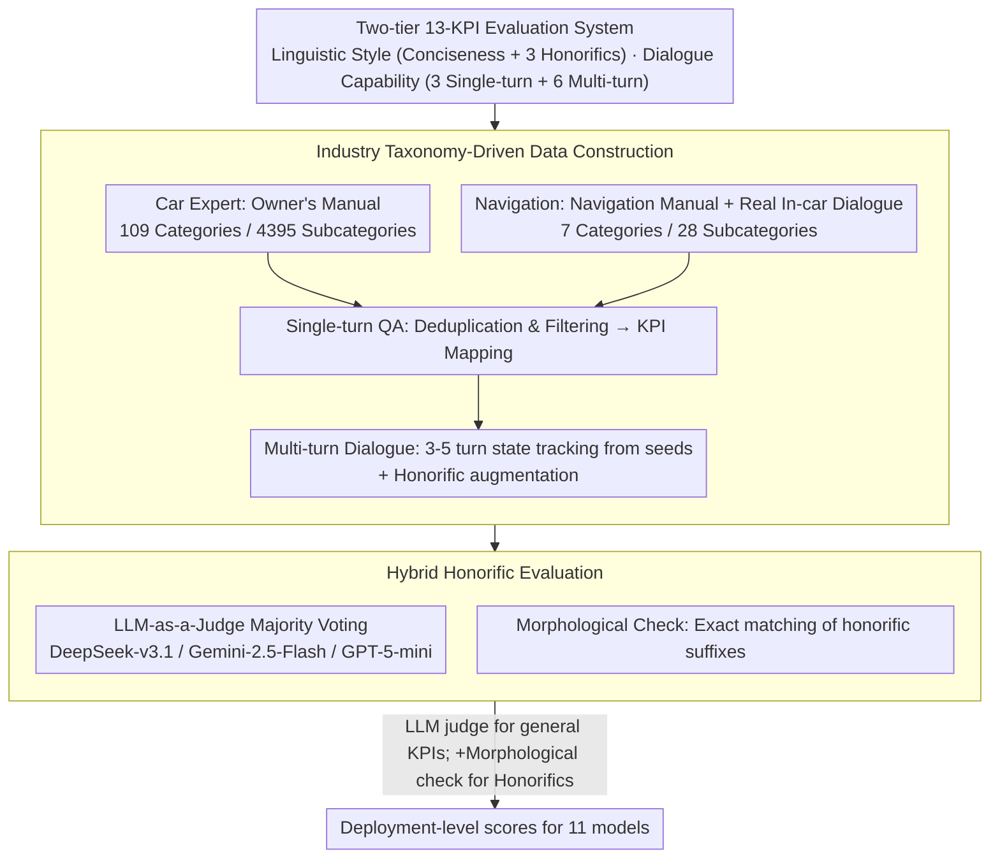

# LoCar: Localization-Aware Evaluation of In-Vehicle Assistants through Fine-Grained Sociolinguistic Control

**Conference**: ACL2026  
**arXiv**: [2605.21086](https://arxiv.org/abs/2605.21086)  
**Code**: No public code; data contains proprietary material from industry partners and is not publicly available per the paper.  
**Area**: LLM Evaluation / Localization / In-Vehicle Assistants  
**Keywords**: Localization Evaluation, Korean Honorifics, In-Vehicle Assistants, LLM-as-a-Judge, Multi-turn Dialogue  

## TL;DR
LoCar proposes 13 deployment-level KPIs for Korean in-vehicle assistants and evaluates 11 models using human-calibrated LLM-as-a-Judge with honorific morphological verification. Findings show that while general understanding is near saturation, fine-grained honorific control and multi-turn strategic guidance remain significantly unstable.

## Background & Motivation
**Background**: In-vehicle assistants are evolving from fixed-command systems into LLM applications capable of interpreting vehicle manuals, understanding navigation needs, and managing multi-turn dialogues. Existing evaluations primarily focus on general knowledge, reasoning, or English interaction quality, but localization requirements in commercial deployment are often more granular. For example, different honorific levels in Korean directly impact user-perceived politeness, trust, and professionalism.

**Limitations of Prior Work**: Common LLM benchmarks struggle to cover two types of requirements in in-vehicle scenarios: functional correctness related to vehicle operation and navigation, and sociolinguistic norms for specific language markets. Even if a model answers correctly, it may fail localization standards regarding honorific levels, conciseness, timing of clarification, or proactive suggestions.

**Key Challenge**: Deployment-level evaluation requires granularity down to linguistic-cultural norms and in-car interaction flows. However, human evaluation is costly, and standard LLM judges often confuse similar Korean honorific forms. The authors aim to solve how to make evaluation both automatable and reliable in checking functional capabilities and localized linguistic styles.

**Goal**: Construct a Korean in-vehicle assistant evaluation framework covering two core use cases (Car Expert and Navigation); define linguistic style and dialogue capability KPIs; synthesize and enhance test data; calibrate the evaluator with human annotations; and analyze differences among models in meeting localized deployment requirements.

**Key Insight**: Instead of treating "Korean capability" as a monolithic score, the paper breaks it down into actionable KPIs: Conciseness, three honorific levels (Hae/Haeyo/Hapsyo), Implicit Understanding, Contextual Understanding, Harmful Question Response, Clarification, Retention, Refinement, Reflection, Proactive Suggestion, and Troubleshooting.

**Core Idea**: Generate in-vehicle assistant data using an industry scenario taxonomy, and then utilize a hybrid evaluation pipeline consisting of "LLM judge majority voting + Korean sentence-ending morphological verification" to transform localized linguistic norms into quantifiable deployment metrics.

## Method
The contribution of LoCar is a complete evaluation system rather than a single model. It defines a task taxonomy for in-vehicle assistants, constructs single-turn and multi-turn samples based on vehicle manuals and real in-car dialogues, and selects appropriate automated evaluation methods for each KPI.

### Overall Architecture
The framework consists of three steps. First is the data taxonomy: Car Expert covers vehicle knowledge, operation, and diagnostics derived from owner's manual hierarchies; Navigation covers destination search, route explanation, traffic consultation, and contextual recommendations. Second is data construction: single-turn QA is synthesized from the manuals and navigation taxonomy, while multi-turn dialogues are expanded from single-turn seeds into interaction flows requiring state tracking, triple-augmented with Korean honorifics. Third is evaluation: human-calibrated LLM-as-a-Judge with multi-model majority voting is used for general KPIs, while morphological verification of sentence endings is added for honorific KPIs to compensate for LLM judge failures in identifying similar honorific levels.

### Key Designs

**1. Two-tier 13-KPI Evaluation System: Separating "Correctness" from "Appropriateness"**

Failure in an in-vehicle assistant exceeds mere incorrect answers—verbosity, incorrect politeness levels, failure to refuse harmful prompts, or losing state in multi-turn dialogues are critical deployment flaws. Traditional benchmarks with aggregate scores cannot detect these issues. LoCar decomposes capability into 13 KPIs across two tiers: Linguistic Style (Conciseness and Hae/Haeyo/Hapsyo honorifics) and Dialogue Capability (Implicit Understanding, Contextual Understanding, Harmful Question Response for single-turn; Clarification, Retention, Refinement, Reflection, Proactive, and Troubleshooting for multi-turn). This allows precise identification of whether a model lacks knowledge, politeness, or state management.

**2. Industry Taxonomy-Driven Data Construction: Grounding Evaluation in Real Functions**

Localized evaluations using general chat samples cannot guarantee performance in a vehicle. LoCar generates its test set directly from product materials: Car Expert parses owner's manuals into 109 categories and 4,395 subcategories; Navigation uses navigation manuals and real dialogues to form 7 categories and 28 subcategories. Multi-turn data is expanded from single-turn seeds into 3-5 turn interaction flows requiring state tracking, with triple augmentation for Korean honorifics. Mapping every sample to specific product functions ensures the scores have deployment significance.

**3. Hybrid Honorific Evaluation: LLM for Semantics, Rules for Suffixes**

Korean honorific levels are primarily marked by sentence-ending morphology. Since adjacent levels like Hae/Haeyo/Hapsyo look similar, pure LLM-as-a-Judge is highly prone to confusion. LoCar adopts a division of labor: the LLM judge handles contextual semantic judgment, while a lightweight morphological check handles precise suffix matching, acting as a high-precision error filter to complement LLM weaknesses. This hybrid approach improved human-evaluator consistency for honorific classification from 0.69 to 0.94 (+24 percentage points), with the most formal level (hapsyo) benefiting the most.

### Loss & Training
Ours does not train the evaluated models. The choice of evaluators is based on 803 human-calibrated samples, each independently labeled by three annotators. Candidate judge models were selected based on consistency across KPIs and overall agreement, resulting in a majority vote of DeepSeek-v3.1, Gemini-2.5-Flash, and GPT-5-mini. The experiment randomly sampled 50 test instances for each dialogue capability KPI; for multi-turn samples, a target turn was randomly selected as the evaluation turn, with a random target honorific style (hae, haeyo, or hapsyo).

## Key Experimental Results

### Main Results

| Item | Setting | Key Data | Conclusion |
|------|---------|----------|------------|
| Human Calibration Set | 13 KPIs, Single & Multi-turn | 803 human-annotated samples (3 annotators/item) | Provides basis for LLM-as-a-Judge selection and calibration |
| Hybrid Honorific Eval | LLM-only vs. LLM + Morphological | Human-judge consistency 0.69 → 0.94 (+24 pts) | Suffix checking significantly improves fine-grained honorific detection |
| Single-turn Avg | 11 Models | Navigation: Implicit 0.92, Context 0.94, Harmful 0.85; Car Expert: Implicit 0.96, Harmful 0.93 | Single-turn understanding metrics are near saturation |
| Multi-turn Avg | 11 Models | Navigation: Clarification 0.58, Proactive 0.78, Retention 0.88, Refinement 0.95; Car Expert: Troubleshooting 0.95 | Strategic clarification is most difficult; state retention is stable |
| Evaluated Models | LLM variety | 11 models (6 Korean local, several global APIs) | Framework distinguishes deployment gaps between local and global models |

### Ablation Study

| Analysis | Configuration | Key Data | Description |
|----------|---------------|----------|-------------|
| Honorific Judge Improv. | Gemini-2.5-Flash | Hae +0.06, Haeyo +0.11, Hapsyo +0.19 | Improvement more pronounced for formal hapsyo |
| Honorific Judge Improv. | GPT-5-mini | Hae +0.08, Haeyo +0.18, Hapsyo +0.52 | GPT-5-mini suffered most from confusion in hapsyo |
| Honorific Judge Improv. | DeepSeek-v3.1 | Hae +0.03, Haeyo +0.08, Hapsyo +0.09 | All three judges showed consistent gains |
| Multi-turn Rep. Model | gpt-5.1 | Nav Clarification 0.84, Proactive 1.00; Car Expert Clarification 0.92 | Frontier models excel in strategic multi-turn KPIs |
| Multi-turn Low Score | kanana-1.5-15.7b-a3b | Nav Clarification 0.28, Proactive 0.50; Car Expert Clarification 0.22 | Clarification and proactive intervention are weak points for local models |
| Inference Latency | 11 Models | solar-pro-3_free 91.16s, gpt-5.1 50.4s | High latency does not necessarily correlate with better multi-turn strategy |

### Key Findings
- Single-turn understanding metrics are already very high, suggesting that "knowing the answer" is no longer the primary bottleneck for in-vehicle QA.
- Fine-grained honorific control remains unstable, particularly the confusion between adjacent politeness levels like haeyo and hapsyo.
- Clarification and Proactive KPIs in multi-turn dialogues are significantly harder than Retention, Refinement, or Reflection, as they require the model to judge *when* to intervene.
- Evaluators themselves require localization: LLM judges are not inherently reliable for Korean honorifics and must be combined with linguistic morphological knowledge.

## Highlights & Insights
- LoCar transforms "localization" from a vague multilingual capability into concrete, executable sociolinguistic metrics, which is closer to real deployment than simple QA accuracy.
- The hybrid evaluation design is pragmatic: LLM judges excel at contextual understanding, while rule-based morphological checks excel at catching suffixes; the combination is more robust than either alone.
- The paper clearly demonstrates two layers of capability: vehicle and navigation knowledge is foundational, but the real challenge lies in multi-turn clarification, proactive suggestions, and safety boundary handling.
- There is inspiration for other language markets. Even beyond Korean, many languages have local politeness norms, dialects, honorifics, or cultural conventions that require specialized evaluation components.

## Limitations & Future Work
- LoCar was developed and validated only for the Korean market; honorific detection relies on Korean sentence morphology and cannot be directly transferred to languages where politeness is encoded via vocabulary, word order, or context.
- The data contains proprietary material and cannot be released, which limits reproducibility and community extension.
- The evaluation is currently restricted to offline text, not covering real-world in-car ASR errors, TTS presentation, noise, multi-modal screen info, or real-time driving states.
- The paper intentionally excluded manufacturer-specific metrics to maintain generality, but real deployment requires context like dynamic weather, location, and tool-calling.

## Related Work & Insights
- **vs MT-Bench / Arena-Hard**: General dialogue evaluation focuses on overall quality, whereas LoCar focuses on localized linguistic style and task continuity in deployment.
- **vs Korean-specific benchmarks**: General Korean benchmarks measure linguistic ability, but LoCar demands specific honorific levels, vehicle functions, and multi-turn management.
- **vs Pure LLM-as-a-Judge**: Pure LLM judges are unreliable for fine-grained honorifics; LoCar adds morphological verification as a high-precision constraint.
- **vs Domain QA Datasets**: Standard automotive QA often only measures knowledge correctness, whereas LoCar measures safety response, clarification, proactivity, and sociolinguistic adaptation.

## Rating
- Novelty: ⭐⭐⭐⭐☆ Breaking down localization into 13 KPIs with morphological validation is highly valuable for applications.
- Experimental Thoroughness: ⭐⭐⭐⭐☆ Includes 803 calibration samples and 11 models, though limited to Korean and proprietary data.
- Writing Quality: ⭐⭐⭐⭐☆ Structure is clear, with a natural flow between taxonomy, evaluator, and deployment implications.
- Value: ⭐⭐⭐⭐☆ Directly applicable to multilingual assistants, localization evaluation, and enterprise LLM deployment.

<!-- RELATED:START -->

## Related Papers

- [\[ACL 2026\] IF-Critic: Towards a Fine-Grained LLM Critic for Instruction-Following Evaluation](if-critic_towards_a_fine-grained_llm_critic_for_instruction-following_evaluation.md)
- [\[ICLR 2026\] Reliable Fine-Grained Evaluation of Natural Language Math Proofs](../../ICLR2026/llm_evaluation/reliable_fine-grained_evaluation_of_natural_language_math_proofs.md)
- [\[ACL 2026\] K-MetBench: A Multi-Dimensional Benchmark for Fine-Grained Evaluation of Expert Reasoning, Locality, and Multimodality in Meteorology](k-metbench_a_multi-dimensional_benchmark_for_fine-grained_evaluation_of_expert_r.md)
- [\[ACL 2026\] Rethinking Meeting Effectiveness: A Benchmark and Framework for Temporal Fine-grained Automatic Meeting Effectiveness Evaluation](rethinking_meeting_effectiveness_a_benchmark_and_framework_for_temporal_fine-gra.md)
- [\[ICLR 2026\] FRABench and UFEval: Unified Fine-grained Evaluation with Task and Aspect Generalization](../../ICLR2026/llm_evaluation/frabench_and_ufeval_unified_fine-grained_evaluation_with_task_and_aspect_general.md)

<!-- RELATED:END -->
