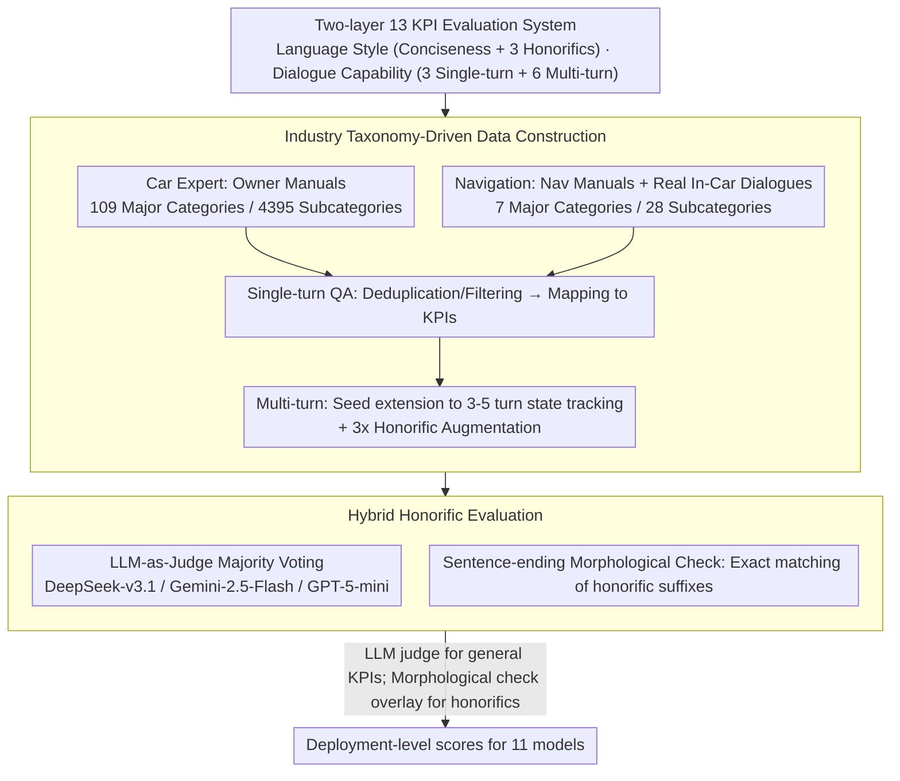

# LoCar: Localization-Aware Evaluation of In-Vehicle Assistants through Fine-Grained Sociolinguistic Control

**Conference**: ACL2026  
**arXiv**: [2605.21086](https://arxiv.org/abs/2605.21086)  
**Code**: No public code; data contains proprietary materials from industry partners, paper states it cannot be disclosed  
**Area**: LLM Evaluation / Localization / In-Vehicle Assistants  
**Keywords**: Localization evaluation, Korean honorifics, In-vehicle assistants, LLM-as-a-Judge, Multi-turn conversation  

## TL;DR
LoCar proposes 13 deployment-level KPIs for Korean in-vehicle assistants and evaluates 11 models using human-calibrated LLM-as-a-Judge combined with honorific morphological validation. It finds that general comprehension capability is nearly saturated, but fine-grained honorific control and multi-turn strategic guidance remain significantly unstable.

## Background & Motivation
**Background**: In-vehicle assistants are evolving from fixed command systems into LLM applications capable of interpreting vehicle manuals, understanding navigation needs, and managing multi-turn dialogues. Existing evaluations primarily focus on general knowledge, reasoning, or English interaction quality, but localization requirements in commercial deployment are often more granular. For instance, different honorific levels in Korean directly impact user-perceived politeness, trust, and professionalism.

**Limitations of Prior Work**: Standard LLM benchmarks struggle to cover two types of requirements in in-vehicle scenarios: functional correctness related to vehicle operations and navigation, and sociolinguistic norms for specific language markets. Even if a model answers correctly, it might fail to meet local deployment standards regarding honorific levels, conciseness, clarification timing, or proactive suggestions.

**Key Challenge**: Deployment-level evaluation requires granularity down to linguistic-cultural norms and in-car interaction flows. However, human evaluation is costly, and standard LLM judges often confuse similar Korean honorific forms. The authors aim to address how to make evaluation both functionally comprehensive and reliable in checking localized linguistic styles while remaining automatable.

**Goal**: Construct a Korean in-vehicle assistant evaluation framework covering two core use cases: Car Expert and Navigation; define language style and dialogue capability layer KPIs; synthesize and augment test data; calibrate evaluators with human annotations; and finally analyze differences among models regarding local deployment requirements.

**Key Insight**: Instead of treating "Korean capability" as a single aggregate score, the paper breaks it down into actionable KPIs: Conciseness, Hae/Haeyo/Hapsyo honorifics, implicit understanding, contextual understanding, harmful question response, clarification, retention, refinement, reflection, proactive suggestion, and troubleshooting.

**Core Idea**: Generate in-vehicle assistant data using an industry scenario taxonomy, then utilize a hybrid evaluation pipeline of "LLM judge majority voting + Korean sentence-ending morphological check" to transform localized linguistic norms into quantifiable deployment evaluations.

## Method
The contribution of LoCar is more of a complete evaluation system rather than a single model. It first defines a task taxonomy for in-vehicle assistants, then constructs single-turn and multi-turn samples based on vehicle manuals, navigation manuals, and real in-car dialogues, and finally selects appropriate automatic evaluation methods per KPI.

### Overall Architecture
The framework consists of three steps. The first step is data taxonomy: Car Expert covers vehicle knowledge, operations, and diagnostics derived from owner manual hierarchies; Navigation covers destination search, route explanation, traffic consultation, and contextual recommendations. The second step is data construction: single-turn Q&A are synthesized from manual and navigation taxonomies with deduplication filtering; multi-turn dialogues are expanded from single-turn seeds into interaction flows requiring state tracking, with three-fold augmentation using Korean honorifics. The third step is evaluation: human-calibrated LLM-as-a-Judge with multi-model majority voting is used for general KPIs; sentence-ending morphological validation is added for honorific KPIs to compensate for LLM judge deficiencies in identifying similar honorific levels. Overall, the target (13 KPIs) is determined first, then the test set is grown from real vehicle functions, and finally scores are generated via hybrid evaluators.

### Key Designs

**1. Two-layer 13 KPI Evaluation System: Separating "Answering Correctness" from "Speaking Appropriateness"**

In-vehicle assistant failures involve more than just wrong answers—being too wordy, using the wrong politeness level, failing to refuse harmful prompts, or losing state in multi-turn dialogues are critical deployment issues that a single aggregate score in traditional benchmarks cannot detect. LoCar decomposes capabilities into two layers of 13 KPIs: the Language Style layer handles "how to speak," including Conciseness and three honorific levels (Hae/Haeyo/Hapsyo); the Dialogue Capability layer handles "interaction quality," including implicit understanding, contextual understanding, and harmful question response for single-turn, and Clarification, Retention, Refinement, Reflection, Proactive, and Troubleshooting for multi-turn. This allows evaluations to precisely indicate whether a model lacks "knowledge," "politeness," or "state management."

**2. Industry Taxonomy-Driven Data Construction: Growing Test Sets from Real Vehicle Functions**

If localized evaluation uses general chat samples, high scores cannot guarantee utility inside a vehicle. LoCar grows test sets directly from product documentation: Car Expert parses owner manuals into 109 major and 4,395 subcategories (covering vehicle knowledge, operation, diagnostics); Navigation is derived from navigation manuals and real in-car dialogues into 7 major and 28 subcategories (destination search, route explanation, traffic info, contextual recommendations). Single-turn QA is deduplicated and mapped to KPIs, while multi-turn data expands from single-turn seeds into 3-5 turn interaction flows requiring state tracking, augmented three-fold for honorifics. Each sample aligns with specific product functions, making the scores meaningful for deployment.

**3. Hybrid Honorific Evaluation: LLMs for Semantics, Rules for Suffixes**

Korean honorific levels are primarily indicated by sentence-ending morphological markers. Since adjacent levels like Hae/Haeyo/Hapsyo look similar, pure LLM-as-a-Judge is highly prone to confusion—rendering scores unreliable if the evaluator itself is flawed. LoCar's approach is a division of labor: the LLM judge handles contextual semantic judgment, while a lightweight sentence-ending morphological check performs exact matching of honorific suffixes, serving as a high-precision error filter to supplement LLM weaknesses. This improvement increased human-evaluator consistency for honorific classification from 0.69 to 0.94 (+24 percentage points), with the most formal level (hapsyo) benefiting the most.

### Loss & Training
Ours does not train the models being evaluated. Evaluator selection is based on 803 human-annotated calibration samples, with each sample independently labeled by 3 annotators. Candidate judge models were selected based on consistency across KPIs and overall agreement, finally adopting a majority vote of DeepSeek-v3.1, Gemini-2.5-Flash, and GPT-5-mini. The experiment randomly samples 50 test instances for each Dialogue Capability KPI. For multi-turn samples, one target turn is randomly selected as the evaluation turn, and hae, haeyo, or hapsyo is randomly assigned as the target honorific style.

## Key Experimental Results

### Main Results
| Experimental Item | Setting | Key Data | Conclusion |
|-------------------|---------|----------|------------|
| Human Calibration Set | 13 KPIs, Single & Multi-turn | 803 human-labeled samples, 3 annotators each | Basis for LLM-as-a-Judge selection and calibration |
| Honorific Hybrid Eval | LLM-only vs. LLM + Morphological | Human-judge agreement 0.69 → 0.94, +24 points | Morphological checks significantly improve granular honorific discrimination |
| Single-turn Overall Avg | 11 models | Navigation: Implicit 0.92, Contextual 0.94, Refusal 0.85; Car Expert: Implicit 0.96, Refusal 0.93 | Single-turn comprehension metrics are nearly saturated |
| Multi-turn Overall Avg | 11 models | Navigation: Clarification 0.58, Proactive 0.78, Retention 0.88, Refinement 0.95; Car Expert: Troubleshooting 0.95 | Strategic clarification is hardest; state retention is stable |
| Evaluated Models | Scale of models | 11 models total, including 6 Korean local models and global API models | Framework differentiates deployment readiness between local/global models |

### Ablation Study
| Analysis Item | Configuration | Key Data | Description |
|---------------|---------------|----------|-------------|
| Honorific Judge Improv. | Gemini-2.5-Flash | Hae +0.06, Haeyo +0.11, Hapsyo +0.19 | Morphological validation helps more with formal hapsyo |
| Honorific Judge Improv. | GPT-5-mini | Hae +0.08, Haeyo +0.18, Hapsyo +0.52 | GPT-5-mini had worst LLM-only confusion on hapsyo |
| Honorific Judge Improv. | DeepSeek-v3.1 | Hae +0.03, Haeyo +0.08, Hapsyo +0.09 | Consistent gains across all three judges |
| Multi-turn Leading Model | gpt-5.1 | Nav Clarification 0.84, Proactive 1.00; Car Expert Clarification 0.92 | Frontier models excel at strategic multi-turn KPIs |
| Multi-turn Low Scorer | kanana-1.5-15.7b-a3b | Nav Clarification 0.28, Proactive 0.50 | Clarification and proactive intervention are weak for local models |
| Latency | 11 models | solar-pro 91.16s, gpt-5.1 50.4s | Higher latency does not necessarily correlate with better multi-turn strategy |

### Key Findings
- Single-turn comprehension metrics are already very high, indicating that "knowing the answer" is not the primary bottleneck for in-vehicle QA.
- Fine-grained honorific control remains unstable, particularly the confusion between adjacent politeness levels like haeyo and hapsyo.
- In multi-turn dialogues, Clarification and Proactive are significantly harder than Retention, Refinement, and Reflection because they require the model to judge when to intervene rather than just continuing the context.
- Evaluators themselves require localization: LLM judges are not inherently reliable for Korean honorifics and must be combined with linguistic morphological knowledge.

## Highlights & Insights
- LoCar decomposes "localization" from vague multilingual capability into specific, executable sociolinguistic metrics, which is closer to real deployment than simply measuring Korean QA accuracy.
- The hybrid evaluation design is pragmatic: LLM judges excel at contextual semantics, while rule-based morphological checks excel at catching suffixes; combining them is more robust than using either alone.
- The paper clearly illustrates two tiers of assistant capability: understanding vehicle and navigation knowledge is basic, whereas correctly managing clarifications, proactive suggestions, and safety boundaries in multi-turn flows is the true challenge.
- The work provides insights for other language markets. Even outside of Korean, many languages have local politeness norms, dialects, honorifics, registers, or cultural conventions requiring specialized evaluation components.

## Limitations & Future Work
- LoCar was developed and validated only for the Korean language and market; honorific detection relies on Korean sentence-ending morphology and cannot be directly migrated to languages where politeness is encoded via vocabulary, word order, or context.
- Data contains proprietary industry materials and cannot be publicly released, which limits reproducibility and community extension.
- Evaluation is an offline text-based setup, not covering real-world ASR misrecognition, TTS presentation, in-car noise, multimodal screen information, or real-time driving status.
- The paper intentionally excludes manufacturer-specific metrics to maintain generality, but real deployment requires context like dynamic weather, location, user history, and tool calls.
- Future work could extend to cross-lingual LoCar, closed-loop in-car testing, end-to-end voice evaluation, and dynamic evaluation combined with RAG and tool-use.

## Related Work & Insights
- **vs. MT-Bench / Arena-Hard**: General dialogue evaluation focuses on overall response quality; LoCar focuses on localized linguistic style and task continuity in vehicle deployment.
- **vs. Korean-specific benchmarks**: General Korean benchmarks test linguistic ability; LoCar further demands honorific levels, vehicle functions, and multi-turn management.
- **vs. Pure LLM-as-a-Judge**: Pure LLM judges are unreliable for fine-grained Korean honorifics; LoCar adds morphological validation as a high-precision constraint.
- **vs. Automotive QA Datasets**: Standard automotive QA usually measures knowledge correctness; LoCar simultaneously evaluates safety response, clarification, proactivity, and sociolinguistic adaptation.

## Rating
- Novelty: ⭐⭐⭐⭐☆ Breaking in-vehicle localization into 13 KPIs with morphological validation is highly valuable for application.
- Experimental Thoroughness: ⭐⭐⭐⭐☆ Includes 803 calibration samples, 11 models, and single/multi-turn evaluation, though data is not public and limited to Korean.
- Writing Quality: ⭐⭐⭐⭐☆ Clear structure; taxonomy, evaluator, and deployment implications are naturally linked.
- Value: ⭐⭐⭐⭐☆ Direct insights for multilingual in-vehicle assistants, localization evaluation, and enterprise LLM deployment.

<!-- RELATED:START -->

## Related Papers

- [\[ACL 2026\] IF-Critic: Towards a Fine-Grained LLM Critic for Instruction-Following Evaluation](if-critic_towards_a_fine-grained_llm_critic_for_instruction-following_evaluation.md)
- [\[ACL 2026\] K-MetBench: A Multi-Dimensional Benchmark for Fine-Grained Evaluation of Expert Reasoning, Locality, and Multimodality in Meteorology](k-metbench_a_multi-dimensional_benchmark_for_fine-grained_evaluation_of_expert_r.md)
- [\[ACL 2026\] Rethinking Meeting Effectiveness: A Benchmark and Framework for Temporal Fine-grained Automatic Meeting Effectiveness Evaluation](rethinking_meeting_effectiveness_a_benchmark_and_framework_for_temporal_fine-gra.md)
- [\[ICLR 2026\] Enabling Fine-Grained Operating Points for Black-Box LLMs](../../ICLR2026/llm_evaluation/enabling_fine-grained_operating_points_for_black-box_llms.md)
- [\[ACL 2026\] AJ-Bench: Benchmarking Agent-as-a-Judge for Environment-Aware Evaluation](aj-bench_benchmarking_agent-as-a-judge_for_environment-aware_evaluation.md)

<!-- RELATED:END -->
