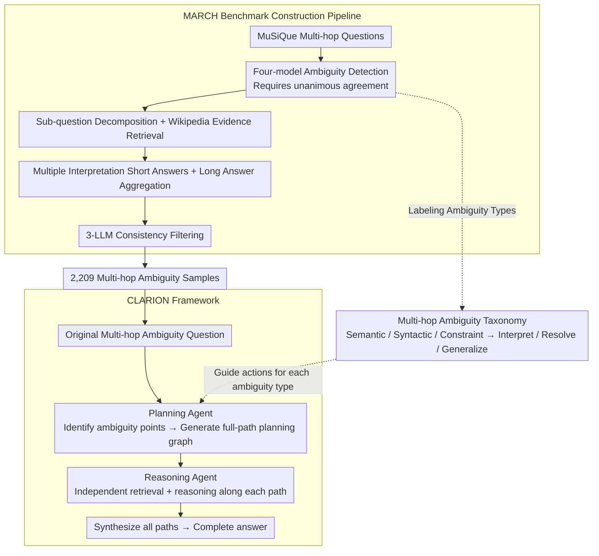

# MARCH: Evaluating the Intersection of Ambiguity Interpretation and Multi-hop Inference

**Conference**: ACL 2026 Findings  
**arXiv**: [2509.22750](https://arxiv.org/abs/2509.22750)  
**Code**: [GitHub](https://github.com/jeonghyunpark2002/MARCH)  
**Area**: LLM Reasoning / Question Answering  
**Keywords**: Multi-hop Reasoning, Ambiguity Resolution, Benchmark Construction, Hierarchical Uncertainty, Agentic Framework

## TL;DR

Ours proposes the MARCH benchmark (2,209 multi-hop ambiguous questions) and the CLARION framework, marks the first systematic study of QA challenges at the intersection of ambiguity resolution and multi-step reasoning, revealing significant deficiencies in existing SOTA models for such problems.

## Background & Motivation

**Background**: Multi-hop QA requires models to construct logical chains across multiple documents; ambiguous QA requires models to handle polysemy and insufficient contexts. These two types of challenges have been widely studied separately, but their **intersection** remains almost unexplored.

**Limitations of Prior Work**: Among real user queries, 48.4% contain ambiguity, 17.7% involve multi-hop reasoning, and 13.3% involve both. However, existing benchmarks either focus only on single-hop ambiguity (ASQA) or only on multi-hop reasoning (MuSiQue). When ambiguity occurs in the intermediate steps of multi-hop reasoning, uncertainty cascades—early errors in ambiguity resolution lock the model into incorrect reasoning paths.

**Key Challenge**: Ambiguity in multi-hop reasoning can be **latent**—only manifesting after previous steps are correctly resolved. For example, in "What is the best-selling pickup sold by the manufacturer of the 'Mustang'?", the ambiguity of "pickup" (truck vs. guitar pickup) can only be discovered after preserving both interpretations of "Mustang" (car vs. guitar).

**Goal**: (1) Construct a dedicated benchmark for evaluating multi-hop ambiguous QA; (2) Propose a framework to solve this problem.

**Core Idea**: Multi-hop ambiguous QA requires models to maintain a "superposition" of multiple interpretation paths throughout the reasoning chain rather than committing prematurely to a single interpretation. CLARION prevents premature pruning of reasoning paths by decoupling ambiguity planning from evidence retrieval.

## Method

### Overall Architecture

This paper addresses whether existing models can handle cases where ambiguity is hidden in the intermediate steps of multi-hop reasoning. To this end, it provides two components: MARCH, a specialized evaluation benchmark derived from the unambiguous MuSiQue dataset through a four-stage pipeline that injects and labels ambiguities (resulting in 2,209 questions covering semantic, syntactic, and constraint ambiguities); and CLARION, a training-free framework that decouples "Ambiguity Planning" and "Per-path Evidence Reasoning" into two agents, allowing the model to carry multiple interpretation paths across the entire reasoning chain. Both are underpinned by a multi-hop ambiguity taxonomy that labels ambiguity points in the benchmark and guides actions during problem-solving.

### Key Designs

**1. MARCH Construction Pipeline: Trading Consensus for Label Reliability**

To evaluate joint "multi-hop + ambiguity" capabilities, high-quality data is essential, yet labeling ambiguity with a single LLM often introduces bias. The pipeline follows four steps: first, four models (GPT-4.1, Llama-4, Qwen3-235B, Claude-4) perform ambiguity type detection on each MuSiQue question, where an ambiguity type is only confirmed if all **four models agree unanimously**; then, clarified questions are decomposed into atomic sub-questions with evidence retrieved from Wikipedia; next, a short answer is generated for each valid interpretation and aggregated into a long answer covering all possibilities; finally, three independent LLMs perform consistency filtering. This unanimous consensus minimizes single-model bias, achieving human-verified annotation consistency of Fleiss' $\kappa=0.92\text{–}0.95$ across 2,209 samples.

**2. Multi-hop Ambiguity Taxonomy: Three Types with Distinct Actions**

Different ambiguities require different responses. The authors expand standard ambiguity classifications to the multi-hop scenario, defining a system with three categories and corresponding actions. **Semantic Ambiguity** occurs when a mention maps to multiple entities (e.g., Mustang as a Ford car or a Fender guitar), requiring the "Interpret" action—expanding each entity interpretation. **Syntactic Ambiguity** involves multiple valid parses of a sentence leading to different dependencies between hops (e.g., prepositional phrase attachment), requiring the "Resolve" action. **Constraint Ambiguity** involves overly specific qualifiers that prematurely prune valid reasoning paths, requiring the "Generalize" action. This taxonomy labels the data and directly guides the strategies used during solving.

**3. CLARION Framework: Decoupling Planning from Reasoning to Prevent Path Pruning**

A common failure in standard RAG/CoT is committing to a single interpretation at the first hop. If chosen incorrectly, the entire subsequent reasoning is locked into an erroneous path—especially when ambiguity is "latent" and only appears if previous steps are correct. CLARION splits the process into two agents: the **Planning Agent** reads the original question, identifies all ambiguity points, and generates a planning graph preserving all valid interpretation paths; the **Reasoning Agent** then independently retrieves evidence and reasons along each planned path. Finally, results from all paths are synthesized. Separating planning from execution forces the model to maintain a "superposition" of interpretations, mechanically blocking "premature commitment" errors.

### Loss & Training

Both MARCH and CLARION are training-free solutions: MARCH is a constructed benchmark, and CLARION is implemented via prompt engineering on existing LLMs. Evaluation metrics include F1-score, EM, D-F1 (disambiguation F1), ROUGE-L, and LLM-judge.

## Key Experimental Results

### Main Results

| Setting | MuSiQue (Multi-hop) | ASQA (Ambiguity) | MARCH (Joint) | Description |
|------|-------------|-----------|------------|------|
| Existing Models | Fair | Fair | **Significant Drop** | Joint scenario is significantly harder than single scenarios |
| CLARION | - | - | **Significantly outperforms baselines** | Validates the effectiveness of the decoupling strategy |

### Benchmark Statistics

| Metric | Value | Description |
|------|-----|------|
| Total Samples | 2,209 | Covers three categories of ambiguity |
| Ambiguity Distribution | Sem:734, Syn:739, Const:736 | Balanced distribution |
| Average Hops | 2.11-2.95 | Syntactic ambiguity has the most hops |
| Human Verification | Fleiss' $\kappa=0.92\text{–}0.95$ | Extremely high annotation consistency |
| Long Answer Validity | >90% | Successfully integrates all interpretations |

### Key Findings
- 13.3% of real-world user queries involve both multi-hop and ambiguity, indicating this is not a rare edge case.
- Models performing reasonably on separate multi-hop or ambiguity tasks show sharp performance degradation in the joint scenario (MARCH).
- Models tend to lock into a single interpretation at the first hop (premature commitment), leading to cascading errors.
- CLARION's planning-execution decoupling effectively prevents premature pruning of reasoning paths.

## Highlights & Insights
- **Depth of Problem Definition**: The concept of "latent ambiguity" (ambiguity that only appears if previous steps are correct) is profound.
- **Taxonomy of Three Ambiguities**: Semantic/Syntactic/Constraint ambiguities with corresponding actions (Interpret/Resolve/Generalize) provide a practical classification system.
- **Rigorous Construction**: The use of 4-LLM unanimous consensus plus human verification ensures high reliability.
- **Real-world Frequency Data**: Statistics from lmsys-chat-1m (13.3%) strongly justify the practical importance of the problem.
- **Simplicity of CLARION**: The planning-execution decoupling is a simple yet effective architectural insight.

## Limitations & Future Work
- MARCH is built upon MuSiQue, inheriting its domain and hop count constraints.
- CLARION currently operates in a retrieval-augmented setting; the open-domain non-retrieval scenario remains unexplored.
- The balanced distribution of the three ambiguity types is manually controlled and may not reflect the natural distribution.
- Future work could explore under what conditions a model should proactively ask clarification questions versus attempting all interpretations.
- Expansion to multilingual multi-hop ambiguity scenarios is possible.

## Related Work & Insights
- **vs ASQA**: ASQA focuses only on single-hop ambiguity, whereas MARCH extends this to multi-hop scenarios.
- **vs MuSiQue**: MuSiQue focuses on multi-hop reasoning but assumes no ambiguity; MARCH introduces ambiguity into this framework.
- **vs Standard RAG/CoT**: Standard methods fail under multi-hop ambiguity due to premature commitment; CLARION resolves this through planning-execution decoupling.

## Rating
- Novelty: ⭐⭐⭐⭐⭐ First systematic definition and evaluation of multi-hop ambiguous QA.
- Experimental Thoroughness: ⭐⭐⭐⭐ Includes benchmark construction, human verification, model evaluation, and framework comparison.
- Writing Quality: ⭐⭐⭐⭐⭐ Clear problem definition, rigorous taxonomy, and vivid analysis.
- Value: ⭐⭐⭐⭐⭐ Both the benchmark and framework provide independent contributions to the reasoning and ambiguity communities.

<!-- RELATED:START -->

## Related Papers

- [\[ICLR 2026\] Multi-LLM Adaptive Conformal Inference for Reliable LLM Responses](../../ICLR2026/llm_evaluation/multi-llm_adaptive_conformal_inference_for_reliable_llm_response.md)
- [\[ACL 2026\] CLARITY: A Framework and Benchmark for Conversational Language Ambiguity and Unanswerability in Interactive NL2SQL Systems](clarity_a_framework_and_benchmark_for_conversational_language_ambiguity_and_unan.md)
- [\[ACL 2026\] Evaluating Temporal Consistency in Multi-Turn Language Models](evaluating_temporal_consistency_in_multi-turn_language_models.md)
- [\[ACL 2026\] SciImpact: A Multi-Dimensional, Multi-Field Benchmark for Scientific Impact Prediction](sciimpact_a_multi-dimensional_multi-field_benchmark_for_scientific_impact_predic.md)
- [\[ACL 2026\] Statistically Reliable LLM-Based Ranking Evaluation via Prediction-Powered Inference](statistically_reliable_llm-based_ranking_evaluation_via_prediction-powered_infer.md)

<!-- RELATED:END -->
