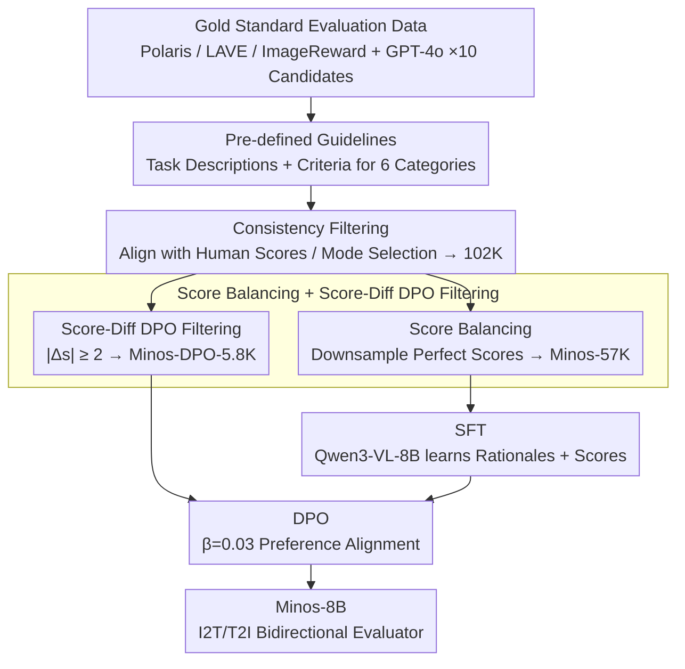

# Minos: A Multimodal Evaluation Model for Bidirectional Generation Between Image and Text

**Conference**: ACL 2026 Findings  
**arXiv**: [2506.02494](https://arxiv.org/abs/2506.02494)  
**Code**: https://github.com/reroze/MINOS  
**Area**: Multimodal Evaluation / MLLM-as-a-Judge / Preference Alignment  
**Keywords**: Multimodal Evaluation, Data Quality Control, I2T/T2I Bidirectional Evaluation, DPO Alignment, reference-free scoring

## TL;DR
By employing a three-step strategy of "stringent data quality control + SFT + DPO alignment," the authors trained Minos, an 8B evaluation model. Using 57K high-quality evaluation samples—less than half the scale of existing works—Minos can score bidirectional multimodal generation tasks (I2T and T2I). It outperforms all open-source MLLM-evaluators across 16 out-of-domain tasks and approaches the performance of GPT-4o.

## Background & Motivation

**Background**: As MLLM capabilities advance, "using MLLM as a judge" has become the mainstream automatic evaluation paradigm for multimodal generation (image captioning, VQA, text-to-image, etc.). Representative works such as Prometheus-Vision, LLaVA-Critic, and UnifiedReward train MLLMs as pointwise or pairwise scorers.

**Limitations of Prior Work**: (1) Existing evaluation models rely on massive data volume—LLaVA-Critic uses 113K and UnifiedReward uses 236K—but perform almost no quality filtering, directly training on GPT-4o outputs. (2) It is difficult for existing models to be strong in both I2T and T2I simultaneously; LLaVA-Critic covers I2T almost exclusively, whereas UnifiedReward is weak in I2T. (3) Preference alignment is rarely conducted after SFT, leaving the potential gains of the alignment phase untapped.

**Key Challenge**: Is the bottleneck of evaluation capability the "quantity" or the "accuracy" of data? The authors explicitly bet on the latter—if a GPT-generated evaluation is inconsistent with human judgment or is heavily skewed (e.g., an excess of perfect scores), adding more data only contaminates the model.

**Goal**: (1) Construct a high-quality, low-volume evaluation dataset spanning both I2T and T2I. (2) Conduct SFT and DPO based on this dataset. (3) Verify the "quality > quantity" hypothesis in multimodal evaluation.

**Key Insight**: Treat high-quality human-annotated evaluation data (Polaris/LAVE/ImageReward) as the "gold standard." Generate 10 candidate evaluations per sample using GPT-4o and filter for truly reliable samples based on "consistency with human scores" or "internal GPT mode." Furthermore, filter DPO preference pairs using the criterion of "chosen/rejected score difference $\ge 2$."

**Core Idea**: Use rigorous instance-level + dataset-level quality control combined with DPO filtered by score differences to ensure 57K samples outperform 236K unfiltered samples.

## Method

### Overall Architecture
The Minos pipeline consists of two tracks: **Data Construction** (Minos-57K + Minos-DPO-5.8K) and **Two-stage Training** (SFT → DPO). For data, each evaluation instance is formalized as $(q, d, g, k, [r], a, s)$—comprising task input $q$, task description $d$, model output $g$, evaluation criteria $k$, optional reference $r$, output evaluation analysis $a$, and a 1–5 Likert score $s$. This schema accommodates both I2T (image+question→text) and T2I (text→image), which is the key to "bidirectional unification." The backbone model is Qwen3-VL-8B. SFT uses Minos-57K (2 epochs, lr 1e-5), and DPO uses Minos-DPO-5.8K (1 epoch, lr 2e-6, $\beta=0.03$).

### Key Designs

**1. Pre-defined Guideline: Defining the standard for the model first**

Human evaluators are trained before judging different tasks; otherwise, they might apply captioning standards to VQA. The authors developed a "task description + evaluation criteria" for 6 categories of multimodal tasks (caption / VQA / T2I / text reading / reasoning / instruction following). Every evaluation input is prepended with the corresponding guideline. This eliminates confusion between task criteria, allowing an 8B model to reason through OOD tasks step-by-step rather than relying on intuition—adding guidelines alone raised the Pearson-r from 36.3 to 37.1.

**2. Consistency Filter: Converging GPT noise to high-confidence patterns**

When GPT-4o acts as an annotator, it exhibits high variance on certain samples, which can contaminate training. The authors generated 10 candidate evaluations per sample from GPT-4o and filtered them in two ways: for data with **human scores** (Polaris / LAVE / ImageReward), they kept only GPT scores that matched human scores (discarding the entire sample if no match was found); for data **without human scores**, they took the mode of the 10 scores $\hat{s}=\mathrm{mode}(s_1,\ldots,s_{10})$ as the pseudo-label and randomly selected one candidate analysis with that score. This converges "model-generated evaluations" from a distribution to a high-confidence mode, avoiding high-variance scoring. Pearson-r rose to 39.0 after filtering 124K entries down to 102K.

**3. Score Balance + Delta Score DPO Filter: Addressing dataset skew and preference noise**

After consistency filtering, the score distribution remained heavily skewed toward perfect scores (56% were 5s in the 57K set). The authors used random downsampling to balance the distribution (16/17/21/23/23%), resulting in Minos-57K. The DPO phase is even more critical: for each sample, the consistency-filtered evaluation is used as the 'chosen' response, and the candidate with the largest score difference is used as 'rejected.' The data was further refined using $|s_\text{chosen} - s_\text{rejected}| \ge 2$, compressing 38K preference pairs to 5.8K. This was done because naive DPO performance actually dropped from 40.9 to 40.1. Evaluator models are extremely sensitive to preference noise; DPO only yields a stable +1.4 gain when using "score difference" as an explicit confidence signal. This leverages the fact that evaluation tasks have inherent scores $s$ to quantify preference strength without needing a separate reward model.

### Loss & Training

The SFT phase uses standard next-token prediction, supervising the entire evaluation rationale $a$ plus the score $s$ (experiments show "SFT with rationale" outperformed "scoring only" by 2.1 points in Pearson-r). DPO uses the standard formula from Rafailov et al. with $\beta=0.03$ and $\gamma=0$. Training used 4x H100 GPUs in BF16; SFT took ~10 hours, and DPO took ~2 hours.

## Key Experimental Results

### Main Results
The evaluation protocol follows LLaVA-Critic: Pearson-r measures the correlation between model and human scores across 16 OOD datasets, including MLLM-as-a-Judge (14 I2T tasks) + RichHF-18K + GenAI-Bench (2 T2I tasks).

| Model | Scale | Avg. Pearson-r (16 tasks) | Remarks |
|------|------|---------------------------|------|
| Gemini-2.5-Pro | / | 41.5 | Closed-source |
| GPT-4o | / | 44.2 | Closed-source ceiling |
| Qwen3-VL (base) | 8B | 38.4 | Same backbone baseline |
| LLaVA-Critic | 7B | 30.7 | I2T training only |
| LLaVA-Critic | 72B | 39.8 | Prev. SOTA (Open-source) |
| UnifiedReward_Q | 8B | 37.2 | Previous SOTA at scale |
| **Minos** | **8B** | **42.3** | +2.5 points over 72B LLaVA-Critic |

### Ablation Study

| Configuration | Avg. Pearson-r | Description |
|------|---------------|------|
| RAW (124K, no filtering) | 36.3 | Lower than base model 38.4 → "Dirty data causes negative training" |
| + Guideline | 37.1 | +0.8, task guidelines are significantly useful |
| + Consistency Filter (102K) | 39.0 | +1.9, filters GPT evaluation noise |
| + Score Balance → Minos-57K (SFT only) | 40.9 | +1.9, re-balances score distribution |
| + Naive DPO (38K pairs) | 40.1 | **Drops 0.8**, confirms naive DPO can be harmful |
| + Delta-Score DPO (5.8K) | **42.3** | +1.4, only high-quality preference pairs are effective |
| T2I training only (10K) → I2T Avg | 25.4 | Drops 11.3 vs base 36.7, severe negative transfer |
| I2T training only (47K) → T2I Avg | 46.1 | 4.8 lower than joint training 50.9 |
| **Joint I2T+T2I (57K)** | I2T 39.5 / T2I 50.9 | Bidirectional mutual enhancement |

### Key Findings
- **Quality is much more important than scale**: Training on 57K samples (approx. 1/2 of LLaVA-Critic and 1/4 of UnifiedReward) achieved results 4.6 points higher than the original 124K raw data; this is the strongest "counter-consensus" conclusion.
- **Naive DPO can cause negative transfer**: Training on 38K preference pairs dropped Pearson-r from 40.9 to 40.1, indicating that evaluation models are highly sensitive to preference noise. The "score difference $\ge 2$" heuristic corrected this by selecting the top 1/6 of data.
- **I2T and T2I complement each other**: Training on T2I alone degraded I2T capability (36.7 → 25.4), but joint training yielded bidirectional gains, suggesting that evaluating "image-text consistency" shares underlying capabilities across directions.
- **SFT with rationale is more accurate**: Having the model output a text rationale before the score resulted in a 2.1 Pearson-r gain over direct scoring. The rationale improves interpretability and anchors the scoring behavior.

## Highlights & Insights
- **Verifying "Quality > Scale" in multimodal evaluation**: This work provides clear evidence that "training on dirty evaluation data makes the model worse than the base model" (36.3 < 38.4). This negative result serves as a warning for future work on reward or judge models.
- **Delta-Score DPO as a clean heuristic**: Since evaluation tasks yield explicit scores $s$, preference strength is naturally quantifiable. The authors use $|s_\text{chosen}-s_\text{rejected}| \ge 2$ as a "high-confidence" filter, avoiding the need for a separate reward model to select pairs—a trick reusable for any alignment task with numerical outputs.
- **Unified schema $(q,d,g,k,[r],a,s)$ allows joint I2T/T2I training**: By abstracting both "image+question" and "prompt" into "task input $q$ + description $d$," the architecture supports bidirectionality naturally. This can be easily migrated to video-to-text or audio-to-text evaluations.

## Limitations & Future Work
- The authors acknowledge that due to compute limits, scaling trends on a 70B backbone were not verified. Some early human evaluation datasets have broken links, leading to incomplete coverage.
- Personal observation: Evaluation tasks are concentrated on "general" dimensions like generation quality and text alignment, lacking coverage for specialized dimensions like safety, factuality, or hallucination. Guidelines are currently manual; automating them will be necessary for scaling to dozens of task types.
- The 5.8K cutoff for DPO indicates that high-quality preference pairs are scarce. Future work could explore "soft score differences" or online preference mining to expand effective DPO data.

## Related Work & Insights
- **vs LLaVA-Critic (7B/72B)**: LLaVA-Critic relies on 113K GPT-4o generated I2T samples and is limited to I2T evaluations. Minos, using 1/2 the data with strict quality control, DPO, and bidirectional coverage, exceeds the 72B version by 2.5 Pearson-r points.
- **vs UnifiedReward**: UnifiedReward uses 236K samples but lacks quality control and is weak in I2T (37.2). Minos is 5.1 points higher at the same 8B scale.
- **vs Prometheus-V**: Prometheus-V uses GPT-synthesized data without consistency filtering, averaging 20.3. Minos proves the necessity of combining "GPT-as-annotator" with "rigorous screening."
- **Insight**: Any project using "LLM as a judge" should first ask if the training evaluation data has passed a consistency check rather than blindly accumulating data.

## Rating
- Novelty: ⭐⭐⭐⭐ The strategy is a combination of known techniques (quality control + DPO score-diff filtering), but the empirical success of "small data outperforming big data" is compelling.
- Experimental Thoroughness: ⭐⭐⭐⭐⭐ 16 OOD datasets and 4 ablation tables provide a clear decomposition of each design element.
- Writing Quality: ⭐⭐⭐⭐ Clear structure and high table density; the derivation of motivations is solid, though the DPO methodology section is brief.
- Value: ⭐⭐⭐⭐⭐ Provides a SOTA open-source evaluator and critical negative results on data quality, directly usable for researchers in reward/judge models.

<!-- RELATED:START -->

## Related Papers

- [\[ACL 2026\] Comprehensiveness Metrics for Automatic Evaluation of Factual Recall in Text Generation](comprehensiveness_metrics_for_automatic_evaluation_of_factual_recall_in_text_gen.md)
- [\[ACL 2025\] EditInspector: A Benchmark for Evaluation of Text-Guided Image Edits](../../ACL2025/llm_evaluation/editinspector_a_benchmark_for_evaluation_of_text-guided_image_edits.md)
- [\[ICML 2025\] Communicating Activations Between Language Model Agents](../../ICML2025/llm_evaluation/communicating_activations_between_language_model_agents.md)
- [\[ACL 2026\] Attribution, Citation, and Quotation: A Survey of Evidence-based Text Generation with Large Language Models](attribution_citation_and_quotation_a_survey_of_evidence-based_text_generation_wi.md)
- [\[ACL 2026\] Illusions of the Gold Standard: A Large-scale Analysis of Human Evaluation Protocols for Long-form Text Generation](illusions_of_the_gold_standard_a_large-scale_analysis_of_human_evaluation_protoc.md)

<!-- RELATED:END -->
