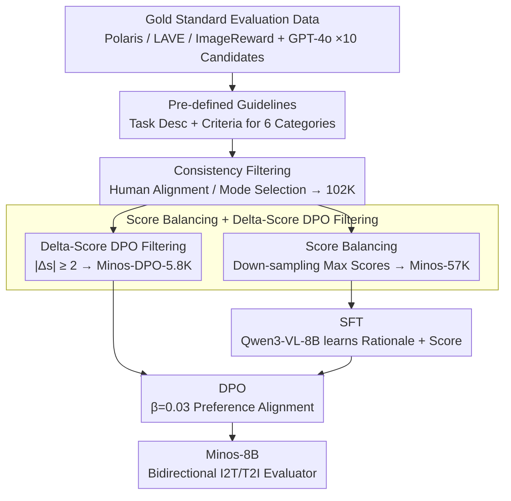

# Minos: A Multimodal Evaluation Model for Bidirectional Generation Between Image and Text

**Conference**: ACL 2026 Findings  
**arXiv**: [2506.02494](https://arxiv.org/abs/2506.02494)  
**Code**: https://github.com/reroze/MINOS  
**Area**: Multimodal Evaluation / MLLM-as-a-Judge / Preference Alignment  
**Keywords**: Multimodal Evaluation, Data Quality Control, I2T/T2I Bidirectional Evaluation, DPO Alignment, Reference-free Scoring

## TL;DR
The authors developed Minos, an 8B evaluation model capable of scoring both I2T and T2I bidirectional multimodal generation tasks. By employing a three-step pipeline of "stringent data quality control + SFT + DPO alignment," Minos was trained on only 57K high-quality evaluation samples—less than half the scale of existing works. It outperforms all open-source MLLM-evaluators across 16 out-of-domain tasks and approaches GPT-4o performance.

## Background & Motivation

**Background**: As MLLM capabilities advance, using "MLLM as a judge" has become the mainstream automatic evaluation paradigm for multimodal generation (image captioning, VQA, text-to-image, etc.). Representative works like Prometheus-Vision, LLaVA-Critic, and UnifiedReward train MLLMs as pointwise or pairwise scorers.

**Limitations of Prior Work**: (1) Existing evaluation models primarily rely on "scaling data"—LLaVA-Critic uses 113K and UnifiedReward uses 236K samples—but they perform almost no data quality filtering, directly training on noisy GPT-4o outputs. (2) Existing models struggle to excel in both I2T and T2I simultaneously; LLaVA-Critic focuses almost exclusively on I2T, while UnifiedReward is relatively weak in I2T. (3) Preference alignment is rarely performed after SFT, missing out on the benefits of the alignment stage.

**Key Challenge**: Does the bottleneck of evaluation capability lie in "data quantity" or "data accuracy"? The authors explicitly bet on the latter—if a GPT-generated score is inconsistent with human judgment or if the overall score distribution is heavily skewed (e.g., an excess of perfect scores), adding more data will only contaminate the model.

**Goal**: (1) Construct a high-quality, small-scale evaluation dataset spanning both I2T and T2I. (2) Perform both SFT and DPO based on this dataset. (3) Verify that the "Quality > Quantity" hypothesis holds true in multimodal evaluation.

**Key Insight**: Treat high-quality human-annotated evaluation data (Polaris/LAVE/ImageReward) as the "gold standard." For each sample, generate 10 candidate evaluations using GPT-4o and filter for truly reliable samples based on "consistency with human scores" or "GPT internal consensus." Furthermore, use a "score margin $\ge 2$" to filter DPO preference pairs.

**Core Idea**: Utilize stringent instance-level and dataset-level quality control combined with delta-score filtered DPO to enable a 57K dataset to outperform the training results of 236K raw samples.

## Method

### Overall Architecture
The Minos pipeline follows two paths: **Data Construction** (Minos-57K + Minos-DPO-5.8K) and **Two-Stage Training** (SFT → DPO). On the data side, each evaluation instance is unified into the schema $(q, d, g, k, [r], a, s)$—consisting of task input $q$, task description $d$, model output $g$, evaluation criteria $k$, optional reference $r$, evaluation rationale $a$, and a 1–5 Likert score $s$. This schema accommodates both I2T (image+question→text) and T2I (text→image), which is key to realization of "bidirectional unification." The backbone is Qwen3-VL-8B. SFT uses Minos-57K (2 epochs, lr 1e-5), and DPO uses Minos-DPO-5.8K (1 epoch, lr 2e-6, $\beta=0.03$).

### Key Designs

**1. Pre-defined Guidelines: Instructing the model on evaluation standards first**

Human evaluators require training before assessing different tasks; otherwise, they might apply captioning standards to VQA. The authors drafted specific "Task Descriptions + Evaluation Criteria" for six multimodal task categories (captioning, VQA, T2I, text reading, reasoning, and instruction following). Each evaluation input is concatenated with the corresponding guideline. This eliminates confusion between task criteria, allowing an 8B model to reason step-by-step on OOD tasks based on the guideline rather than relying on intuition. Ablation shows that adding guidelines alone increases Pearson-r from 36.3 to 37.1.

**2. Consistency Filter: Converging GPT noise into high-confidence patterns**

As an annotator, GPT-4o exhibits high variance on certain samples; training on these directly contaminates the model. The authors generate 10 candidate evaluations per sample via GPT-4o and filter them in two ways: For data with **human scores** (Polaris / LAVE / ImageReward), they retain only candidates where the GPT score matches the human score; if no candidates match, the sample is discarded. For data **without human scores**, they first determine the mode $\hat{s}=\mathrm{mode}(s_1,\ldots,s_{10})$ as a pseudo-label and randomly select one rationale corresponding to $\hat{s}$. This essentially forces the "model-generated evaluation" to converge from a probability distribution to a high-confidence mode, avoiding high-variance scoring. After filtering 124K raw samples, 102K remain, improving Pearson-r to 39.0.

**3. Score Balance + Delta Score DPO Filter: Addressing dataset skew and preference noise**

After consistency filtering, the score distribution remains heavily skewed toward perfect scores (56% are 5s in the 57K set). The authors used random down-sampling to flatten the distribution to 16/17/21/23/23%, resulting in Minos-57K. The DPO stage is even more critical: for each sample, the consistency-filtered evaluation is the "chosen" response, and the candidate with the largest score difference is the "rejected" response. They further filter using $|s_\text{chosen} - s_\text{rejected}| \ge 2$, reducing 38K preference pairs to 5.8K. This was done because naive DPO dropped performance from 40.9 to 40.1—evaluation models are extremely sensitive to preference noise. Using "score difference" as an explicit confidence heuristic to keep only high-quality signals allowed DPO to yield a steady +1.4 gain. This also leverages the fact that evaluation tasks provide scores $s$, allowing for the quantification of preference intensity without training a separate reward model.

### Loss & Training

The SFT stage uses standard next-token prediction, supervising the entire rationale $a$ plus the score $s$ (experiments show "SFT with rationale" outperforms "score-only" by 2.1 points in Pearson-r). DPO uses the standard formula from Rafailov et al. with $\beta=0.03, \gamma=0$. Training was conducted on 4 H100 GPUs using BF16; SFT took ~10 hours, and DPO took ~2 hours.

## Key Experimental Results

### Main Results
The evaluation protocol follows LLaVA-Critic: 16 OOD datasets including MLLM-as-a-Judge (14 I2T tasks) + RichHF-18K + GenAI-Bench (2 T2I tasks). Pearson-r is used to measure the correlation between model and human scores.

| Model | Size | Avg. Pearson-r (16 tasks) | Note |
|------|------|---------------------------|------|
| Gemini-2.5-Pro | / | 41.5 | Closed-source |
| GPT-4o | / | 44.2 | Closed-source ceiling |
| Qwen3-VL (base) | 8B | 38.4 | Same backbone baseline |
| LLaVA-Critic | 7B | 30.7 | I2T-only training |
| LLaVA-Critic | 72B | 39.8 | Prev. SOTA (Open-source) |
| UnifiedReward_Q | 8B | 37.2 | Same scale Prev. SOTA |
| **Minos** | **8B** | **42.3** | Beats 72B LLaVA-Critic by 2.5 pts |

### Ablation Study

| Configuration | Avg. Pearson-r | Explanation |
|------|---------------|------|
| RAW (124K, no QC) | 36.3 | Lower than base 38.4 → "Dirty data leads to negative training" |
| + Guideline | 37.1 | +0.8, task guidelines are significantly useful |
| + Consistency Filter (102K) | 39.0 | +1.9, filtering GPT noisy evaluations |
| + Score Balance → Minos-57K (SFT only) | 40.9 | +1.9, rebalancing score distribution |
| + Naive DPO (38K pairs) | 40.1 | **Drops 0.8**, verifies naive DPO degradation |
| + Delta-Score DPO (5.8K) | **42.3** | +1.4, only high-quality pairs are effective |
| T2I-only (10K) → I2T Avg | 25.4 | Drop of 11.3 vs base 36.7; unidirectional training causes negative transfer |
| I2T-only (47K) → T2I Avg | 46.1 | 4.8 lower than joint training (50.9) |
| **I2T+T2I Joint (57K)** | I2T 39.5 / T2I 50.9 | Bidirectional mutual reinforcement |

### Key Findings
- **Quality is far more important than scale**: Training on 57K samples (approx. 1/2 of LLaVA-Critic and 1/4 of UnifiedReward) outperformed 124K raw samples by 4.6 points. This is the strongest "anti-consensus" conclusion of the paper.
- **Naive DPO causes negative transfer**: Using 38K preference pairs dropped Pearson-r from 40.9 to 40.1, indicating that evaluators are hypersensitive to preference noise. The $| \Delta s | \ge 2$ heuristic, which slashed data to 1/6, was necessary to achieve gains.
- **I2T and T2I are complementary**: Training on T2I alone severely degrades I2T capability (36.7 → 25.4), but joint training provides bidirectional gains, suggesting that "assessing image-text alignment" shares underlying capabilities across directions.
- **SFT with rationale is more accurate**: Requiring the model to output a rationale before the score yielded a 2.1 Pearson-r improvement over direct scoring. Rationales not only improve interpretability but also anchor the scoring behavior.

## Highlights & Insights
- **Empirical proof for "Quality > Scale" in multimodal evaluation**: First to clearly provide evidence that "dirty evaluation data makes the model worse than the base model" (36.3 < 38.4). This negative result is a significant warning for future reward/judge model development.
- **Delta-Score DPO is a clean heuristic**: Since evaluation tasks naturally include explicit scores $s$, preference intensity can be quantified directly. Using $|s_\text{chosen}-s_\text{rejected}| \ge 2$ as a "high-confidence" filter avoids the complexity of training a separate reward model to select pairs—a trick reusable in any alignment task with scorable outputs.
- **Unified schema $(q,d,g,k,[r],a,s)$ for I2T/T2I training**: By abstracting "image+question" and "prompt" into "task input $q$ + task description $d$," bidirectional support is naturally achieved. This framework can be easily extended to video-to-text or audio-to-text evaluation with near-zero cost.

## Limitations & Future Work
- The authors acknowledge that hardware constraints prevented validation on a 70B backbone, leaving scaling trends unclear. Some early human evaluation dataset links were dead, leading to incomplete coverage.
- Personal observation: Evaluation tasks focus on "general" dimensions like generation quality and alignment, lacking coverage for specialized dimensions like safety, factuality, or hallucination. Guidelines are currently hand-written; scaling to dozens of tasks will require automated guideline generation.
- The DPO stage required cutting data down to 5.8K to work, implying that usable preference pairs are extremely scarce. Future work could explore "soft delta scores" or online preference mining to expand effective DPO data.
- Improvement ideas: Extend the Delta-Score Filter to process-level scoring (e.g., independent scoring per dimension) to unlock more pairs, or engage in multi-task joint training of "rationale + score" during SFT.

## Related Work & Insights
- **vs LLaVA-Critic (7B/72B)**: LLaVA-Critic relies on 113K GPT-4o generated I2T samples and is limited to I2T. Minos uses 1/2 the data with strict QC + DPO + bidirectional coverage, allowing the 8B version to surpass the 72B LLaVA-Critic by 2.5 Pearson-r points.
- **vs UnifiedReward**: UnifiedReward uses 236K samples but lacks QC and is weak in I2T (37.2). Minos is 5.1 points higher at the same 8B scale, largely due to quality filtering and DPO alignment.
- **vs Prometheus-V**: Prometheus-V uses GPT-synthesized data without consistency filtering, averaging 20.3. Minos demonstrates the necessity of pairing "GPT-as-annotator" with "stringent filtering."
- **Insight**: Any work using "LLM as a judge" should first ask "Has my training evaluation data passed a consistency check?" rather than blindly scaling data. This applies equally to current reward model training.

## Rating
- Novelty: ⭐⭐⭐⭐ The approach is a combination of strategies (QC + Bidirectional + Delta-Score filtering). Single-point innovation is modest, but the empirical "less is more" result is compelling.
- Experimental Thoroughness: ⭐⭐⭐⭐⭐ 16 OOD datasets + 4 ablation tables, with every design choice dissected.
- Writing Quality: ⭐⭐⭐⭐ Clear structure and high table density; solid motivation, though the DPO formula in the method section is somewhat brief.
- Value: ⭐⭐⭐⭐⭐ Provides both a SOTA open-source evaluator and critical negative results on "quality vs. scale," directly applicable to peers building reward/judge models.

<!-- RELATED:START -->

## Related Papers

- [\[ACL 2026\] Comprehensiveness Metrics for Automatic Evaluation of Factual Recall in Text Generation](comprehensiveness_metrics_for_automatic_evaluation_of_factual_recall_in_text_gen.md)
- [\[ACL 2025\] EditInspector: A Benchmark for Evaluation of Text-Guided Image Edits](../../ACL2025/llm_evaluation/editinspector_a_benchmark_for_evaluation_of_text-guided_image_edits.md)
- [\[ICML 2025\] Communicating Activations Between Language Model Agents](../../ICML2025/llm_evaluation/communicating_activations_between_language_model_agents.md)
- [\[ACL 2026\] Attribution, Citation, and Quotation: A Survey of Evidence-based Text Generation with Large Language Models](attribution_citation_and_quotation_a_survey_of_evidence-based_text_generation_wi.md)
- [\[ACL 2026\] Capabilities and Evaluation Biases of Large Language Models in Classical Chinese Poetry Generation: A Case Study on Tang Poetry](capabilities_and_evaluation_biases_of_large_language_models_in_classical_chinese.md)

<!-- RELATED:END -->
