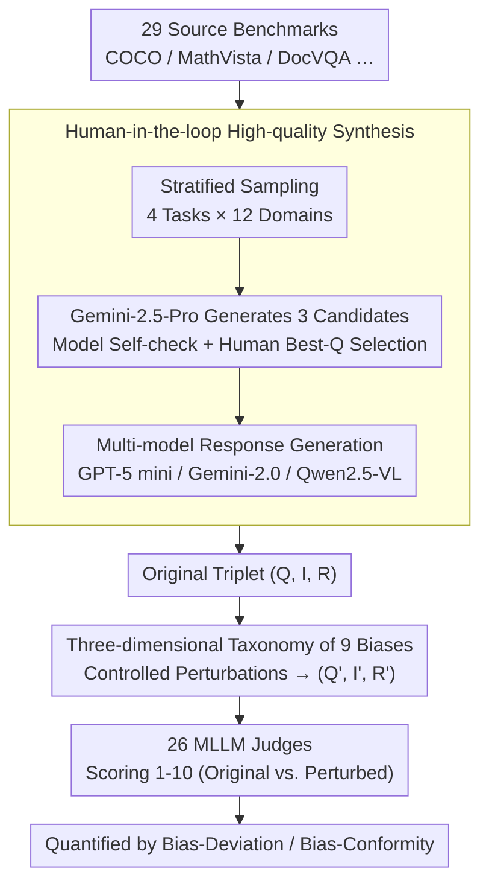

# MM-JudgeBias: A Benchmark for Evaluating Compositional Biases in MLLM-as-a-Judge

**Conference**: ACL 2026  
**arXiv**: [2604.18164](https://arxiv.org/abs/2604.18164)  
**Code**: Project page + GitHub (as noted in abstract)  
**Area**: Multimodal Evaluation / MLLM-as-a-Judge / Bias Benchmark  
**Keywords**: MLLM-as-a-Judge, compositional bias, modality bias, Bias-Deviation, Bias-Conformity

## TL;DR
The authors formalize whether "MLLM judges truly integrate images, queries, and responses" as **Compositional Bias** and construct **MM-JudgeBias**—a diagnostic set containing 9 types of bias and 1804 samples from 29 source benchmarks. Using two complementary metrics, **Bias-Deviation** (failure to decrease scores when semantics are destroyed) and **Bias-Conformity** (failure to remain stable when semantics are preserved), they reveal that 26 SOTA MLLM judges (including Gemini-3 Pro, GPT-5.1, and Claude Opus 4.5) exhibit severe modality neglect.

## Background & Motivation

**Background**: MLLM-as-a-Judge has become the dominant paradigm for automatic evaluation in multimodal generation (captioning, VQA, visual reasoning). This evolves from using GPT-4o directly to fine-tuning specialized critic models like Prometheus-Vision and LLaVA-Critic.

**Limitations of Prior Work**: While LLM-as-a-Judge has seen systematic studies across 12 bias types, reliability research for MLLM judges remains at a shallow level, focusing on properties inherited from LLMs like "position bias," "verbosity," or "length." No systematic study has asked: "Does the judge still give arbitrary scores when the image is missing, the image and response are mismatched, or irrelevant captions are added?" These are failure modes unique to multimodal judges.

**Key Challenge**: MLLM judges are frequently found to "give the same score whether they see the image or not." This is not merely a lack of capability but a failure of **verification integrity**. The judge's primary role is conditional verification, yet models degrade this into unconditional prediction, awarding full marks based solely on the surface fluency of the response.

**Goal**: (1) Provide a formalized framework for multimodal judge bias; (2) Construct a diagnostic set with controlled perturbations; (3) Quantify the severity of these issues across 26 MLLMs.

**Key Insight**: Reliable judge behavior is decomposed into three categories: **Integrality** (scores should drop if components are missing), **Congruity** (scores should drop if components contradict), and **Robustness** (scores should remain stable under semantics-preserving perturbations). The first two are measured by Bias-Deviation, while the latter is measured by Bias-Conformity.

**Core Idea**: Systematize and measure "compositional bias" using 9 types of controlled perturbations across 1804 data points and two complementary metrics.

## Method

### Overall Architecture
The construction and evaluation of MM-JudgeBias follow a serial pipeline: (a) Stratified sampling across 4 task types and 12 domains from 29 source benchmarks (COCO, MathVista, DocVQA, ChartQAPro, etc.); (b) Using Gemini-2.5-Pro to generate 3 queries per sample, followed by model-human dual review to select the "best-Q," ensuring the query strictly requires joint image-text reasoning; meanwhile, constructing a parallel text-only query set (for unnecessary-image bias); (c) Generating responses using GPT-5 mini / Gemini-2.0-Flash-Lite / Qwen2.5-VL to ensure score diversity; (d) Applying controlled perturbations to original triplets $(Q, I, R)$ according to 9 bias types to obtain $(Q', I', R')$; (e) Evaluating original and perturbed versions with 26 MLLM judges on a 1-10 scale; (f) Quantifying bias using Bias-Deviation and Bias-Conformity.

### Key Designs

**1. Human-in-the-loop Synthesis: Ensuring Queries Truly Require Multimodal Reasoning**

If a query can be answered by looking at the image or text alone, a judge not dropping points after perturbation is a "valid response" rather than a "bias." This is a common pitfall in diagnostic benchmarks. To address this, Gemini-2.5-Pro generates 3 candidates per sample, followed by model self-checking and human review to ensure the "best-Q" requires joint reasoning. Diverse responses are generated via GPT-5 mini, Gemini-2.0, and Qwen2.5-VL. Semantics-preserving visual augmentations use preset pipelines, while semantics-destroying perturbations (e.g., texture insertion) use generative models. Each bias spans easy/mod/hard difficulties.

**2. 9-Bias Taxonomy: Decomposing Judge Failure into Fine-grained Types**

Based on triplet perturbations, the 9 biases are categorized into three dimensions. **Integrality** (3 types) tests if missing components trigger score drops: Text-Dominance / Image-Dominance / Response-Dominance (replacing image, query, or both with null). **Congruity** (2 types) tests if contradictions trigger drops: Instruction-Misalignment / Image-Misalignment (random irrelevant replacement). **Robustness** (4 types) tests stability under invariant perturbations: Detail-Description (appending image captions to query), Unnecessary-Image (irrelevant image in text tasks), Visual-Transformation (augmented image), and Texture-Insertion (query keywords overlaid on image).

**3. Bias-Deviation (BD) and Bias-Conformity (BC) Metrics: Quantifying Opposing Expectations**

BD is used for Integrality and Congruity: $\text{BD} = \mathbb{E}_{(y, \hat{y}) \sim D}[(y - \hat{y})_+ / (y - 1)\mid y > 1]$. It normalizes the actual drop against the maximum possible drop, excluding $y=1$ to avoid boundary effects. BC is used for Robustness: $\text{BC} = \mathbb{E}_{(y, \hat{y}) \sim D}[1 - |y - \hat{y}| / \max(y-1, S-y)]$. Higher BC indicates better stability. Since a "constant constant judge" could achieve perfect BC, the paper also reports inter-sample variance.

### Loss & Training
MM-JudgeBias is a benchmark, not a model; no training is involved. For evaluation, all judges use `max_tokens=16384` and `reasoning effort` set to "high" (for Gemini-2.5, o3, Claude Opus 4.5). Means of three independent samples are reported along with inter-run/inter-sample variance.

## Key Experimental Results

### Main Results: BD/BC across 9 Biases for 26 MLLMs (Selected, Higher is Better)

| Model (Think) | Integrality Avg BD | Congruity Avg BD | Robustness Avg BC | Overall |
|------|---------------------|--------------------|--------------------|---------|
| Gemini-3-Pro (high) ✓ | 0.726 | 0.969 | 0.926 | **0.869** |
| Claude-Opus-4.5 ✓ | 0.729 | 0.973 | 0.897 | 0.858 |
| Gemini-2.5-Pro ✓ | 0.755 | 0.952 | 0.913 | 0.869 |
| Gemini-2.5-Flash ✓ | 0.486 | 0.879 | 0.908 | 0.761 |
| o3 (high) ✓ | 0.409 | 0.661 | 0.880 | 0.675 |
| GPT-5.1 (high) ✓ | 0.201 | 0.648 | 0.912 | 0.616 |
| GPT-5 mini (high) ✓ | 0.228 | 0.588 | 0.914 | 0.613 |
| Qwen3-VL-30B-Thinking ✓ | 0.481 | 0.730 | 0.879 | 0.713 |
| Qwen2.5-VL-72B-Instruct | 0.154 | 0.598 | 0.858 | 0.566 |
| LLaVA-Critic-72B | 0.214 | 0.620 | 0.943 | 0.628 |
| Prometheus-Vision-13B | 0.288 | 0.528 | 0.785 | 0.563 |
| **All 26 models Mean** | **0.384** | **0.746** | **0.868** | **0.679** |

### Ablation Study: Prompt-level intervention

| Model | Original | +Score Guide | +Modality Constraint | +Modality Reasoning |
|------|----------|--------------|----------------------|---------------------|
| GPT-5 mini | 0.612 | 0.609 | 0.644 | 0.645 |
| Qwen3-VL-8B-Thinking | 0.660 | 0.674 | 0.694 | **0.726** |
| LLaVA-Critic-7B | 0.647 | 0.631 | 0.600 | 0.653 |

### Key Findings
- **Integrality is the biggest weakness**: Mean Text-Dominance BD is 0.287 and Image-Dominance BD is 0.317. Even when the image is replaced by a black square, judges only slightly lower scores, showing images are not treated as necessary conditions.
- **Shocking Response-Dominance**: Even with null query and image, judges gave high scores based solely on response fluency in nearly half of the scenarios (Mean BD 0.547).
- **Reasoning improves consistency but is not a panacea**: Thinking modes in Gemini 2.5 Pro and Claude Opus 4.5 show significant gains, but reasoning in o3 or GPT-5 mini fails to fix modality neglect.
- **Critic models are not necessarily more reliable**: LLaVA-Critic-72B performed worse overall than its 7B counterpart (0.628 vs 0.647), suggesting SFT data fails to solve the underlying modality integration problem.
- **Scale ≠ Reliability**: Increasing parameters within the same family does not consistently improve BD/BC, proving judgment reliability is orthogonal to general capability.

## Highlights & Insights
- **The concept of "Compositional Bias" is accurately framed**: Reframing modality bias as a failure of verification integrity in judges explains previously scattered phenomena.
- **BD/BC dual metrics prevent metric gaming**: Applying specific metrics to specific bias types + using inter-sample variance as a safeguard is a robust design pattern for reward model evaluation.
- **9 bias recipes for diagnostic benchmarking**: The simple, reproducible perturbations (null image, random Q, etc.) provide a best-practice template for constructing diagnostic benchmarks.
- **Structured prompts provide partial relief**: Modality reasoning prompts improved Qwen3-VL-8B significantly, suggesting inference-time engineering still has room for improvement.

## Limitations & Future Work
- **Limitations**: Only covers vision+language (no video/audio); utilizes pointwise scoring instead of pairwise ranking; does not cover broader cultural or social biases.
- **Future Work**: Pairwise evaluation could further control for baseline effects; calibration-conditioned BD could provide fairer comparisons across models with different scoring distributions.

## Related Work & Insights
- **Comparison**: While prior works like Chen et al. (2024a) cover 14 evaluation tasks, they only examine LLM-inherited biases (ego/position/length). This paper specifically targets multimodal compositional bias.
- **Insight**: All MLLM-as-a-Judge frameworks should undergo BD/BC "health checks" before release. Reward model training could incorporate "punishing null-modality inputs" as an auxiliary loss to fix integrality bias.

## Rating
- Novelty: ⭐⭐⭐⭐ The framing and BD/BC metrics are novel; individual perturbations are adapted from LLM judge studies.
- Experimental Thoroughness: ⭐⭐⭐⭐⭐ 26 models × 9 biases × 1804 samples + prompt interventions.
- Writing Quality: ⭐⭐⭐⭐⭐ Clear taxonomy, rigorous metric definitions, high information density.
- Value: ⭐⭐⭐⭐⭐ Provides a reproducible diagnostic suite and reliability rankings for SOTA models.

<!-- RELATED:START -->

## Related Papers

- [\[ACL 2026\] Reasoning Model Is Superior LLM-Judge, Yet Suffers from Biases](reasoning_model_is_superior_llm-judge_yet_suffers_from_biases.md)
- [\[ACL 2026\] Multi-Task Reinforcement Learning for Enhanced Multimodal LLM-as-a-Judge](multi-task_reinforcement_learning_for_enhanced_multimodal_llm-as-a-judge.md)
- [\[ACL 2026\] Contrastive Decoding Mitigates Score Range Bias in LLM-as-a-Judge](contrastive_decoding_mitigates_score_range_bias_in_llm-as-a-judge.md)
- [\[ACL 2026\] IF-RewardBench: Benchmarking Judge Models for Instruction-Following Evaluation](if-rewardbench_benchmarking_judge_models_for_instruction-following_evaluation.md)
- [\[ACL 2026\] When Vision-Language Models Judge Without Seeing: Exposing Informativeness Bias](when_vision-language_models_judge_without_seeing_exposing_informativeness_bias.md)

<!-- RELATED:END -->
